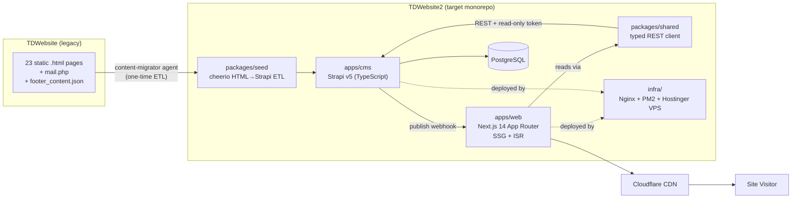
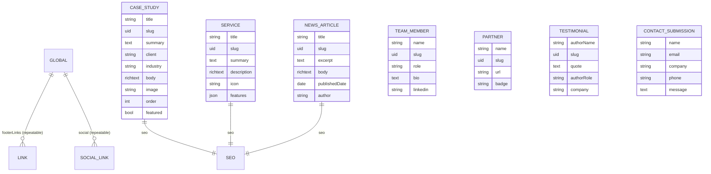
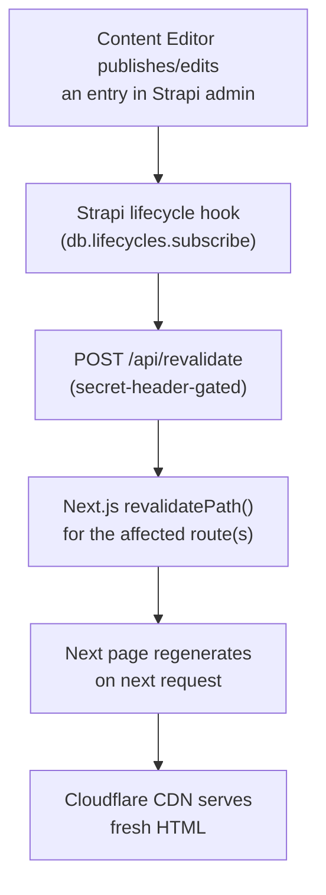

# 00 — Overview & Architecture (Requirements)

> **Source application:** **TrieDatum's marketing website** (repo `TDWebsite`) — a static Themeholy (Bootstrap 5 + jQuery) HTML site: 23 HTML pages, a `mail.php` contact handler, and a SASS source tree, with no data layer, no build pipeline, and no test suite.
> **Target platform:** **Next.js 14 (App Router) + Strapi v5 + PostgreSQL** headless-CMS stack, delivered as an npm-workspaces monorepo (repo `TDWebsite2`): `apps/web` + `apps/cms` + `packages/shared` + `packages/seed` + `infra/` + `docs/`.
> **Document purpose.** Analyst-produced Epics and Stories for the migration, ready to be turned into Jira tickets in a follow-on session. This file is the shared context (roles, glossary, conventions, target architecture, index) that every section document references.

## 1. How these documents are organized

| # | Document | Section | Epics | Stories |
|---|----------|---------|-------|---------|
| 00 | [00-overview-and-architecture.md](00-overview-and-architecture.md) | Conventions, roles, glossary, architecture map | — | — |
| 01 | [01-global-shell-navigation-and-footer.md](01-global-shell-navigation-and-footer.md) | A — Global Site Shell, Navigation & Footer | EP-01–EP-03 | 11 |
| 02 | [02-homepage.md](02-homepage.md) | B — Homepage | EP-04–EP-11 | 17 |
| 03 | [03-about-and-team.md](03-about-and-team.md) | C — About & Team | EP-12–EP-13 | 3 |
| 04 | [04-services.md](04-services.md) | D — Services | EP-14 | 4 |
| 05 | [05-ai-bootcamp.md](05-ai-bootcamp.md) | E — AI Bootcamp | EP-15–EP-16 | 8 |
| 06 | [06-partnership.md](06-partnership.md) | F — Partnership | EP-17 | 3 |
| 07 | [07-contact-and-lead-capture.md](07-contact-and-lead-capture.md) | G — Contact & Lead Capture | EP-18–EP-19 | 6 |
| 08 | [08-news-case-studies-and-testimonials.md](08-news-case-studies-and-testimonials.md) | H — News, Case Studies & Testimonials | EP-20–EP-22 | 10 |
| 09 | [09-cms-seo-and-platform.md](09-cms-seo-and-platform.md) | I — CMS Platform, SEO, Redirects, Analytics & Hosting | EP-23–EP-27 | 18 |
| — | [SOURCE-COVERAGE.md](SOURCE-COVERAGE.md) | Legacy page/section → Epic/Story traceability | — | — |
| — | [README.md](README.md) | Reading order, epic map, critical path | — | — |

**Total: 27 Epics, 80 Stories.** These counts are the join-key population used by `SOURCE-COVERAGE.md`, `A02-2-TEST-STRATEGY/TS-COVERAGE-test-coverage-matrix.md`, and `A04-2-SOLUTION-ARCHITECTURE/06-requirements-coverage.md` — every downstream coverage document must sum to 27/27 and 80/80.

## 2. Role catalog (story actors)

| Role | Used in stories about |
|------|------------------------|
| **Site Visitor** | Anyone browsing the public marketing site (all read-only pages) |
| **Prospective Client** | A visitor evaluating TrieDatum for a services/bootcamp engagement — fills the contact form, reads case studies |
| **Content Editor** | A TrieDatum team member who edits copy/media/case studies/news in the Strapi admin panel, without touching code |
| **Site Administrator** | Manages Strapi users, roles/permissions, and API tokens |
| **Front-End Engineer** | The `next-porter` / `feature-builder` agent persona building `apps/web` |
| **CMS Engineer** | The `strapi-modeler` / `cms-extender` agent persona building `apps/cms` |
| **Deploy Engineer** | The `deploy-engineer` agent persona operating the Hostinger VPS |
| **SEO Engineer** | The `seo-migrator` agent persona responsible for zero ranking/traffic loss |

## 3. Domain glossary

| Term | Meaning |
|------|---------|
| **Legacy site / TDWebsite** | The static Themeholy HTML+jQuery site being replaced. Design/content source of truth during the port. |
| **Target site / TDWebsite2** | The Next.js 14 + Strapi v5 monorepo that replaces it. |
| **Lift-and-shift** | v1 styling strategy: reuse the legacy compiled CSS/class names verbatim; no Tailwind/CSS-Modules rewrite. |
| **Content type** | A Strapi schema (`collectionType` or `singleType`) defining one kind of editable content. |
| **Component** (Strapi) | A reusable, embeddable field group (e.g. `shared.seo`, `shared.link`, `shared.social-link`) nested inside a content type. |
| **Global single type** | The one Strapi `singleType` (`global`) holding footer/contact/social data — replaces `footer_content.json`. |
| **SSG + ISR** | Static Site Generation with Incremental Static Regeneration — Next.js renders pages at build time and re-renders them on a timer or on-demand webhook. |
| **On-demand revalidation** | A Strapi lifecycle hook that POSTs to a secret-gated Next.js API route whenever editorial content changes, invalidating the cached page immediately instead of waiting for the timed ISR window. |
| **Parity** | The bar for "done": a ported page/section must visually and functionally match the legacy page at desktop and mobile. |
| **Preserve-or-retire item** | Legacy dead code, generic/duplicated SEO metadata, or an orphaned page found during analysis, logged with a disposition recommendation rather than silently dropped. |

**Key content rules carried from the legacy site into the target architecture:**
1. The **footer is already centralized as data** (`assets/data/footer_content.json`, fetched by `assets/js/load-footer.js`) on the legacy site — the one piece of the legacy site that was *not* hand-duplicated as static markup. This is the natural seam for the `global` single type (EP-02).
2. **Header/nav markup is hand-duplicated verbatim** across all ~24 legacy HTML files (no include mechanism) — must be collapsed into one shared component (EP-01).
3. **No native `<form>` element exists anywhere except `contact.html`** — the sole lead-capture surface on the entire site (EP-18).
4. **`bootcamp.html` is a structural outlier** — a self-contained micro-site with its own ~1,000-line inline CSS design system, distinct from the shared Themeholy chrome — treated as its own page template, not the generic "page-single" pattern (EP-15).
5. **Generic, duplicated SEO metadata** ("TrieDatum - Your Trusted Partner in AI & Data" reused verbatim as `<title>`/description/keywords) affects `index.html`, `about.html`, `service.html`, most `case-study/*.html`, and half of `news/*.html` — a real content gap to fix during migration, not preserve (EP-24).
6. **`case8.html` is an orphan** — excluded from both the nav dropdown and the homepage carousel, reachable only by direct URL. Flagged as a preserve-or-retire decision (see §8 and `EP-21-S4`).

## 4. Target architecture (modernization intent)



**Legacy construct → target mapping:**

| Legacy construct | Target construct |
|---|---|
| `.html` page body | `apps/web/app/<route>/page.tsx` (Server Component) |
| Hand-duplicated header/nav/footer markup | `components/layout/{SiteHeader,MobileMenu,SiteFooter}.tsx`, fed by the `global` single type |
| `assets/data/footer_content.json` | Strapi `global` single type |
| Repeating card grids (services, case studies, news, testimonials, partners, team) | Strapi collection types, fetched via `packages/shared` |
| `assets/js/main.js` jQuery interactions (Swiper, GSAP, CounterUp, Isotope, Tilt, Particles, Magnific Popup) | Isolated `"use client"` React components (one per interaction) |
| `mail.php` | `apps/web/app/api/contact/route.ts` → Strapi `contact-submission` |
| Hand-copied `<title>`/meta tags per page | Strapi `shared.seo` component + Next `generateMetadata` |
| No redirect mechanism | `next.config.js` `redirects()` sourced from a redirect map |
| No CI/CD, no test suite | `infra/github/deploy.yml` (designed) + this requirement set's test strategy (A02) |

## 5. Entity-relationship model (content types, preview — full detail in A04-2 §02)



## 6. End-to-end content-editing pipeline



## 7. Story conventions (applied in every section document)

Every Story in `01`–`09` follows this exact shape and order:
1. `### EP-<NN>-S<n> — <short title>` (H3)
2. **Title:** `As a <role> I want <goal> so that <benefit>.`
3. **Description:** 3–6 sentences — current (legacy) behavior, target (Strapi/Next.js) behavior, explicit out-of-scope carve-outs.
4. **Acceptance Criteria:** ≥3 Gherkin scenarios, each explicitly labeled **happy path**, **failure/error**, or **edge/boundary**.
5. **Story Points:** Fibonacci (1/2/3/5/8/13).
6. **Priority:** P1 (launch-blocking) – P4 (nice-to-have/future).
7. **Labels:** backtick-quoted tags.
8. **Components:** the `apps/web`/`apps/cms` component(s) or Strapi content type(s) that implement the story (uses the component-ID prefixes fixed in `A04-2-SOLUTION-ARCHITECTURE/01-component-architecture.md`: `PAGE-*`, `SEC-*`, `API-*`, `CMS-*`, `SVC-*`, `INFRA-*`).
9. **Epic Link:** `EP-<NN> — <Epic Title>`.
10. **Source:** the exact legacy file (and section/line reference where useful) this story replaces — the join key for `SOURCE-COVERAGE.md`.

Every section document ends with the same **Definition of Done** checklist (verbatim, matching `A02-2-TEST-STRATEGY` and `A04-2-SOLUTION-ARCHITECTURE` gates):

```
- [ ] Code reviewed and approved by ≥1 peer (`code-reviewer` agent)
- [ ] All Gherkin acceptance criteria pass in a local/staging environment
- [ ] Unit test coverage meets the target in TS-000 §2 for touched code
- [ ] Visual + functional parity confirmed by `parity-auditor` (desktop + mobile)
- [ ] No CRITICAL or HIGH findings from the Standards or Security scan
- [ ] Strapi schema/permission changes documented in `docs/content-model.md`
- [ ] Legacy URL(s) 301 to the new route; SEO metadata present
- [ ] No open blockers or unresolved dependencies
```

## 8. Priority scale

| Priority | Meaning |
|---|---|
| **P1** | Launch-blocking — the site cannot go live without this |
| **P2** | High-value, expected at launch, but a short delay wouldn't block cutover |
| **P3** | Should-have, can ship in a fast-follow release |
| **P4** | Nice-to-have / explicitly deferred (e.g. `bootcamp-program` collection type, real CAPTCHA, Turnstile wiring) |

## 9. Coverage philosophy

Every legacy page, section, repeating card structure, form, and script hook is either (a) mapped to exactly one Story via `SOURCE-COVERAGE.md`, or (b) explicitly logged in that document's **Preserve-or-retire register** with a disposition recommendation (implement / retire / content-owner-decision). Nothing is silently dropped — dead/commented-out legacy code (e.g. `about.html`'s disabled hero and legacy team-bio carousel, `service.html`'s disabled alternate copy block) is called out explicitly rather than ignored.
