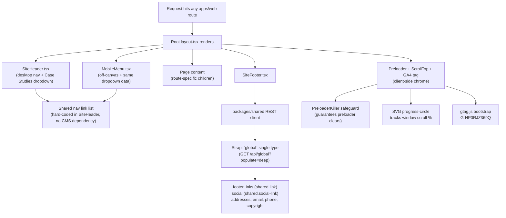

# Section A — Global Site Shell, Navigation & Footer

> **Scope:** The chrome that wraps every route on the site — the desktop main navigation, the mobile off-canvas menu, the "Case Studies" dropdown submenu shared by both, the sticky/absolute header behavior, the global footer (addresses, nav links, social icons, copyright), and the small set of page-independent behaviors that run on every page load: the preloader, the scroll-to-top control, and the Google Analytics 4 bootstrap tag.
>
> **Modernization intent:** The legacy site hand-duplicated its header and mobile-menu markup verbatim across all ~24 HTML files with no include/templating mechanism — any nav change meant editing ~24 files by hand. The footer was the one exception: it was already centralized as data (`assets/data/footer_content.json`, fetched client-side by `assets/js/load-footer.js`). The target collapses the header/nav/mobile-menu duplication into a single shared React component tree (`components/layout/{SiteHeader,MobileMenu}.tsx`) rendered once per request by the Next.js App Router layout, and promotes the footer's existing data-driven pattern into a proper Strapi `global` single type so non-developers can edit addresses, links, socials, and copyright without a code change or redeploy. Page-independent chrome (preloader, scroll-to-top, GA4) is ported as isolated, route-agnostic components/scripts rather than re-duplicated per page.
> Roles, glossary terms, and story conventions are defined in [00-overview-and-architecture.md](00-overview-and-architecture.md) and used verbatim below.

---

## Global shell rendering flow



---

## EP-01 — Global Site Header & Navigation

**Epic title:** Global Site Header & Navigation
**Epic description:**
- **Goal:** Replace hand-duplicated-across-24-files header/nav markup with one shared, CMS-agnostic React component tree so that navigation changes are made once and apply everywhere.
- **Scope:** Desktop main navigation (`nav.main-menu`), the mobile off-canvas menu (`.th-menu-wrapper`) with its hamburger toggle, the "Case Studies" dropdown submenu shared verbatim between desktop and mobile, and the sticky/absolute header scroll behavior — for every route in `apps/web`.
- **Out of scope:** Footer navigation links (EP-02), page-specific hero content beneath the header, CMS-driven nav items (nav link set is hard-coded in the component, matching the legacy site's hard-coded markup — no `nav-item` Strapi content type is introduced in this migration).
- **Success metric:** Zero nav-markup duplication in `apps/web` (one `SiteHeader` + one `MobileMenu` component instance rendered by the root layout); visual/functional parity confirmed on 100% of migrated routes at desktop and mobile breakpoints.
**Priority:** P1

---

### EP-01-S1 — Shared desktop main navigation component

**Title:** As a Front-End Engineer I want the desktop main navigation rendered from a single shared `SiteHeader` component so that a nav change never again requires editing every page file by hand.
**Description:** On the legacy site, `nav.main-menu` (see `index.html` lines ~494-547) is copy-pasted byte-for-byte into every one of the ~24 legacy HTML files — there is no include, partial, or templating mechanism, so a single link-label typo fix historically required 24 manual edits. In the target architecture, `components/layout/SiteHeader.tsx` renders the desktop nav exactly once, imported by the root App Router layout so every route inherits it automatically. The link set (Home, About, Services, Case Studies dropdown, Bootcamp, Partnership, News, Contact — matching the legacy label/href set) is hard-coded in the component, not CMS-driven, mirroring the legacy site's own hard-coded approach. Out of scope: mobile rendering (EP-01-S2), the Case Studies dropdown's own data (EP-01-S4/EP-01-S3 cross-reference), and any CMS-backed nav-item editing capability.
**Acceptance Criteria:**
```
Scenario 1 — Happy path: desktop nav renders identical link set on every route
Given a Site Visitor requests any migrated route in apps/web (e.g. "/", "/about", "/contact")
When the page finishes rendering on a desktop-width viewport
Then the SiteHeader component renders the same ordered set of top-level nav links as legacy index.html's nav.main-menu
And each link's href resolves to the correct target Next.js route (not a legacy .html path)
And the currently active route's nav item is visually indicated as active
```
```
Scenario 2 — Failure/error: broken/missing route target degrades gracefully
Given the SiteHeader component references a nav link target that has not yet been migrated
When the corresponding page.tsx does not exist under apps/web/app
Then the build fails at compile time (Next.js static route check) rather than shipping a silent 404 link
And the Front-End Engineer is required to resolve the missing route before the change can ship
```
```
Scenario 3 — Edge/boundary: nav renders correctly at the tablet/desktop breakpoint boundary
Given a Site Visitor's viewport width sits exactly at the Bootstrap-inherited desktop/mobile breakpoint (992px, lift-and-shift from legacy CSS)
When the page loads
Then the desktop nav (nav.main-menu) is shown and the mobile hamburger trigger is hidden at ≥992px
And at <992px the desktop nav is hidden and the mobile hamburger trigger (EP-01-S2) is shown
And no layout shift or flash-of-both-menus is observable during hydration
```
- **Story Points:** 5
- **Priority:** P1
- **Labels:** `navigation`, `header`, `component-consolidation`, `lift-and-shift`
- **Components:** SEC-HEADER
- **Epic Link:** EP-01 — Global Site Header & Navigation
- **Source:** `index.html` lines ~494-547 (`nav.main-menu`), hand-duplicated verbatim across all ~24 legacy HTML files (no include/templating mechanism existed)

---

### EP-01-S2 — Mobile off-canvas menu

**Title:** As a Site Visitor on a mobile device I want an off-canvas menu with the same links as the desktop navigation so that I can navigate the full site regardless of screen size.
**Description:** The legacy site implements a mobile menu as `.th-menu-wrapper` (see `index.html` lines 412-468), duplicated across every page alongside the desktop nav, and toggled open/closed by a hamburger icon button via jQuery class toggling. The target implements this as `components/layout/MobileMenu.tsx`, a `"use client"` component sharing the exact same link data source as `SiteHeader.tsx` (same labels, hrefs, and ordering, including the Case Studies dropdown) so the two never drift out of sync. The off-canvas panel slides in from the side, dims/locks background scroll while open, and closes on backdrop click, link click, or an explicit close button. Out of scope: any distinct mobile-only link set (legacy has none) and gesture-based (swipe) dismissal, which was not present in the legacy jQuery implementation.
**Acceptance Criteria:**
```
Scenario 1 — Happy path: hamburger opens the off-canvas panel with full link parity
Given a Site Visitor is on a mobile-width viewport (<992px) on any migrated route
When they tap the hamburger toggle button
Then the off-canvas menu slides into view and displays the identical ordered link set as the desktop SiteHeader, including the Case Studies dropdown trigger
And background page scroll is locked while the panel is open
```
```
Scenario 2 — Failure/error: rapid double-toggle does not desync open/closed state
Given the off-canvas menu is closed
When the Site Visitor taps the hamburger toggle twice in rapid succession (e.g. on a slow device where the animation hasn't finished)
Then the menu ends in a single, consistent state (either fully open or fully closed, never a partially-open unresponsive state)
And no duplicate menu instance or ghost backdrop is left in the DOM
```
```
Scenario 3 — Edge/boundary: closing via link navigation, backdrop, and close button all behave identically
Given the off-canvas menu is open
When the Site Visitor clicks a nav link, clicks the backdrop, or clicks the explicit close (×) control
Then in every case the menu closes and background scroll is unlocked
And clicking a nav link additionally navigates to the target route after the panel closes
```
- **Story Points:** 5
- **Priority:** P1
- **Labels:** `navigation`, `mobile`, `off-canvas`, `component-consolidation`
- **Components:** SEC-MOBILE-MENU
- **Epic Link:** EP-01 — Global Site Header & Navigation
- **Source:** `index.html` lines 412-468 (`.th-menu-wrapper`), duplicated across all pages

---

### EP-01-S3 — Shared "Case Studies" dropdown submenu

**Title:** As a Front-End Engineer I want the Case Studies dropdown submenu defined once and rendered inside both the desktop nav and the mobile menu so that the two surfaces can never list different case studies.
**Description:** On the legacy site, `ul.sub-menu` — the 9-item Case Studies dropdown — is repeated identically inside every page's desktop header markup and again inside every page's mobile menu markup, meaning each of the ~24 pages contains two independent copies of the same 9 links. `case8.html` is intentionally absent from this list on the legacy site (it is an orphan page reachable only by direct URL — see `00-overview-and-architecture.md` §3 item 6 and `EP-21-S4`), and the target preserves that exclusion rather than "fixing" it, since the disposition of `case8` is a preserve-or-retire decision tracked separately. The target defines the dropdown's 9-item link list as one shared data array consumed by both `SiteHeader.tsx` and `MobileMenu.tsx`. Out of scope: making the dropdown data CMS-driven (it remains hard-coded, matching legacy) and resolving `case8`'s orphan status (tracked in EP-21).
**Acceptance Criteria:**
```
Scenario 1 — Happy path: dropdown lists exactly the 9 non-orphaned case studies in both surfaces
Given a Site Visitor opens the Case Studies dropdown on desktop, and separately opens it inside the mobile off-canvas menu
When the dropdown/submenu content is inspected
Then both surfaces render the identical ordered set of 9 case-study links
And neither surface includes a link to case8
```
```
Scenario 2 — Failure/error: adding a 10th case study without updating the shared list is caught
Given a new case-study collection-type entry is published in Strapi
When no corresponding update has been made to the shared dropdown link array (which is intentionally hard-coded, not CMS-fetched, per legacy parity)
Then the dropdown continues to show only the original 9 links (no runtime error, no broken link)
And this is flagged as an expected content-ops follow-up, not a code defect — documented in the component's inline comments
```
```
Scenario 3 — Edge/boundary: dropdown keyboard/touch interaction on both surfaces
Given a Site Visitor is navigating via keyboard focus on desktop
When they tab to the Case Studies trigger and press Enter/Space
Then the dropdown opens and focus moves into the first sub-menu link
And on mobile, tapping the equivalent submenu trigger expands the nested list in place within the off-canvas panel without closing the panel itself
```
- **Story Points:** 3
- **Priority:** P1
- **Labels:** `navigation`, `dropdown`, `case-studies`, `component-consolidation`
- **Components:** SEC-HEADER, SEC-MOBILE-MENU
- **Epic Link:** EP-01 — Global Site Header & Navigation
- **Source:** `ul.sub-menu` list items repeated identically in every page's header and mobile menu (e.g. `index.html`, desktop + mobile copies)

---

### EP-01-S4 — Sticky/absolute header scroll behavior

**Title:** As a Site Visitor I want the header to overlay the hero content on page load and become opaque as I scroll so that the visual design matches the legacy site's look and feel.
**Description:** Every legacy page's header carries the classes `header.th-header.header-layout18.header-absolute`, which position the header absolutely over the hero section at the top of the page, transparent until the visitor scrolls, at which point legacy jQuery toggles a "sticky" class that gives the header an opaque background and fixes it to the viewport top. The target reproduces this exact visual behavior via a `"use client"` scroll listener inside `SiteHeader.tsx` (lift-and-shift: same class names/CSS, no Tailwind rewrite), applied uniformly across all routes regardless of whether the page below has a hero section tall enough to scroll past. Out of scope: per-page header color/theme variants (the legacy site does not have any — every page uses the same `header-absolute` treatment) and any parallax or hide-on-scroll-down behavior, which the legacy site does not implement.
**Acceptance Criteria:**
```
Scenario 1 — Happy path: header transitions from transparent-overlay to opaque-sticky on scroll
Given a Site Visitor loads any migrated route at the top of the page
When the page first renders
Then the header is positioned absolutely over the hero content with a transparent/overlay background
And when the visitor scrolls down past the defined threshold, the header gains the sticky/opaque class and remains fixed at the top of the viewport
```
```
Scenario 2 — Failure/error: header behavior does not break on pages with short content
Given a migrated route whose total page content is shorter than the viewport height (e.g. a minimal utility page)
When the page loads and no scroll is possible
Then the header remains in its initial absolute/transparent state without erroring
And no scroll-listener exception is thrown in the browser console
```
```
Scenario 3 — Edge/boundary: rapid scroll direction changes near the threshold do not cause flicker
Given a Site Visitor scrolls back and forth rapidly across the sticky-activation scroll-position threshold
When the scroll listener fires repeatedly in quick succession
Then the header's sticky/transparent state toggles cleanly with each threshold crossing (debounced/throttled) without visible flicker or layout jank
And this behavior is identical across all routes since the listener lives in the single shared SiteHeader component
```
- **Story Points:** 3
- **Priority:** P1
- **Labels:** `header`, `scroll-behavior`, `lift-and-shift`, `parity`
- **Components:** SEC-HEADER
- **Epic Link:** EP-01 — Global Site Header & Navigation
- **Source:** `header.th-header.header-layout18.header-absolute`, present on every legacy page

---

## EP-02 — Global Footer & Site Settings (Strapi `global` single type)

**Epic title:** Global Footer & Site Settings (Strapi `global` single type)
**Epic description:**
- **Goal:** Promote the one piece of the legacy site that was already centralized as data (`footer_content.json`) into a proper Strapi single type so non-developers can edit footer content without touching code.
- **Scope:** The `global` singleType schema definition; rendering of addresses, footer nav links, social icons, and the copyright line from that schema via `components/layout/SiteFooter.tsx`.
- **Out of scope:** Header/nav content (EP-01), contact form submission handling (EP-18/EP-19), any additional "site settings" fields beyond what `footer_content.json` already held (e.g. no new theming/config fields are introduced in this migration).
- **Success metric:** 100% of `footer_content.json` fields represented in the `global` schema with no data loss; a Content Editor can change any footer field in the Strapi admin and see it reflected on the live site (via ISR/on-demand revalidation) with zero developer involvement.
**Priority:** P1

---

### EP-02-S1 — Model the Strapi `global` single type

**Title:** As a CMS Engineer I want a Strapi `global` singleType content type that fully models the legacy footer data so that `footer_content.json` and `load-footer.js` can be retired entirely.
**Description:** The legacy site fetches `assets/data/footer_content.json` client-side via `assets/js/load-footer.js` and injects the resulting fields into static footer markup — the one part of the legacy site already shaped like structured data rather than hand-written HTML. The target formalizes this as a Strapi `global` singleType with fields: `siteName` (string, default `"TrieDatum"`), `usAddress`/`indiaAddress` (text), `email`/`phone`/`phoneClean` (string), `copyrightYear` (integer, default `2026`), `footerLinks` (repeatable `shared.link` component), and `social` (repeatable `shared.social-link` component). This single type fully replaces the JSON file and its loader script — there is no client-side fetch-and-inject step in the target; the footer is server-rendered from Strapi data via `packages/shared`. Out of scope: versioning/draft-publish workflow for `global` (single types in this migration are published-only, no draft preview needed for footer content) and any per-locale variants (the site is English-only).
**Acceptance Criteria:**
```
Scenario 1 — Happy path: schema fully round-trips every legacy footer_content.json field
Given the Strapi `global` content type has been created with the fields listed above
When a CMS Engineer seeds it from the legacy footer_content.json via packages/seed
Then every field present in footer_content.json (addresses, email, phone, phoneClean, links[], social[], copyright/copyrightYear) has a corresponding populated field in the `global` entry
And no legacy footer field is dropped or left unmapped
```
```
Scenario 2 — Failure/error: seed script is idempotent against a pre-existing global entry
Given the `global` single type already has a populated entry (e.g. from a prior seed run or manual edit)
When the seed script is run again
Then it upserts rather than duplicates the entry (single types cannot have duplicates, but the script must not overwrite manual admin edits with stale JSON data on a second run without an explicit --force flag)
And the script exits with a clear log message stating whether it created, updated, or skipped the entry
```
```
Scenario 3 — Edge/boundary: repeatable components enforce their own field shape
Given a Content Editor adds a new entry to `footerLinks` or `social` in the Strapi admin
When they attempt to save an entry missing a required sub-field (e.g. a `shared.social-link` with no `url`)
Then Strapi's validation blocks the save and surfaces a field-level error
And existing valid entries in the repeatable list are unaffected
```
- **Story Points:** 5
- **Priority:** P1
- **Labels:** `strapi`, `content-model`, `global-single-type`, `footer`
- **Components:** CMS-GLOBAL
- **Epic Link:** EP-02 — Global Footer & Site Settings (Strapi `global` single type)
- **Source:** `assets/data/footer_content.json`

---

### EP-02-S2 — Footer address rendering with preserved line breaks

**Title:** As a Site Visitor I want the footer's US and India office addresses to display with the same line breaks as the legacy site so that the addresses remain readable and correctly formatted.
**Description:** The legacy footer renders each address as a sequence of `<span class="d-block">` elements, one per address line, so that line breaks are structural HTML rather than embedded whitespace. The target stores each address as a single text field (`usAddress`, `indiaAddress`) containing literal `\n` line-break characters, and `SiteFooter.tsx` renders each with a `white-space: pre-line` CSS treatment so that the stored newlines reproduce the same visual line-break layout without needing per-line markup. Out of scope: rich-text/HTML formatting within the address fields (plain text with newlines is sufficient, matching the legacy content's actual complexity) and address geocoding/map embeds (not present in the legacy footer).
**Acceptance Criteria:**
```
Scenario 1 — Happy path: multi-line address renders with correct line breaks
Given the `global` entry's `usAddress` field contains a multi-line string with embedded `\n` characters matching the legacy footer_content.json content
When the SiteFooter component renders on any route
Then the address displays across multiple visual lines matching the legacy `.d-block` line-by-line layout
And the same is true independently for `indiaAddress`
```
```
Scenario 2 — Failure/error: empty or missing address field degrades gracefully
Given a Content Editor clears the `indiaAddress` field to empty in the Strapi admin and republishes
When the footer renders
Then the India address block is omitted or shown empty without throwing a rendering error
And the US address block continues to render normally, unaffected by the missing sibling field
```
```
Scenario 3 — Edge/boundary: address text containing no newlines still renders correctly
Given an address field is edited by a Content Editor to a single line with no `\n` characters
When the footer renders
Then the address displays as one line with `white-space: pre-line` applied but no visual artifact from the CSS rule
And no extra blank line or spacing gap appears where a line break would otherwise have been
```
- **Story Points:** 2
- **Priority:** P1
- **Labels:** `footer`, `content-model`, `parity`
- **Components:** SEC-FOOTER, CMS-GLOBAL
- **Epic Link:** EP-02 — Global Footer & Site Settings (Strapi `global` single type)
- **Source:** `footer_content.json` `usAddress`/`indiaAddress` fields

---

### EP-02-S3 — Footer nav links and social icons from CMS repeatable components

**Title:** As a Content Editor I want to manage the footer's navigation links and social icons in Strapi so that I can add, remove, or reorder them without asking an engineer to edit markup.
**Description:** The legacy footer hardcodes 5 nav links (including a hash-anchor link back up to the case-studies section) and 1 social icon (LinkedIn) directly as `<a>` tags sourced from `footer_content.json`'s `links[]` and `social[]` arrays via `load-footer.js`. The target renders these from the `global` single type's `footerLinks` (repeatable `shared.link`: label + href) and `social` (repeatable `shared.social-link`: platform/icon + url) components, iterated in `SiteFooter.tsx`. The hash-anchor link to case studies is preserved as a literal `href` value (e.g. `/#case-studies` or the equivalent target-route anchor) rather than special-cased in code. Out of scope: adding new social platforms beyond LinkedIn (content-owner decision, not a build-time requirement) and link click-tracking/analytics tagging (not present in legacy).
**Acceptance Criteria:**
```
Scenario 1 — Happy path: footer renders the same 5 links and 1 social icon as legacy, from CMS data
Given the `global` entry's `footerLinks` contains 5 entries (including the hash-anchor case-studies link) and `social` contains 1 LinkedIn entry
When the footer renders on any route
Then all 5 nav links appear in the same order with matching labels and working hrefs, including the hash-anchor scrolling/navigating to the case-studies section
And the LinkedIn icon renders and links to the correct URL from the `social` component
```
```
Scenario 2 — Failure/error: a link entry with a malformed or empty href does not break the footer
Given a Content Editor saves a `footerLinks` entry with an empty `href` value
When the footer renders
Then that link renders as inert text or is skipped, rather than producing a broken `<a href="">` that reloads the current page
And all other valid link entries render normally
```
```
Scenario 3 — Edge/boundary: reordering or adding a link/social entry in Strapi is reflected without a code change
Given a Content Editor adds a 6th entry to `footerLinks` or reorders the existing 5 in the Strapi admin and publishes
When the site is revalidated (per EP-26 on-demand revalidation)
Then the footer reflects the new count/order on next page load
And no redeploy or code change was required to achieve this
```
- **Story Points:** 3
- **Priority:** P1
- **Labels:** `footer`, `content-model`, `strapi-components`, `social-links`
- **Components:** SEC-FOOTER, CMS-GLOBAL
- **Epic Link:** EP-02 — Global Footer & Site Settings (Strapi `global` single type)
- **Source:** `footer_content.json` `links[]`/`social[]`

---

### EP-02-S4 — Footer copyright line editable from CMS

**Title:** As a Content Editor I want to edit the footer's copyright line (including its embedded icon and homepage link) directly in Strapi so that I can update the year or wording myself without a code deploy.
**Description:** The legacy footer's copyright line is a rich string containing an embedded icon glyph and an inline link back to the homepage, sourced from `footer_content.json`'s `copyright` field and injected as raw HTML by `load-footer.js`. The target stores `copyrightYear` as a discrete integer field (default `2026`) combined with a `siteName` string (default `"TrieDatum"`) so the year can be bumped by a Content Editor without touching markup, while the surrounding copy/icon/homepage-link structure lives in the `SiteFooter.tsx` template itself (not as raw injected HTML, to avoid the legacy pattern's XSS-adjacent unsanitized-HTML-injection risk). A change to `copyrightYear` or `siteName` in the Strapi admin is reflected on the live site subject to on-demand revalidation (cross-referenced to EP-26) rather than requiring a rebuild/redeploy. Out of scope: full rich-text/HTML editing of the entire copyright line (deliberately constrained to the year/site-name fields for safety — the icon and link markup are template-owned, not editor-owned) — this is a scoped narrowing from the legacy field's raw-HTML flexibility, called out explicitly here rather than silently dropped.
**Acceptance Criteria:**
```
Scenario 1 — Happy path: copyright line renders current year and site name from CMS fields
Given the `global` entry has `copyrightYear = 2026` and `siteName = "TrieDatum"`
When the footer renders on any route
Then the copyright line displays "© 2026 TrieDatum" (or the template's equivalent phrasing) with the embedded icon and a working link back to the homepage
```
```
Scenario 2 — Failure/error: Content Editor edits copyrightYear without any code change or redeploy
Given a Content Editor changes `copyrightYear` from 2026 to 2027 in the Strapi admin and publishes
When the on-demand revalidation webhook fires (EP-26) and the affected pages are revalidated
Then the live footer shows "2027" on next request without a Front-End Engineer redeploying apps/web
And if the revalidation webhook fails to fire, the page still updates within the standard ISR timer window as a fallback
```
```
Scenario 3 — Edge/boundary: missing copyrightYear falls back to the schema default
Given a `global` entry is created without an explicit `copyrightYear` value
When the footer renders
Then it falls back to the schema default of 2026 rather than rendering a blank/undefined year
And no rendering error occurs
```
- **Story Points:** 3
- **Priority:** P2
- **Labels:** `footer`, `content-model`, `revalidation`, `content-editing`
- **Components:** SEC-FOOTER, CMS-GLOBAL
- **Epic Link:** EP-02 — Global Footer & Site Settings (Strapi `global` single type)
- **Source:** `footer_content.json` `copyright` field

---

## EP-03 — Shared Page Chrome (Preloader, Scroll-to-Top, Analytics)

**Epic title:** Shared Page Chrome (Preloader, Scroll-to-Top, Analytics)
**Epic description:**
- **Goal:** Port the small set of page-independent chrome/behaviors that appear on every route — the initial-load preloader, the scroll-to-top control, and the Google Analytics 4 bootstrap tag — as isolated, route-agnostic components rather than re-duplicating them per page.
- **Scope:** `#preloader`/`.preloader` initial-load animation and its guaranteed-clear safeguard; `.scroll-top` SVG progress-circle control; the `gtag` GA4 bootstrap snippet.
- **Out of scope:** Any additional analytics events/conversion tracking beyond the base GA4 pageview tag (not present in legacy, tracked if at all under a separate CMS/SEO/platform epic), and any other jQuery-driven page-independent widget not listed here.
- **Success metric:** All three behaviors present and functionally identical on 100% of migrated routes; the preloader has zero "stuck forever" incidents (previously possible in the legacy jQuery-timer-only approach) across a full crawl of the site.
**Priority:** P1

---

### EP-03-S1 — Preloader with guaranteed-clear safeguard

**Title:** As a Site Visitor I want a branded preloader shown while the page's initial assets load, and I want it to always disappear, so that I'm never stuck staring at a loading screen.
**Description:** The legacy site's `#preloader`/`.preloader` (see `index.html` line 372) shows a letter-by-letter "TRIEDATUM" animation plus a tagline while the page loads, and is hidden purely by a jQuery `window.load`/timer-based handler with no fallback — if a slow-loading resource or a JS error prevents that handler from firing, the preloader can stick indefinitely, permanently blocking the page. The target reproduces the same visual animation as a route-agnostic component but adds an explicit `PreloaderKiller` safeguard: a hard maximum-duration timeout and/or an error-boundary-driven force-hide that guarantees the preloader is removed from the DOM even if a resource fails to load or a script throws. Out of scope: skeleton-screen or per-section loading states (the legacy site has none — the preloader is a single full-page overlay) and preloader suppression on client-side route transitions (Next.js App Router transitions do not re-trigger the full-page preloader, matching the fact that the legacy site is also a full-reload-per-page architecture where this distinction didn't previously exist).
**Acceptance Criteria:**
```
Scenario 1 — Happy path: preloader shows on load and clears once the page is ready
Given a Site Visitor requests any migrated route with a cold cache
When the page begins loading
Then the preloader overlay is visible with the letter-by-letter "TRIEDATUM" animation and tagline
And it is removed from the DOM as soon as the page's critical content has rendered, revealing the page beneath
```
```
Scenario 2 — Failure/error: a slow or failed resource does not leave the preloader stuck
Given a non-critical page resource (e.g. an image or a third-party script) fails to load or hangs indefinitely
When the PreloaderKiller safeguard's maximum-duration timeout elapses
Then the preloader is force-removed from the DOM regardless of the hung resource's state
And the underlying page content remains interactive to the Site Visitor
```
```
Scenario 3 — Edge/boundary: a JavaScript error during initial load does not prevent preloader removal
Given a script error occurs elsewhere on the page during initial load (e.g. an unrelated third-party embed throwing)
When the error is caught (or the timeout safeguard independently fires)
Then the preloader is still removed within the guaranteed maximum duration
And the error is logged (e.g. to the console or an error-tracking hook) without crashing the rest of the page
```
- **Story Points:** 3
- **Priority:** P1
- **Labels:** `preloader`, `resilience`, `page-chrome`, `parity`
- **Components:** SEC-PRELOADER
- **Epic Link:** EP-03 — Shared Page Chrome (Preloader, Scroll-to-Top, Analytics)
- **Source:** `#preloader` / `.preloader`, `index.html` line 372 (letter-by-letter "TRIEDATUM" animation + tagline)

---

### EP-03-S2 — Scroll-to-top control with SVG progress-circle

**Title:** As a Site Visitor I want a scroll-to-top button that visually shows my progress down the page so that I have both a quick way back to the top and a sense of how far I've scrolled.
**Description:** The legacy `.scroll-top` control, present on every page, is driven by `circle-progress.js`: an SVG circle whose `stroke-dashoffset` is recalculated on scroll to visually "fill" as the visitor scrolls down the page, with a click handler that smooth-scrolls back to the top. The target ports this as a single route-agnostic `"use client"` component rendered once by the root layout, recalculating the same `stroke-dashoffset` formula against `window.scrollY`/document height on scroll, with the click-to-top behavior preserved. Out of scope: any change to the progress-circle's visual design or the addition of a "scroll to section" variant (not present in legacy — it only ever returns to the absolute top).
**Acceptance Criteria:**
```
Scenario 1 — Happy path: progress-circle fills proportionally to scroll position
Given a Site Visitor is on a migrated route with content taller than the viewport
When they scroll down to roughly 50% of the total scrollable height
Then the scroll-to-top button's SVG circle stroke-dashoffset reflects approximately 50% progress
And clicking the button smooth-scrolls the page back to the top
```
```
Scenario 2 — Failure/error: control does not render or activate on a page with no scrollable overflow
Given a migrated route's content is shorter than the viewport (no scroll is possible)
When the page loads
Then the scroll-to-top button either remains hidden or renders in a visually inert (0%) state without erroring
And no division-by-zero or NaN value is produced in the stroke-dashoffset calculation
```
```
Scenario 3 — Edge/boundary: rapid scroll events are throttled without visual lag or jank
Given a Site Visitor scrolls very quickly (e.g. via a trackpad fling or a fast mouse-wheel spin) across the full page height
When the scroll listener recalculates progress on each event
Then the progress-circle update is throttled/debounced to avoid excessive re-renders
And the final displayed progress value still accurately reflects the visitor's resting scroll position once scrolling stops
```
- **Story Points:** 2
- **Priority:** P2
- **Labels:** `scroll-to-top`, `page-chrome`, `svg`, `parity`
- **Components:** SEC-SCROLLTOP
- **Epic Link:** EP-03 — Shared Page Chrome (Preloader, Scroll-to-Top, Analytics)
- **Source:** `.scroll-top`, present on every legacy page; driven by `circle-progress.js`

---

### EP-03-S3 — Google Analytics 4 tag on every route

**Title:** As an SEO Engineer I want the Google Analytics 4 tag firing identically on every route with the exact same measurement ID so that traffic/ranking continuity is preserved and no analytics history is lost during the migration.
**Description:** Every legacy HTML page duplicates an inline `gtag` bootstrap snippet verbatim in its `<head>`, hardcoding measurement ID `G-HP0RJZ369Q`. The target injects the identical GA4 tag once, via the root layout (or Next.js's `next/script` mechanism), so it fires on every route without per-page duplication, while preserving the exact same measurement ID so historical analytics continuity is unbroken across the migration cutover. Out of scope: migrating to server-side tagging, adding custom GA4 events beyond the base pageview, or consent-mode/cookie-banner gating (none of which exist in the legacy implementation — this story is a like-for-like port, not an analytics upgrade).
**Acceptance Criteria:**
```
Scenario 1 — Happy path: GA4 tag fires with the correct measurement ID on every route
Given a Site Visitor loads any migrated route
When the page finishes loading
Then the GA4 gtag.js script loads and a pageview event fires tagged with measurement ID G-HP0RJZ369Q
And this is verifiable identically across every route (home, about, contact, case studies, etc.)
```
```
Scenario 2 — Failure/error: GA4 script load failure does not block page rendering
Given the GA4 script fails to load (e.g. blocked by an ad-blocker or a network failure)
When the page continues rendering
Then the rest of the page functions normally with no visible error or blocked content
And no unhandled JS exception is thrown as a result of the missing gtag object
```
```
Scenario 3 — Edge/boundary: client-side route transitions still register as distinct pageviews
Given a Site Visitor navigates between two migrated routes via client-side Next.js navigation (no full page reload)
When the second route finishes rendering
Then a corresponding GA4 pageview (or page_view-equivalent) event fires for the new route
And the measurement ID and tag configuration remain identical to the initial full page load
```
- **Story Points:** 2
- **Priority:** P1
- **Labels:** `analytics`, `ga4`, `seo`, `page-chrome`, `parity`
- **Components:** SEC-ANALYTICS
- **Epic Link:** EP-03 — Shared Page Chrome (Preloader, Scroll-to-Top, Analytics)
- **Source:** inline `gtag` bootstrap snippet duplicated verbatim in every legacy page's `<head>`

---

## Definition of Done

- [ ] Code reviewed and approved by ≥1 peer (`code-reviewer` agent)
- [ ] All Gherkin acceptance criteria pass in a local/staging environment
- [ ] Unit test coverage meets the target in TS-000 §2 for touched code
- [ ] Visual + functional parity confirmed by `parity-auditor` (desktop + mobile)
- [ ] No CRITICAL or HIGH findings from the Standards or Security scan
- [ ] Strapi schema/permission changes documented in `docs/content-model.md`
- [ ] Legacy URL(s) 301 to the new route; SEO metadata present
- [ ] No open blockers or unresolved dependencies
