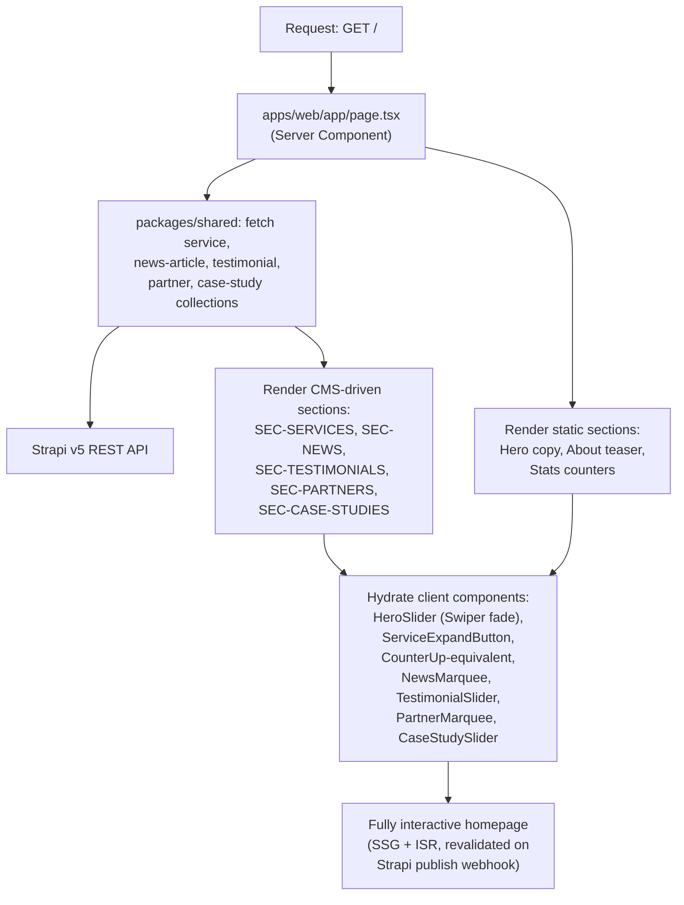

# Section B — Homepage

> **Scope:** The Next.js 14 homepage route (`apps/web/app/page.tsx`), replacing the legacy `index.html` (2,304 lines). Covers the hero slider, About teaser, Services carousel, stats counters, news marquee + news grid, testimonials carousel, partner logo strip, and case-studies carousel — every repeating and CMS-eligible section that appears above the shared footer on the homepage.
> **Modernization intent:** Lift-and-shift the visual design and copy 1:1 for launch, while converting every hardcoded repeating-card block (Services, News, Testimonials, Partners, Case Studies) from hand-authored markup into Strapi-driven collection types fetched via `packages/shared`, and re-implementing every jQuery/Swiper/GSAP interaction as an isolated `"use client"` React component.
> Roles, glossary terms, and story conventions are defined in [00-overview-and-architecture.md](00-overview-and-architecture.md) and used verbatim below.

---

## Homepage render flow



---

## EP-04 — Homepage Hero Slider
**Epic title:** Homepage Hero Slider
**Epic description:**
- **Goal:** Port the 6-slide fade-transition Swiper hero from `index.html` to `apps/web/app/page.tsx` with exact content, order, CTA targets, and entrance-animation timing parity.
- **Scope:** The `#heroSlide19` Swiper instance (slide markup, headline/subtext copy, per-slide CTA hrefs, GSAP/ScrollTrigger entrance animation attributes, fade transition effect, pagination).
- **Out of scope:** Making hero slide content Strapi-editable (v1 is a static, hardcoded lift-and-shift; a `hero-slide` content type is explicitly deferred — see `EP-24`/`EP-27` future-work notes in `09-cms-seo-and-platform.md`).
- **Success metric:** All 6 slides render in legacy order with byte-identical headline/subtext copy and CTA targets; fade transition and entrance animation timing are visually indistinguishable from legacy at desktop and mobile breakpoints.
**Priority:** P1

---

### EP-04-S1 — Render the 6-slide fade hero with exact content and order
**Title:** As a Site Visitor I want the homepage hero to show TrieDatum's six core value propositions in the same order as the legacy site so that my first impression of the company's capabilities is unchanged by the migration.
**Description:** The legacy `div.swiper.th-slider#heroSlide19` (lines 605-977) renders 6 slides via `data-slider-options='{"effect":"fade"}'`, each with an `h1.hero-title`, a `p.hero-text`, and a right-column hero image. The target `HeroSlider.tsx` client component must reproduce all 6 slides, in order, with identical headline and subtext copy: (1) Graph RAG — "Trusted AI powered by SQL Ontology based Semantic Layer"; (2) AI Agents — "Stop Searching Dashboards. Start Talking to Your Data with AI Agents"; (3) Data Ecosystems — "Architecting Data Ecosystems for the Next Generation of Intelligence"; (4) Legacy Modernization — "Unlock Legacy Systems with AI-Powered Modernization"; (5) Engineering Trusted AI — "Engineering the Future of Trusted AI"; (6) AI Bootcamp — "AI Bootcamp Programs". Slide content is hardcoded in the React component per the out-of-scope note in EP-04; only the fade-transition mechanics and slide images are re-implemented as a Swiper.js React wrapper. Pagination dots (`.slider-pagination`) must also be ported; the commented-out legacy prev/next arrows remain commented-out (not implemented) to match legacy behavior exactly.
**Acceptance Criteria:**
```
Scenario 1 — Happy path: all 6 slides render in legacy order with fade transition
Given a Site Visitor loads the homepage "/"
When the hero section mounts
Then exactly 6 slides are present in the DOM in this order: Graph RAG, AI Agents, Data Ecosystems, Legacy Modernization, Engineering Trusted AI, AI Bootcamp
And each slide's headline and subtext text matches the legacy copy exactly
And the active-to-next slide transition uses a cross-fade (no slide/translate motion), matching the legacy `effect:"fade"` Swiper option
```
```
Scenario 2 — Failure/error: hero image fails to load
Given the hero section is rendering slide 1 (Graph RAG)
When the slide image `hero_2_graphrag.png` fails to fetch (404 or network error)
Then the slide's headline, subtext, and CTA buttons still render and remain fully readable and clickable
And the broken image does not collapse the slide layout or block pagination dot interaction
```
```
Scenario 3 — Edge/boundary: reduced-motion preference
Given a Site Visitor has `prefers-reduced-motion: reduce` set in their OS/browser
When the hero slider auto-advances between slides
Then the fade transition duration is shortened or disabled per accessibility best practice, while slide content and order remain unchanged
```
- **Story Points:** 8
- **Priority:** P1
- **Labels:** `hero`, `swiper`, `homepage`, `parity`
- **Components:** PAGE-HOME, SEC-HERO
- **Epic Link:** EP-04 — Homepage Hero Slider
- **Source:** `index.html` `div.swiper.th-slider#heroSlide19`, lines 605-977, `data-slider-options='{"effect":"fade"}'`

---

### EP-04-S2 — Per-slide CTA button pair with correct hrefs
**Title:** As a Prospective Client I want each hero slide's "Learn more" and "Contact us" buttons to route to the correct destination so that I can act immediately on whichever value proposition resonates with me.
**Description:** Each of the 6 slides has a `.hero-inner .btn-group` containing exactly two CTA buttons. The "Learn more" button target varies per slide (a case study, a service anchor, the About page, or the Bootcamp page), while "Contact us" is `contact.html` (→ `/contact`) on every slide. The target implementation must preserve this per-slide href mapping exactly: slide 1 → `/case-studies/case9` (formerly `case-study/case9.html`; see EP-11-S2 for the new case-studies routing), slide 2 → `/case-studies/case7`, slide 3 → `/services#dataEng`, slide 4 → `/services`, slide 5 → `/about`, slide 6 → `/bootcamp`. Button label casing must be preserved verbatim, including slide 6's "Learn More"/"Contact Us" (title case, unlike the sentence-case "Learn more"/"Contact us" on slides 1-5).
**Acceptance Criteria:**
```
Scenario 1 — Happy path: each slide's CTA pair routes correctly
Given a Site Visitor is viewing hero slide 4 (Legacy Modernization)
When they click the "Learn more" button
Then they navigate to the /services route
And when they instead click "Contact us" they navigate to /contact
```
```
Scenario 2 — Failure/error: anchor-fragment target service section missing
Given a Site Visitor clicks "Learn more" on slide 3 (Data Ecosystems), targeting /services#dataEng
When the /services page loads but the #dataEng anchor element is not present (e.g. content was restructured)
Then the page still loads successfully at /services without a client-side error
And the visitor lands at the top of the page rather than triggering a broken-anchor exception
```
```
Scenario 3 — Edge/boundary: slide 6 CTA label casing
Given a Site Visitor is viewing hero slide 6 (AI Bootcamp)
When the slide renders
Then the CTA buttons read exactly "Learn More" and "Contact Us" (title case), distinct from the sentence-case labels on slides 1-5
And "Learn More" routes to /bootcamp while "Contact Us" routes to /contact
```
- **Story Points:** 3
- **Priority:** P1
- **Labels:** `hero`, `cta`, `routing`, `parity`
- **Components:** PAGE-HOME, SEC-HERO
- **Epic Link:** EP-04 — Homepage Hero Slider
- **Source:** `index.html` `.hero-inner .btn-group` on each slide, lines 642-657, 704-719, 766-781, 826-841, 884-899, 942-957

---

### EP-04-S3 — Preserve GSAP/ScrollTrigger entrance animation timing
**Title:** As a Front-End Engineer I want the hero slide entrance animation timing re-implemented faithfully so that the ported hero feels as polished and unjarring as the legacy hero on first paint.
**Description:** Every animatable hero element (`h1.hero-title`, `p.hero-text`, `.btn-group`, `.th-hero-img`) carries `data-ani="slideinup"` and `data-ani-delay="0s"` attributes on the legacy site, consumed by `assets/js/main.js`'s GSAP/ScrollTrigger initialization to slide+fade each element up into place. The target `HeroSlider.tsx` (or a shared `useEntranceAnimation` hook) must reproduce the same "slide in up" motion curve and stagger timing per element, triggered on each slide's active transition (not just initial page load, since the Swiper fade re-triggers the animation on every slide change in the legacy behavior). This story covers only the animation mechanics; slide content and CTA hrefs are covered by EP-04-S1 and EP-04-S2 respectively.
**Acceptance Criteria:**
```
Scenario 1 — Happy path: entrance animation replays on each slide change
Given the hero slider transitions from slide 2 to slide 3
When slide 3 becomes active
Then its headline, subtext, button group, and image animate in with a slide-up + fade-in motion
And the animation completes within the same duration window as the legacy GSAP timeline (no perceptible slowdown or acceleration)
```
```
Scenario 2 — Failure/error: animation library fails to initialize
Given the client-side animation hook throws during hydration (e.g. GSAP/ScrollTrigger equivalent fails to load)
When the hero section renders
Then all slide content is still visible immediately (no content hidden behind an animation that never fires)
And the page does not crash or show a blank hero area
```
```
Scenario 3 — Edge/boundary: rapid manual slide navigation
Given a Site Visitor rapidly clicks pagination dots to skip through multiple slides within one second
When several slide-change events fire in quick succession
Then each slide's entrance animation either completes or is cleanly cancelled without stacking duplicate animations or leaving elements in a partially-animated (invisible/offset) state
```
- **Story Points:** 5
- **Priority:** P2
- **Labels:** `hero`, `animation`, `gsap`, `parity`
- **Components:** PAGE-HOME, SEC-HERO
- **Epic Link:** EP-04 — Homepage Hero Slider
- **Source:** `index.html` `data-ani="slideinup"` / `data-ani-delay` attributes, lines 629-965

---

## EP-05 — Homepage About Teaser
**Epic title:** Homepage About Teaser
**Epic description:**
- **Goal:** Port the static "About TRIEDATUM" teaser block (image, company description, "Learn More" link) as a lift-and-shift static section.
- **Scope:** The `div.space_abt#about-sec` block: image, sub-title, heading, description paragraph, CTA link to `/about`.
- **Out of scope:** Making the teaser copy Strapi-editable in v1 (it remains static JSX, consistent with the hero's out-of-scope decision in EP-04); the full "Our Story" narrative content on the About page itself (covered by `EP-12` in `03-about-and-team.md`).
- **Success metric:** Teaser renders with identical image, copy, and link target to legacy; teaser copy does not contradict the About page's fuller narrative.
**Priority:** P1

---

### EP-05-S1 — Render the static "About TRIEDATUM" teaser section
**Title:** As a Site Visitor I want a short "About TRIEDATUM" summary on the homepage so that I can quickly understand who the company is without leaving the homepage.
**Description:** The legacy `div.space_abt#about-sec` (starting line 991) renders a two-column layout: a company image (`assets/img/normal/about.jpg`) on the left, and on the right a "About TRIEDATUM" sub-title, an "Your Trusted Partner in AI & Data" heading, a company description paragraph (founding year, HQ, boutique AI consultancy positioning, Semantic Layer differentiation, US/India delivery model), and a "Learn More" link to `about.html` (→ `/about`). The target implementation renders this as a static Server Component section in `apps/web/app/page.tsx` (or an extracted `AboutTeaser.tsx`), with the image, heading, paragraph copy, and link target preserved verbatim. No CMS wiring is in scope for this story.
**Acceptance Criteria:**
```
Scenario 1 — Happy path: teaser renders with correct image, copy, and link
Given a Site Visitor loads the homepage
When they scroll to the About teaser section
Then the section shows the about.jpg image, the "About TRIEDATUM" sub-title, the "Your Trusted Partner in AI & Data" heading, and the founding/HQ/Semantic-Layer description paragraph verbatim
And the "Learn More" link routes to /about
```
```
Scenario 2 — Failure/error: about image fails to load
Given the about.jpg image fails to load (404 or slow network)
When the About teaser section renders
Then the heading, paragraph, and "Learn More" link remain visible and functional
And the layout does not shift/collapse due to the missing image
```
```
Scenario 3 — Edge/boundary: narrow mobile viewport
Given a Site Visitor is on a mobile viewport (< 576px)
When the About teaser section renders
Then the image stacks above the text column (no horizontal overflow or overlapping text)
And the "Learn More" link remains a full-width or clearly tappable target
```
- **Story Points:** 3
- **Priority:** P1
- **Labels:** `about`, `homepage`, `static-content`, `parity`
- **Components:** PAGE-HOME, SEC-ABOUT-TEASER
- **Epic Link:** EP-05 — Homepage About Teaser
- **Source:** `index.html` `div.space_abt#about-sec`, line 991

---

### EP-05-S2 — Keep teaser copy consistent with the About page's "Our Story"
**Title:** As a Content Editor I want the homepage About teaser and the About page's "Our Story" section to tell a consistent story so that visitors don't encounter contradictory company narratives as they navigate deeper into the site.
**Description:** The legacy site already has two independent, hand-written descriptions of TrieDatum: the homepage teaser paragraph (EP-05-S1) and the fuller "Our Story" narrative on `about.html` (EP-12). Because both are static, hand-duplicated copy blocks (not sourced from one CMS field), they are at risk of drifting apart over future edits — one could be updated while the other is forgotten. This story establishes the cross-reference and editorial guardrail: document in `docs/content-model.md` (or an editorial style note) that both blocks describe the same founding facts (2020, North Carolina HQ, boutique AI consultancy, Semantic Layer, US/India delivery) and must be reviewed together whenever one changes, even though they remain two separate static text blocks in v1 rather than a single shared CMS field.
**Acceptance Criteria:**
```
Scenario 1 — Happy path: both narratives agree on core facts at launch
Given the homepage About teaser and the About page's "Our Story" section are both rendered
When their content is compared fact-for-fact (founding year, HQ location, delivery model, core differentiator)
Then no factual contradictions exist between the two blocks
```
```
Scenario 2 — Failure/error: a future edit updates one block but not the other
Given a Content Editor updates the About page's "Our Story" founding year or HQ location
When the homepage teaser is not updated in the same change
Then the documented editorial guardrail (docs/content-model.md note) flags this as a required joint review, so the drift is caught in review rather than shipped silently
```
```
Scenario 3 — Edge/boundary: teaser and full story differ in detail level but not in fact
Given the About teaser is intentionally shorter than the "Our Story" narrative
When comparing the two for consistency
Then omissions in the teaser (e.g. leadership bios, timeline detail) are acceptable
And only factual contradictions (not differing detail depth) are treated as defects
```
- **Story Points:** 2
- **Priority:** P3
- **Labels:** `about`, `content-governance`, `cross-reference`
- **Components:** PAGE-HOME, SEC-ABOUT-TEASER
- **Epic Link:** EP-05 — Homepage About Teaser
- **Source:** cross-reference to `about.html` "Our Story" section (see `EP-12` in `03-about-and-team.md`)

---

## EP-06 — Homepage Services Carousel (CMS-driven)
**Epic title:** Homepage Services Carousel (CMS-driven)
**Epic description:**
- **Goal:** Replace the 4 hardcoded service teaser cards with a Strapi `service`-collection-driven carousel, preserving the expand/collapse "Read Details" interaction.
- **Scope:** The `#serviceSlider1` Swiper (icon, title, summary, expand/collapse toggle, "Read Details" link) for all 4 services: Data Engineering, Generative AI Enablement, Advanced Analytics, AI-Enabled Migrations.
- **Out of scope:** The full `/services` page content (covered by `EP-14` in `04-services.md`); this epic covers only the homepage teaser carousel.
- **Success metric:** All 4 service cards render from Strapi with identical copy/order to legacy; expand/collapse works identically; editing a service in Strapi updates the homepage carousel without a code deploy.
**Priority:** P1

---

### EP-06-S1 — Render the 4-card Services carousel from the Strapi `service` collection
**Title:** As a Content Editor I want the homepage Services carousel to pull from the Strapi `service` collection type so that I can update service copy, icons, or ordering without a code deployment.
**Description:** The legacy `#serviceSlider1` Swiper (lines 1062-1283) hardcodes 4 `service-item` cards, each with an icon image, a linked title, a long-form summary paragraph, and a "Read Details" link — for Data Engineering (`service.html`), Generative AI Enablement (`service.html#genAI`), Advanced Analytics (`service.html#advAna`), and AI-Enabled Migrations (`service.html#manSer`). The target implementation fetches all published entries from the Strapi `service` collection type (already modeled with `title`, `slug`, `summary`, `icon` per §5 of the overview doc) via `packages/shared`, and renders them as Swiper slides in the same responsive breakpoint configuration (`slidesPerView`: 1/1/2/3/4 at 0/576/768/992/1200px). Card order must match the legacy order (Data Engineering, Generative AI Enablement, Advanced Analytics, AI-Enabled Migrations) via an explicit `order` field or Strapi's default creation-order, seeded to match.
**Acceptance Criteria:**
```
Scenario 1 — Happy path: 4 service cards render from Strapi in legacy order
Given the Strapi `service` collection has 4 published entries seeded from the legacy content
When the homepage Services section renders
Then exactly 4 cards appear in the order: Data Engineering, Generative AI Enablement, Advanced Analytics, AI-Enabled Migrations
And each card's icon, title, and summary text match the legacy copy verbatim
```
```
Scenario 2 — Failure/error: Strapi is unreachable at build/request time
Given the Strapi API is down or times out during the homepage's data fetch
When the homepage is requested
Then the page still renders (using the last successfully cached/ISR-generated version, or a graceful empty-state for the Services section)
And no unhandled server error (500) is shown to the Site Visitor
```
```
Scenario 3 — Edge/boundary: fewer or more than 4 services published
Given a Content Editor publishes a 5th service entry or unpublishes one, leaving 3
When the homepage Services carousel next regenerates
Then the carousel renders however many services are currently published (3 or 5), without layout breakage
And the Swiper breakpoint slidesPerView configuration still applies correctly to the new count
```
- **Story Points:** 8
- **Priority:** P1
- **Labels:** `services`, `swiper`, `cms-driven`, `homepage`
- **Components:** PAGE-HOME, SEC-SERVICES, CMS-SERVICE
- **Epic Link:** EP-06 — Homepage Services Carousel (CMS-driven)
- **Source:** `index.html` `#serviceSlider1`, lines 1062-1283

---

### EP-06-S2 — Isolated client component for the "Read Details" expand/collapse interaction
**Title:** As a Front-End Engineer I want the service card's expand/collapse behavior re-implemented as a self-contained React client component so that the interaction works correctly under React's rendering model instead of relying on a global inline `onclick` handler.
**Description:** The legacy service card's expand button uses an inline `onclick="toggleServiceCard(this)"` handler (script defined at lines 2293-2301) that walks up to the closest `.service-item_content`, finds its `.service-item_text` sibling, and toggles an `expanded` class on the text block plus an `active` class on the button (rotating the chevron icon). This pattern does not translate directly into React/JSX (no inline DOM-traversal handlers). The target `ServiceExpandButton.tsx` must reproduce the same visual behavior — clicking the chevron button expands/collapses the summary paragraph within that specific card only — using local component state (e.g. `useState` toggling a boolean) scoped to each card instance, with no shared global function.
**Acceptance Criteria:**
```
Scenario 1 — Happy path: clicking expand reveals full summary text, independent per card
Given the Services carousel shows 4 cards, each with truncated summary text and a collapsed chevron
When a Site Visitor clicks the expand chevron on the "Advanced Analytics" card
Then only that card's summary text expands to show the full paragraph
And the chevron icon rotates/flips to indicate the expanded state
And the other 3 cards remain unaffected (still collapsed)
```
```
Scenario 2 — Failure/error: rapid double-click on the same toggle
Given a card is in the collapsed state
When a Site Visitor double-clicks the expand button in quick succession
Then the card ends in a deterministic state (expanded after an odd number of toggles, collapsed after an even number) with no flicker or desynchronization between the text block and the chevron icon state
```
```
Scenario 3 — Edge/boundary: keyboard-only interaction
Given a Site Visitor is navigating via keyboard only
When they Tab to the expand button and press Enter or Space
Then the same card expands/collapses as if it had been clicked
And the button exposes an accessible label (e.g. `aria-expanded`) reflecting its current state
```
- **Story Points:** 5
- **Priority:** P1
- **Labels:** `services`, `client-component`, `interaction`, `accessibility`
- **Components:** PAGE-HOME, SEC-SERVICES
- **Epic Link:** EP-06 — Homepage Services Carousel (CMS-driven)
- **Source:** inline `<script>` at lines 2293-2301; target: `ServiceExpandButton.tsx`

---

## EP-07 — Homepage Stats Counters
**Epic title:** Homepage Stats Counters
**Epic description:**
- **Goal:** Port the 4 animated stat cards with an equivalent count-up-on-scroll animation.
- **Scope:** The `div.bg-theme.space-extra` counter-card row (icon, count-up number, label) for all 4 stats.
- **Out of scope:** Making the stat values Strapi-editable in v1 (static lift-and-shift, consistent with EP-04/EP-05's static-content decisions).
- **Success metric:** All 4 stat cards render with exact legacy values/labels and trigger a count-up animation on scroll-into-view matching legacy CounterUp behavior.
**Priority:** P1

---

### EP-07-S1 — Render 4 stat cards with count-up-on-scroll animation
**Title:** As a Site Visitor I want the homepage stats to animate a count-up effect as I scroll to them so that the credibility metrics feel dynamic and draw attention, matching the legacy site's behavior.
**Description:** The legacy `div.bg-theme.space-extra` block (lines 1294-1369) renders 4 `counter-card` elements, each with an icon, a `span.counter-number` driven by the jQuery CounterUp plugin (animates from 0 to the target number when scrolled into view), a "+" suffix, and a label. The target `StatsCounter.tsx` client component must reproduce this: on scroll-into-viewport (using an IntersectionObserver-based equivalent), each number animates from 0 up to its target value over a short duration, then displays the static "+" suffix. The animation must fire once per page load per card (not re-trigger on every scroll-into-view if the user scrolls back up and down again), matching legacy CounterUp default behavior.
**Acceptance Criteria:**
```
Scenario 1 — Happy path: counters animate once when scrolled into view
Given a Site Visitor loads the homepage and the Stats section is below the fold
When they scroll down until the Stats section enters the viewport
Then each of the 4 counter numbers animates from 0 up to its target value
And the animation does not re-trigger if the visitor scrolls away and back into view again
```
```
Scenario 2 — Failure/error: JavaScript animation hook fails to initialize
Given the count-up animation script fails to attach (e.g. IntersectionObserver polyfill missing on an old browser)
When the Stats section renders
Then the final target numbers are still displayed as static text (no animation, but no blank/zero values either)
```
```
Scenario 3 — Edge/boundary: Stats section is already in the initial viewport on page load
Given a Site Visitor loads the homepage on a large desktop display where the Stats section is visible without scrolling
When the page finishes its initial render
Then the count-up animation still triggers on load (since the section is already "in view"), rather than never firing because no scroll event occurred
```
- **Story Points:** 5
- **Priority:** P1
- **Labels:** `stats`, `counter`, `animation`, `homepage`
- **Components:** PAGE-HOME, SEC-STATS
- **Epic Link:** EP-07 — Homepage Stats Counters
- **Source:** `index.html` `div.bg-theme.space-extra`, lines 1294-1369

---

### EP-07-S2 — Preserve exact stat values and labels
**Title:** As a Prospective Client I want the homepage stats to show TrieDatum's exact track record so that I can trust the credibility signals when evaluating the company.
**Description:** The 4 legacy stat cards show precise, specific values and labels that must not drift during migration: "8+ Delighted Clients", "65+ Finished Projects", "6+ Years of Delivery", and "160+ Collective Years of Experience in AI & Data" (the last label uses a distinct, longer text style class `text_counter_card_text_collective`). This story is a content-parity check layered on top of EP-07-S1's animation mechanics — it ensures the numeric values, "+" suffixes, and label wording are byte-identical to legacy, in the same left-to-right card order and with the same icon per card (`counter_1_2`, `counter_1_1`, `counter_1_3`, `counter_1_4` respectively).
**Acceptance Criteria:**
```
Scenario 1 — Happy path: all 4 stat values/labels match legacy exactly
Given the Stats section renders on the homepage
When its content is inspected
Then the 4 cards read, in order: "8+ Delighted Clients", "65+ Finished Projects", "6+ Years of Delivery", "160+ Collective Years of Experience in AI & Data"
And each card's icon matches its legacy counterpart
```
```
Scenario 2 — Failure/error: a stat value is updated by business need after launch
Given TrieDatum's actual client count or years-of-delivery figure changes post-launch
When a Front-End Engineer updates the static value in the component
Then the change is a simple, isolated text/prop edit (not a rebuild of the counter animation logic), and the "+" suffix and label formatting remain consistent with the other 3 cards
```
```
Scenario 3 — Edge/boundary: long label text wrapping on narrow viewports
Given the "160+ Collective Years of Experience in AI & Data" label is the longest of the 4
When the Stats section renders on a narrow mobile viewport
Then the label wraps onto multiple lines without truncation, overlap, or breaking the card's fixed layout
```
- **Story Points:** 2
- **Priority:** P1
- **Labels:** `stats`, `content-parity`, `homepage`
- **Components:** PAGE-HOME, SEC-STATS
- **Epic Link:** EP-07 — Homepage Stats Counters
- **Source:** `index.html` `div.bg-theme.space-extra`, lines 1294-1369

---

## EP-08 — Homepage News Marquee & News Grid
**Epic title:** Homepage News Marquee & News Grid
**Epic description:**
- **Goal:** Port both homepage news surfaces — the scrolling headline ticker and the 4-card "Latest News" grid — converting the grid to a Strapi `news-article`-driven feed.
- **Scope:** The `.homepage-news-marquee` ticker (header-area) and the `#triedatum-news-sec` 4-card grid (mid-page), including the graphic fallback used for news items without a photo.
- **Out of scope:** The full news listing/index page and individual news article detail pages (covered by `EP-20` in `08-news-case-studies-and-testimonials.md`).
- **Success metric:** Marquee shows the 3 latest headlines looping seamlessly; news grid shows the 4 most recent articles from Strapi with correct date/excerpt/image (or fallback graphic), matching legacy visual style.
**Priority:** P1

---

### EP-08-S1 — Render the scrolling news-headline ticker with seamless CSS-loop duplication
**Title:** As a Site Visitor I want a compact scrolling ticker of the latest headlines near the top of the homepage so that I can catch recent company news without scrolling down to the full news grid.
**Description:** The legacy `.homepage-news-marquee` (lines 561-604) renders a horizontally scrolling ticker inside the header area, showing 3 headline links ("TrieDatum launches its AI Bootcamp Programs", "Trevor Mason joins as our CTO", "TrieDatum joins Claude Partner Network") separated by dividers, wrapped in a `.homepage-news-marquee-track` that contains **two identical `.homepage-news-marquee-group` duplicates** back-to-back — the standard CSS-marquee technique for a seamless infinite-scroll loop (when the first group scrolls fully out of view, the second identical group is already in position, masking the loop reset). The target `NewsMarquee.tsx` client component must reproduce this exact duplication technique (not a JS-driven re-render loop, to avoid layout jank), sourcing its 3 headlines dynamically as the 3 most recent Strapi `news-article` entries rather than hardcoding them.
**Acceptance Criteria:**
```
Scenario 1 — Happy path: ticker scrolls seamlessly with no visible loop reset
Given the 3 most recent news articles are published in Strapi
When the homepage header renders and the marquee animation runs
Then the ticker scrolls continuously left with the 3 headlines separated by dividers
And the transition from the end of the first duplicate group to the start of the second is visually seamless (no jump-cut or blank gap)
```
```
Scenario 2 — Failure/error: fewer than 3 news articles exist in Strapi
Given only 1 news article is currently published
When the marquee renders
Then it shows the 1 available headline (duplicated across both loop groups as usual) rather than crashing or showing empty divider slots for missing items
```
```
Scenario 3 — Edge/boundary: a headline is unusually long
Given a published news article has a headline significantly longer than the 3 legacy examples
When it appears in the marquee
Then the ticker continues to scroll smoothly without wrapping the headline onto multiple lines or breaking the single-line marquee layout
```
- **Story Points:** 5
- **Priority:** P2
- **Labels:** `news`, `marquee`, `cms-driven`, `homepage`
- **Components:** PAGE-HOME, SEC-NEWS, CMS-NEWS-ARTICLE
- **Epic Link:** EP-08 — Homepage News Marquee & News Grid
- **Source:** `index.html` `.homepage-news-marquee`, lines 561-604

---

### EP-08-S2 — Render the 4-card "Latest News" grid from the Strapi `news-article` collection
**Title:** As a Content Editor I want the homepage's "Latest News" grid to automatically show my 4 most recently published articles so that publishing new news content updates the homepage without a manual code change.
**Description:** The legacy `#triedatum-news-sec` (lines 1377-1658) hardcodes 4 `news-card-v2` items: a date badge, an image (or, for the AI Bootcamp item specifically, an inline SVG/CSS graphic treatment since no photo exists for that story), a title, an excerpt, and a "Read More" link. The target `NewsSection.tsx` (a Server Component fetching via `packages/shared`, with any client-only bits isolated) must query the Strapi `news-article` collection for the 4 most recent published entries ordered by `publishedDate` descending, and render each with its date badge, excerpt, and image — falling back to a generic graphic/gradient placeholder (reproducing the legacy inline-SVG treatment's visual intent, not necessarily the exact SVG paths) for any article entry that has no `image` field populated. The section's "View All News" button must route to the news listing page (`/news`, covered by `EP-20`).
**Acceptance Criteria:**
```
Scenario 1 — Happy path: 4 most recent articles render with correct date/excerpt/image
Given Strapi has 6 published `news-article` entries with varying `publishedDate` values
When the homepage News grid renders
Then exactly the 4 entries with the most recent `publishedDate` values appear, newest first
And each card shows its date badge, title, excerpt, and image
```
```
Scenario 2 — Failure/error: an article has no image uploaded
Given a published news article has no `image` field set (e.g. an announcement with no photo, like the legacy "AI Bootcamp" news item)
When that article appears in the 4-card grid
Then a graphic/gradient fallback treatment renders in place of a broken or missing `` tag
And the card's title, excerpt, date badge, and "Read More" link still render normally
```
```
Scenario 3 — Edge/boundary: fewer than 4 news articles are published
Given Strapi currently has only 2 published `news-article` entries
When the homepage News grid renders
Then it shows 2 cards (not 4 placeholder/empty cards), with the grid layout adjusting gracefully (e.g. centered, no dangling empty column)
```
- **Story Points:** 8
- **Priority:** P1
- **Labels:** `news`, `cms-driven`, `homepage`, `fallback-image`
- **Components:** PAGE-HOME, SEC-NEWS, CMS-NEWS-ARTICLE
- **Epic Link:** EP-08 — Homepage News Marquee & News Grid
- **Source:** `index.html` `#triedatum-news-sec`, lines 1377-1658; target: `NewsSection.tsx`

---

## EP-09 — Homepage Testimonials Carousel
**Epic title:** Homepage Testimonials Carousel
**Epic description:**
- **Goal:** Port the 2-card testimonial carousel as a Strapi `testimonial`-collection-driven Swiper, linking each card through to a dedicated detail route.
- **Scope:** The `#testiSlider9` Swiper (quote icon, name, designation/company, quote text) and its click-through to `/testimonials/[slug]`.
- **Out of scope:** The testimonial detail page template itself (covered by `EP-22` in `08-news-case-studies-and-testimonials.md`); this epic covers only the homepage carousel surface.
- **Success metric:** Both testimonial cards render from Strapi with byte-identical quote/name/designation copy to legacy and link through correctly; adding a 3rd testimonial in Strapi surfaces it in the carousel without a code change.
**Priority:** P2

---

### EP-09-S1 — Render the 2-card testimonial Swiper from the Strapi `testimonial` collection
**Title:** As a Prospective Client I want to see real client testimonials on the homepage so that I can gauge TrieDatum's credibility from other clients' experiences before I reach out.
**Description:** The legacy `#testiSlider9` (lines 1678-1753) hardcodes 2 testimonial cards — Rob Wdowik (Director, Information and Data Architecture, Large Pharmaceutical International Organization) and Kristy Burns (SVP of Marketing and E-Commerce, Halo Dream, Inc) — each wrapping its entire card in an `<a>` tag linking to a static `/testimonial/testimonial{n}.html` detail page. The target implementation fetches all published entries from the Strapi `testimonial` collection type (modeled with `authorName`, `slug`, `quote`, `authorRole`, `company` per §5 of the overview doc) and renders them as Swiper slides (breakpoint config: 1 slide below 1200px, 2 slides at 1200px+, matching legacy), with each card linking through to `/testimonials/[slug]` (the new detail route, replacing the legacy static HTML page pattern).
**Acceptance Criteria:**
```
Scenario 1 — Happy path: both testimonials render and link to their detail pages
Given the Strapi `testimonial` collection has 2 published entries seeded from Rob Wdowik and Kristy Burns' legacy content
When the homepage Testimonials section renders
Then both cards appear with their quote, name, and designation/company text matching legacy verbatim
And clicking either card navigates to its corresponding /testimonials/[slug] route
```
```
Scenario 2 — Failure/error: a testimonial entry has no slug set
Given a Content Editor publishes a new testimonial without filling in the `slug` field
When that testimonial is fetched for the homepage carousel
Then the card either falls back to a generated slug (e.g. slugified authorName) or is excluded from click-through entirely without crashing the whole carousel
```
```
Scenario 3 — Edge/boundary: a 3rd testimonial is published
Given a Content Editor adds and publishes a 3rd testimonial entry
When the homepage next regenerates
Then the carousel shows 3 slides, still respecting the 2-slides-at-1200px+ breakpoint (now with genuine sliding/paging since content exceeds the visible slot count)
```
- **Story Points:** 5
- **Priority:** P2
- **Labels:** `testimonials`, `swiper`, `cms-driven`, `homepage`
- **Components:** PAGE-HOME, SEC-TESTIMONIALS, CMS-TESTIMONIAL
- **Epic Link:** EP-09 — Homepage Testimonials Carousel
- **Source:** `index.html` `#testiSlider9`, lines 1678-1753 (Rob Wdowik, Kristy Burns)

---

### EP-09-S2 — Preserve exact quote-icon, name, and designation/company formatting
**Title:** As a Site Visitor I want each testimonial card's formatting (quote icon, name, title/company) to look as polished and consistent as the legacy design so that testimonials read as credible endorsements rather than raw, unformatted text.
**Description:** Each legacy testimonial card has a specific visual structure: a bolded name (`h3.box-title`), a designation/company line in a smaller muted style (`.testi-card5_desig`) that can wrap onto multiple lines for long titles (e.g. Rob Wdowik's "Director, Information and Data Architecture, Large Pharmaceutical International Organization"), a decorative quote-mark icon (`quote4.svg`) positioned near the name block, and the quote text itself wrapped in curly quotation marks and set to visually fill available vertical space (`flex-grow: 1`) so both cards in a row have equal height regardless of quote length. This story ensures the target `TestimonialCard.tsx` reproduces this exact visual hierarchy and equal-height card behavior, independent of the CMS-wiring covered in EP-09-S1.
**Acceptance Criteria:**
```
Scenario 1 — Happy path: card formatting matches legacy visual hierarchy
Given two testimonial cards render side by side at desktop width
When their formatting is inspected
Then each shows the quote icon near the name/designation block, the name in bold, the designation/company in a smaller muted style, and the quote text wrapped in curly quotes
And both cards render at equal height regardless of differing quote text length
```
```
Scenario 2 — Failure/error: designation/company text is unusually long
Given a testimonial's `authorRole`/`company` text is longer than either legacy example
When the card renders
Then the designation text wraps onto additional lines without truncation or overlapping the quote icon
```
```
Scenario 3 — Edge/boundary: quote text is very short (one sentence)
Given a testimonial's `quote` field contains only a single short sentence
When the card renders alongside a card with a much longer quote
Then the short-quote card still stretches to match the taller card's height (via the flex-grow equal-height behavior), rather than leaving a visibly shorter, mismatched card
```
- **Story Points:** 3
- **Priority:** P2
- **Labels:** `testimonials`, `visual-parity`, `homepage`
- **Components:** PAGE-HOME, SEC-TESTIMONIALS
- **Epic Link:** EP-09 — Homepage Testimonials Carousel
- **Source:** `index.html` `#testiSlider9`, lines 1678-1753

---

## EP-10 — Homepage Partner Logo Strip
**Epic title:** Homepage Partner Logo Strip
**Epic description:**
- **Goal:** Port the auto-scrolling partner-logo marquee as a Strapi `partner`-collection-driven strip, matching the legacy 3-partner set exactly and pruning any stale partner records.
- **Scope:** The `.minimal-partner-strip` marquee (logo images, auto-scroll loop, link-through to `/partnership`).
- **Out of scope:** The full `/partnership` page content and partner detail sections (covered by `EP-17` in `06-partnership.md`); this epic covers only the homepage strip.
- **Success metric:** Strip shows exactly Databricks, Claude, and Timbr in legacy order, with no stale/orphaned partner entries (e.g. "Cognition") surfacing in the seeded data; each logo links through to `/partnership`.
**Priority:** P2

---

### EP-10-S1 — Render the auto-scrolling partner strip from the Strapi `partner` collection, pruning stale records
**Title:** As a Content Editor I want the homepage partner strip to reflect exactly TrieDatum's current, live partnerships so that visitors never see a logo for a partnership that has lapsed or was never actually live on the site.
**Description:** The legacy `.minimal-partner-strip` (lines 1764-1888) hardcodes two identical `.minimal-partner-track` groups (the same seamless CSS-loop duplication technique as EP-08-S1's news marquee), each repeating 3 logos three times: Databricks, Claude, Timbr — in that exact order. The target `PartnerMarquee.tsx` must fetch all published entries from the Strapi `partner` collection type and render them in the same auto-scrolling duplicated-track pattern. Critically, the seed/migration process (`packages/seed`) must populate **exactly** the 3 partners that appear on the live legacy homepage — Databricks, Claude, Timbr — in that order. Some internal inventories or working documents reference a 4th partner ("Cognition") that is not actually present anywhere on the live legacy homepage; the seed script must not create a stray "Cognition" `partner` entry, and if one exists from an earlier draft/seed run, it must be pruned so the target strip does not drift from the legacy set. This is the join key referenced by `EP-17` for the full partnership page's parity check.
**Acceptance Criteria:**
```
Scenario 1 — Happy path: exactly 3 partners render in legacy order
Given the Strapi `partner` collection has been seeded per the legacy homepage
When the homepage Partner strip renders
Then exactly 3 logos appear — Databricks, Claude, Timbr — in that order, each duplicated across the two marquee tracks for seamless looping
```
```
Scenario 2 — Failure/error: a stale "Cognition" partner record exists in Strapi
Given an earlier seed run or manual entry created a `partner` record for "Cognition" that was never on the live legacy homepage
When the seed/migration script is (re-)run against a target environment
Then the stale "Cognition" record is identified and pruned (or the seed script is idempotent and never creates it in the first place)
And the homepage strip shows only the 3 legacy partners, with no unexpected 4th logo
```
```
Scenario 3 — Edge/boundary: a Content Editor adds a genuinely new partner post-launch
Given a Content Editor publishes a new, real `partner` entry (e.g. a new technology alliance) after launch
When the homepage strip next regenerates
Then the new logo appears in the marquee alongside the original 3, duplicated correctly across both loop tracks without breaking the seamless scroll
```
- **Story Points:** 5
- **Priority:** P2
- **Labels:** `partners`, `marquee`, `cms-driven`, `data-hygiene`, `homepage`
- **Components:** PAGE-HOME, SEC-PARTNERS, CMS-PARTNER
- **Epic Link:** EP-10 — Homepage Partner Logo Strip
- **Source:** `index.html` `.minimal-partner-strip`, lines 1764-1888

---

### EP-10-S2 — Each partner logo links through to `/partnership`
**Title:** As a Prospective Client I want to click any partner logo on the homepage and land on TrieDatum's partnership page so that I can learn more about that technology relationship.
**Description:** Every `.minimal-logo-item` anchor in the legacy strip points to `partnership.html` regardless of which logo it wraps (all 3 partners link to the same destination page, not per-partner deep links). The target implementation preserves this exact behavior: every logo rendered from the Strapi `partner` collection links to `/partnership`, even though the `partner` content type may have a `url`/`badge` field available for a future per-partner deep-link enhancement (explicitly out of scope for this story — v1 matches legacy's single shared destination).
**Acceptance Criteria:**
```
Scenario 1 — Happy path: every logo links to /partnership
Given the homepage Partner strip renders all 3 partner logos
When a Site Visitor clicks any one of them (Databricks, Claude, or Timbr)
Then they are routed to /partnership, regardless of which logo was clicked
```
```
Scenario 2 — Failure/error: a partner record is missing its logo image but is published
Given a `partner` entry is published without a `badge`/logo image asset uploaded
When it appears in the marquee
Then the anchor still renders (as a text fallback or placeholder) and still links to /partnership rather than being skipped or producing a broken, unclickable slot
```
```
Scenario 3 — Edge/boundary: keyboard/screen-reader navigation through the strip
Given a Site Visitor tabs through the partner strip using a keyboard
When they reach a logo anchor
Then the anchor has an accessible name (e.g. "Databricks — view partnership details") rather than an unlabeled image link
```
- **Story Points:** 2
- **Priority:** P2
- **Labels:** `partners`, `routing`, `homepage`
- **Components:** PAGE-HOME, SEC-PARTNERS, CMS-PARTNER
- **Epic Link:** EP-10 — Homepage Partner Logo Strip
- **Source:** `index.html` `.minimal-partner-strip`, lines 1764-1888

---

## EP-11 — Homepage Case Studies Carousel
**Epic title:** Homepage Case Studies Carousel
**Epic description:**
- **Goal:** Port the case-studies carousel as a Strapi `case-study`-collection-driven Swiper with nav arrows/autoplay/loop, and close the legacy "no case-studies listing page" gap with a real `/case-studies` index route.
- **Scope:** The `#caseStudySlider` Swiper (prev/next arrows, autoplay, loop, 9-of-10 case studies shown) and the "View All" button's target route.
- **Out of scope:** Individual case-study detail page templates (covered by `EP-21` in `08-news-case-studies-and-testimonials.md`); the `case8` orphan disposition decision itself (documented in `EP-21-S4`, referenced here only for context).
- **Success metric:** Carousel renders the same 9 case studies in the same order as legacy, with matching autoplay/loop/nav behavior; "View All" routes to a genuine `/case-studies` listing page instead of an improvised anchor or direct detail-page link.
**Priority:** P1

---

### EP-11-S1 — Render the Case Studies Swiper from the Strapi `case-study` collection
**Title:** As a Prospective Client I want to browse TrieDatum's case studies directly from the homepage so that I can evaluate relevant past work without navigating away first.
**Description:** The legacy `#caseStudySlider` (lines 1897-2102) is a Swiper configured with `loop:true`, `speed:700`, `autoplay:{delay:3000, disableOnInteraction:false, pauseOnMouseEnter:true}`, responsive breakpoints (1/2/2/3/4 slides at 0/576/768/992/1200px), and external prev/next nav buttons (`.cs-btn-prev`/`.cs-btn-next`). It shows 9 of the site's 10 total case studies — `case1`, `case2`, `case4`, `case5`, `case6`, `case7`, `case3`, `case9`, `case10` — in that specific (non-numeric) order; `case8` is deliberately excluded from this carousel (see EP-21-S4 for the resulting orphan-page parity decision). The target implementation fetches the Strapi `case-study` collection filtered/ordered to reproduce this exact same 9-item set and order (e.g. via an explicit `order` or `featured`/`homepageOrder` field), and re-implements the Swiper with identical loop, autoplay, speed, pause-on-hover, and breakpoint configuration.
**Acceptance Criteria:**
```
Scenario 1 — Happy path: 9 case studies render in legacy order with autoplay/loop
Given the Strapi `case-study` collection is seeded with all 10 legacy case studies, with the 9 non-`case8` entries flagged for homepage display
When the homepage Case Studies carousel renders
Then exactly 9 cards appear in the order: case1, case2, case4, case5, case6, case7, case3, case9, case10 (by legacy slug)
And the carousel autoplays every 3 seconds, loops seamlessly, and pauses on mouse hover
```
```
Scenario 2 — Failure/error: prev/next nav arrow clicked during an in-progress autoplay transition
Given the carousel is mid-transition between two slides during autoplay
When a Site Visitor clicks the next-arrow button
Then the carousel completes a clean transition to the next slide (no visual stutter or double-jump) and autoplay resumes afterward per `disableOnInteraction:false`
```
```
Scenario 3 — Edge/boundary: case-study entry is unpublished after being included in the homepage set
Given a previously-published case study flagged for homepage display is unpublished by a Content Editor
When the homepage carousel next regenerates
Then it shows the remaining published entries (fewer than 9) without leaving a blank/broken slide in its place
```
- **Story Points:** 8
- **Priority:** P1
- **Labels:** `case-studies`, `swiper`, `cms-driven`, `homepage`
- **Components:** PAGE-HOME, SEC-CASE-STUDIES, CMS-CASE-STUDY
- **Epic Link:** EP-11 — Homepage Case Studies Carousel
- **Source:** `index.html` `#caseStudySlider`, lines 1897-2102 (legacy showed 9 of the 10 total case studies; `case8` was excluded — see EP-21-S4 for the resulting parity decision)

---

### EP-11-S2 — "View All" routes to a real `/case-studies` listing page
**Title:** As a Prospective Client I want a proper case-studies index page so that I can browse the complete list of TrieDatum's work, not just the 9 shown in the rotating homepage carousel.
**Description:** The legacy site never built a dedicated case-studies listing/index page — a genuine content gap, not a design choice. Its "View All" button on the homepage carousel links directly to `case-study/case1.html` (the first detail page, used as an improvised stand-in for a listing page); the main nav dropdown and footer case-studies links similarly point at individual detail pages or homepage anchors rather than a true index. The target implementation closes this gap: the homepage's "View All" button routes to a genuine `/case-studies` listing route (built under `EP-21`) that shows all 10 published case studies (including `case8`, per the disposition in EP-21-S4), each linking to its own `/case-studies/[slug]` detail page. This story covers only the homepage button's routing target; the listing page itself is built and tested under `EP-21` in `08-news-case-studies-and-testimonials.md`.
**Acceptance Criteria:**
```
Scenario 1 — Happy path: "View All" routes to the real listing page
Given the homepage Case Studies carousel is rendered
When a Site Visitor clicks the "View All" button
Then they navigate to /case-studies
And that page lists all 10 case studies (not just the 9 shown in the homepage carousel)
```
```
Scenario 2 — Failure/error: /case-studies listing route is not yet deployed (mid-migration state)
Given a partial deployment where /case-studies has not yet been built
When the "View All" button is clicked
Then the link must not silently regress to the legacy improvised pattern (a direct link to a single detail page or a same-page anchor) — this is treated as a launch blocker for EP-11, not an acceptable interim fallback
```
```
Scenario 3 — Edge/boundary: case8 appears on the listing page but never in the homepage carousel
Given case8 is included in the /case-studies listing page per the EP-21-S4 disposition decision
When a Site Visitor browses /case-studies
Then case8 is visible and clickable there, resolving its legacy status as reachable only by guessing a direct URL
```
- **Story Points:** 3
- **Priority:** P1
- **Labels:** `case-studies`, `routing`, `gap-closure`, `homepage`
- **Components:** PAGE-HOME, SEC-CASE-STUDIES, CMS-CASE-STUDY
- **Epic Link:** EP-11 — Homepage Case Studies Carousel
- **Source:** absence of a listing page anywhere in `TDWebsite`; cross-reference EP-21-S2

---

## Definition of Done

- [ ] Code reviewed and approved by ≥1 peer (`code-reviewer` agent)
- [ ] All Gherkin acceptance criteria pass in a local/staging environment
- [ ] Unit test coverage meets the target in TS-000 §2 for touched code
- [ ] Visual + functional parity confirmed by `parity-auditor` (desktop + mobile)
- [ ] No CRITICAL or HIGH findings from the Standards or Security scan
- [ ] Strapi schema/permission changes documented in `docs/content-model.md`
- [ ] Legacy URL(s) 301 to the new route; SEO metadata present
- [ ] No open blockers or unresolved dependencies
