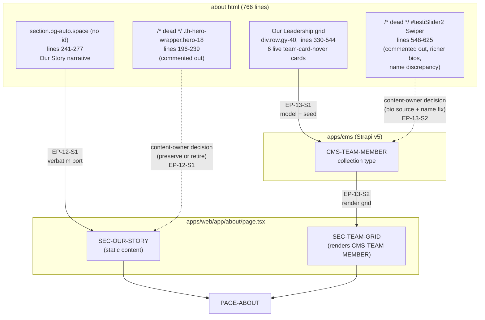

# Section C — About & Team

> **Scope.** This section covers the migration of the legacy `about.html` (766 lines) to `apps/web/app/about/page.tsx` in the Next.js 14 + Strapi v5 monorepo: the static "Our Story" company narrative and the "Our Leadership" team directory. It also resolves two preserve-or-retire decisions surfaced by dead (HTML-commented) code found in the legacy file — a disabled hero-slider block and a disabled alternate team-bio carousel whose content diverges from the live grid.
>
> **Intent.** Port the visible, live sections verbatim (lift-and-shift styling), model team members as a proper Strapi collection type instead of hand-duplicated markup, and flag — rather than silently resolve — the two pieces of dead legacy code that carry unresolved content questions for the content owner.



## EP-12 — About "Our Story"

**Epic title:** About "Our Story"

**Description:** Port the static company narrative section from `about.html` to `apps/web/app/about/page.tsx`, preserving the legacy copy and layout verbatim (lift-and-shift), while explicitly surfacing a piece of dead legacy code (a disabled hero-slider block carrying an alternate, shorter "Our Story" headline and paragraph) that must not be silently ported or silently dropped.

- **Goal:** Port the static company narrative section.
- **Scope:** The live "Our Story" section (`section.bg-auto.space`, no `id`, lines 241-277) — sub-title label, section background image, and the multi-paragraph company narrative covering founding, mission, the Semantic Layer approach, and the global (U.S./India) delivery model, rendered as static content on `PAGE-ABOUT`.
- **Out of scope:** Any CMS-editable modeling of the narrative text (it remains static per this epic); the disabled hero-slider block itself is not implemented — only flagged for a content-owner decision; team content (see EP-13).
- **Success metric:** `apps/about` visually and functionally matches the legacy "Our Story" section at desktop and mobile (parity), and the disabled hero-slider block has a recorded content-owner disposition (preserve/retire) in `docs/content-model.md` or the preserve-or-retire register.
- **Priority:** P2

### EP-12-S1 — Render the "Our Story" narrative section

**Title:** As a Site Visitor I want to read TrieDatum's company story on the About page so that I understand who the company is, what problem it solves, and how it delivers work globally.

**Description:** The legacy `about.html` renders a single live "Our Story" section (`section.bg-auto.space`, no `id`, lines 241-277) containing a centered sub-title label ("Our Story" with a masked icon shape), a section background image (`data-bg-src="assets/img/bg/testi_bg_2.png"`), and a `div.story-box` with one multi-paragraph narrative covering the company's founding/mission, the "hallucination gap" problem framing, the Semantic Layer approach, the AI-infused engineering practice, and the global delivery model spanning the U.S. and India. This story ports that section verbatim as static content (no CMS field) into `apps/web/app/about/page.tsx` as `SEC-OUR-STORY`, preserving paragraph breaks, bold emphasis, and background styling. Separately and explicitly: a full, disabled `.th-hero-wrapper.hero-18` hero-slider block (lines 196-239, id `heroSlide18`) sits directly above this section in the legacy markup, entirely wrapped in an HTML comment — it contains its own "Our <span>Story</span>" headline and a distinct, shorter narrative paragraph (a "Founded in 2020... boutique AI consultancy..." variant that differs from the live `story-box` copy). This hero block is dead code today; this story does NOT silently port it and does NOT silently drop it — it must be logged as a preserve-or-retire item for the content owner to explicitly accept (leave disabled) or resurrect (re-enable with reconciled copy) before/at launch. Out of scope: implementing the hero-slider itself, reconciling the two divergent copies, or any Swiper/`hero-18` interaction wiring — those only happen if the content owner chooses "resurrect."

**Acceptance Criteria:**

```gherkin
# Happy path
Scenario: Visitor views the Our Story section on the About page
  Given a Site Visitor navigates to "/about"
  When the page renders
  Then a section labeled "Our Story" is displayed with its sub-title icon and background image
  And the multi-paragraph narrative (founding/mission, Semantic Layer, global delivery model) renders in full, matching the legacy copy verbatim
  And the section visually matches the legacy "bg-auto space" section at desktop and mobile breakpoints

# Failure/error
Scenario: Background image asset fails to load
  Given the "Our Story" section's configured background image is missing or fails to resolve
  When the page renders
  Then the section still renders its sub-title and full narrative text without layout breakage
  And no unhandled rendering error is thrown that would block the rest of the About page from rendering

# Edge/boundary
Scenario: Disabled hero-slider block is not present in the rendered output, and its disposition is explicitly tracked
  Given the legacy hero-slider block ("th-hero-wrapper hero-18", lines 196-239) is commented out in about.html
  When "/about" is rendered by apps/web
  Then no hero-slider markup, headline, or its alternate "Our Story" paragraph appears on the page
  And a preserve-or-retire entry exists in SOURCE-COVERAGE.md (or docs/content-model.md) recording that the content owner has explicitly chosen to retire (keep disabled) or resurrect this block, rather than the decision being made implicitly by omission
```

**Story Points:** 3

**Priority:** P2

**Labels:** `content-migration`, `static-content`, `preserve-or-retire`, `about-page`

**Components:** `PAGE-ABOUT`, `SEC-OUR-STORY`

**Epic Link:** EP-12 — About "Our Story"

**Source:** `about.html`, `section.bg-auto.space` (no `id`), lines 241-277 (live); `.th-hero-wrapper.hero-18` / `#heroSlide18`, lines 196-239 (dead/commented, preserve-or-retire)

## EP-13 — Team Member Directory

**Epic title:** Team Member Directory

**Description:** Replace the hand-duplicated "Our Leadership" card markup in `about.html` with a proper Strapi `team-member` collection type, seed it with the 6 live team members and their LinkedIn profiles, and render the leadership grid from CMS data with the legacy card-hover styling — while explicitly surfacing a content discrepancy between the live grid and a large block of dead (HTML-commented) alternate team-bio carousel markup that contains richer bios for the same 6 people and one conflicting name spelling.

- **Goal:** Model team members as a proper Strapi collection and reconcile a content discrepancy found in dead legacy code.
- **Scope:** The `team-member` Strapi collection type schema and seed data (EP-13-S1); the Next.js rendering of the leadership grid from that collection with legacy visual parity (EP-13-S2); explicit logging of the dead-code bio/name discrepancy as a content-owner decision.
- **Out of scope:** Implementing the alternate Swiper carousel (`#testiSlider2`) itself; retroactively rewriting the live bios without content-owner sign-off; any team member not among the 6 present in the live grid.
- **Success metric:** `team-member` collection type exists in Strapi with all 6 members seeded and correctly linked to LinkedIn URLs; `PAGE-ABOUT`'s leadership grid renders from CMS data with visual/functional parity to the legacy grid; the bio-source and name-spelling discrepancy is recorded as an explicit content-owner decision before seed data is treated as final.
- **Priority:** P1

### EP-13-S1 — Model and seed the `team-member` collection type

**Title:** As a CMS Engineer I want a `team-member` Strapi collection type seeded with TrieDatum's 6 leadership profiles so that team content is editable in the CMS instead of hand-duplicated HTML.

**Description:** Today, each of the 6 leadership profiles in `about.html`'s "Our Leadership" grid (`div.row.gy-40`, lines 330-544) is hand-coded as a separate Bootstrap card with an inline image path, name, title, bio paragraph, and LinkedIn anchor — there is no data model, and any edit requires a code change. This story defines a Strapi v5 collection type `team-member` with fields `name` (string), `slug` (UID, attached to `name`), `role` (string), `bio` (text), `image` (media), `linkedin` (string, URL), and `order` (integer, for grid ordering), and seeds it via `packages/seed` with the 6 live members and their live-grid bios/LinkedIn URLs: Yin Guo (Founder & CEO, `linkedin.com/in/yin-guo-884912`), Trevor (CTO, `linkedin.com/in/trevor-mason-8b19371`), Ranjit Das (VP, Customer Success, `linkedin.com/in/ranjit-das-1a209411`), Raj Nadipalli (VP, Technology and Strategy, `linkedin.com/in/nadipalli`), Jayanta Bora (Head of India Operations, `in.linkedin.com/in/jbora`), and Mrinal Das (Chief Technologist, `in.linkedin.com/in/mrinal-das-611877219`). Out of scope: the alternate/longer bio copy found in the dead carousel markup (see EP-13-S2, which flags that discrepancy for a content-owner decision before any bio text is treated as final) and rendering of the grid itself (EP-13-S2).

**Acceptance Criteria:**

```gherkin
# Happy path
Scenario: All 6 live team members are seeded with correct fields
  Given the packages/seed ETL script runs against a clean Strapi instance
  When the "team-member" collection type seed completes
  Then 6 team-member entries exist, one each for Yin Guo, Trevor, Ranjit Das, Raj Nadipalli, Jayanta Bora, and Mrinal Das
  And each entry has a non-empty name, slug, role, bio, image, and linkedin field matching the live legacy grid content
  And each entry's "order" field reproduces the legacy grid's display order (Yin Guo, Trevor, Ranjit Das, Raj Nadipalli, Jayanta Bora, Mrinal Das)

# Failure/error
Scenario: Seed script is re-run against an already-seeded instance
  Given the "team-member" collection already contains the 6 seeded entries
  When the seed script is executed again
  Then the script upserts by slug instead of creating 6 duplicate entries
  And the collection still contains exactly 6 team-member entries after the re-run

# Edge/boundary
Scenario: A team member's slug is derived correctly from a multi-word name
  Given a team-member entry with name "Raj Nadipalli"
  When the "slug" (UID) field is generated from "name"
  Then the resulting slug is a URL-safe, lowercase, hyphenated value (e.g. "raj-nadipalli")
  And the slug is unique across all 6 seeded entries
```

**Story Points:** 5

**Priority:** P1

**Labels:** `strapi-schema`, `content-migration`, `seed-data`, `team`

**Components:** `CMS-TEAM-MEMBER`

**Epic Link:** EP-13 — Team Member Directory

**Source:** `about.html`, "Our Leadership" grid, `div.row.gy-40`, lines 330-544

### EP-13-S2 — Render the leadership grid from the `team-member` collection

**Title:** As a Site Visitor I want to see TrieDatum's leadership team in a styled card grid on the About page so that I can learn who leads the company and connect with them on LinkedIn.

**Description:** The legacy leadership grid renders 6 hand-coded `team-card-hover` cards in a 2-column (`col-xl-6`) responsive Bootstrap layout, each with a square team photo, name, role, bio, and a LinkedIn icon link that opens in a new tab. This story renders the same 2-column responsive grid and `team-card-hover` styling in `apps/web/app/about/page.tsx` (`SEC-TEAM-GRID`), sourcing all 6 cards from the `CMS-TEAM-MEMBER` collection (EP-13-S1) ordered by the `order` field, with each card's LinkedIn icon linking out to the member's `linkedin` field value in a new tab. Critically, this story does NOT resolve the following content discrepancy silently — it must be explicitly logged as a content-owner decision before the seed bios in EP-13-S1 are treated as final: a large HTML-commented-out alternate team carousel (`#testiSlider2` Swiper, lines 548-625) exists in the legacy markup, presenting the SAME 6 people but with noticeably longer and richer bio copy for several of them (e.g. Ranjit Das's dead-code bio is a multi-sentence, detailed account of his customer-success track record versus the live grid's short 2-sentence summary; Raj's dead-code bio adds his prior "Executive Director of Enterprise Data Architecture at PPD (ThermoFisher Scientific)" detail and Snowflake Data Marketplace achievement not present in the live card). It also contains one outright name discrepancy: the live card reads "Raj Nadipalli" while the dead carousel's `<h3 class="box-title">` reads "Rajesh Nadipalli" for the same LinkedIn URL (`linkedin.com/in/nadipalli`). The content owner must decide — before any bio content is finalized in the CMS — whether to seed with the shorter live-grid bios (already done in EP-13-S1) or replace them with the richer dead-code bios, and must resolve the "Raj" vs. "Rajesh" naming conflict. This story implements only the live-grid rendering; the dead carousel itself is out of scope for implementation.

**Acceptance Criteria:**

```gherkin
# Happy path
Scenario: Visitor views the leadership grid rendered from CMS data
  Given the "team-member" collection contains the 6 seeded entries ordered by "order"
  When a Site Visitor navigates to "/about"
  Then a "team-card-hover" styled card renders for each of the 6 team members in a 2-column responsive layout
  And each card displays the member's photo, name, role, and bio sourced from the CMS
  And each card's LinkedIn icon link opens the member's "linkedin" URL in a new tab

# Failure/error
Scenario: A team member's image is missing from the CMS
  Given a team-member entry has no "image" media asset attached
  When the leadership grid renders
  Then that member's card renders with a fallback/placeholder image instead of a broken image element
  And the rest of the grid (name, role, bio, LinkedIn link) still renders correctly for that card

# Edge/boundary
Scenario: Dead-code bio/name discrepancy is logged, not silently resolved
  Given the dead "#testiSlider2" carousel markup (lines 548-625) contains richer bios and the name "Rajesh Nadipalli" for the same person rendered as "Raj Nadipalli" in the live grid
  When the leadership grid feature is reviewed for completion
  Then a preserve-or-retire / content-discrepancy entry exists in SOURCE-COVERAGE.md documenting both the bio-length divergence and the "Raj" vs. "Rajesh" naming conflict
  And the entry explicitly requires content-owner sign-off on which bio set and which name spelling to treat as canonical before the seed data is considered final
  And the rendered grid is not blocked on that decision — it ships with the live-grid bios and "Raj Nadipalli" spelling pending that sign-off
```

**Story Points:** 5

**Priority:** P1

**Labels:** `frontend`, `strapi-integration`, `content-discrepancy`, `preserve-or-retire`, `team`

**Components:** `PAGE-ABOUT`, `SEC-TEAM-GRID`, `CMS-TEAM-MEMBER`

**Epic Link:** EP-13 — Team Member Directory

**Source:** `about.html`, live grid `div.row.gy-40`, lines 333-544; dead carousel `#testiSlider2`, lines 548-625

## Definition of Done

```
- [ ] Code reviewed and approved by ≥1 peer (`code-reviewer` agent)
- [ ] All Gherkin acceptance criteria pass in a local/staging environment
- [ ] Unit test coverage meets the target in TS-000 §2 for touched code
- [ ] Visual + functional parity confirmed by `parity-auditor` (desktop + mobile)
- [ ] No CRITICAL or HIGH findings from the Standards or Security scan
- [ ] Strapi schema/permission changes documented in `docs/content-model.md`
- [ ] Legacy URL(s) 301 to the new route; SEO metadata present
- [ ] No open blockers or unresolved dependencies
```
