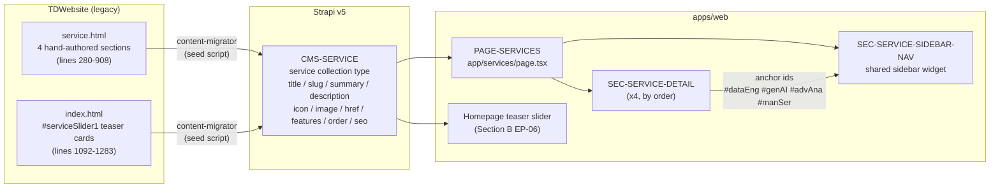

# Section D — Services

> **Scope.** This section covers the migration of `service.html` (1,074 lines) — the legacy site's single services detail page, containing four hand-authored service sections (Data Engineering, GenAI Enablement Services, Advanced Analytics Services, AI-Enabled Migrations) — to `apps/web/app/services/page.tsx`. It also covers the introduction of a unified Strapi `service` collection type that is the **single source of truth** for both this detail page and the homepage "Our Services" teaser slider (`#serviceSlider1`, see Section B `EP-06`), which on the legacy site is a second, independently-authored copy of the same four services' names, icons, and summaries. Out of scope: the homepage teaser slider's own carousel/expand-card interaction behavior (covered by `EP-06`); the case-study pages themselves (Section H); global header/footer chrome (Section A).
>
> **Intent.** Replace two hand-maintained copies of "what TrieDatum offers" — one short (homepage teaser) and one long (detail page) — with one Strapi collection type carrying both a short field (`summary`) and a long field (`description`), so a Content Editor updates a service exactly once and both surfaces stay in sync.



## EP-14 — Services Detail Page & Service Content Type

**Epic title:** Services Detail Page & Service Content Type

**Description:** Unify the homepage teaser cards (Section B `EP-06`) and the full `service.html` detail page under one Strapi `service` collection type, so the four services' copy — name, icon, short summary, long description, feature checklist, and outbound case-study link — is authored and maintained exactly once rather than in two independently-drifting HTML surfaces.

**Goal:** Model, seed, and render a single `service` collection type that powers both `apps/web/app/services/page.tsx` (full detail) and the homepage teaser slider (summary view), eliminating legacy content duplication and the four hand-copy-pasted sidebar nav widgets.

**Scope:** The `service` Strapi collection type and its schema fields; seeding the 4 legacy services (Data Engineering, Generative AI Enablement, Advanced Analytics, AI-Enabled Migrations); the `/services` detail page route with anchor-id parity; the shared "Our Services" sidebar cross-navigation widget derived from CMS `order`; preservation (or explicit content-owner flag) of the "Read a case study" outbound links.

**Out of scope:** The homepage teaser slider's Swiper carousel mechanics, expand/collapse button behavior, and icon SVG asset pipeline (Section B `EP-06`); the linked case-study pages' own content and layout (Section H); any new service beyond the 4 that exist in the legacy site today.

**Success metric:** All 4 services render identically (copy, checklist items, images, anchor ids, case-study links) at `/services` and on the homepage teaser, sourced from the same 4 Strapi entries with zero duplicate authoring; visual/functional parity confirmed by `parity-auditor` against `service.html` at desktop and mobile; no empty placeholder `<li>` elements or dead-code-block ambiguity carried into the CMS.

**Priority:** P1

---

### EP-14-S1 — Model and seed the Strapi `service` collection type

**Title:** As a CMS Engineer, I want a single `service` collection type covering both teaser and detail content, so that Content Editors maintain each service's copy in one place instead of two.

**Description:** Today, each of the 4 services has its name, icon, and a ~150-word summary hand-written into `index.html`'s `#serviceSlider1` markup (lines 1092–1283), and a second, longer, independently-authored copy of the same service's title, intro paragraph, checklist, and multi-paragraph body hand-written into `service.html` (lines 280–908). Nothing links these two copies together beyond a human remembering to update both when the service description changes. The target replaces both with one Strapi `service` collection type: `title` (string), `slug` (uid, generated from `title`), `summary` (text — feeds the homepage teaser card body), `description` (richtext — feeds the full detail-page body, including the sub-topic paragraphs and technology-stack lists), `icon` (media/string — the teaser slider's SVG icon), `image` (media — the detail page's feature image, e.g. `data_eng_img_2.png`), `href` (string — computed as `/services#<anchor>` but stored/overridable for edge cases), `features` (json — the checklist bullet items, e.g. `["Unified Data Lakehouse Architecture", "Robust and Automated Data Pipelines", ...]`), `order` (integer — controls display order on both surfaces and drives the sidebar nav in `EP-14-S3`), and `seo` (component, per the `shared.seo` pattern used elsewhere in the ERD). Seed the 4 legacy services with `order` 1–4 matching their current page sequence: Data Engineering, Generative AI Enablement, Advanced Analytics, AI-Enabled Migrations. Out of scope: authoring any 5th service; building an admin UI beyond Strapi's default content-manager forms.

**Acceptance Criteria:**

```gherkin
# Happy path
Scenario: CMS Engineer creates the service collection type and seeds all 4 legacy services
  Given the Strapi admin has no "service" collection type yet
  When the CMS Engineer applies the service content-type schema (title, slug, summary, description, icon, image, href, features, order, seo)
    And runs the seed script against service.html and index.html's #serviceSlider1 markup
  Then exactly 4 "service" entries exist, titled "Data Engineering", "Generative AI Enablement", "Advanced Analytics", and "AI-Enabled Migrations"
    And each entry's "order" field is 1, 2, 3, and 4 respectively
    And each entry's "summary" field matches the corresponding homepage teaser paragraph
    And each entry's "description" field matches the corresponding service.html body content

# Failure/error
Scenario: Seed script encounters a service missing a required field
  Given the seed script is parsing service.html for the 4 service sections
  When one section is missing an expected checklist or intro paragraph node
  Then the seed script aborts that entry with a logged validation error identifying the missing field and source line range
    And no partially-populated "service" entry is created in Strapi
    And previously-seeded entries from the same run are not rolled back

# Edge/boundary
Scenario: Re-running the seed script against already-seeded services is idempotent
  Given all 4 "service" entries already exist in Strapi from a prior seed run
  When the seed script is run a second time against the same source HTML
  Then no duplicate "service" entries are created
    And existing entries are updated in place (matched by slug) rather than appended
```

**Story Points:** 5

**Priority:** P1

**Labels:** `strapi-schema`, `content-model`, `seed-script`, `services`

**Components:** `CMS-SERVICE`

**Epic Link:** EP-14 — Services Detail Page & Service Content Type

**Source:** `service.html` lines 280–908 (4 detail sections); `index.html` lines 1092–1283 (`#serviceSlider1` teaser cards) — currently two separately-authored copies of the same 4 services on the legacy site; unified into the `service` collection type.

---

### EP-14-S2 — Render the 4 service detail sections with anchor-id parity

**Title:** As a Site Visitor, I want to land on the exact service section I clicked from the homepage or navigate directly via anchor link, so that deep links into the services page continue to work after migration.

**Description:** Legacy `service.html` renders 4 stacked `<section>` blocks (lines 280–430, 432–552, 554–731, 733–911), each with a title (`<h2 class="page-title">`), an intro paragraph, a two-column row (feature image + checklist `<ul>`), and a full-width sub-topic body with additional paragraphs (some bolded lead-ins) and, for AI-Enabled Migrations, nested `<h5>` sub-headings. Each section carries (or is targeted by) one of the anchor ids `#dataEng`, `#genAI`, `#advAna`, `#manSer`, which the homepage teaser slider's "Read Details" links and icon links point to directly (e.g. `service.html#genAI`). The target renders these same 4 sections from the `service` collection (ordered by `order`), preserving all 4 anchor ids exactly so existing inbound links (homepage teaser, any external bookmarks) continue to resolve to the correct section. The legacy checklist markup contains empty placeholder `<li></li>` elements used purely as CSS vertical-spacing hacks — e.g. lines 311–313 in the Data Engineering section render 3 empty `<li>` before the 5 real checklist items, and the GenAI and Advanced Analytics sections have their own empty-`<li>` counts. These must be normalized out during migration: the `features` json field seeded in `EP-14-S1` must contain only the real checklist text, and the rendered component must not emit empty list items or attempt to reproduce the spacing hack via markup — any equivalent visual spacing must be achieved with CSS (flex/gap) on the rendering component. Out of scope: redesigning the checklist visual style; changing the 4 services' order or introducing new anchor ids.

**Acceptance Criteria:**

```gherkin
# Happy path
Scenario: All 4 service sections render with correct content and anchor ids
  Given the 4 "service" entries are seeded and published in Strapi
  When a Site Visitor loads /services
  Then 4 sections render in order: Data Engineering, Generative AI Enablement, Advanced Analytics, AI-Enabled Migrations
    And each section's root element carries its legacy anchor id (#dataEng, #genAI, #advAna, #manSer respectively)
    And each section shows its title, intro paragraph, feature image, checklist items, and full sub-topic body matching service.html

# Failure/error
Scenario: A service entry's feature image is missing or fails to load
  Given the "Advanced Analytics" service entry has no image asset attached in Strapi
  When a Site Visitor loads /services
  Then the Advanced Analytics section renders its title, text, and checklist without erroring
    And a placeholder or omitted-image layout is used instead of a broken image tag
    And the page does not fail to build or render for the remaining 3 services

# Edge/boundary
Scenario: Checklist items render with no empty placeholder list items
  Given the "Data Engineering" service entry's "features" json field contains exactly 5 real checklist strings (no empty entries)
  When a Site Visitor loads /services#dataEng
  Then exactly 5 checklist `<li>` items render, each with visible text and the checkmark icon
    And no empty `<li>` elements are present in the rendered DOM
    And visual spacing above the checklist matches legacy parity via CSS, not empty markup nodes

Scenario: Direct anchor navigation from the homepage teaser resolves to the correct section
  Given a Site Visitor is on the homepage and clicks the "AI-Enabled Migrations" teaser card's "Read Details" link
  When the browser navigates to /services#manSer
  Then the page scrolls to the AI-Enabled Migrations section
    And the corresponding sidebar nav item is marked active per EP-14-S3
```

**Story Points:** 8

**Priority:** P1

**Labels:** `next-js`, `services`, `content-parity`, `anchor-links`

**Components:** `PAGE-SERVICES`, `SEC-SERVICE-DETAIL`, `CMS-SERVICE`

**Epic Link:** EP-14 — Services Detail Page & Service Content Type

**Source:** `service.html` lines 280–908; empty placeholder `<li>` CSS-spacing hack at lines 311–313 (and equivalent empty `<li>` runs in the GenAI and Advanced Analytics checklists) — normalized out, not carried over as empty content items.

---

### EP-14-S3 — Render the shared "Our Services" sidebar nav widget once

**Title:** As a Front-End Engineer, I want one "Our Services" sidebar nav component driven by the Service collection's `order` field, so that the 4-item cross-navigation list is authored once instead of duplicated per section.

**Description:** Legacy `service.html` repeats the identical `aside.sidebar-area` "Our Services" widget 4 times — once per section (lines 341–357, 483–500, 610–627, 843–860) — with all 4 nav items (`Data Engineering`, `GenAI Enablement Services`, `Advanced Analytics Services`, `AI-Enabled Migrations`) hand-copied into each occurrence, differing only in which item carries the `custom_s_nm_ac_itm` active-state class for that section. Any change to a service's nav label requires 4 synchronized edits. The target renders this widget as a single reusable component that reads the same 4 `service` entries (ordered by `order`) used by the detail sections, computes the active item by comparing the current section's anchor id against each service's `href`/anchor, and renders once per detail section (visually, so it still appears alongside each section as in the legacy layout) but from one shared implementation and one data source. Out of scope: making the widget sticky/scroll-spy-driven (legacy behavior is static per-section, not scroll-linked); redesigning the widget's visual style.

**Acceptance Criteria:**

```gherkin
# Happy path
Scenario: Sidebar nav widget lists all 4 services in CMS-defined order
  Given the 4 "service" entries are seeded with order 1-4 as Data Engineering, Generative AI Enablement, Advanced Analytics, AI-Enabled Migrations
  When a Site Visitor loads /services
  Then each of the 4 sections displays a sidebar widget titled "Our Services"
    And each widget lists all 4 services in the same order, linking to their respective anchor ids

# Failure/error
Scenario: A service entry is unpublished after the page has been statically generated
  Given the "Advanced Analytics" service entry is unpublished in Strapi
  When the on-demand revalidation webhook triggers a rebuild of /services
  Then the sidebar nav widget renders only the remaining 3 published services
    And no broken link or empty nav item is left in place of the unpublished service
    And the corresponding detail section for the unpublished service is also omitted from the page

# Edge/boundary
Scenario: Active-item highlighting matches the section the widget is rendered within
  Given a Site Visitor is viewing the "GenAI Enablement Services" section at /services#genAI
  When the sidebar widget for that section renders
  Then the "Generative AI Enablement" nav item is visually marked active
    And the other 3 nav items are rendered without the active-state styling
    And this active-state logic is derived from component props/section context, not 4 separately hand-authored widget copies
```

**Story Points:** 5

**Priority:** P2

**Labels:** `next-js`, `services`, `component-reuse`, `sidebar-nav`

**Components:** `SEC-SERVICE-SIDEBAR-NAV`, `PAGE-SERVICES`, `CMS-SERVICE`

**Epic Link:** EP-14 — Services Detail Page & Service Content Type

**Source:** `service.html` `aside.sidebar-area` "Our Services" widget, repeated identically at lines 341–357, 483–500, 610–627, and 843–860, differing only in which item carries the `custom_s_nm_ac_itm` active class.

---

### EP-14-S4 — Preserve (or flag) the "Read a case study" outbound link per service

**Title:** As a Content Editor, I want each service's optional case-study link modeled explicitly in the CMS, so that the inconsistent legacy pattern (3 of 4 services link out, 1 doesn't) is a deliberate, visible content decision rather than a silent migration gap.

**Description:** In the live legacy markup, 3 of the 4 services end their detail section with a `To learn more about our services` sentence containing an `a.line-btn` link labeled "Read a case study": Data Engineering → `case-study/case2.html` (line 419), GenAI Enablement Services → `case-study/case1.html` (line 541), Advanced Analytics Services → `case-study/case7.html` (line 720). AI-Enabled Migrations has no such link in its live section (lines 733–911); a commented-out alternate content block at lines 862–908 contains dead copy (a near-duplicate of the GenAI section's text) that references `case-study/case6.html` for this slot, but it is not rendered and was evidently left over from an earlier draft — it must not be resurrected as-is. The target models this as an optional `caseStudyLink` field (relation to `case-study` or a plain url string) on the `service` collection type, populated for the 3 services that have it and left empty for AI-Enabled Migrations, with this omission explicitly flagged to the content owner as a decision point (add a real case-study link for AI-Enabled Migrations — case6 or otherwise — or intentionally ship without one) rather than guessed at by an engineer or agent. Out of scope: writing new case-study content; deciding the AI-Enabled Migrations disposition unilaterally — this story's Definition of Done requires the flag to be raised, not resolved.

**Acceptance Criteria:**

```gherkin
# Happy path
Scenario: The 3 services with legacy case-study links render them correctly
  Given the "Data Engineering", "Generative AI Enablement", and "Advanced Analytics" service entries each have a populated caseStudyLink field
  When a Site Visitor views each of those 3 sections on /services
  Then each section renders a "Read a case study" link
    And the link targets the correct migrated case-study route (case2, case1, and case7 respectively)

# Failure/error
Scenario: A case-study link target has been retired or renamed
  Given the "Advanced Analytics" service's caseStudyLink points to a case-study slug that no longer exists in Strapi
  When the page is statically generated
  Then the build/render process logs a broken-reference warning identifying the orphaned link
    And the section still renders its other content without failing the build
    And the "Read a case study" link is omitted rather than rendered as a dead link

# Edge/boundary
Scenario: AI-Enabled Migrations has no case-study link and this is a flagged, not silent, gap
  Given the "AI-Enabled Migrations" service entry has an empty caseStudyLink field
  When a Site Visitor views the AI-Enabled Migrations section on /services
  Then no "Read a case study" link renders for that section
    And no error or placeholder text is shown in its place
    And this omission is recorded in SOURCE-COVERAGE.md's preserve-or-retire register as a content-owner decision (add a link, e.g. reviving/replacing the dead case6 reference, or intentionally leave unlinked), not silently resolved by an engineer
```

**Story Points:** 3

**Priority:** P2

**Labels:** `content-model`, `services`, `case-study-link`, `preserve-or-retire`

**Components:** `SEC-SERVICE-DETAIL`, `CMS-SERVICE`

**Epic Link:** EP-14 — Services Detail Page & Service Content Type

**Source:** `service.html` `a.line-btn` "Read a case study" links at lines 419 (`case2.html`), 541 (`case1.html`), 720 (`case7.html`); dead/commented-out alternate content block at lines 862–908 referencing `case6.html`, not live in the AI-Enabled Migrations section.

---

## Definition of Done

- [ ] Code reviewed and approved by ≥1 peer (`code-reviewer` agent)
- [ ] All Gherkin acceptance criteria pass in a local/staging environment
- [ ] Unit test coverage meets the target in TS-000 §2 for touched code
- [ ] Visual + functional parity confirmed by `parity-auditor` (desktop + mobile)
- [ ] No CRITICAL or HIGH findings from the Standards or Security scan
- [ ] Strapi schema/permission changes documented in `docs/content-model.md`
- [ ] Legacy URL(s) 301 to the new route; SEO metadata present
- [ ] No open blockers or unresolved dependencies
