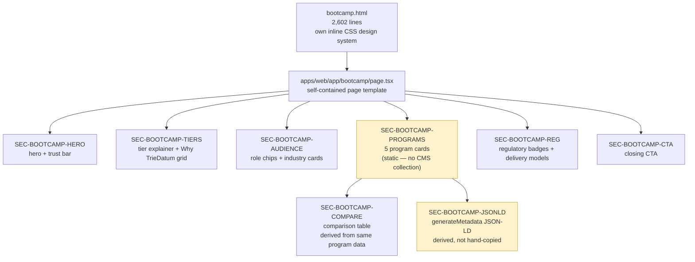

# Section E — AI Bootcamp

> **Scope.** This section covers the migration of `bootcamp.html` (2,602 lines) — the legacy site's AI Bootcamp landing page — to `apps/web/app/bootcamp/page.tsx`. `bootcamp.html` is a **structural outlier**: it ships its own ~1,000-line inline CSS design system, entirely distinct from the shared Themeholy chrome used by every other legacy page, and is treated in the target architecture as its own self-contained page template rather than forced into the generic "page-single" pattern used by About/Services/Partnership. It covers the hero, tier explainer, "Why TrieDatum" grid, audience section, the 5 Program cards, the program comparison table, regulatory/delivery sections, the closing CTA, and the page's hand-authored JSON-LD structured data. **A key, deliberate scope decision carried through this section: no `bootcamp-program` Strapi collection type is built for v1** — the 5 program cards remain static page content in `apps/web`, because (unlike Service or Case Study) bootcamp programs do not repeat anywhere else on the site, so the reuse payoff of a full collection type was judged low relative to the modeling/seeding effort. This is a documented, intentional P4/future-work deferral — not an oversight.



## EP-15 — Bootcamp Landing Page & Program Content

**Epic title:** Bootcamp Landing Page & Program Content

**Description:** Port `bootcamp.html`'s self-contained landing-page micro-site faithfully as its own page template, preserving its distinct visual identity rather than folding it into the shared Themeholy "page-single" pattern used elsewhere on the site.

**Goal:** Deliver `apps/web/app/bootcamp/page.tsx` as a visually and functionally faithful, scoped-CSS reproduction of the legacy bootcamp landing page — hero, tier explainer, audience targeting, 5 program cards, comparison table, regulatory/delivery credibility sections, and closing CTA.

**Scope:** Hero + trust bar; two-tier explainer + "Why TrieDatum" 6-card grid; audience role chips + industry cards; the 5 Program cards (4 Practitioner-Tier + 1 Leadership-Tier); the program comparison table; regulatory/standards badges + delivery model cards; closing CTA section. All content is rendered from the page's own scoped CSS design system.

**Out of scope:** A `bootcamp-program` Strapi collection type (deferred — see EP-15-S4); structured data generation (covered separately in EP-16); any content editing workflow for bootcamp copy (remains a code change, not a CMS edit, for v1).

**Success metric:** 100% visual + functional parity with the legacy `bootcamp.html` at desktop and mobile breakpoints, confirmed by `parity-auditor`, with zero bleed-through of the shared Themeholy theme's global CSS into the bootcamp route.

**Priority:** P1

### EP-15-S1 — Bootcamp hero and trust bar

**Title:** As a Site Visitor I want to see a clear, distinct bootcamp hero and credibility trust bar so that I immediately understand this is a specialized, practitioner-grade offering separate from the rest of the marketing site.

**Description:** The legacy page renders a custom hero (`header.hero`) with an eyebrow badge, an H1 containing an emphasis `<span>`, subtext, and two CTA buttons — "Explore Programs" (anchor to `#programs`) and "Request a Consultation" (link to `/contact`) — followed by a 4-item trust bar with inline SVG icons and labels: "Practitioner-Led Instruction," "Hands-On Labs with Live Tools," "Customised to Your Use Case," and "5 Programs · 2 Tiers · Regulated Industries." The target renders this as `SEC-BOOTCAMP-HERO` inside `PAGE-BOOTCAMP`, using the page's own scoped CSS module/class namespace rather than any shared Themeholy hero component, since the visual language (typography scale, colors, spacing) is unique to this page. Out of scope: any A/B testing of hero copy, and any dynamic/CMS-driven hero content (hero text is static for v1, matching the legacy source exactly).

**Acceptance Criteria:**

```gherkin
Scenario: Happy path — hero renders with both CTAs functional
  Given a Site Visitor loads /bootcamp
  When the page finishes rendering
  Then the eyebrow badge, H1 with its emphasized span, and subtext are visible
  And the "Explore Programs" button scrolls the viewport to the #programs anchor
  And the "Request a Consultation" button navigates to /contact
  And the trust bar shows exactly 4 items, each with its inline SVG icon and label

Scenario: Failure/error — scoped CSS fails to load
  Given the bootcamp page's scoped stylesheet fails to load or is blocked
  When /bootcamp renders
  Then the hero content and CTAs still render as valid, readable HTML
  And no shared Themeholy theme classes or styles leak in to visually distort the hero
  And no unstyled-content flash breaks the page's usability

Scenario: Edge/boundary — narrow mobile viewport
  Given a Site Visitor loads /bootcamp on a 320px-wide viewport
  When the hero and trust bar render
  Then the H1, subtext, and both CTA buttons stack vertically without horizontal overflow
  And all 4 trust-bar items remain legible and do not clip their SVG icons or labels
```

**Story Points:** 5

**Priority:** P1

**Labels:** `frontend`, `bootcamp`, `hero`, `scoped-css`, `parity`

**Components:** `PAGE-BOOTCAMP`, `SEC-BOOTCAMP-HERO`

**Epic Link:** EP-15 — Bootcamp Landing Page & Program Content

**Source:** `bootcamp.html`, `header.hero` + `.trust-bar`, lines 1324–1392

---

### EP-15-S2 — Tier explainer and "Why TrieDatum" grid

**Title:** As a Prospective Client I want to understand the two bootcamp tiers and why TrieDatum is credible to deliver them so that I can decide which tier fits my organization's needs.

**Description:** The legacy page renders a `.how-section` containing two explainer cards — Practitioner Tier and Leadership Tier — followed by a `.why-section` 6-card grid: Production-First Architecture Focus, Regulatory Precision Baked In, Client-Specific Use Cases, Measurable Impact, Deep Technical Credibility, and Industry-Agnostic Regulation-Ready. The target renders both as `SEC-BOOTCAMP-TIERS` within `PAGE-BOOTCAMP`, preserving the legacy card copy and layout verbatim using the page's scoped CSS. Out of scope: making the tier cards clickable/filterable (they are informational only on the legacy page and remain so in the target).

**Acceptance Criteria:**

```gherkin
Scenario: Happy path — both sections render with full card counts
  Given a Site Visitor scrolls to the tier explainer section
  When the section renders
  Then exactly 2 tier cards are visible: Practitioner Tier and Leadership Tier
  And immediately below, the Why TrieDatum grid shows exactly 6 cards
  And each of the 6 cards shows its title and description text matching the legacy copy

Scenario: Failure/error — one Why-TrieDatum card's copy is missing at build time
  Given a content regression removes text from one of the 6 Why-TrieDatum cards during a code change
  When the page is built
  Then the build/lint step flags the missing content as an error
  And the page does not silently ship with an empty card

Scenario: Edge/boundary — grid reflow at tablet breakpoint
  Given a Site Visitor loads /bootcamp on a 768px-wide viewport
  When the Why TrieDatum grid renders
  Then the 6 cards reflow into a 2-column layout without overlapping text
  And card heights remain visually consistent within each row
```

**Story Points:** 5

**Priority:** P1

**Labels:** `frontend`, `bootcamp`, `content`, `parity`

**Components:** `PAGE-BOOTCAMP`, `SEC-BOOTCAMP-TIERS`

**Epic Link:** EP-15 — Bootcamp Landing Page & Program Content

**Source:** `bootcamp.html`, `.how-section` + `.why-section`, lines 1394–1546

---

### EP-15-S3 — Audience section (role chips and industry cards)

**Title:** As a Prospective Client I want to see which roles and industries the bootcamp targets so that I can quickly self-identify whether this program is relevant to my organization.

**Description:** The legacy `.audience-section` renders 14 role chips split into two groups — 8 practitioner roles (Enterprise Architect, Solution Architect, Platform Architect, AI CoE Lead, Engineering Lead, Technical Manager, Data Platform Engineer, AI/ML Engineer) and 6 leadership roles (CTO, CIO, VP Engineering, VP Architecture, VP AI Strategy, Senior Director AI & Data) — plus 8 industry cards (Pharma & Biotech, Life Sciences & MedTech, Banking & Financial Services, Healthcare & Health Systems, Insurance, Energy & Critical Infrastructure, Government & Public Sector, Any Quality-Driven Enterprise). The target renders this as `SEC-BOOTCAMP-AUDIENCE`, preserving the exact grouping, order, and labels, using static arrays local to the page component since this content does not repeat elsewhere on the site. Out of scope: linking role chips or industry cards to filtered program views (the legacy page does not do this either).

**Acceptance Criteria:**

```gherkin
Scenario: Happy path — all role chips and industry cards render with correct grouping
  Given a Site Visitor scrolls to the audience section
  When the section renders
  Then exactly 8 chips render under the practitioner-roles group and exactly 6 under the leadership-roles group
  And exactly 8 industry cards render, each with its label text
  And the total of 14 role chips matches the legacy count exactly

Scenario: Failure/error — role count drifts from spec during a future edit
  Given a developer adds or removes a role chip without updating both the group array and a length-asserting test
  When the test suite runs
  Then a test asserting exactly 8 practitioner roles and exactly 6 leadership roles fails
  And the regression is caught before merge

Scenario: Edge/boundary — chip label longer than the container at narrow width
  Given the role chip "Senior Director AI & Data" is the longest label in the set
  When rendered on a 320px-wide viewport
  Then the chip wraps or truncates gracefully without breaking the surrounding chip-row layout
  And no horizontal scroll is introduced on the page
```

**Story Points:** 5

**Priority:** P2

**Labels:** `frontend`, `bootcamp`, `content`, `parity`

**Components:** `PAGE-BOOTCAMP`, `SEC-BOOTCAMP-AUDIENCE`

**Epic Link:** EP-15 — Bootcamp Landing Page & Program Content

**Source:** `bootcamp.html`, `.audience-section`, lines 1552–1654

---

### EP-15-S4 — Program cards (5 programs, 2 tiers)

**Title:** As a Prospective Client I want to browse the 5 bootcamp programs with their full details so that I can evaluate which program matches my team's needs and enquire about it.

**Description:** The legacy `.programs-section#programs` renders the richest repeating content structure on the entire legacy site: 5 program cards grouped by tier — 4 Practitioner-Tier programs (AI Semantic Layer Lab; AI-Driven Legacy Modernization Workshop; AI Pilot to Production; Governed AI for Regulated Environments — Architecture) and 1 Leadership-Tier program (Governed AI for Regulated Environments — Leadership). Each card shows a format badge, duration, meta rows, an audience tag, a tagline, a description, 6–8 outcome bullets, 6–9 tags, and an "Enquire →" CTA linking to `/contact`. **The target implementation renders this section as fully static page content in `apps/web` — no `bootcamp-program` Strapi collection type is built.** This is a deliberate P4/future-work deferral, not a bug: unlike Service or Case Study, bootcamp programs do not repeat anywhere else on the site (no other page references or lists them), so the reuse payoff of modeling a full collection type — schema design, seed scripting, admin UI training — was judged low relative to the effort, at least for v1. If a second consumer of this data ever emerges (e.g. a programs index elsewhere), this decision should be revisited. Out of scope: any Strapi schema, seed script, or admin editing workflow for programs (explicitly deferred).

**Acceptance Criteria:**

```gherkin
Scenario: Happy path — all 5 program cards render fully populated and grouped by tier
  Given a Site Visitor scrolls to the programs section
  When the section renders
  Then exactly 4 cards render under the Practitioner-Tier heading and exactly 1 under the Leadership-Tier heading
  And each of the 5 cards shows a format badge, duration, meta rows, audience tag, tagline, description, at least 6 outcome bullets, and at least 6 tags
  And each card's "Enquire →" button links to /contact

Scenario: Failure/error — a program card is missing a required field at build time
  Given a static program data object is edited and a required field (e.g. duration) is accidentally deleted
  When the page is built or type-checked
  Then TypeScript/type validation on the static program data shape fails the build
  And the incomplete card is never shipped to production

Scenario: Edge/boundary — longest outcome-bullet list (8 items) at mobile width
  Given the program card with the maximum 8 outcome bullets is rendered on a 375px-wide viewport
  When the card renders
  Then all 8 bullets are visible via natural page scroll without being clipped or requiring an internal scroll container
  And the card's tag list wraps onto multiple lines without overflowing the card boundary
```

**Story Points:** 8

**Priority:** P1

**Labels:** `frontend`, `bootcamp`, `content`, `parity`, `deferred-cms`

**Components:** `PAGE-BOOTCAMP`, `SEC-BOOTCAMP-PROGRAMS`

**Epic Link:** EP-15 — Bootcamp Landing Page & Program Content

**Source:** `bootcamp.html`, `.programs-section#programs`, lines 1656–2130

---

### EP-15-S5 — Program comparison table

**Title:** As a Prospective Client I want a compact side-by-side comparison of all 5 programs so that I can quickly scan format, duration, audience, delivery, and award differences without reading every card in full.

**Description:** The legacy page renders a `table.compare-tbl` with 6 columns (Program, Format, Duration, Primary Audience, Delivery, Award) across 5 rows, one per program. In the legacy HTML this table's cell content is hand-authored separately from the program cards above it, creating a duplicate-content maintenance risk. The target derives this table's rows from the same static program data object used by `SEC-BOOTCAMP-PROGRAMS` (EP-15-S4) — a single source of truth — rather than maintaining the table as separately-authored duplicate content. Out of scope: making the table sortable/filterable (the legacy table is static, and parity does not require new interactivity).

**Acceptance Criteria:**

```gherkin
Scenario: Happy path — table renders 5 rows derived from program data
  Given a Site Visitor scrolls to the comparison table
  When the table renders
  Then it shows exactly 6 columns (Program, Format, Duration, Primary Audience, Delivery, Award) and exactly 5 rows
  And each cell's value matches the corresponding field on that program's static data object used by the program cards section

Scenario: Failure/error — a program's duration is updated in the card but the table is hard-coded separately
  Given a developer updates a program's duration value only in the shared static data object (not in two places)
  When the page rebuilds
  Then both the program card and the comparison table row reflect the updated duration automatically
  And no discrepancy between card and table is possible because both read the same source

Scenario: Edge/boundary — table on a narrow mobile viewport
  Given a Site Visitor loads /bootcamp on a 375px-wide viewport
  When the comparison table renders
  Then the table becomes horizontally scrollable within its own container
  And the rest of the page body does not scroll horizontally
```

**Story Points:** 3

**Priority:** P2

**Labels:** `frontend`, `bootcamp`, `content`, `data-derivation`

**Components:** `PAGE-BOOTCAMP`, `SEC-BOOTCAMP-COMPARE`

**Epic Link:** EP-15 — Bootcamp Landing Page & Program Content

**Source:** `bootcamp.html`, `table.compare-tbl`, lines 2135–2200

---

### EP-15-S6 — Regulatory/standards badges and delivery model cards

**Title:** As a Prospective Client evaluating a regulated-industry engagement I want to see which standards and delivery formats the bootcamp aligns to so that I can confirm it meets my organization's compliance and logistical requirements.

**Description:** The legacy `.reg-section` renders 8 regulatory/standards alignment badges (EU AI Act; FDA AI/ML SaMD; GAMP 5; 21 CFR Part 11; HIPAA & GDPR; SR 11-7 (Banking); ISO 42001; ISO 9001/SOC 2), and the `.delivery-section` renders 5 delivery model cards (On-site Cohort; In-Person & Virtual Instructor-Led; Day 0 Discovery; Flexible Scheduling; Post-Program Support). The target renders both as `SEC-BOOTCAMP-REG` within `PAGE-BOOTCAMP`, preserving exact badge/card counts, labels, and order. Out of scope: linking individual badges to external standards-body documentation (the legacy page does not link out either).

**Acceptance Criteria:**

```gherkin
Scenario: Happy path — all badges and delivery cards render with correct counts
  Given a Site Visitor scrolls to the regulatory section
  When the section renders
  Then exactly 8 regulatory/standards badges render with their labels
  And exactly 5 delivery model cards render immediately after, each with title and description

Scenario: Failure/error — badge icon asset fails to load
  Given one of the 8 regulatory badge icons fails to load (e.g. 404 on the icon asset)
  When the section renders
  Then the badge label text still renders and remains legible
  And the broken icon does not collapse the badge's layout or hide the label

Scenario: Edge/boundary — badge grid at the exact 2-column/3-column breakpoint boundary
  Given a Site Visitor's viewport width sits exactly at the CSS breakpoint that switches the badge grid from 2 to 3 columns
  When the section renders
  Then all 8 badges remain evenly distributed with no orphaned single badge left alone on a final row in an unbalanced way
  And no badge text is clipped at that boundary width
```

**Story Points:** 3

**Priority:** P2

**Labels:** `frontend`, `bootcamp`, `content`, `parity`

**Components:** `PAGE-BOOTCAMP`, `SEC-BOOTCAMP-REG`

**Epic Link:** EP-15 — Bootcamp Landing Page & Program Content

**Source:** `bootcamp.html`, `.reg-section` + `.delivery-section`, lines 2203–2343

---

### EP-15-S7 — Closing CTA section

**Title:** As a Prospective Client who has read through the bootcamp page I want a clear final call to action so that I can easily take the next step toward engaging TrieDatum.

**Description:** The legacy `.cta-section` renders a closing heading, a paragraph, and two buttons — "Request a Consultation" and "Email Us Directly" — both linking to `/contact` on the target site (the legacy "Email Us Directly" button opens a `mailto:` link, which is preserved in intent by routing to the same contact surface used elsewhere on the modernized site per EP-18's unified lead-capture pattern). The target renders this as `SEC-BOOTCAMP-CTA`, the final section of `PAGE-BOOTCAMP`. Out of scope: any embedded contact form directly on the bootcamp page (the page links out to `/contact` rather than duplicating the form, consistent with the site's single-lead-capture-surface rule in overview §3.3).

**Acceptance Criteria:**

```gherkin
Scenario: Happy path — closing CTA renders with both buttons functional
  Given a Site Visitor scrolls to the bottom of /bootcamp
  When the closing CTA section renders
  Then the heading and paragraph copy match the legacy source
  And both the "Request a Consultation" and "Email Us Directly" buttons are visible and link to /contact

Scenario: Failure/error — /contact route is unreachable
  Given the /contact route returns a server error at request time
  When a Site Visitor clicks either closing CTA button
  Then the browser navigates to /contact and receives the site's standard error page
  And the bootcamp page itself does not throw a client-side error or blank out

Scenario: Edge/boundary — closing CTA immediately following the last regulatory/delivery card
  Given the delivery model cards section renders directly above the closing CTA with no intermediate section
  When the page renders at any supported viewport width
  Then there is clear visual separation (spacing/border/background change) between the delivery section and the CTA section
  And no cards or CTA buttons visually overlap at the section boundary
```

**Story Points:** 2

**Priority:** P1

**Labels:** `frontend`, `bootcamp`, `cta`, `parity`

**Components:** `PAGE-BOOTCAMP`, `SEC-BOOTCAMP-CTA`

**Epic Link:** EP-15 — Bootcamp Landing Page & Program Content

**Source:** `bootcamp.html`, `.cta-section`, lines 2349–2380

---

## EP-16 — Bootcamp Structured Data (JSON-LD)

**Epic title:** Bootcamp Structured Data (JSON-LD)

**Description:** Stop hand-authoring the bootcamp page's schema.org structured data as a static, hand-copied block that duplicates the program card content, and instead generate it dynamically from the same program data at render time.

**Goal:** Generate valid schema.org `EducationalOrganization` + `OfferCatalog` JSON-LD for the bootcamp page dynamically via Next.js `generateMetadata`, sourced from the same static program data object used by `SEC-BOOTCAMP-PROGRAMS` and `SEC-BOOTCAMP-COMPARE`, eliminating the risk of the structured data drifting out of sync with the visible page content.

**Scope:** The `EducationalOrganization` root entity, the `OfferCatalog` with 5 `Course` entries (name, description, `timeRequired` in ISO-8601 duration format, `educationalLevel`), and `offers.name` for the 2 certificate-bearing programs.

**Out of scope:** Structured data for any other legacy page (the legacy site has no other page with any structured data at all, so there is no other JSON-LD migration to perform); rich-result monitoring/Search Console validation tooling (covered under EP-24's SEO workstream, not this epic).

**Success metric:** The rendered JSON-LD on `/bootcamp` validates against Google's Rich Results Test with zero errors, and every `Course` entry's fields are provably sourced from (not duplicated against) the single program data object — verified by a test asserting the JSON-LD program count and names match the rendered program cards exactly.

**Priority:** P2

### EP-16-S1 — Generate EducationalOrganization + OfferCatalog JSON-LD from program data

**Title:** As an SEO Engineer I want the bootcamp page's structured data generated from the same program data that drives the visible page content so that search engines always see structured data consistent with what visitors see, with no separate content to maintain.

**Description:** The legacy page hand-authors a `<script type="application/ld+json">` block (the only structured data anywhere on the entire legacy site) describing an `EducationalOrganization` with an `OfferCatalog` of 5 `Course` entries — each with `name`, `description`, `timeRequired` in ISO-8601 duration format, and `educationalLevel` — plus an `offers.name` field on the 2 programs that carry a certificate. Because this JSON-LD is hand-copied text, any future edit to a program's name, duration, or description on the visible page risks silently going out of sync with the structured data search engines index. The target instead generates this JSON-LD programmatically inside `apps/bootcamp/page.tsx`'s `generateMetadata` function (or an equivalent server-side JSON-LD builder invoked from it), deriving every field directly from the same static program data object used by EP-15-S4 and EP-15-S5 — so there is exactly one authored copy of each program's name, description, and duration, and the structured data is a pure function of it. Out of scope: structured data for any other page type (Service, Case Study, News) — none of those pages have equivalent structured data on the legacy site, so none is added here; that is a separate, unscoped future opportunity, not part of this story.

**Acceptance Criteria:**

```gherkin
Scenario: Happy path — JSON-LD reflects all 5 programs with correct schema fields
  Given a Site Visitor or crawler requests /bootcamp
  When the page's <head> is rendered
  Then a single application/ld+json script tag contains a valid EducationalOrganization entity with an OfferCatalog of exactly 5 Course entries
  And each Course entry's name, description, timeRequired (ISO-8601 duration), and educationalLevel match the corresponding program's static data fields exactly
  And the 2 certificate-bearing programs each include an offers.name field; the other 3 do not

Scenario: Failure/error — a program's duration field is malformed in the source data
  Given a program's duration value in the static data object is not expressible as a valid ISO-8601 duration
  When generateMetadata attempts to build the JSON-LD
  Then a build-time type check or validation function rejects the malformed value
  And the build fails loudly rather than shipping invalid structured data to production

Scenario: Edge/boundary — a program is added or removed from the static data object
  Given a 6th program is added to the shared static program data object
  When the page rebuilds
  Then the generated OfferCatalog automatically contains 6 Course entries without any manual edit to a separate JSON-LD block
  And a test asserting "JSON-LD course count equals rendered program card count" continues to pass without modification
```

**Story Points:** 5

**Priority:** P2

**Labels:** `seo`, `bootcamp`, `structured-data`, `json-ld`, `data-derivation`

**Components:** `PAGE-BOOTCAMP`, `SEC-BOOTCAMP-JSONLD`

**Epic Link:** EP-16 — Bootcamp Structured Data (JSON-LD)

**Source:** `bootcamp.html`, inline `<script type="application/ld+json">`, lines 2382–2439

---

## Definition of Done

- [ ] Code reviewed and approved by ≥1 peer (`code-reviewer` agent)
- [ ] All Gherkin acceptance criteria pass in a local/staging environment
- [ ] Unit test coverage meets the target in TS-000 §2 for touched code
- [ ] Visual + functional parity confirmed by `parity-auditor` (desktop + mobile)
- [ ] No CRITICAL or HIGH findings from the Standards or Security scan
- [ ] Strapi schema/permission changes documented in `docs/content-model.md`
- [ ] Legacy URL(s) 301 to the new route; SEO metadata present
- [ ] No open blockers or unresolved dependencies
