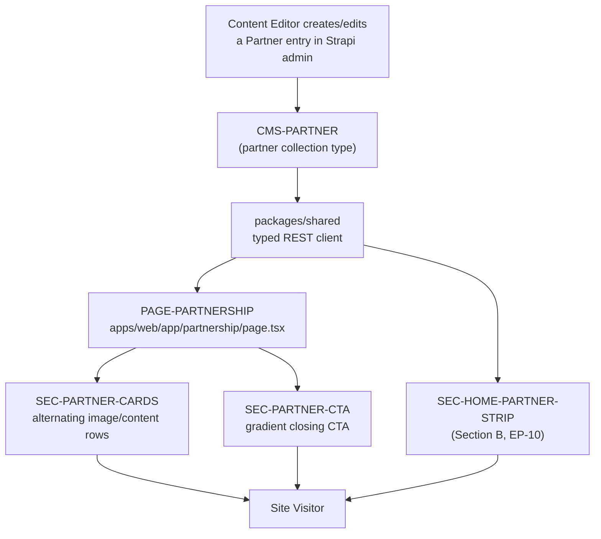

# Section F — Partnership

> **Scope.** This section covers the legacy `partnership.html` (604 lines) page — a single-route marketing page describing TrieDatum's technology-partner ecosystem — and its migration to `apps/web/app/partnership/page.tsx`. It introduces the Strapi `partner` collection type, which is **shared** with the homepage partner-logo strip covered in Section B (`EP-10`). In scope: the `partner` content type and seed data, the alternating partner-card layout (image/content panels with badge, tagline, description, and outbound CTA), and the closing gradient CTA block. Out of scope: the homepage marquee/logo-strip rendering itself (Section B, `EP-10`), the global header/nav/footer chrome (Section A), and any partner-specific case studies (Section H).
>
> **Intent.** Replace three hand-authored, hard-coded `partner-card-wrapper` blocks (Claude, Timbr, Databricks) with a single Strapi collection type editable by Content Editors without a code deploy, while explicitly surfacing a content discrepancy discovered during analysis: a fourth partner logo asset (`Cognition.png`) exists in the legacy asset tree but is not referenced by any rendered markup on the live page or the homepage.



## EP-17 — Partnership Page & Partner Content Type

**Epic title:** Partnership Page & Partner Content Type

**Description:** Model technology partners as a single Strapi collection type (`partner`) consumed by both the dedicated `/partnership` page and the homepage logo strip (Section B, `EP-10`), replacing three hand-coded HTML blocks with editor-managed content. This epic also resolves a data discrepancy found during content analysis: the legacy asset directory contains a fourth partner logo, `assets/img/partners/Cognition.png`, that is not rendered anywhere in the live `partnership.html` markup or the homepage marquee — it is orphaned art, not an orphaned feature, and its disposition (retire the asset, or the page never got updated when Cognition was dropped as a partner) is a content-owner decision, not an engineering one.

**Goal:** Ship a `partner` Strapi collection type seeded with the three partners actually live on the legacy page (Claude, Timbr, Databricks), and port the page's alternating card layout and closing CTA with full visual/functional parity, while logging the Cognition discrepancy for explicit content-owner resolution rather than silently including or omitting it.

**Scope:** `partner` content type schema and seed data; `/partnership` route rendering the hero-adjacent card list and closing CTA; the preserve-or-retire flag for the Cognition asset.

**Out of scope:** The homepage partner-logo-strip component itself (implemented in Section B `EP-10`, but reading from the same `CMS-PARTNER` content type defined here); the hero banner directly above the partner cards (shared `PAGE-PARTNERSHIP` hero markup, tracked under Section A's page-template conventions); any partner-specific case study content.

**Success metric:** All 3 live partner cards render with full visual/content parity (badge, name, tagline, description, outbound CTA) sourced from Strapi; the Cognition discrepancy is documented in `docs/content-model.md` with a disposition recommendation and explicitly answered by the content owner before launch sign-off; zero hard-coded partner markup remains in `apps/web`.

**Priority:** P2

### EP-17-S1 — Model the Strapi `partner` collection type and seed live partner data

**Title:** As a CMS Engineer, I want a `partner` collection type with the fields needed to drive both the partnership page and the homepage logo strip, seeded from the three partners actually featured on the live site, so that Content Editors can add, reorder, or retire partners without a code change.

**Description:** The legacy page hard-codes three `partner-card-wrapper` `<div>` blocks (Claude, Timbr, Databricks) directly in `partnership.html`, each duplicating image path, badge text, name, tagline, description paragraph(s), and outbound URL as literal markup. The target behavior is a Strapi `partner` collection type with fields `name` (string), `slug` (uid, targetField `name`), `url` (string, the outbound "Visit Website" link), `image` (media, single), `badge` (string, category label e.g. "Enterprise AI"), `description` (richtext, supports one or more paragraphs), and `order` (integer, controls both page and homepage-strip sort order). Seed exactly the 3 partners rendered on the live page: **Claude/Anthropic** (badge "Enterprise AI"), **Timbr** (badge "Knowledge Graph"), **Databricks** (badge "Data Platform"), in that display order. During analysis, a discrepancy was found: some content inventories and the legacy asset tree (`assets/img/partners/Cognition.png`) reference a fourth partner, "Cognition," that is **not** rendered anywhere in `partnership.html`'s markup or in the homepage partner marquee — this story must log that finding explicitly (in `docs/content-model.md` and this story's notes) as a preserve-or-retire item for the content owner to resolve (was Cognition intentionally dropped as a partner, in which case the asset should be deleted from the target repo, or was the page never updated after a new partnership was signed, in which case a 4th `partner` entry should be added), rather than either silently seeding a 4th entry with guessed copy or silently deleting the asset without a note. Out of scope: any decision on Cognition's actual disposition (content-owner call, not engineering's), and the homepage-strip rendering component (Section B `EP-10` consumes this same content type).

**Acceptance Criteria:**

```gherkin
# Happy path
Scenario: Seeding the partner collection type from the live legacy page
  Given the Strapi "partner" collection type is deployed with fields
    name, slug, url, image, badge, description, order
  When the seed script runs against a clean Strapi instance
  Then exactly 3 partner entries exist: "Claude", "Timbr", "Databricks"
  And each entry's "order" field matches its display order on the legacy
    page (Claude=1, Timbr=2, Databricks=3)
  And each entry's "badge" field exactly matches its legacy badge text
    ("Enterprise AI", "Knowledge Graph", "Data Platform" respectively)

# Failure/error
Scenario: Seed script rejects a partner entry missing a required field
  Given the seed script attempts to create a partner entry with no "url" value
  When the create request is sent to the Strapi REST API
  Then Strapi returns a 400 validation error
  And no partial partner entry is persisted
  And the seed script logs the failure and halts rather than continuing
    with incomplete data

# Edge/boundary
Scenario: The Cognition asset discrepancy is logged, not silently resolved
  Given the legacy asset tree contains "assets/img/partners/Cognition.png"
  And no "Cognition" partner-card markup exists in partnership.html
    or the homepage partner strip
  When the content-model documentation is generated for this story
  Then "docs/content-model.md" contains an explicit preserve-or-retire
    note identifying the Cognition asset as orphaned art with no
    corresponding rendered content
  And the note states the required content-owner decision (add a 4th
    partner entry, or delete the unused asset) without the seed script
    unilaterally choosing either outcome
```

**Story Points:** 5

**Priority:** P2

**Labels:** `content-type`, `strapi`, `partner`, `data-migration`, `preserve-or-retire`

**Components:** `CMS-PARTNER`

**Epic Link:** EP-17 — Partnership Page & Partner Content Type

**Source:** `partnership.html`, `div.partner-card-wrapper` blocks, lines 362–451; discrepancy cross-referenced against `assets/img/partners/Cognition.png` (present in the legacy asset tree but unreferenced by any partner-card markup) and the homepage partner-logo strip (Section B, `EP-10`).

---

### EP-17-S2 — Render the alternating partner card rows

**Title:** As a Site Visitor, I want to see each technology partner presented with a clear badge, name, description, and a way to visit their site, so that I can understand the depth and credibility of TrieDatum's partner ecosystem.

**Description:** On the legacy page, each partner is a two-column Bootstrap row (`.partner-img-box` + `.partner-content-box`) with the image/content column order alternating per card via `order-md-1`/`order-md-2` classes: Claude is image-left/content-right, Timbr is content-left/image-right, Databricks is image-left/content-right again. Each content panel carries a `.partner-badge` category label, an `<h2>` partner name, an `<h4>` tagline, one or two `.text-muted` description paragraphs, and a `.th-btn` "Visit Website" CTA linking out to the partner's site in a new tab. The target behavior renders this as a `SEC-PARTNER-CARDS` component that maps over the `partner` collection type (ordered by the `order` field), reproducing the alternating layout, hover-lift/grayscale-to-color image treatment, and outbound-link behavior (`target="_blank"`, `rel="noopener"`) with full visual parity at desktop and mobile breakpoints. Out of scope: the `partner` schema itself (`EP-17-S1`) and the closing CTA block below the cards (`EP-17-S3`).

**Acceptance Criteria:**

```gherkin
# Happy path
Scenario: All 3 partner cards render in the correct alternating layout and order
  Given the "partner" collection type contains Claude (order=1), Timbr (order=2),
    and Databricks (order=3)
  When a Site Visitor loads "/partnership"
  Then the cards render top-to-bottom in order: Claude, Timbr, Databricks
  And Claude's image panel appears left of its content panel on desktop
  And Timbr's content panel appears left of its image panel on desktop
  And Databricks' image panel appears left of its content panel on desktop
  And each card shows its badge, name, tagline, description paragraph(s),
    and a "Visit Website" button linking to its "url" field in a new tab

# Failure/error
Scenario: A partner entry is missing its image asset
  Given a "partner" entry has a null or unresolved "image" field
  When the partnership page attempts to render that partner's card
  Then the page renders the image panel with a graceful fallback
    (e.g. placeholder or omitted ) instead of throwing a
    render error or breaking the row's layout
  And the partner's content panel (badge, name, description, CTA)
    still renders normally

# Edge/boundary
Scenario: Card layout collapses to a single column on mobile
  Given a Site Visitor loads "/partnership" on a viewport narrower
    than the Bootstrap "md" breakpoint (768px)
  When any partner card is rendered
  Then the image panel and content panel stack vertically
    (image above content) regardless of the alternating desktop order
  And the "Visit Website" CTA remains fully visible and tappable
    without horizontal scrolling
```

**Story Points:** 8

**Priority:** P2

**Labels:** `frontend`, `partner`, `layout`, `responsive`, `parity`

**Components:** `PAGE-PARTNERSHIP`, `SEC-PARTNER-CARDS`, `CMS-PARTNER`

**Epic Link:** EP-17 — Partnership Page & Partner Content Type

**Source:** `partnership.html`, lines 362–451 (`.partner-card-wrapper` rows for Claude, Timbr, and Databricks, including the associated `<style>` block at lines 226–355 defining `.partner-img-box`, `.partner-content-box`, and `.partner-badge`).

---

### EP-17-S3 — Render the closing "Strategic Partnerships" CTA block

**Title:** As a Site Visitor, I want a clear closing statement on why TrieDatum's partnerships matter, so that I come away with a summary takeaway after reading the individual partner cards.

**Description:** The legacy page ends with a centered `.partner-cta-box` block on a diagonal-gradient background (`linear-gradient(135deg, var(--theme-color) 0%, #084298 100%)`) containing an `<h2>` heading ("Delivering Greater Value Through Strategic Partnerships") and a supporting paragraph, both white text, constrained to an 800px max-width for readability. The target behavior renders this as a `SEC-PARTNER-CTA` component with the heading and body sourced from Strapi (either as static copy fields on a `partnership-page` single type/page-level content block, or as fixed page content, at the CMS Engineer's discretion — this story's job is the visual/structural port, not the data-modeling decision, which is out of scope here and may be covered generically by Section I's page-content patterns). Out of scope: the partner cards themselves (`EP-17-S2`) and any new CTA-tracking/analytics behavior not present in the legacy page (the legacy CTA is not a clickable button, only a text block).

**Acceptance Criteria:**

```gherkin
# Happy path
Scenario: The closing CTA block renders with gradient background and centered copy
  Given a Site Visitor scrolls to the bottom of "/partnership"
  When the closing CTA block renders
  Then it displays the heading "Delivering Greater Value Through
    Strategic Partnerships" in white text
  And it displays the supporting paragraph in white, reduced-opacity text
  And the block's background renders the diagonal blue gradient matching
    the legacy ".partner-cta-box" treatment
  And the heading and paragraph are horizontally centered with the
    paragraph capped at roughly 800px max-width

# Failure/error
Scenario: CTA copy fails to load from the CMS
  Given the CTA heading/body content cannot be fetched at build or
    request time (e.g. Strapi is unreachable)
  When the partnership page is statically regenerated
  Then the build/ISR revalidation fails closed (keeps serving the last
    known-good cached version) rather than publishing a page with an
    empty or broken CTA block
  And the failure is logged for the Deploy Engineer to investigate

# Edge/boundary
Scenario: CTA block remains legible on narrow mobile viewports
  Given a Site Visitor loads "/partnership" on a 375px-wide viewport
  When the closing CTA block renders
  Then the gradient background box's padding shrinks appropriately
    without the heading or paragraph text overflowing or overlapping
    the box edges
  And the block remains fully within the viewport width with no
    horizontal scroll introduced
```

**Story Points:** 3

**Priority:** P3

**Labels:** `frontend`, `cta`, `layout`, `parity`

**Components:** `PAGE-PARTNERSHIP`, `SEC-PARTNER-CTA`

**Epic Link:** EP-17 — Partnership Page & Partner Content Type

**Source:** `partnership.html`, `.partner-cta-box`, lines 454–465 (plus its style definition at lines 337–355).

---

## Definition of Done

- [ ] Code reviewed and approved by ≥1 peer (`code-reviewer` agent)
- [ ] All Gherkin acceptance criteria pass in a local/staging environment
- [ ] Unit test coverage meets the target in TS-000 §2 for touched code
- [ ] Visual + functional parity confirmed by `parity-auditor` (desktop + mobile)
- [ ] No CRITICAL or HIGH findings from the Standards or Security scan
- [ ] Strapi schema/permission changes documented in `docs/content-model.md`
- [ ] Legacy URL(s) 301 to the new route; SEO metadata present
- [ ] No open blockers or unresolved dependencies
