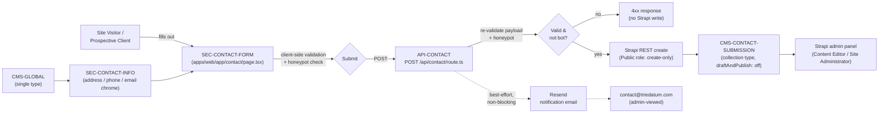

# Section G — Contact & Lead Capture

> **Scope.** This section covers the migration of `contact.html` (394 lines) and its PHP form handler `mail.php` — together the **only** lead-capture surface on the legacy site — into `apps/web/app/contact/page.tsx`, `apps/web/app/api/contact/route.ts`, and a new Strapi `contact-submission` collection type. `contact.html` contains the **only** `<form>` element that exists anywhere on the entire legacy site (23 HTML pages); every other page's calls-to-action are plain `<a>` links that ultimately point back to this one page. Getting this form right — validated, spam-resistant, reliably delivered to the team, and durably recorded — is therefore the single highest-value conversion surface in the whole migration. Contact page chrome (address/phone/email info boxes) is also in scope, reusing the same Strapi `global` single type introduced for the footer (Section A, EP-02) rather than re-hardcoding the same data a second time.



## EP-18 — Contact Form & Submission Handling

**Epic title:** Contact Form & Submission Handling

**Description:** Replace the legacy `mail.php` PHP mail-relay — a same-page form POST that fires PHP's `mail()` function synchronously and offers no real bot protection — with a Next.js contact page backed by a validated Next.js API route that durably persists every submission to Strapi, with best-effort email notification decoupled from the write path.

- **Goal:** Every legitimate contact-form submission is captured durably in Strapi (not just relayed-and-forgotten as an email that can silently fail), validated server-side, and protected against trivial spam, while the team still receives an email notification for awareness.
- **Scope:** Contact form markup and field parity; client + server-side validation; honeypot spam control; `POST /api/contact` route; `contact-submission` Strapi collection type and its Public-role permissions; best-effort Resend notification email.
- **Out of scope:** Real bot protection via Cloudflare Turnstile (tracked as EP-18-S5, explicitly deferred to P4); CRM/marketing-automation integration; autoresponder emails to the submitter; admin-side submission triage UI beyond the stock Strapi admin list view.
- **Success metric:** 100% of non-spam form submissions that pass validation result in a persisted Strapi `contact-submission` record, independent of whether the Resend notification succeeds; zero submissions are lost to an unhandled exception in the mail step.

**Priority:** P1

---

### EP-18-S1 — Render the contact form with legacy-parity fields

**Title:** As a Prospective Client, I want the contact form to present the same fields the legacy site collected, so that filling it out feels familiar and no information I'd expect to provide is missing.

**Description:** The legacy `contact.html` renders `<form action="mail.php" method="POST" class="contact-form ajax-contact">` (lines 191–249) with five fields: Name (text), Email (email), "Phone Number" (tel, `name="number"`), Company (text — labeled "Company" in the UI but the underlying field is `name="subject"`, a naming mismatch carried over from a form template that was never fully renamed), and Message (textarea). The target `apps/web/app/contact/page.tsx` reproduces this exact field set and labeling in a client-rendered form component, but normalizes the internal field/DTO names (`name`, `email`, `phone`, `company`, `message`) so the `subject`-as-company naming quirk is not propagated into the new codebase — the mapping from legacy `subject` to target `company` is documented but not user-visible. Layout, labels, and placeholder copy retain visual parity with the legacy design (lift-and-shift styling). Out of scope: any new fields beyond the legacy five (e.g. "how did you hear about us") — not part of this migration.

**Acceptance Criteria:**

```gherkin
Scenario: Happy path — all legacy-equivalent fields render and accept input
  Given I am a Site Visitor on /contact
  When the page finishes loading
  Then I see labeled inputs for Name, Email, Phone Number, Company, and Message
  And I can type a value into each field
  And the Company field's underlying form value is keyed "company" (not the legacy "subject")

Scenario: Failure/error — JavaScript disabled or hydration not yet complete
  Given I am a Site Visitor on /contact with JavaScript disabled
  When the page loads
  Then the form's static HTML still renders all five fields with visible labels
  And no field is hidden or non-functional purely due to missing client-side hydration

Scenario: Edge/boundary — very long input in the Message textarea
  Given I am filling out the contact form
  When I paste a 5,000-character message into the Message field
  Then the textarea accepts and displays the full input without truncation
  And no client-side error is thrown before I attempt to submit
```

**Story Points:** 3

**Priority:** P1

**Labels:** `frontend`, `contact-form`, `parity`, `forms`

**Components:** `PAGE-CONTACT`, `SEC-CONTACT-FORM`

**Epic Link:** EP-18 — Contact Form & Submission Handling

**Source:** `contact.html`, `<form action="mail.php" method="POST" class="contact-form ajax-contact">`, lines 191–249

---

### EP-18-S2 — Client-side validation and honeypot spam control

**Title:** As a Front-End Engineer, I want real client-side validation and a hidden honeypot field, so that obvious bad submissions are caught early and unsophisticated bots are filtered without asking human visitors to do anything extra.

**Description:** The legacy form's only "anti-spam" control is a fake "I'm not a robot" checkbox (`.captcha` widget, lines 224–242) whose inline jQuery `onclick` handler does nothing but toggle the submit button's `disabled` attribute — it performs no actual verification and would pass for any bot that ticks the box. The target form removes this checkbox entirely and replaces it with (a) client-side required/format validation for Name, Email, and Message (Phone and Company remain optional, matching legacy behavior), with inline error messages, and (b) a visually-hidden honeypot input (e.g. `aria-hidden`, off-screen via CSS, not `display:none` alone, to resist naive bot heuristics) that real users never see or fill, and that causes the server to silently reject the submission if populated. This is an interim control, not equivalent to a managed challenge service — see EP-18-S5 for the deferred Turnstile integration. Out of scope: server-side validation logic itself (EP-18-S3) and any CAPTCHA/Turnstile widget (EP-18-S5).

**Acceptance Criteria:**

```gherkin
Scenario: Happy path — valid input passes client-side validation with honeypot empty
  Given I am a human visitor filling out the contact form
  When I enter a non-empty Name, a validly-formatted Email, and a non-empty Message
  And I leave the hidden honeypot field untouched (as a human naturally would)
  Then no validation errors are shown
  And the form is allowed to submit

Scenario: Failure/error — invalid or missing required field blocks submission
  Given I am filling out the contact form
  When I leave the Email field empty or enter a malformed value such as "not-an-email"
  And I attempt to submit
  Then the form is not submitted
  And an inline error message identifies the Email field as invalid

Scenario: Edge/boundary — honeypot field is populated (bot behavior)
  Given an automated script fills every input on the page, including the visually-hidden honeypot field
  When the form is submitted with the honeypot field non-empty
  Then the client-side submission proceeds to the API (client-side checks alone cannot distinguish this case)
  And the request is flagged for server-side rejection per EP-18-S3
```

**Story Points:** 5

**Priority:** P1

**Labels:** `frontend`, `validation`, `spam-protection`, `honeypot`, `accessibility`

**Components:** `SEC-CONTACT-FORM`, `PAGE-CONTACT`

**Epic Link:** EP-18 — Contact Form & Submission Handling

**Source:** `contact.html`, `.captcha` checkbox widget and inline jQuery `onclick` handler, lines 224–242

---

### EP-18-S3 — `POST /api/contact` validation, honeypot enforcement, and Strapi write

**Title:** As a Front-End Engineer, I want a server-side API route that re-validates the payload, enforces the honeypot, and creates a Strapi `contact-submission` record, so that every accepted lead is durably stored and no submission depends on a PHP `mail()` call succeeding.

**Description:** The legacy `mail.php` is a root-level PHP script that reads `$_POST['name']`, `$_POST['subject']` (rendered as "Company" in the UI), `$_POST['email']`, `$_POST['number']`, and `$_POST['message']`, then calls `mail()` against a hardcoded recipient `contact@triedatum.com` — there is no persistence layer; if the mail call fails or the inbox is missed, the lead is gone with no record. The target `apps/web/app/api/contact/route.ts` accepts a `POST`, re-validates all fields server-side (never trusting client-side checks alone), rejects silently-but-safely (see AC below) if the honeypot field is populated, and on success creates a record in a new Strapi `contact-submission` collection type via the Public role's REST `create` permission. The collection type has fields `name` (string, required), `email` (email type, required), `company` (string, optional — the target-side rename of legacy `subject`), `phone` (string, optional), and `message` (text, required); `draftAndPublish` is turned OFF because a form submission is a data record, not editorial content requiring a draft/review workflow. The Public role is granted `create` on this content type ONLY — explicitly no `find`, `findOne`, `update`, or `delete` — so submissions can only ever be read via the authenticated Strapi admin panel, never enumerated or read back over the public API. Out of scope: the email-notification side effect (EP-18-S4) and any bot-protection mechanism beyond the honeypot (EP-18-S5).

**Acceptance Criteria:**

```gherkin
Scenario: Happy path — valid payload is persisted to Strapi
  Given a POST to /api/contact with a valid name, email, and message, an empty honeypot field, and optional phone/company
  When the route handler processes the request
  Then a new contact-submission entry is created in Strapi with the mapped fields (subject → company)
  And the API responds with a 2xx success status
  And no field beyond name/email/company/phone/message is persisted

Scenario: Failure/error — honeypot populated is treated as spam and rejected
  Given a POST to /api/contact where the hidden honeypot field contains any non-empty value
  When the route handler processes the request
  Then no Strapi contact-submission record is created
  And the API responds with a success-shaped response (to avoid revealing the anti-spam mechanism to the bot) while performing no write
  And the rejection is logged server-side for monitoring

Scenario: Edge/boundary — required field missing or malformed on the server side
  Given a POST to /api/contact with a missing "message" field or a malformed "email" value, bypassing or spoofing client-side validation
  When the route handler validates the payload
  Then the request is rejected with a 400-level response and a field-specific error
  And no Strapi contact-submission record is created

Scenario: Failure/error — Public role attempts to read submissions
  Given an unauthenticated request to GET /api/contact-submissions directly against the Strapi REST API
  When Strapi evaluates the Public role's permissions for the contact-submission content type
  Then the request is rejected as forbidden, because Public has create-only access
```

**Story Points:** 8

**Priority:** P1

**Labels:** `backend`, `api-route`, `strapi-content-type`, `validation`, `spam-protection`, `security`

**Components:** `API-CONTACT`, `CMS-CONTACT-SUBMISSION`

**Epic Link:** EP-18 — Contact Form & Submission Handling

**Source:** `mail.php` (root-level PHP handler; reads `name`/`subject`(as company)/`email`/`number`/`message`; hardcoded recipient `contact@triedatum.com`)

---

### EP-18-S4 — Best-effort email notification via Resend

**Title:** As a Site Administrator, I want an email notification when a new contact submission is stored, so that the team is promptly alerted to a new lead the same way they were under the legacy `mail()` behavior, without that email step being able to lose the lead if it fails.

**Description:** The legacy `mail.php` sends its notification email synchronously and *as* the persistence mechanism — if the mail call throws, times out, or is silently dropped by the mail server, the lead is lost entirely with no fallback record. The target behavior decouples notification from persistence: once the `contact-submission` record write (EP-18-S3) succeeds, `apps/web/app/api/contact/route.ts` fires a best-effort notification email via Resend to `contact@triedatum.com`, mirroring the legacy recipient and general intent (new-lead alert with the submitted details). Failure of the Resend call is caught, logged, and does not affect the API response already returned to the visitor — the Strapi record is the durable source of truth regardless of email outcome. Out of scope: autoresponder/confirmation email to the submitter; retry queues or delivery-status tracking for the notification email itself (a future enhancement, not required for parity).

**Acceptance Criteria:**

```gherkin
Scenario: Happy path — submission stored and notification email sent
  Given a valid contact form submission has just been persisted to Strapi
  When the API route triggers the Resend notification step
  Then an email is sent to contact@triedatum.com containing the submitted name, email, company, phone, and message
  And the API's success response to the visitor is not delayed waiting on email delivery confirmation

Scenario: Failure/error — Resend is down or the API call errors
  Given a valid contact form submission has just been persisted to Strapi
  When the Resend API call fails, times out, or returns an error
  Then the error is caught and logged server-side
  And the contact-submission record already written to Strapi is unaffected and remains the durable record
  And the visitor still receives the same success response as if the email had succeeded

Scenario: Edge/boundary — Resend API key missing or misconfigured in the environment
  Given the RESEND_API_KEY environment variable is unset or invalid in a given deployment environment
  When a contact form submission is processed
  Then the Strapi write still completes successfully
  And the notification-send attempt fails gracefully without throwing an unhandled exception that would surface a 500 to the visitor
```

**Story Points:** 3

**Priority:** P2

**Labels:** `backend`, `email`, `resend`, `notifications`, `resilience`

**Components:** `API-CONTACT`

**Epic Link:** EP-18 — Contact Form & Submission Handling

**Source:** `mail.php`, notification-email behavior (`mail()` call to `contact@triedatum.com`)

---

### EP-18-S5 — (Deferred) Cloudflare Turnstile bot protection

**Title:** As a Site Administrator, I want real, managed bot protection on the contact form, so that spam submissions are blocked by more than a honeypot once traffic volume makes that worthwhile — but I accept this is not part of the initial launch.

**Description:** The legacy site's "I'm not a robot" checkbox (EP-18-S2's source) provided zero actual verification. The interim target control is the honeypot field (EP-18-S2). This story tracks the intentionally deferred next step: integrating Cloudflare Turnstile as a real, low-friction challenge on the contact form, verified server-side in `apps/web/app/api/contact/route.ts` before the Strapi write proceeds. Turnstile environment variables (site key and secret key) are provisioned in the target `.env.example` and project status notes so the integration can be wired up quickly in a fast-follow release, but no Turnstile widget, client script, or server-side verification call is implemented as part of this migration's launch scope. This is logged here explicitly so it reads as a known, intentional, documented gap rather than an omission discovered later.

**Acceptance Criteria:**

```gherkin
Scenario: Happy path — Turnstile environment variables are present and documented, unused
  Given the target repository's .env.example file
  When I inspect the contact-form-related environment variables
  Then TURNSTILE_SITE_KEY and TURNSTILE_SECRET_KEY (or equivalent) are present and documented as "provisioned, not yet integrated"
  And the project status notes explicitly list Turnstile wiring as a deferred, P4 item rather than omitting it

Scenario: Failure/error — a future engineer assumes Turnstile is already active
  Given a future engineer reads the contact form code expecting bot verification beyond the honeypot
  When they inspect apps/web/app/api/contact/route.ts
  Then no Turnstile verification call is present
  And this story (EP-18-S5) is discoverable via SOURCE-COVERAGE.md as the documented reason why, preventing the gap from being mistaken for an oversight

Scenario: Edge/boundary — honeypot-only protection under a real spam campaign
  Given the honeypot from EP-18-S2 is the only active bot control at launch
  When a sophisticated bot that fills all visible and hidden fields (including the honeypot) submits the form
  Then the submission may pass through to Strapi despite being spam
  And this residual risk is accepted and documented as the known limitation this story exists to close in a future release
```

**Story Points:** 2

**Priority:** P4

**Labels:** `backend`, `spam-protection`, `turnstile`, `deferred`, `security`

**Components:** `API-CONTACT`, `SEC-CONTACT-FORM`

**Epic Link:** EP-18 — Contact Form & Submission Handling

**Source:** Target `.env.example` / project status notes (Turnstile variables provisioned, integration deferred)

---

## EP-19 — Contact Page Chrome

**Epic title:** Contact Page Chrome

**Description:** Replace the contact page's hardcoded US Address / India Address / Email / Call info boxes — currently a second, independently-maintained copy of data that also appears in the footer — with chrome sourced from the same Strapi `global` single type introduced for the footer (Section A, EP-02), so contact details are edited once and stay consistent everywhere they appear.

- **Goal:** Eliminate the duplicated hardcoding of company contact details between the footer and the contact page by sourcing both from one Strapi single type.
- **Scope:** Contact page hero/info chrome (address, phone, email info boxes) rendered from the `global` single type.
- **Out of scope:** The contact form itself (EP-18); the footer's own rendering logic (Section A, EP-02) beyond confirming it is the same data source.
- **Success metric:** A Content Editor who updates an address or phone number in the `global` single type's admin form sees that change reflected on both the footer and the `/contact` page without any code change or second edit.

**Priority:** P2

---

### EP-19-S1 — Render contact page info chrome from the `global` single type

**Title:** As a Content Editor, I want the contact page's address/phone/email info boxes to pull from the same CMS data as the footer, so that updating our contact details once keeps every page in sync.

**Description:** `contact.html` surrounds the form with a set of info boxes (US Address, India Address, Email, Call) using the same visual `info-box` card pattern found in the legacy footer — but as hardcoded markup local to `contact.html`, independent of `assets/data/footer_content.json`. This means the legacy site already has two places where the same contact facts must be kept in sync by hand. The target `apps/web/app/contact/page.tsx` renders this info-box chrome as a Server Component reading from the same Strapi `global` single type (see Section A, EP-02) that feeds `SiteFooter`, reusing the shared `info-box` presentational pattern rather than re-declaring a second static copy. Out of scope: introducing new address/contact fields not already modeled on `global`; changing the footer's own component implementation.

**Acceptance Criteria:**

```gherkin
Scenario: Happy path — contact page info boxes match the global single type's current values
  Given the Strapi global single type has US Address, India Address, Email, and Call values populated
  When a Site Visitor loads /contact
  Then the page renders info boxes showing those exact current values
  And the visual presentation matches the legacy info-box card pattern used in the footer

Scenario: Failure/error — the global single type is temporarily unreachable at build/request time
  Given the Strapi global single type cannot be fetched (e.g. CMS is down during a request that requires fresh data)
  When the /contact page attempts to render
  Then the page fails gracefully (e.g. serving the last successfully generated static version via ISR) rather than crashing with an unhandled error
  And the contact form itself (EP-18) remains functional independent of this chrome

Scenario: Edge/boundary — a Content Editor updates an address in the global single type
  Given a Content Editor changes the India Address value in the Strapi admin panel for the global single type
  When the change is published and the revalidation webhook fires
  Then both the footer (on every page) and the /contact page's info box reflect the updated address after the next regeneration
  And no code change or separate edit to a contact-page-specific data source is required
```

**Story Points:** 3

**Priority:** P2

**Labels:** `frontend`, `cms-integration`, `content-model`, `dedupe`

**Components:** `PAGE-CONTACT`, `SEC-CONTACT-INFO`, `CMS-GLOBAL`

**Epic Link:** EP-19 — Contact Page Chrome

**Source:** `contact.html`, info-box markup surrounding the form (US Address / India Address / Email / Call), matching the shared `info-box` pattern from the footer (`assets/data/footer_content.json`)

---

## Definition of Done

- [ ] Code reviewed and approved by ≥1 peer (`code-reviewer` agent)
- [ ] All Gherkin acceptance criteria pass in a local/staging environment
- [ ] Unit test coverage meets the target in TS-000 §2 for touched code
- [ ] Visual + functional parity confirmed by `parity-auditor` (desktop + mobile)
- [ ] No CRITICAL or HIGH findings from the Standards or Security scan
- [ ] Strapi schema/permission changes documented in `docs/content-model.md`
- [ ] Legacy URL(s) 301 to the new route; SEO metadata present
- [ ] No open blockers or unresolved dependencies
