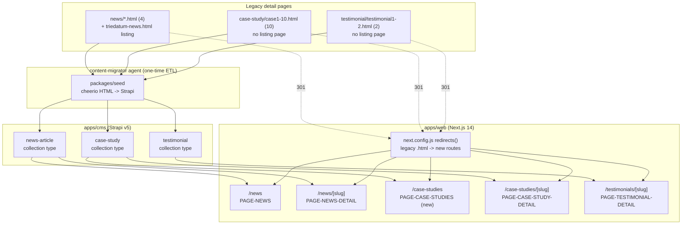

# Section H — News, Case Studies & Testimonials

> **Scope.** This section covers the three legacy "detail page" collections that share one structural pattern — a hand-written index/anchor on some other page, plus N individually-authored `.html` detail files with no shared template enforcement: `news/*.html` (4 articles + the `triedatum-news.html` listing page), `case-study/case1.html`–`case10.html` (10 case studies, no listing page), and `testimonial/testimonial1.html`–`testimonial2.html` (2 testimonials). All three become Strapi collection types (`news-article`, `case-study`, `testimonial`) rendered through Next.js dynamic `[slug]` routes with `generateStaticParams`. **Out of scope:** the homepage previews of these collections (news card, case-study carousel, testimonial slider) are covered in Section B (`EP-09`, `EP-11`); the nav dropdown and footer links that point at case studies are covered in Section A (`EP-01`); global SEO metadata remediation is covered in Section I (`EP-24`).



## EP-20 — News Article Collection & Detail Route

**Epic title:** News Article Collection & Detail Route

**Description:** Model TrieDatum's news/announcements as a Strapi collection type with a flexible body layout, because the 4 legacy articles under `news/` vary structurally more than any other repeating content type on the site — two carry image galleries, one is plain narrative, and one has no images at all but does have program cards, a CTA box, and hashtag pills.

**Goal:** Every legacy news article is represented as a `news-article` entry, rendered through a `/news` listing and `/news/[slug]` detail route, without forcing structurally dissimilar articles into one rigid template.

**Scope:** The `news-article` Strapi content type; seeding the 4 confirmed articles; the `/news` listing page; the `/news/[slug]` dynamic route with `generateStaticParams`; the lightbox gallery re-implementation for the two articles that use Magnific Popup; 301 redirects from all 5 legacy news URLs.

**Out of scope:** The homepage's own news-card preview module (Section B, `EP-09`); the 5th "hybrid" card on `triedatum-news.html` that links to `partnership.html` (it is not a news article and is explicitly excluded from seeding — logged as a preserve-or-retire item in `SOURCE-COVERAGE.md`, disposition: retire-as-news, keep as a `partnership.html` promotional link elsewhere).

**Success metric:** All 4 legacy news articles render at their new `/news/[slug]` URLs with 100% content parity (text, images, tags, CTA) and zero broken Magnific Popup galleries; `/news` lists exactly 4 articles; 0 of the 5 legacy news URLs return anything but a 301.

**Priority:** P2

### EP-20-S1 — Model and seed the `news-article` collection type

**Title:** As a CMS Engineer I want a `news-article` Strapi collection type modeling title, slug, excerpt, body, publish date, author, image, and SEO so that all 4 legacy news articles can be represented as structured, editable content instead of hand-written HTML files.

**Description:** Currently, each news article is an independent static HTML file under `news/` with its own `<head>` metadata, hand-duplicated header/footer, and inline article markup — there is no shared schema, so editing an article means hand-editing HTML. The target creates a `news-article` collection type (`title` string, `slug` uid←title, `excerpt` text, `body` richtext, `publishedDate` date, `author` string, `image` media, `seo` component) and seeds it with the 4 confirmed articles: "5 Year Anniversary" (`news/5-year-anniversary.html`), "New Engineering Office" (`news/new-engineering-office.html`), "Trevor Mason Joins TrieDatum as CTO" (`news/trevor-cto.html`), and "Launching the TrieDatum AI Bootcamp" (`news/triedatum-bootcamp.html`). The `triedatum-news.html` listing page shows a 5th card that is a hybrid promotional tile linking out to `partnership.html`, not to a news detail page — that 5th card is explicitly NOT a `news-article` and must not be seeded as one; it is logged as a preserve-or-retire item and left for `EP-17` (Partnership) or `EP-24` (SEO) to address on its own page. Out of scope: the `body` field's internal layout flexibility (covered by `EP-20-S2`) and redirects (covered by `EP-20-S3`).

**Acceptance Criteria:**

```gherkin
# Happy path
Scenario: Seeding all 4 confirmed news articles
  Given the 4 legacy files "5-year-anniversary.html", "new-engineering-office.html", "trevor-cto.html", and "triedatum-bootcamp.html" under news/
  When the content-migrator agent runs the news-article seed script
  Then exactly 4 news-article entries are created in Strapi
  And each entry's title, slug, excerpt, publishedDate, author, and image match its source file
  And no 5th entry is created for the hybrid promotional card on triedatum-news.html

# Failure/error
Scenario: Seed script encounters a news article with a missing publish date
  Given a legacy news HTML file that has no discoverable publish date in its banner or metadata
  When the seed script processes that file
  Then the script logs a warning identifying the file and the missing field
  And it does not fail the entire seed run
  And the resulting entry is flagged in Strapi (e.g. left in draft state) pending manual entry of the date

# Edge/boundary
Scenario: Re-running the seed script is idempotent
  Given the 4 news-article entries already exist from a prior seed run
  When the seed script is run a second time against the same source files
  Then no duplicate news-article entries are created
  And existing entries are updated in place (matched by slug) rather than duplicated
```

**Story Points:** 5

**Priority:** P2

**Labels:** `cms`, `content-model`, `news`, `seed-script`

**Components:** `CMS-NEWS-ARTICLE`

**Epic Link:** EP-20 — News Article Collection & Detail Route

**Source:** `news/5-year-anniversary.html`, `news/new-engineering-office.html`, `news/trevor-cto.html`, `news/triedatum-bootcamp.html`, `triedatum-news.html` (5th hybrid card, excluded)

---

### EP-20-S2 — Render `/news` listing and `/news/[slug]` detail route with flexible body layout

**Title:** As a Site Visitor I want to browse a news listing page and read each article's full detail page so that I can learn about TrieDatum's announcements, regardless of how visually different each article's internal layout is.

**Description:** Currently, `triedatum-news.html` hand-lists article cards linking to individually hand-coded detail pages; each detail page's body is bespoke — `5-year-anniversary.html` and `new-engineering-office.html` embed a multi-image lightbox gallery driven by Magnific Popup (`jquery.magnific-popup.min.js`); `trevor-cto.html` is plain narrative prose plus a single photo; `triedatum-bootcamp.html` uniquely has zero images but instead has 5 program mini-cards, a gradient CTA box, and 10 hashtag-style tag pills, all styled via a page-local `<style>` block. The target renders a `/news` listing (server component, fetches all `news-article` entries ordered by `publishedDate` descending) and a `/news/[slug]` detail route via `generateStaticParams`, where the `body` richtext field (or a dedicated flexible-layout component, e.g. a blocks/dynamic-zone field) is expressive enough to carry the gallery, the plain-narrative, and the program-cards-plus-CTA-plus-tags layouts without forcing every article into one rigid card-and-paragraph template. The Magnific Popup lightbox behavior must be re-implemented as an isolated `"use client"` React lightbox component per the interaction-porting pattern used elsewhere on the site. Out of scope: modeling the bootcamp program cards as their own reusable Strapi component (they are seeded as part of this one article's `body` content, not as a separate `bootcamp-program` collection — see also Section E `EP-15`/`EP-16` out-of-scope notes for the full `/bootcamp` micro-site, which is unrelated).

**Acceptance Criteria:**

```gherkin
# Happy path
Scenario: Visitor opens a gallery-style news article
  Given the "5 Year Anniversary" article has 1 or more gallery images seeded on its body
  When a Site Visitor navigates to /news/5-year-anniversary
  Then the article renders its narrative text and thumbnail gallery
  And clicking a thumbnail opens a full-size lightbox view without a full page navigation
  And the lightbox supports next/previous navigation between gallery images

# Failure/error
Scenario: Detail route requested for a slug that does not exist
  Given no news-article entry exists with slug "not-a-real-article"
  When a request is made to /news/not-a-real-article
  Then the route returns an HTTP 404
  And the 404 page is the site's standard not-found page, not an unhandled server error

# Edge/boundary
Scenario: Rendering the bootcamp-launch article with zero images
  Given the "Launching the TrieDatum AI Bootcamp" article has no image field populated
  When a Site Visitor navigates to /news/triedatum-bootcamp
  Then the page renders the 5 program mini-cards, the CTA box, and all 10 tag pills correctly
  And no broken image placeholder or empty gallery component is rendered
  And the page's layout does not assume an image is present
```

**Story Points:** 8

**Priority:** P2

**Labels:** `frontend`, `news`, `dynamic-route`, `lightbox`, `content-flexibility`

**Components:** `PAGE-NEWS`, `PAGE-NEWS-DETAIL`, `CMS-NEWS-ARTICLE`

**Epic Link:** EP-20 — News Article Collection & Detail Route

**Source:** `news/5-year-anniversary.html`, `news/new-engineering-office.html`, `news/trevor-cto.html`, `news/triedatum-bootcamp.html`, `triedatum-news.html`

---

### EP-20-S3 — 301-redirect legacy news URLs to new routes

**Title:** As an SEO Engineer I want every legacy `news/*.html` URL and `triedatum-news.html` to 301-redirect to its new Next.js route so that inbound links, bookmarks, and search-engine rankings for TrieDatum's announcements are preserved through the migration.

**Description:** Currently, the 4 news articles and the listing page live at static paths (`news/5-year-anniversary.html`, `news/new-engineering-office.html`, `news/trevor-cto.html`, `news/triedatum-bootcamp.html`, `triedatum-news.html`) with no redirect mechanism of any kind on the legacy static host. The target adds entries to the shared redirect map consumed by `next.config.js` `redirects()` (per the architecture map in `00-overview-and-architecture.md` §4) mapping each of the 5 legacy URLs to its corresponding `/news` or `/news/[slug]` route with a permanent (301) redirect. Out of scope: redirects for any other legacy page family (covered by their respective sections' stories, and consolidated in `EP-25`).

**Acceptance Criteria:**

```gherkin
# Happy path
Scenario: Legacy article URL redirects to its new slug route
  Given a request to /news/trevor-cto.html
  When the request is handled by the target site
  Then the response is an HTTP 301 permanent redirect
  And the Location header points to /news/trevor-cto

# Failure/error
Scenario: Redirect map entry is missing for a legacy URL
  Given the redirect map does not yet contain an entry for /news/triedatum-bootcamp.html
  When a request is made to that legacy URL
  Then the response falls through to the site's standard 404 rather than crashing the request pipeline
  And this gap is caught by the redirect-coverage test in TS-000 before launch, not discovered in production

# Edge/boundary
Scenario: The listing page's own legacy URL is redirected, not just its articles
  Given a request to /triedatum-news.html
  When the request is handled by the target site
  Then the response is an HTTP 301 redirect to /news
  And this is a distinct redirect-map entry from the 4 individual article redirects
```

**Story Points:** 2

**Priority:** P1

**Labels:** `seo`, `redirects`, `news`

**Components:** `PAGE-NEWS`, `PAGE-NEWS-DETAIL`

**Epic Link:** EP-20 — News Article Collection & Detail Route

**Source:** `news/5-year-anniversary.html`, `news/new-engineering-office.html`, `news/trevor-cto.html`, `news/triedatum-bootcamp.html`, `triedatum-news.html`

---

## EP-21 — Case Study Collection & Detail Route

**Epic title:** Case Study Collection & Detail Route

**Description:** Model all 10 legacy case studies as a Strapi collection type, build the `/case-studies` listing/index page that the legacy site never had, and make an explicit, recorded decision about the `case8` orphan-page parity gap rather than letting the target's current 10-card behavior stand as an undocumented drift from the legacy site's 9-card behavior.

**Goal:** All 10 case studies are structured, editable Strapi entries reachable from a real listing page and individually addressable detail pages, with the case8 exclusion/inclusion behavior a deliberate, recorded choice.

**Scope:** The `case-study` Strapi content type; seeding all 10 case studies including authoring real titles for the 5 that only ever had the generic sitewide `<title>`; the new `/case-studies` index route (does not exist in the legacy site); the `/case-studies/[slug]` detail route; 301 redirects for all 10 legacy case-study URLs; resolving the case8 parity decision.

**Out of scope:** The homepage case-studies carousel component itself (Section B `EP-11`, cross-referenced from `EP-21-S2` and `EP-21-S4`); the nav dropdown's case-studies sub-menu markup (Section A `EP-01`).

**Success metric:** All 10 case studies render at slug-based `/case-studies/[slug]` URLs with content parity to their legacy source; a real `/case-studies` listing page exists and is reachable from nav/footer/homepage without any improvised substitute link; the case8 parity gap has one recorded disposition (not left ambiguous); 0 of the 10 legacy case-study URLs return anything but a 301.

**Priority:** P2

### EP-21-S1 — Model and seed the `case-study` collection type, including 5 retitled entries

**Title:** As a CMS Engineer I want a `case-study` Strapi collection type modeling title, slug, summary, client, industry, body, image, order, featured, and SEO so that all 10 legacy case studies are represented as structured content, with unique real titles authored for the 5 that currently only carry the sitewide generic title.

**Description:** Currently, all 10 case studies live as independent files (`case-study/case1.html` through `case-study/case10.html`) that share a consistent internal skeleton — hero image, then Challenge/Solution/Results/Conclusion prose using a bold-label convention (e.g. `<strong>Introduction: </strong>`) rather than discrete structured fields — but are not template-uniform in their metadata: 5 files (case3, case6, case7, case9, case10) have real, unique `<title>` tags confirmed from their `<head>` (e.g. case9 = "Transforming Greenhouse Intelligence with a Semantic Data and AI Platform", case3 = RAGaaS, case6 = GenAI POC Turnaround, case7 = Supply Chain GenBI, case10 = Mainframe Modernization), while the other 5 (case1, case2, case4, case5, case8) still carry the generic sitewide `<title>TrieDatum - Your Trusted Partner in AI &amp; Data</title>` — a duplicate/generic title across 5+ pages is itself an SEO defect (cross-referenced from `EP-24-S1`, the sitewide generic-metadata remediation story), so this story requires those 5 to be authored real, unique titles during content migration rather than carrying the placeholder forward verbatim. The target models `title`, `slug` (uid←title), `summary`, `client`, `industry`, `body` (richtext), `image`, `order` (int), `featured` (bool), and `seo` (component), then seeds all 10 entries. Out of scope: building the `/case-studies` listing route itself (`EP-21-S2`) and the case8 parity decision (`EP-21-S4`) — this story only covers the schema and the 10 seeded records including their titles.

**Acceptance Criteria:**

```gherkin
# Happy path
Scenario: Seeding a case study that already has a real, unique legacy title
  Given case-study/case9.html has the confirmed <title> "Transforming Greenhouse Intelligence with a Semantic Data and AI Platform"
  When the seed script processes case9.html
  Then the resulting case-study entry's title field is exactly that string
  And its slug is derived from that title, not from the generic sitewide string

# Failure/error
Scenario: Seed script encounters one of the 5 generically-titled case studies
  Given case-study/case1.html has the generic sitewide <title> shared with index.html, about.html, and service.html
  When the seed script processes case1.html
  Then the entry is created in draft state with a placeholder flag (not published with the generic title)
  And the Content Editor is required to author a real, unique title before the entry can be published
  And the entry is not silently published with the duplicate generic title

# Edge/boundary
Scenario: Two of the 5 generically-titled case studies are authored with accidentally identical new titles
  Given a Content Editor authors real titles for case1 and case4 during migration
  When both new titles resolve to the same slug
  Then Strapi's uid field uniqueness constraint rejects the second save
  And the Content Editor is prompted to choose a distinct title/slug for one of them
```

**Story Points:** 8

**Priority:** P2

**Labels:** `cms`, `content-model`, `case-studies`, `seo`, `seed-script`

**Components:** `CMS-CASE-STUDY`

**Epic Link:** EP-21 — Case Study Collection & Detail Route

**Source:** `case-study/case1.html`–`case-study/case10.html` (10 files); cross-reference `EP-24-S1`

---

### EP-21-S2 — Render `/case-studies` listing and `/case-studies/[slug]` detail route

**Title:** As a Prospective Client I want a real case-studies listing page and individual detail pages so that I can browse all of TrieDatum's case studies from one place instead of guessing URLs or relying on the homepage carousel.

**Description:** Currently, there is no dedicated case-studies index anywhere in `TDWebsite` — the legacy nav dropdown, the footer "Case Studies" link, and the homepage carousel's "View All" button all point at improvised substitutes: an anchor into the homepage carousel section (`index.html#...`) or a direct link straight to `case-study/case1.html`, none of which is a true listing page. The target builds the real `/case-studies` index/listing route (fetching all `case-study` entries ordered by `order`, a genuinely new page with no legacy equivalent) and the `/case-studies/[slug]` detail route via `generateStaticParams`, rendering the Challenge/Solution/Results/Conclusion body content faithfully from the richtext `body` field. Out of scope: the homepage carousel component itself, which is a separate, already-existing preview surface (Section B `EP-11-S2`) — this story only builds the standalone listing page and wires the nav/footer/carousel "View All" link to point at it instead of their legacy improvised substitutes.

**Acceptance Criteria:**

```gherkin
# Happy path
Scenario: Visitor browses the new case-studies listing page
  Given 10 case-study entries exist in Strapi
  When a Site Visitor navigates to /case-studies
  Then a card grid of case studies renders, ordered by the order field
  And clicking any card navigates to that case study's /case-studies/[slug] detail page

# Failure/error
Scenario: Nav dropdown link that used to point at the homepage carousel anchor is requested directly
  Given the legacy nav dropdown previously linked individual case studies directly (e.g. case-study/case9.html)
  When a Site Visitor uses the ported nav dropdown's "Case Studies" parent link
  Then it resolves to /case-studies (the new listing page), not to a homepage anchor or a single case study
  And this is verified as a behavior improvement, not a broken link, in the parity audit

# Edge/boundary
Scenario: Listing page renders correctly with a case study that has no summary populated
  Given a case-study entry (e.g. one of the 5 retitled entries) is published with a title and body but an empty summary field
  When /case-studies is rendered
  Then that entry's card displays a graceful fallback (e.g. truncated body text or blank summary area)
  And the page does not throw a rendering error or omit the card entirely
```

**Story Points:** 8

**Priority:** P2

**Labels:** `frontend`, `case-studies`, `dynamic-route`, `new-page`

**Components:** `PAGE-CASE-STUDIES`, `PAGE-CASE-STUDY-DETAIL`, `CMS-CASE-STUDY`

**Epic Link:** EP-21 — Case Study Collection & Detail Route

**Source:** absence of any dedicated case-studies index anywhere in `TDWebsite`; cross-reference Section B `EP-11-S2`

---

### EP-21-S3 — 301-redirect legacy case-study URLs to slug-based routes

**Title:** As an SEO Engineer I want every legacy `case-study/caseN.html` URL to 301-redirect to its new slug-based `/case-studies/[slug]` route so that all inbound case-study links and search rankings survive the migration, even for the 5 case studies whose slugs change because they are being retitled.

**Description:** Currently, all 10 case studies live at numeric-suffix static paths (`case-study/case1.html` … `case-study/case10.html`) with no redirect mechanism. The target maps each of the 10 legacy URLs to its corresponding new slug-based route in the shared redirect map. This is a distinct concern from ordinary URL migration because 5 of the 10 slugs are not simply a case-preserving rename of the old filename — they are derived from newly-authored titles (`EP-21-S1`), so the redirect map must be updated once those 5 real titles are finalized, not assumed to follow a `case1.html` → `/case-studies/case-1` pattern. Out of scope: the case8 redirect's destination changing based on the `EP-21-S4` parity decision — regardless of which disposition is chosen there, `case8.html` still needs a working redirect to wherever case8's content ends up living.

**Acceptance Criteria:**

```gherkin
# Happy path
Scenario: A case study with an unchanged, already-real title redirects predictably
  Given case-study/case9.html's confirmed title-derived slug is "greenhouse-intelligence-semantic-ai-platform" (illustrative)
  When a request is made to /case-study/case9.html
  Then the response is an HTTP 301 redirect to /case-studies/greenhouse-intelligence-semantic-ai-platform

# Failure/error
Scenario: Redirect map is built before the 5 retitled case studies' final slugs are known
  Given case1's real title/slug has not yet been finalized by the Content Editor
  When the redirect map is generated during that interim period
  Then the build process either fails the redirect-coverage check with a clear "pending slug" error, or emits a temporary redirect to /case-studies until the final slug is confirmed
  And a permanent 301 is never issued to a slug that is still subject to change

# Edge/boundary
Scenario: All 10 redirects are verified in one automated pass before launch
  Given the redirect map is complete for all 10 legacy case-study URLs
  When the redirect-coverage test in TS-000 runs against the staging environment
  Then all 10 URLs report a 301 status with a Location header resolving to a live /case-studies/[slug] page
  And none resolve to a 404 or to the generic /case-studies listing as a fallback
```

**Story Points:** 3

**Priority:** P1

**Labels:** `seo`, `redirects`, `case-studies`

**Components:** `PAGE-CASE-STUDY-DETAIL`

**Epic Link:** EP-21 — Case Study Collection & Detail Route

**Source:** `case-study/case1.html`–`case-study/case10.html` (10 files)

---

### EP-21-S4 — Resolve the `case8` orphan-page parity decision

**Title:** As a Content Editor I want a recorded decision about whether `case8` should stay excluded from the nav dropdown and homepage carousel (matching legacy) or be promoted to full parity with the other 9 case studies, so that the target site's 10-card `CaseStudiesSection` is a deliberate choice rather than an undocumented behavior change.

**Description:** Currently, `case-study/case8.html` exists as a fully-formed page but has no entry in the legacy nav dropdown's Case Studies sub-menu and no card in the homepage carousel — the carousel shows exactly 9 of the 10 case studies (case9, case5, case1, case6, case3, case7, case4, case2, case10, in that legacy menu order), and case8 is reachable only by a visitor guessing or being given the direct URL. This is confirmed by inspecting both `index.html`'s carousel markup and the nav dropdown markup in every legacy page — case8 is absent from both. The target's current `CaseStudiesSection` component renders all 10 case studies, which is a genuine, documented behavior change from the legacy site — not an oversight on the target's part, since the code runs correctly, but also not yet a *deliberate* product decision, since nothing in the target explains why case8 was promoted to parity with the other 9. This story requires the content owner to choose exactly one of two dispositions: (a) add a `featured` or `homepageOrder` field to `case-study` (already present in the `EP-21-S1` schema as `featured`) and filter both the homepage carousel and the nav dropdown to the same 9 entries as legacy, restoring exact parity and treating case8 as intentionally still-orphaned; or (b) intentionally promote case8 to full parity — add it to the nav dropdown too — and treat the 10-card homepage carousel as a deliberate improvement over the legacy site's inconsistent 9-of-10 behavior. Whichever is chosen must be written down (e.g. in `docs/content-model.md` and `SOURCE-COVERAGE.md`'s preserve-or-retire register), not left ambiguous. Out of scope: the actual homepage carousel component's rendering logic, which lives in Section B `EP-11`; this story owns only the decision and the `case-study.featured` field's seeded values for case8 specifically.

**Acceptance Criteria:**

```gherkin
# Happy path
Scenario: Content owner chooses disposition (a) — restore legacy 9-of-10 parity
  Given the content owner has decided to preserve legacy behavior exactly
  When case8's featured field is set to false while all other 9 case studies are set to true
  Then the homepage carousel renders exactly the same 9 case studies as the legacy index.html, in the same order
  And the nav dropdown's Case Studies sub-menu also excludes case8, matching legacy exactly
  And this decision is recorded in docs/content-model.md with a reference to this story

# Failure/error
Scenario: No decision is recorded before launch
  Given neither disposition (a) nor (b) has been explicitly chosen and documented
  When the Definition of Done checklist is evaluated for this story
  Then the story fails the "No open blockers or unresolved dependencies" gate
  And the launch checklist blocks on this story until a disposition is recorded

# Edge/boundary
Scenario: Content owner chooses disposition (b) — promote case8 to full parity
  Given the content owner has decided the 10-card carousel is an intentional improvement
  When case8's featured field is set to true along with all other 9 case studies
  Then the nav dropdown's Case Studies sub-menu is updated to include a 10th entry for case8
  And this decision is recorded in docs/content-model.md and in SOURCE-COVERAGE.md's preserve-or-retire register as "promoted, not an oversight"
  And the homepage carousel's 10-card state is explicitly called out in the parity-auditor's report as an approved deviation from legacy, not a defect
```

**Story Points:** 3

**Priority:** P2

**Labels:** `content-decision`, `case-studies`, `parity`, `preserve-or-retire`

**Components:** `PAGE-CASE-STUDIES`, `CMS-CASE-STUDY`

**Epic Link:** EP-21 — Case Study Collection & Detail Route

**Source:** `index.html` carousel (9 of 10 case studies, case8 absent) vs. nav dropdown (also 9, case8 absent) vs. target's current 10-card `CaseStudiesSection`

---

## EP-22 — Testimonial Collection & Detail Route

**Epic title:** Testimonial Collection & Detail Route

**Description:** Model both of TrieDatum's live client testimonials as a Strapi collection type, preserving the fact that the two source files use structurally different body formats — one a long-form essay, one a Q&A — without collapsing them into a lossy shared shape.

**Goal:** Both testimonials are structured, editable Strapi entries rendered through individually addressable detail pages, with the homepage testimonial carousel preview pulling from the same records.

**Scope:** The `testimonial` Strapi content type; seeding Rob Wdowik's and Kristy Burns's testimonials; the `/testimonials/[slug]` detail route; 301 redirects for both legacy testimonial URLs; confirming the homepage carousel shares the same data source.

**Out of scope:** The homepage testimonial carousel/slider component itself (Section B `EP-09`) — this section only confirms it reads from the same collection, not its rendering/animation behavior.

**Success metric:** Both testimonials render at their new slug-based URLs with full content parity to their legacy source, including the essay-format subheadings and the Q&A pairs respectively; 0 of the 2 legacy testimonial URLs return anything but a 301; the homepage carousel preview and the detail pages never drift out of sync because they read the same records.

**Priority:** P3

### EP-22-S1 — Model and seed the `testimonial` collection type for both formats

**Title:** As a CMS Engineer I want a `testimonial` Strapi collection type modeling author, quote, role, company, and a flexible richtext body so that both legacy testimonials — one an essay, one a Q&A — can be represented without forcing either into the other's shape.

**Description:** Currently, the two testimonials live as independent static files with no shared schema: `testimonial/testimonial1.html` is Rob Wdowik's (Director, Information and Data Architecture) long-form essay for an unnamed "Large Pharmaceutical International Organization" — the client's name is anonymized in the source text itself and referred to only as "Client," which is a content characteristic to preserve, not a migration gap to fix — structured around 9 bold subheadings (Challenges and the Need for Change, Choosing TrieDatum, A Seamless Collaboration, Measuring Success and Delivering Value, Unexpected Benefits, Enduring Impact, Reflections and Recommendations, Opportunities for Growth, Conclusion); `testimonial/testimonial2.html` is Kristy Burns's (SVP Marketing & E-Commerce, Halo Dream Inc — named, not anonymized) Q&A-format testimonial with 5 question/answer pairs, and additionally contains a dead, commented-out essay-format paragraph left in the markup as an unused alternate draft (`<!-- <p class="mb-4 c_txt_black_color">Client (Large Pharmaceutical International Organization) partnered with TrieDatum... -->`) — this commented-out block belongs to testimonial1's subject matter, not testimonial2's, and is logged in the preserve-or-retire register as dead legacy content, not seeded. The target models `authorName`, `slug` (uid←authorName), `quote` (text, required — the short pull-quote used in previews), `authorRole`, `company`, `image`, `body` (richtext, holding the full essay or Q&A content), and `order`, then seeds both entries with their full body content preserved in its native format. Out of scope: rendering logic for the two different body formats (`EP-22-S2`).

**Acceptance Criteria:**

```gherkin
# Happy path
Scenario: Seeding Rob Wdowik's essay-format testimonial
  Given testimonial/testimonial1.html contains 9 bold subheadings across a single long-form essay
  When the seed script processes testimonial1.html
  Then the resulting testimonial entry's body field preserves all 9 subheadings as distinct richtext headings in order
  And the company field is populated as "Large Pharmaceutical International Organization" while the body text itself still refers to the anonymized "Client" wording verbatim

# Failure/error
Scenario: Seed script encounters the dead commented-out paragraph in testimonial2.html
  Given testimonial2.html contains an HTML comment with an unused essay-format paragraph about the pharmaceutical client
  When the seed script parses testimonial2.html
  Then the commented-out block is not extracted into Kristy Burns's testimonial entry
  And the seed script logs that a commented-out block was found and skipped, cross-referencing SOURCE-COVERAGE.md's preserve-or-retire register

# Edge/boundary
Scenario: Seeding Kristy Burns's Q&A-format testimonial
  Given testimonial2.html contains exactly 5 question/answer pairs plus a short pull-quote at the top
  When the seed script processes testimonial2.html
  Then the resulting testimonial entry's quote field contains only the short pull-quote
  And the body field preserves all 5 question/answer pairs as distinct richtext blocks in their original order, structurally distinguishable from testimonial1's heading-based essay format
```

**Story Points:** 5

**Priority:** P3

**Labels:** `cms`, `content-model`, `testimonials`, `seed-script`

**Components:** `CMS-TESTIMONIAL`

**Epic Link:** EP-22 — Testimonial Collection & Detail Route

**Source:** `testimonial/testimonial1.html`, `testimonial/testimonial2.html`

---

### EP-22-S2 — Render `/testimonials/[slug]` detail route for both body formats

**Title:** As a Prospective Client I want to read a full testimonial detail page that faithfully renders whichever format the author used — essay or Q&A — so that I can evaluate TrieDatum's track record in the client's own words as originally structured.

**Description:** Currently, each testimonial is a bespoke static page with hand-coded markup matching its own format. The target renders `/testimonials/[slug]` via `generateStaticParams`, reading the `body` richtext field and rendering it faithfully regardless of internal structure: Rob Wdowik's page must render 9 sequential heading+paragraph sections; Kristy Burns's page must render 5 question/answer pairs (question emphasized, e.g. bold, followed by its answer) plus the short quote as a lead pull-quote at the top of the page. No single hard-coded "essay template" or "Q&A template" React component should be required to differ — the richtext body itself should carry the necessary structure (headings for the essay, bold-lead paragraphs for the Q&A), rendered through one shared richtext renderer. Out of scope: the homepage carousel's preview rendering (`EP-22-S3` confirms the data source only; Section B `EP-09` owns the carousel component itself).

**Acceptance Criteria:**

```gherkin
# Happy path
Scenario: Visitor reads the Q&A-format testimonial detail page
  Given Kristy Burns's testimonial entry has 5 question/answer pairs in its body field
  When a Site Visitor navigates to /testimonials/kristy-burns
  Then all 5 questions render in bold immediately above their corresponding answer
  And the short pull-quote renders prominently above the Q&A body, matching the legacy page's lead-quote treatment

# Failure/error
Scenario: Detail route requested for a slug that does not exist
  Given no testimonial entry exists with slug "not-a-real-testimonial"
  When a request is made to /testimonials/not-a-real-testimonial
  Then the route returns an HTTP 404 using the site's standard not-found page

# Edge/boundary
Scenario: Visitor reads the essay-format testimonial detail page
  Given Rob Wdowik's testimonial entry has 9 bold subheadings in its body field, ending with a "Conclusion" section
  When a Site Visitor navigates to /testimonials/rob-wdowik
  Then all 9 subheadings render in their original order as distinct visual sections
  And the anonymized "Client" wording in the body text is preserved verbatim, not replaced with the company field's value
```

**Story Points:** 5

**Priority:** P3

**Labels:** `frontend`, `testimonials`, `dynamic-route`, `content-flexibility`

**Components:** `PAGE-TESTIMONIAL-DETAIL`, `CMS-TESTIMONIAL`

**Epic Link:** EP-22 — Testimonial Collection & Detail Route

**Source:** `testimonial/testimonial1.html`, `testimonial/testimonial2.html`

---

### EP-22-S3 — 301-redirect legacy testimonial URLs and confirm shared data source with homepage carousel

**Title:** As an SEO Engineer I want both legacy testimonial URLs to 301-redirect to their new slug-based routes, and as a Content Editor I want confirmation that the homepage testimonial carousel preview pulls from the same Strapi records as the detail pages, so that testimonial content never has to be edited in two places.

**Description:** Currently, both testimonials live at `testimonial/testimonial1.html` and `testimonial/testimonial2.html` with no redirect mechanism, and the homepage's own testimonial carousel (`index.html`'s `#testiSlider9`) hand-codes its own short quote excerpts independently of the detail pages — there is no shared data source on the legacy site since there is no CMS at all. The target adds both legacy URLs to the redirect map, 301-ing to `/testimonials/rob-wdowik` and `/testimonials/kristy-burns` (or their equivalent seeded slugs), and confirms that the homepage carousel component built in Section B `EP-09` fetches its short quote/author/company fields from the same `testimonial` collection entries rather than a separately hand-maintained copy — so that editing a testimonial's `quote` field in Strapi updates both the homepage preview and the detail page in one place. Out of scope: the homepage carousel's Swiper-based rendering/animation logic itself, which is `EP-09`'s responsibility — this story only verifies the data-source seam between the two.

**Acceptance Criteria:**

```gherkin
# Happy path
Scenario: Legacy testimonial URL redirects to its new slug route
  Given a request to /testimonial/testimonial1.html
  When the request is handled by the target site
  Then the response is an HTTP 301 permanent redirect to /testimonials/rob-wdowik

# Failure/error
Scenario: Homepage carousel and detail page diverge because of a hand-maintained duplicate
  Given a Content Editor updates Kristy Burns's quote field in the testimonial collection
  When the homepage is next rendered (respecting ISR/ on-demand revalidation)
  Then the homepage carousel's preview text reflects the updated quote
  And if instead the carousel still displays stale, independently-hard-coded text, this is logged as a defect against EP-09's implementation, not accepted as expected behavior

# Edge/boundary
Scenario: Both legacy testimonial redirects are verified together in the redirect-coverage test
  Given both /testimonial/testimonial1.html and /testimonial/testimonial2.html are in the redirect map
  When the redirect-coverage test in TS-000 runs against staging
  Then both URLs report a 301 with a Location header resolving to a live /testimonials/[slug] page
  And neither redirects to a generic /testimonials listing page as a fallback, since no such listing page is in scope for this section
```

**Story Points:** 3

**Priority:** P3

**Labels:** `seo`, `redirects`, `testimonials`, `data-consistency`

**Components:** `PAGE-TESTIMONIAL-DETAIL`, `CMS-TESTIMONIAL`

**Epic Link:** EP-22 — Testimonial Collection & Detail Route

**Source:** `testimonial/testimonial1.html`, `testimonial/testimonial2.html`, `index.html` `#testiSlider9`

---

## Definition of Done

- [ ] Code reviewed and approved by ≥1 peer (`code-reviewer` agent)
- [ ] All Gherkin acceptance criteria pass in a local/staging environment
- [ ] Unit test coverage meets the target in TS-000 §2 for touched code
- [ ] Visual + functional parity confirmed by `parity-auditor` (desktop + mobile)
- [ ] No CRITICAL or HIGH findings from the Standards or Security scan
- [ ] Strapi schema/permission changes documented in `docs/content-model.md`
- [ ] Legacy URL(s) 301 to the new route; SEO metadata present
- [ ] No open blockers or unresolved dependencies
