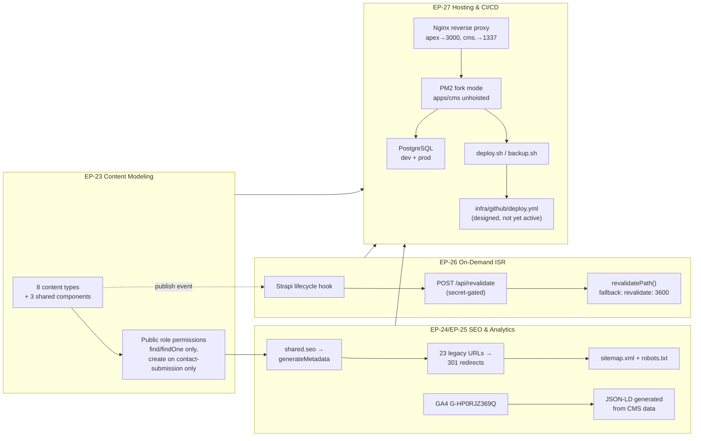

# Section I — CMS Platform, SEO, Redirects, Analytics & Hosting

> **Scope.** This section covers the cross-cutting, non-page-specific infrastructure that every other section (A–H) depends on: the Strapi content model and permissions (EP-23), SEO/metadata/redirects/sitemap (EP-24), analytics and structured data (EP-25), on-demand cache invalidation (EP-26), and hosting/deployment on a Hostinger VPS (EP-27). Nothing here renders a page directly — this is the platform every page-specific Epic in Sections A–H is built on top of. **Out of scope for this section:** any page-specific field schema detail (already specified per content type in Sections B–H); those Epics define *what* fields exist per content type, this section defines *how the platform as a whole* is modeled, secured, optimized for search, tracked, kept fresh, and deployed.



## EP-23 — Strapi Content Modeling & Permissions

**Epic title:** Strapi Content Modeling & Permissions

**Description:** Stand up the complete Strapi v5 content schema that every other section's stories read from and write to, and lock down permissions so the public API surface is exactly as wide as the site needs and no wider.

**Goal:** A fully modeled, correctly permissioned Strapi schema — 8 content types, 3 shared components — that every content-backed page in Sections B–H can query with a read-only public token, plus a single public write path for the contact form.

**Scope:** `apps/cms/src/api/**` content-type schemas (`global`, `case-study`, `news-article`, `service`, `team-member`, `partner`, `testimonial`, `contact-submission`); `apps/cms/src/components/shared/**` (`seo`, `link`, `social-link`); Strapi admin Users & Permissions plugin configuration for the `Public` role; `draftAndPublish` toggles per content type.

**Out of scope:** Field-level content authored per entry (that's the seed/migration work in `packages/seed`, covered by each page-specific Epic in Sections B–H); custom roles beyond `Public`/`Authenticated`/admin defaults; API token lifecycle management (covered under EP-27 deployment docs, not modeling).

**Success metric:** All 8 content types + 3 components exist with schemas matching every field referenced by Sections A–H; `curl` against any public read endpoint for a non-`contact-submission` type succeeds anonymously; any anonymous `PUT`/`PATCH`/`DELETE` request against any content type, and any anonymous `POST` against any type other than `contact-submission`, returns `403`.

**Priority:** P1

### EP-23-S1 — Define the 8 content types and 3 shared components

**Title:** As a CMS Engineer I want the full Strapi schema (8 content types + 3 shared components) defined so that every page-specific Epic in Sections B–H has a content source to read from.

**Description:** The legacy site has no data layer at all — every page's content is hand-typed HTML. The target architecture centralizes that content into one `global` singleType (footer/contact/social — replacing `footer_content.json`) and 6 collectionTypes (`case-study`, `news-article`, `service`, `team-member`, `partner`, `testimonial`) plus the transactional `contact-submission` collectionType. Three shared, embeddable components — `shared.seo` (`metaTitle`, `metaDescription`, `ogImage`), `shared.link` (`label`, `url`, `isExternal`), and `shared.social-link` (`platform`, `url`, `icon`) — are nested into content types wherever a repeatable link list or SEO block is needed, so those field groups are defined once under `apps/cms/src/components/shared/` rather than duplicated per content type. Field-level detail per content type (e.g. `case-study.industry`, `service.features`) must match exactly what Sections B–H's stories specify; this story is the schema-authoring pass that makes those later stories buildable. Out of scope: populating entries with real content (seed/ETL work) and any content type not already enumerated in the overview's §5 ER model.

**Acceptance Criteria:**

```gherkin
Scenario: Happy path — all 8 content types are registered and queryable via the admin content-type builder
  Given the Strapi admin panel is running against a fresh PostgreSQL database
  When a CMS Engineer opens Content-Type Builder
  Then all 8 types are listed — "global" (Single Type) and "case-study", "news-article", "service", "team-member", "partner", "testimonial", "contact-submission" (Collection Types)
  And each type's field list matches the field-level schema specified in its owning Section (B–H) story

Scenario: Failure/error — a required relation or component reference is missing at boot
  Given the "case-study" content type schema references the "shared.seo" component
  When "shared.seo" has not yet been created under apps/cms/src/components/shared/
  Then Strapi fails to build/start with a schema validation error naming the missing component
  And no content type is silently registered without its declared component

Scenario: Edge/boundary — the "global" single type has exactly one entry, never zero or many
  Given "global" is configured as a Strapi singleType
  When a Site Administrator attempts to create a second "global" entry via the REST API
  Then Strapi rejects the request, because singleType semantics permit exactly one entry
  And the existing entry remains the sole source for footer/contact/social data
```

**Story Points:** 8

**Priority:** P1

**Labels:** `strapi`, `content-modeling`, `schema`, `foundation`

**Components:** `CMS-GLOBAL`, `CMS-CASE-STUDY`, `CMS-NEWS-ARTICLE`, `CMS-SERVICE`, `CMS-TEAM-MEMBER`, `CMS-PARTNER`, `CMS-TESTIMONIAL`, `CMS-CONTACT-SUBMISSION`

**Epic Link:** EP-23 — Strapi Content Modeling & Permissions

**Source:** `assets/data/footer_content.json` (legacy `global` seam) + implicit schema across `about.html`, `service.html`, `case-study/*.html`, `news/*.html`, `contact.html`, `triedatum-news.html` (no legacy file directly defines a schema — this is a synthesized platform requirement backing every page-specific Section).

---

### EP-23-S2 — Grant Public role read access to published entries

**Title:** As a Site Visitor I want every published, read-oriented content type to be fetchable anonymously so that the Next.js front end can render pages without authenticating.

**Description:** The legacy site has no access-control concept — every `.html` file is world-readable by definition. In the target architecture, `apps/web`'s Server Components fetch content from Strapi via `packages/shared` using a read-only pattern; that only works if the `Public` role in Strapi's Users & Permissions plugin is explicitly granted `find` and `findOne` on every read-oriented type. This story grants exactly that: `find`/`findOne` on `case-study`, `news-article`, `service`, `team-member`, `partner`, `testimonial` (collection types), and `find` on `global` (single type) — and only on entries in the "published" state, per `draftAndPublish` semantics (EP-23-S4). Out of scope: any write permission (EP-23-S3) and any permission for `contact-submission` reads (there is deliberately none — see EP-23-S3).

**Acceptance Criteria:**

```gherkin
Scenario: Happy path — anonymous GET on a published case study succeeds
  Given a "case-study" entry exists in the "published" state
  When an unauthenticated client sends GET /api/case-studies/<slug>
  Then Strapi responds 200 with the entry's public fields

Scenario: Failure/error — anonymous GET on an unpublished (draft) entry is rejected
  Given a "news-article" entry exists only in the "draft" state
  When an unauthenticated client sends GET /api/news-articles/<slug>
  Then Strapi responds 404, because draft entries are not exposed to the Public role

Scenario: Edge/boundary — the global single type is readable without authentication but has no findOne (singleType has only find)
  Given the "global" single type has one published entry
  When an unauthenticated client sends GET /api/global
  Then Strapi responds 200 with footer/contact/social data
  And no separate findOne permission is needed or granted, since singleType exposes only the one "find" action
```

**Story Points:** 3

**Priority:** P1

**Labels:** `strapi`, `permissions`, `security`, `public-role`

**Components:** `CMS-GLOBAL`, `CMS-CASE-STUDY`, `CMS-NEWS-ARTICLE`, `CMS-SERVICE`, `CMS-TEAM-MEMBER`, `CMS-PARTNER`, `CMS-TESTIMONIAL`

**Epic Link:** EP-23 — Strapi Content Modeling & Permissions

**Source:** No legacy equivalent (static HTML has no permission model) — synthesized platform requirement enabling anonymous reads across all of Sections B, C, D, F, H.

---

### EP-23-S3 — Restrict Public role to create-only on contact-submission; no public update/delete anywhere

**Title:** As a Site Administrator I want the Public role limited to `create` on `contact-submission` and denied every `update`/`delete` action across the entire schema so that anonymous visitors can submit the contact form but can never read, modify, or destroy any content.

**Description:** The legacy `contact.html` form POSTs to `mail.php`, which sends an email and stores nothing queryable — there is no analog of "anonymous write access to a data store" to secure on the legacy side. In the target architecture, the contact form POSTs to `apps/web/app/api/contact/route.ts`, which in turn creates a `contact-submission` entry in Strapi using the Public role's `create` permission — this is the **only** public write permission granted anywhere in the schema. This is a stated hard rule, not an incidental default: no content type, including `contact-submission` itself, ever grants Public `update` or `delete`, and `contact-submission` itself grants Public no `find`/`findOne` either (submissions are write-only from the anonymous side; only authenticated admins can read them back in the Strapi admin panel). Out of scope: any authenticated/admin-role permission grants (those follow Strapi's default admin capabilities and aren't re-specified here).

**Acceptance Criteria:**

```gherkin
Scenario: Happy path — anonymous POST creates a contact-submission entry
  Given the Public role has "create" permission on "contact-submission"
  When an unauthenticated client sends POST /api/contact-submissions with valid name/email/message fields
  Then Strapi responds 201 and a new contact-submission entry is persisted

Scenario: Failure/error — anonymous GET, PUT, and DELETE on contact-submission are all rejected
  Given the Public role has no "find", "findOne", "update", or "delete" permission on "contact-submission"
  When an unauthenticated client sends GET, PUT, or DELETE against /api/contact-submissions or /api/contact-submissions/<id>
  Then Strapi responds 403 for each of the three request types
  And no contact-submission data is ever readable, editable, or deletable by an anonymous client

Scenario: Edge/boundary — no content type anywhere in the schema grants Public update or delete, including the read-oriented types
  Given the Public role's full permission matrix across all 8 content types
  When the permission matrix is audited
  Then "update" and "delete" are unchecked for the Public role on every single content type without exception
  And this remains true even for content types that grant "find"/"findOne" (EP-23-S2), since read access never implies write access
```

**Story Points:** 3

**Priority:** P1

**Labels:** `strapi`, `permissions`, `security`, `public-role`, `hard-rule`

**Components:** `CMS-CONTACT-SUBMISSION`

**Epic Link:** EP-23 — Strapi Content Modeling & Permissions

**Source:** `contact.html` (form target) / `mail.php` (legacy submission handler being replaced) — see also EP-18/EP-19 in Section G for the front-end submission flow.

---

### EP-23-S4 — Enable draftAndPublish on every content type except contact-submission

**Title:** As a Content Editor I want draft/publish workflow enabled on every editorial content type — but explicitly disabled on contact-submission — so that I can stage edits before they go live, while form submissions remain simple transactional records with no editorial lifecycle.

**Description:** The legacy site has no concept of "draft" content — every committed `.html` file is immediately live. In the target architecture, Strapi's `draftAndPublish` feature is turned on for `global`, `case-study`, `news-article`, `service`, `team-member`, `partner`, and `testimonial`, giving Content Editors a draft state to preview and revise before publishing (and giving EP-23-S2's public permissions something meaningful to filter on). `contact-submission` is the one deliberate exception: it has `draftAndPublish` OFF by design, because a form submission is transactional data captured at a point in time, not editorial content that benefits from a draft/review cycle — every submission is simply "created," full stop. Out of scope: any custom editorial workflow/approval stages beyond Strapi's built-in draft/publish binary state.

**Acceptance Criteria:**

```gherkin
Scenario: Happy path — a draft case-study entry is invisible publicly until published
  Given a CMS Engineer has enabled draftAndPublish on "case-study"
  And a Content Editor creates a new case-study entry and saves it without clicking "Publish"
  When an unauthenticated client requests that entry's slug via the public API
  Then the response is 404 (per EP-23-S2), and the entry becomes visible only after the Content Editor clicks "Publish"

Scenario: Failure/error — attempting to enable draftAndPublish on contact-submission is rejected by design
  Given the platform's stated rule that contact-submission has draftAndPublish OFF
  When a CMS Engineer attempts to toggle draftAndPublish ON for "contact-submission" in the Content-Type Builder
  Then the change is flagged in schema review as violating the platform's hard rule and must not be merged
  And contact-submission entries continue to have only a single "created" state, no draft/published distinction

Scenario: Edge/boundary — the global single type's draft state does not remove the live footer, it only withholds new edits
  Given "global" has draftAndPublish enabled and one published entry already live in production
  When a Content Editor edits the global entry and saves without publishing
  Then the public "find" response for /api/global continues returning the last-published version
  And the unpublished edit remains staged until the Content Editor explicitly publishes it
```

**Story Points:** 2

**Priority:** P2

**Labels:** `strapi`, `draft-publish`, `content-modeling`

**Components:** `CMS-GLOBAL`, `CMS-CASE-STUDY`, `CMS-NEWS-ARTICLE`, `CMS-SERVICE`, `CMS-TEAM-MEMBER`, `CMS-PARTNER`, `CMS-TESTIMONIAL`, `CMS-CONTACT-SUBMISSION`

**Epic Link:** EP-23 — Strapi Content Modeling & Permissions

**Source:** No legacy equivalent (static HTML has no draft state) — synthesized platform requirement.

---

## EP-24 — SEO, Metadata, Sitemap & 301 Redirects

**Epic title:** SEO, Metadata, Sitemap & 301 Redirects

**Description:** Guarantee zero search-ranking or referral-traffic loss during the cutover from `TDWebsite` to `TDWebsite2`, while simultaneously fixing real SEO defects the legacy site shipped with — generic duplicated metadata, no sitemap, no robots.txt, no canonical tags, and zero Open Graph tags anywhere.

**Goal:** Every legacy URL 301s to its correct new route, every content-backed page has unique, real SEO metadata (not a carried-forward generic string), and machine-readable discovery files (`sitemap.xml`, `robots.txt`) exist for the first time.

**Scope:** `shared.seo` component wiring into `generateMetadata` across all content-backed routes in `apps/web`; the `next.config.js` `redirects()` table and its backing redirect map; `apps/web/app/sitemap.ts` and `apps/web/app/robots.ts` (or equivalent static files); canonical URL and Open Graph tag emission site-wide.

**Out of scope:** Analytics/tracking (EP-25); structured data / JSON-LD (EP-25); anything about *how* content is modeled (EP-23) — this Epic only covers how content is *surfaced* to search engines and social crawlers, and how legacy URLs are preserved.

**Success metric:** All 23 legacy `.html` URLs 301 correctly; zero pages ship the generic "TrieDatum - Your Trusted Partner in AI & Data" string; `sitemap.xml` and `robots.txt` both resolve with correct content; every page has exactly one canonical `<link>` tag and a complete `og:title`/`og:description`/`og:image` triple.

**Priority:** P1

### EP-24-S1 — Wire shared.seo into generateMetadata and replace generic duplicated metadata

**Title:** As an SEO Engineer I want the `shared.seo` component (`metaTitle`, `metaDescription`, `ogImage`) wired into `generateMetadata` for every content-backed route, with real per-page values authored during migration, so that search engines index unique, accurate metadata instead of the legacy site's duplicated generic string.

**Description:** The legacy site reuses the exact string "TrieDatum - Your Trusted Partner in AI & Data" as `<title>`, meta description, and meta keywords across `index.html`, `about.html`, `service.html`, most `case-study/*.html` pages, and roughly half of `news/*.html` — a real content defect, not a stylistic choice to preserve. In the target architecture, every content type that backs a page (`case-study`, `news-article`, `service`, plus the static-ish pages like homepage/about) carries a `shared.seo` component with `metaTitle`, `metaDescription`, and `ogImage` fields, and each route's `generateMetadata` function reads those fields to emit the page's `<title>` and meta tags. This story includes the migration-time content work of authoring a real, unique SEO value for every page that previously carried the generic string — carrying the generic string forward for even one page is treated as a migration defect, not an acceptable interim state. Out of scope: Open Graph tag emission mechanics (EP-24-S4) and canonical tag emission (EP-24-S4) — this story is about the source data and its wiring into `generateMetadata`, not every meta tag consumer.

**Acceptance Criteria:**

```gherkin
Scenario: Happy path — a case study's unique SEO fields render as page metadata
  Given a "case-study" entry has shared.seo.metaTitle = "Acme Corp: 40% Cost Reduction via AI Ops | TrieDatum"
  When /case-studies/<slug> is requested
  Then the rendered <title> and og:title-adjacent metadata reflect that exact metaTitle
  And it does not match the legacy generic string "TrieDatum - Your Trusted Partner in AI & Data"

Scenario: Failure/error — a content-backed route with an empty shared.seo component falls back safely instead of shipping blank metadata
  Given a "service" entry was migrated without its shared.seo fields populated
  When generateMetadata runs for that service's route
  Then a sensible site-level fallback title/description is emitted rather than an empty <title> tag
  And this fallback gap is logged as a migration content defect to be fixed with real per-entry SEO data, not left permanently on the fallback

Scenario: Edge/boundary — every page that previously carried the generic duplicated string now has a distinct value, with no two pages sharing identical SEO text
  Given the full set of pages that previously showed "TrieDatum - Your Trusted Partner in AI & Data" (index, about, service, most case studies, half of news)
  When their post-migration metaTitle values are compared pairwise
  Then no two pages share an identical metaTitle string
  And none of them equal the legacy generic string verbatim
```

**Story Points:** 5

**Priority:** P1

**Labels:** `seo`, `metadata`, `content-migration`, `generateMetadata`

**Components:** `SVC-SEO`, `CMS-CASE-STUDY`, `CMS-NEWS-ARTICLE`, `CMS-SERVICE`

**Epic Link:** EP-24 — SEO, Metadata, Sitemap & 301 Redirects

**Source:** `index.html`, `about.html`, `service.html`, `case-study/*.html` (most), `news/*.html` (half) — all sharing the generic `<title>`/description/keywords string, per overview §3 item 5.

---

### EP-24-S2 — Build the exhaustive 301 redirect table for all 23 legacy URLs

**Title:** As an SEO Engineer I want every legacy `.html` URL 301-redirected to its corresponding new route so that inbound links, bookmarks, and search-engine index entries continue to resolve correctly after cutover.

**Description:** The legacy site has no redirect mechanism of any kind — it is flat static HTML with no server-side routing logic. The target architecture introduces a machine-readable redirect map consumed by `next.config.js`'s `redirects()` function, covering all 23 legacy URLs: the 7 static pages (`index.html`, `about.html`, `service.html`, `bootcamp.html`, `partnership.html`, `contact.html`, `triedatum-news.html`), the 4 news articles, the 10 case studies, and the 2 testimonials. Every one of these 23 URLs must 301 (permanent redirect, preserving SEO equity) to its corresponding new route — not 302, and not left as a 404. Out of scope: the orphaned `case8.html` (flagged separately in Section H / `EP-21-S4` as a preserve-or-retire decision, not part of this redirect count) and any URL not present on the legacy site today.

**Acceptance Criteria:**

```gherkin
Scenario: Happy path — a static page URL 301s to its new route
  Given the redirect map includes "/about.html" → "/about"
  When a client requests GET /about.html
  Then the server responds 301 with Location: /about
  And this pattern holds for all 7 static legacy pages

Scenario: Failure/error — a case-study or news URL missing from the redirect map would 404 instead of redirecting
  Given the redirect map is the single source of truth consumed by next.config.js
  When any one of the 10 case-study or 4 news-article legacy URLs is accidentally omitted from the map
  Then that URL 404s instead of 301ing, which fails this story's acceptance bar
  And the story is not considered done until all 23 URLs (7 static + 4 news + 10 case studies + 2 testimonials) are verified present and correctly targeted

Scenario: Edge/boundary — testimonial URLs redirect to their consolidated location even though testimonials have no standalone page template
  Given the 2 legacy testimonial URLs previously rendered as their own pages
  And the target architecture surfaces testimonials as content within other pages/sections rather than standalone routes
  When either legacy testimonial URL is requested
  Then it 301s to the most relevant consolidated target (e.g. the testimonials section of the homepage or case studies index)
  And no testimonial URL is left unmapped
```

**Story Points:** 5

**Priority:** P1

**Labels:** `seo`, `redirects`, `next-config`, `migration`

**Components:** `SVC-REDIRECTS`

**Epic Link:** EP-24 — SEO, Metadata, Sitemap & 301 Redirects

**Source:** All 23 legacy `.html` URLs — `index.html`, `about.html`, `service.html`, `bootcamp.html`, `partnership.html`, `contact.html`, `triedatum-news.html`, `news/*.html` (4), `case-study/*.html` (10), testimonial pages (2).

---

### EP-24-S3 — Generate sitemap.xml and robots.txt

**Title:** As an SEO Engineer I want a generated `sitemap.xml` and `robots.txt` so that search engines can discover and correctly crawl every page on the site, which the legacy site never provided.

**Description:** Neither `sitemap.xml` nor `robots.txt` exists anywhere on the legacy site — a real, verifiable gap, not an assumption. The target architecture generates both dynamically: `sitemap.xml` enumerates every static route plus every published entry across the content-backed collection types (`case-study`, `news-article`, `service`, `team-member`, `partner`), staying in sync automatically as content is published or unpublished; `robots.txt` allows crawling of the public site and points to the sitemap location, while disallowing the Strapi admin subdomain/paths. Out of scope: submitting the sitemap to Search Console/Bing Webmaster Tools (an operational step outside this codebase) and per-URL crawl-priority tuning beyond sensible defaults.

**Acceptance Criteria:**

```gherkin
Scenario: Happy path — sitemap.xml includes every published content-backed route
  Given 10 published case studies, 4 published news articles, and the full set of static routes exist
  When GET /sitemap.xml is requested
  Then the response is valid XML containing a <url> entry for every static route and every published case-study/news-article/service/team-member/partner entry

Scenario: Failure/error — an unpublished (draft) entry must not appear in the sitemap
  Given a "news-article" entry exists only in draft state
  When /sitemap.xml is regenerated
  Then no <url> entry references that draft entry's slug
  And publishing it later causes it to appear on the next sitemap generation

Scenario: Edge/boundary — robots.txt disallows the Strapi admin surface while allowing everything public
  Given robots.txt is generated for the production domain
  When a crawler requests /robots.txt
  Then it allows crawling of all public apps/web routes and references the sitemap location
  And it explicitly disallows the cms.<domain> admin path/subdomain from being indexed
```

**Story Points:** 3

**Priority:** P1

**Labels:** `seo`, `sitemap`, `robots-txt`, `discoverability`

**Components:** `SVC-SEO`

**Epic Link:** EP-24 — SEO, Metadata, Sitemap & 301 Redirects

**Source:** No legacy equivalent — neither file exists on `TDWebsite` today; synthesized platform requirement closing a real gap.

---

### EP-24-S4 — Canonical URLs and Open Graph tags site-wide

**Title:** As an SEO Engineer I want exactly one canonical URL per page and a complete Open Graph tag set on every page so that search engines avoid duplicate-content penalties and social shares render rich previews, neither of which the legacy site supported.

**Description:** The legacy site has zero `og:*` tags anywhere across its roughly 24 pages, and has no consistent canonical URL strategy — a link shared on LinkedIn or Slack renders as a bare URL with no preview image, title, or description. The target architecture emits exactly one canonical `<link rel="canonical">` tag per page (derived from the route, not user-supplied, to prevent duplicate/parameterized-URL indexing issues) and a full `og:title`/`og:description`/`og:image` triple on every page, sourced from the same `shared.seo` component wired in EP-24-S1 (falling back to the `ogImage` default asset when a specific entry has none set). Out of scope: Twitter Card–specific tags beyond what Open Graph already covers, and per-page custom social preview image cropping/design (a content-authoring concern, not a platform one).

**Acceptance Criteria:**

```gherkin
Scenario: Happy path — a case-study page emits one canonical tag and a full OG triple
  Given a published case-study entry with shared.seo.ogImage set
  When /case-studies/<slug> is rendered
  Then the HTML head contains exactly one <link rel="canonical" href=".../case-studies/<slug>">
  And og:title, og:description, and og:image are all present and non-empty

Scenario: Failure/error — a page rendered under two different query-string variants must not produce two different canonical URLs
  Given /services?ref=newsletter and /services are both valid ways to reach the same page
  When each variant is rendered
  Then both emit the identical canonical URL "/services" with no query string
  And no page ever emits more than one canonical tag

Scenario: Edge/boundary — a content entry with no ogImage set still emits a valid og:image via the site-wide default
  Given a "team-member" entry has no image uploaded
  When that team member's page (or the about page section referencing them) is rendered
  Then og:image falls back to a site-wide default social image rather than being omitted
  And the OG triple remains complete (no missing og:image) on every page site-wide
```

**Story Points:** 5

**Priority:** P1

**Labels:** `seo`, `open-graph`, `canonical-url`, `social-sharing`

**Components:** `SVC-SEO`

**Epic Link:** EP-24 — SEO, Metadata, Sitemap & 301 Redirects

**Source:** All ~24 legacy pages (none currently emit `og:*` tags or a consistent canonical strategy) — a site-wide gap, not tied to one file.

---

## EP-25 — Analytics & Structured Data

**Epic title:** Analytics & Structured Data

**Description:** Preserve uninterrupted analytics tracking continuity across the platform migration, and replace the legacy site's one hand-authored structured-data block with a pattern that generates schema.org JSON-LD dynamically from CMS data wherever it's needed, site-wide.

**Goal:** Zero gap or discontinuity in the GA4 historical data stream, and structured data that is always derived from live CMS content rather than manually kept in sync with it.

**Scope:** GA4 tag installation/verification across every route in `apps/web`; a JSON-LD generation utility invoked from page-level components for `EducationalOrganization`/`Course` (bootcamp), `Article` (news), and `BreadcrumbList` (wherever breadcrumbs exist).

**Out of scope:** Any additional analytics platform beyond the existing GA4 property (e.g. no new Segment/Mixpanel integration is introduced here); structured-data types beyond the three named (no `Product`, `FAQPage`, etc. unless a future Epic calls for it).

**Success metric:** GA4 real-time reporting shows events firing on every route immediately post-launch under the same property ID as pre-migration; every JSON-LD block present on the target site validates against Google's Rich Results Test and traces back to a CMS field, not a hand-typed literal.

**Priority:** P1

### EP-25-S1 — Preserve GA4 tracking continuity across the migration

**Title:** As a Site Administrator I want the existing GA4 property to fire identically on every route after migration so that historical analytics continuity is not broken by the platform change.

**Description:** The legacy site already has Google Analytics 4 installed under property `G-HP0RJZ369Q`. This story's job is preservation, not introduction: the same measurement ID must be wired into `apps/web` (typically via a root-layout script or a dedicated analytics component loaded on every route, including client-side navigations within the Next.js app) so that page views, events, and audience data continue accumulating under the same property with no gap, no ID change, and no double-counting from a duplicate/leftover legacy snippet. Out of scope: introducing new custom events beyond what the legacy site already tracked (page views), and any GA4 configuration changes within the Google Analytics UI itself (property settings, conversions, audiences) — this story is only about the tag firing correctly from the new codebase.

**Acceptance Criteria:**

```gherkin
Scenario: Happy path — GA4 fires on every route under the same property ID
  Given apps/web is deployed to production
  When a Site Visitor navigates to any route, including client-side Next.js navigations between pages
  Then a GA4 pageview event fires tagged with measurement ID G-HP0RJZ369Q
  And GA4 real-time reporting shows the event within seconds

Scenario: Failure/error — a client-side route transition must not silently skip the pageview event
  Given a Site Visitor is on the homepage and clicks an internal link to /services
  When the Next.js client-side router completes the transition without a full page reload
  Then a new GA4 pageview event still fires for /services
  And this is verified explicitly, since App Router client-side navigation does not automatically re-fire third-party scripts the way a full page load does

Scenario: Edge/boundary — no duplicate or leftover legacy GA snippet double-counts events
  Given the migration is complete and the legacy static site is decommissioned
  When the GA4 integration in apps/web is audited
  Then exactly one GA4 snippet/initialization exists site-wide
  And no page accidentally loads two copies of the tag (e.g. once in a shared layout and again in a page-level component), which would inflate session/event counts
```

**Story Points:** 3

**Priority:** P1

**Labels:** `analytics`, `ga4`, `tracking-continuity`

**Components:** `SVC-SEO`

**Epic Link:** EP-25 — Analytics & Structured Data

**Source:** GA4 snippet (property `G-HP0RJZ369Q`) present across legacy `.html` pages.

---

### EP-25-S2 — Generate schema.org JSON-LD dynamically from CMS data

**Title:** As an SEO Engineer I want schema.org JSON-LD (`EducationalOrganization`/`Course`, `Article`, `BreadcrumbList`) generated dynamically from CMS data at render time so that structured data can never drift out of sync with the content it describes.

**Description:** The legacy site has exactly one page with structured data — `bootcamp.html` — and it is a static, hand-authored JSON-LD block that has to be manually edited every time the bootcamp's price, dates, or description change, with no enforcement that anyone remembers to do so. The target architecture generalizes the pattern site-wide but changes how it's produced: a JSON-LD generation utility reads live CMS fields at render time and emits `EducationalOrganization`/`Course` markup for the bootcamp page, `Article` markup for each news article (sourced from `news-article` fields like `title`, `publishedDate`, `author`), and `BreadcrumbList` markup wherever a page has a breadcrumb trail — always computed from the current CMS state, never hand-copied or manually kept in sync. Out of scope: structured-data types not named here (e.g. no `Organization`/`LocalBusiness` markup is introduced unless a future story calls for it) and JSON-LD for `case-study`, `service`, `team-member`, `partner`, or `testimonial` content types, which are not in this story's named scope.

**Acceptance Criteria:**

```gherkin
Scenario: Happy path — the bootcamp page's JSON-LD reflects live CMS data
  Given the bootcamp content in Strapi has a price and date range
  When /bootcamp is rendered
  Then the page's JSON-LD <script type="application/ld+json"> block contains EducationalOrganization/Course markup matching those live CMS values
  And it validates cleanly in Google's Rich Results Test

Scenario: Failure/error — editing bootcamp content in Strapi and forgetting to touch any code still updates the JSON-LD correctly
  Given a Content Editor changes the bootcamp's price in Strapi and publishes
  When the page regenerates (via ISR or on-demand revalidation per EP-26)
  Then the JSON-LD block reflects the new price automatically
  And this is the explicit negative test for the legacy failure mode — no hand-edit of a static JSON-LD block is ever required or possible

Scenario: Edge/boundary — a news article with no author set still emits valid Article JSON-LD without a broken/empty author field
  Given a "news-article" entry was published without its optional author field populated
  When that article's page is rendered
  Then the Article JSON-LD omits the author property entirely rather than emitting an empty or null value
  And the block as a whole still validates as well-formed schema.org Article markup
```

**Story Points:** 5

**Priority:** P2

**Labels:** `seo`, `structured-data`, `json-ld`, `schema-org`

**Components:** `SVC-SEO`, `CMS-NEWS-ARTICLE`

**Epic Link:** EP-25 — Analytics & Structured Data

**Source:** `bootcamp.html` (sole legacy page with a static, hand-authored JSON-LD block) — pattern extended site-wide in the target architecture.

---

## EP-26 — On-Demand ISR / Revalidation Webhook

**Epic title:** On-Demand ISR / Revalidation Webhook

**Description:** Keep the SSG+ISR cache fresh the moment a Content Editor publishes a change in Strapi, rather than waiting for the next timed revalidation window — while ensuring the site's correctness never actually *depends* on that webhook succeeding.

**Goal:** Sub-second-to-seconds cache freshness on publish, with a resilient, non-brittle fallback to timed ISR when the webhook path is unavailable.

**Scope:** `apps/web/app/api/revalidate/route.ts` (the secret-gated `POST /api/revalidate` endpoint); `apps/cms/src/index.ts` lifecycle hook registration for every editorial content type; the `revalidate: 3600` fallback window declared on each content-backed route.

**Out of scope:** Any change to `contact-submission` (it has no public-facing rendered page to revalidate, and its create-only nature per EP-23-S3 means there is no "publish" lifecycle event to hook into); cache invalidation at the CDN layer (Cloudflare) beyond what Next.js's own revalidation triggers — no separate Cloudflare cache-purge API integration is introduced here.

**Success metric:** A publish/update/delete of any editorial entry in Strapi results in the corresponding Next.js route reflecting the change on the very next request; when the webhook target is unreachable, the same content is never stale for longer than the 3600-second fallback window, and no request ever errors or blocks waiting on the webhook.

**Priority:** P2

### EP-26-S1 — Implement the secret-gated POST /api/revalidate endpoint

**Title:** As a Front-End Engineer I want a `POST /api/revalidate` endpoint gated by a secret header that maps a content-type + slug to the correct Next.js path(s) so that Strapi can trigger targeted cache invalidation without exposing an open revalidation surface to the public internet.

**Description:** The legacy site has no caching layer to invalidate — static files are simply re-deployed. In the target SSG+ISR architecture, `apps/web/app/api/revalidate/route.ts` accepts a `POST` request carrying a content-type identifier (e.g. `"case-study"`) and a slug, checks a secret header against the `STRAPI_REVALIDATE_SECRET` environment variable, and — only if the secret matches — maps the content-type + slug to the one or more Next.js paths that need invalidating (e.g. a `case-study` update revalidates both `/case-studies/<slug>` and the homepage carousel/index page that lists case studies) and calls `revalidatePath` on each. Out of scope: the Strapi-side caller (EP-26-S2) and the timed-ISR fallback behavior itself (EP-26-S3) — this story is specifically the endpoint's own request-handling, auth-gating, and path-mapping logic.

**Acceptance Criteria:**

```gherkin
Scenario: Happy path — a correctly authenticated request revalidates the right path(s)
  Given STRAPI_REVALIDATE_SECRET is configured and matches the request's secret header
  When POST /api/revalidate is called with { contentType: "case-study", slug: "acme-corp" }
  Then the endpoint calls revalidatePath for "/case-studies/acme-corp" and any index/listing page that includes case studies
  And the endpoint responds 200 confirming which paths were revalidated

Scenario: Failure/error — a request with a missing or incorrect secret header is rejected
  Given STRAPI_REVALIDATE_SECRET is configured
  When POST /api/revalidate is called with no secret header, or with an incorrect value
  Then the endpoint responds 401 and performs no revalidation
  And this holds regardless of whether the request body's contentType/slug are otherwise valid

Scenario: Edge/boundary — an unrecognized content-type identifier is handled gracefully, not with a server error
  Given the endpoint's content-type-to-path mapping only knows about the 7 editorial content types
  When POST /api/revalidate is called with a correct secret but an unrecognized contentType value (e.g. a typo or a future/unmapped type)
  Then the endpoint responds 400 with a clear error naming the unrecognized content type
  And it does not throw an unhandled exception or crash the Next.js server process
```

**Story Points:** 5

**Priority:** P2

**Labels:** `isr`, `revalidation`, `api-route`, `caching`

**Components:** `API-REVALIDATE`

**Epic Link:** EP-26 — On-Demand ISR / Revalidation Webhook

**Source:** No legacy equivalent — static HTML has no cache to invalidate; synthesized platform requirement per overview §6 end-to-end content-editing pipeline.

---

### EP-26-S2 — Register Strapi lifecycle hooks for every editorial content type

**Title:** As a CMS Engineer I want a `db.lifecycles.subscribe` hook registered for every editorial content type so that every create/update/delete in Strapi best-effort notifies the Next.js front end to refresh its cache.

**Description:** In `apps/cms/src/index.ts`, a lifecycle subscription is registered covering `global`, `service`, `case-study`, `news-article`, `team-member`, `partner`, and `testimonial` (explicitly not `contact-submission`, per this Epic's stated out-of-scope). On every `afterCreate`, `afterUpdate`, and `afterDelete` event for any of these types, the hook POSTs to `apps/web`'s `/api/revalidate` endpoint (EP-26-S1) with the content-type identifier and the affected entry's slug, including the secret header. This call is explicitly best-effort: it does not block or fail the underlying Strapi write operation if the webhook call itself fails or times out — the content is always saved in Strapi regardless of whether the notification succeeds. Out of scope: retry/backoff logic for failed webhook deliveries (the fallback is the timed ISR window, EP-26-S3, not a retry queue) and any lifecycle hook for `contact-submission`.

**Acceptance Criteria:**

```gherkin
Scenario: Happy path — publishing a case study triggers a webhook call to /api/revalidate
  Given the lifecycle hook is registered for "case-study" in apps/cms/src/index.ts
  When a Content Editor publishes a case-study entry
  Then Strapi's afterCreate/afterUpdate lifecycle fires and POSTs to apps/web's /api/revalidate with the case-study's slug and the correct secret header

Scenario: Failure/error — the webhook call failing does not roll back or block the Strapi write
  Given the Next.js server is unreachable (e.g. down for maintenance) at the moment a Content Editor publishes an entry
  When the lifecycle hook's POST to /api/revalidate fails (connection refused/timeout)
  Then the Strapi entry is still successfully created/updated/deleted and visible in the Strapi admin panel
  And the failure is logged but does not surface as an error to the Content Editor in the publish flow

Scenario: Edge/boundary — deleting an entry also triggers the hook, not just create/update
  Given a "testimonial" entry that was previously published and cached on the front end
  When a Content Editor deletes that testimonial entry
  Then the afterDelete lifecycle fires the same webhook call pattern as create/update
  And the corresponding Next.js path is revalidated so the deleted testimonial stops appearing on next request
```

**Story Points:** 5

**Priority:** P2

**Labels:** `strapi`, `lifecycle-hooks`, `revalidation`, `webhook`

**Components:** `CMS-GLOBAL`, `CMS-SERVICE`, `CMS-CASE-STUDY`, `CMS-NEWS-ARTICLE`, `CMS-TEAM-MEMBER`, `CMS-PARTNER`, `CMS-TESTIMONIAL`, `API-REVALIDATE`

**Epic Link:** EP-26 — On-Demand ISR / Revalidation Webhook

**Source:** No legacy equivalent — synthesized platform requirement per overview §6.

---

### EP-26-S3 — Fall back gracefully to the timed ISR window

**Title:** As a Front-End Engineer I want every content-backed route to declare a `revalidate: 3600` timed ISR fallback so that the site never permanently depends on the webhook succeeding to eventually show fresh content.

**Description:** EP-26-S1 and EP-26-S2 together deliver fast, on-demand freshness, but the architecture must not treat that path as load-bearing for correctness — only for speed. Every content-backed route in `apps/web` also declares Next.js's standard timed ISR window (`revalidate: 3600`, i.e. at most one hour of staleness) as an independent, always-on fallback. This matters concretely in scenarios like a local/dev environment where the Next.js server wasn't even running at the moment content was edited in Strapi (so the webhook had nothing to reach), or a production blip where the webhook request is dropped. In all such cases, the page still eventually re-renders with fresh content within the timed window, with zero manual intervention required. Out of scope: making the timed window configurable per content type (a single site-wide default of 3600 seconds is the specified behavior) and any alerting/monitoring on webhook failure rates (operational concern, not a code requirement here).

**Acceptance Criteria:**

```gherkin
Scenario: Happy path — a page revalidates on its own after the timed window even with no webhook call ever received
  Given a content-backed route declares revalidate: 3600 and received no on-demand revalidation webhook call
  When more than 3600 seconds have elapsed since the page was last generated and a new request arrives
  Then Next.js serves the stale page once and triggers a background regeneration
  And the subsequent request reflects the current CMS content

Scenario: Failure/error — the webhook never fires because the front end was offline when content was edited, yet the site still self-heals
  Given a Content Editor publishes changes while the Next.js dev/production server is down
  And the webhook POST in EP-26-S2 fails silently as designed
  When the Next.js server comes back online and the timed ISR window subsequently elapses
  Then the affected page regenerates with the current content on its own, with no manual cache-clear or redeploy required

Scenario: Edge/boundary — on-demand revalidation and the timed window do not conflict or double-fire in a way that breaks caching
  Given a page was just revalidated on-demand via the webhook 5 seconds ago
  When the timed 3600-second window for that same page has not yet elapsed
  Then the page continues serving the freshly on-demand-revalidated content without the timed window forcing a redundant, unnecessary regeneration
  And the two mechanisms coexist without one undoing the freshness the other just provided
```

**Story Points:** 3

**Priority:** P2

**Labels:** `isr`, `caching`, `resilience`, `fallback`

**Components:** `API-REVALIDATE`

**Epic Link:** EP-26 — On-Demand ISR / Revalidation Webhook

**Source:** No legacy equivalent — synthesized platform requirement; the resilience principle stated explicitly in this section's brief ("the site must never depend on the webhook succeeding").

---

## EP-27 — Hosting, Deployment & CI/CD (Hostinger VPS)

**Epic title:** Hosting, Deployment & CI/CD (Hostinger VPS)

**Description:** Get both `apps/web` and `apps/cms` live on a single Hostinger VPS with a repeatable, rollback-capable deployment process — a capability category the legacy static site never needed at all, since it had no server-side application, no build step, and no database.

**Goal:** A documented, reproducible hosting topology (Nginx + PM2 + PostgreSQL) and deploy/backup tooling that a Deploy Engineer can operate confidently, plus a version-controlled (if not-yet-wired) CI/CD pipeline design.

**Scope:** Nginx server block configuration for both the apex/www domain and the `cms.` subdomain; PM2 process configuration (fork mode, memory caps, workspace-hoist exclusion for `apps/cms`); PostgreSQL provisioning for local dev and production; `infra/deploy.sh` and `infra/backup.sh`; the CI pipeline design at `infra/github/deploy.yml`.

**Out of scope:** Actually copying `infra/github/deploy.yml` into an active `.github/workflows/` directory (explicitly deferred — see EP-27-S5); any container/Kubernetes-based hosting alternative (the specified target is a single Hostinger VPS running PM2 directly, not Docker/K8s); multi-region or multi-VPS high-availability topologies.

**Success metric:** Both apps are reachable over their respective domains with correct TLS; a `deploy.sh` run completes a zero-manual-step deploy with a working `--rollback`; `backup.sh` produces a restorable nightly dump; the CI pipeline design exists and is documented as not-yet-active, with no claim anywhere that it is already running automatically.

**Priority:** P1

### EP-27-S1 — Provision Nginx reverse-proxy server blocks

**Title:** As a Deploy Engineer I want Nginx server blocks routing the apex/www domain to the Next.js app and a `cms.` subdomain to Strapi so that both applications are reachable over standard HTTP(S) ports from a single VPS, with an optional IP-allowlist available for the admin panel.

**Description:** The legacy static site needed no reverse proxy at all — it could be served directly by any web server pointed at its file tree. The target architecture runs two Node.js processes (`apps/web` on port 3000, `apps/cms` on port 1337) that need a front-facing reverse proxy: an Nginx server block for the apex/`www` domain proxies to `localhost:3000`, and a separate server block for the `cms.` subdomain proxies to `localhost:1337`, both terminating TLS at Nginx. An IP-allowlist directive restricting access to the Strapi admin panel path is made available in the config but is optional/commented rather than mandatory, since the operational decision of whether to lock down admin access by IP belongs to the Site Administrator, not the platform default. Out of scope: the TLS certificate acquisition/renewal mechanism itself (assumed to be handled via the VPS's existing certificate tooling) and any CDN-layer configuration (Cloudflare sits in front of this, per the overview's architecture diagram, but its configuration is a separate operational concern).

**Acceptance Criteria:**

```gherkin
Scenario: Happy path — the apex domain and cms subdomain both route to the correct backend port
  Given Nginx is configured with two server blocks as specified
  When a request arrives for the apex/www domain
  Then Nginx proxies it to localhost:3000 (the Next.js app)
  And a request for the cms.<domain> subdomain is proxied to localhost:1337 (Strapi)

Scenario: Failure/error — the Next.js process is down and Nginx must not silently serve a blank/broken response
  Given the PM2-managed Next.js process has crashed or is not yet started
  When a request arrives at the apex domain
  Then Nginx returns a clear 502/503 upstream error rather than hanging indefinitely or returning a misleading 200
  And this failure is visible in Nginx's error log for the Deploy Engineer to diagnose

Scenario: Edge/boundary — the admin-panel IP-allowlist is present in config but inactive by default
  Given the Nginx config for cms.<domain> includes a commented-out or conditionally-disabled IP-allowlist directive for the /admin path
  When the Site Administrator has not explicitly enabled it
  Then the Strapi admin panel remains reachable from any IP (protected instead by Strapi's own auth), confirming the allowlist is genuinely optional, not silently enforced
  And enabling it is a documented one-line config change, not a code change
```

**Story Points:** 5

**Priority:** P1

**Labels:** `infra`, `nginx`, `reverse-proxy`, `hosting`

**Components:** `INFRA-NGINX`

**Epic Link:** EP-27 — Hosting, Deployment & CI/CD (Hostinger VPS)

**Source:** No legacy equivalent — the static site required no application server or reverse proxy; synthesized platform requirement.

---

### EP-27-S2 — Run both apps under PM2 in fork mode with the apps/cms hoist exclusion preserved

**Title:** As a Deploy Engineer I want both `apps/web` and `apps/cms` running under PM2 in fork mode with per-process memory caps, and `apps/cms` deliberately excluded from the npm workspace hoist, so that both processes stay running reliably and Strapi's dependency tree never breaks due to a dependency-version collision with the Next.js/ESLint toolchain.

**Description:** This is a real, hard-won architecture decision, not an arbitrary choice, and must be preserved exactly rather than "simplified" during any future refactor: Strapi's dependency tree requires `ajv@8`, while the Next.js/ESLint toolchain elsewhere in the monorepo requires `ajv@6`. If npm's workspace hoisting is allowed to hoist a single shared `ajv` version to the repo root `node_modules`, one of the two toolchains gets the wrong major version — concretely, Strapi crashes at boot with `Cannot find module 'ajv/dist/core'` when `ajv@6` wins the hoist. The fix is to keep `apps/cms` out of the npm workspace's hoisting behavior (e.g. via a `nohoist`-equivalent workspace configuration or by giving `apps/cms` its own independent `node_modules` install boundary), so each toolchain gets its own correct `ajv` major version. Both `apps/web` and `apps/cms` then run as PM2 fork-mode processes (not cluster mode) with explicit per-process memory caps (`max_memory_restart` or equivalent), so a memory leak in one process triggers an automatic restart rather than taking down the VPS. Out of scope: PM2 cluster mode or any multi-instance load-balancing within a single VPS (fork mode, one instance per app, is the specified topology) and resolving the `ajv` conflict by any means other than un-hoisting `apps/cms` (e.g. no dependency-override/resolutions hack is the specified fix).

**Acceptance Criteria:**

```gherkin
Scenario: Happy path — both processes run under PM2 in fork mode with memory caps applied
  Given a PM2 ecosystem config declaring both apps/web and apps/cms
  When `pm2 start` is run
  Then both processes appear in `pm2 list` as fork-mode instances (not cluster mode)
  And each has a configured max_memory_restart threshold

Scenario: Failure/error — hoisting apps/cms's dependencies reproduces the known ajv crash, confirming why the exclusion is required
  Given a hypothetical workspace config that allows apps/cms to be hoisted like every other workspace package
  When `npm install` is run at the repo root and Strapi is started
  Then Strapi crashes at boot with "Cannot find module 'ajv/dist/core'" because ajv@6 (hoisted for the Next.js/ESLint toolchain) shadows the ajv@8 Strapi requires
  And this is the documented reason apps/cms must remain excluded from the hoist — this scenario is a regression test for the architecture decision, not an acceptable running state

Scenario: Edge/boundary — a memory-capped process that exceeds its limit restarts automatically without operator intervention
  Given apps/web's PM2 process has a max_memory_restart cap configured
  When that process's memory usage exceeds the configured cap
  Then PM2 automatically restarts the process
  And the restart is visible in `pm2 logs`/`pm2 list` with no manual Deploy Engineer action required to bring it back up
```

**Story Points:** 8

**Priority:** P1

**Labels:** `infra`, `pm2`, `process-management`, `dependency-conflict`, `hard-won-decision`

**Components:** `INFRA-PM2`

**Epic Link:** EP-27 — Hosting, Deployment & CI/CD (Hostinger VPS)

**Source:** No legacy equivalent — the static site had no Node.js process to manage; synthesized platform requirement documenting a real production incident class (`ajv` hoist collision) and its fix.

---

### EP-27-S3 — Provision PostgreSQL for local dev and production

**Title:** As a Deploy Engineer I want a documented, repeatable PostgreSQL provisioning recipe for both local development and production so that setting up a new environment's database is a known, scripted process rather than tribal knowledge.

**Description:** The legacy static site has zero database dependency — this entire capability is new in the target architecture. Strapi requires a PostgreSQL database in both local dev (typically a locally-installed or containerized Postgres instance) and production (on the Hostinger VPS itself or a managed instance). This story delivers a documented recipe covering: installing/provisioning PostgreSQL, creating the database and a dedicated role/user with least-privilege access scoped to that one database, setting the connection string/environment variables Strapi reads (`DATABASE_*` or equivalent), and verifying connectivity before the first Strapi boot. The recipe must be repeatable — following it twice (e.g. once for dev, once for prod, or once when provisioning a second VPS) must produce an equivalent, correctly isolated database each time. Out of scope: any specific managed-Postgres vendor beyond what's needed for the Hostinger VPS target (no AWS RDS/Supabase-specific instructions are required) and database schema migrations themselves (handled by Strapi's own migration mechanism, not this recipe).

**Acceptance Criteria:**

```gherkin
Scenario: Happy path — following the documented recipe produces a working, isolated database and role
  Given a fresh VPS or local machine with PostgreSQL installed but no application database yet
  When a Deploy Engineer follows the documented database/role creation recipe
  Then a dedicated database and a dedicated role (not the Postgres superuser) exist, scoped to only that database
  And Strapi successfully connects and completes its first-boot schema sync using those credentials

Scenario: Failure/error — an incorrect connection string is caught with a clear error, not a silent hang
  Given the recipe's documented environment variables are misconfigured (wrong password or database name)
  When Strapi attempts to boot
  Then it fails fast with a clear database-connection error in its logs
  And the Deploy Engineer can trace the failure directly back to the specific misconfigured variable

Scenario: Edge/boundary — running the recipe a second time for a second environment does not collide with or affect the first
  Given the recipe has already been used once to provision the production database on the VPS
  When the same recipe is followed again for a local dev environment on a different machine
  Then the two databases and roles are fully independent, with no shared credentials and no cross-environment data visibility
  And repeatability is confirmed since neither run required deviating from the documented steps
```

**Story Points:** 5

**Priority:** P1

**Labels:** `infra`, `postgresql`, `database`, `provisioning`

**Components:** `INFRA-POSTGRES`

**Epic Link:** EP-27 — Hosting, Deployment & CI/CD (Hostinger VPS)

**Source:** No legacy equivalent — the static site had no database at all; synthesized platform requirement.

---

### EP-27-S4 — Implement deploy.sh and backup.sh

**Title:** As a Deploy Engineer I want a scripted `deploy.sh` (with rollback support) and a scripted nightly `backup.sh` so that shipping a new build and recovering from a bad deploy or data loss are both fast, repeatable, and don't depend on remembering manual steps.

**Description:** `deploy.sh` performs, in order: `git pull --ff-only` (refusing to proceed on a non-fast-forward state rather than force-merging), `npm ci` (clean, reproducible dependency install), a production build of the affected app(s), `pm2 reload --update-env` (zero-downtime reload picking up any new environment variables), and a sequence of health-check `curl` calls against both the web and CMS endpoints to confirm the new build is actually serving traffic correctly before declaring success. It supports a `--rollback` flag that redeploys a previously stored SHA (the script persists the last-known-good SHA before each deploy specifically so a rollback target always exists). `backup.sh` runs nightly via cron/PM2's scheduler, producing a `pg_dump` of the production database, optionally syncing that dump offsite, and enforcing a 30-day retention window by pruning dumps older than that. Out of scope: any GUI/dashboard for triggering these scripts (they are CLI-invoked, whether manually or from CI per EP-27-S5) and backup encryption-at-rest specifics beyond what the offsite sync target already provides.

**Acceptance Criteria:**

```gherkin
Scenario: Happy path — deploy.sh completes a full deploy and passes its health checks
  Given a clean working tree on the VPS with a new commit available on the remote's main branch
  When `./deploy.sh` is run
  Then it performs git pull --ff-only, npm ci, build, and pm2 reload --update-env in that order
  And it finishes only after health-check curls against both apps/web and apps/cms return healthy responses

Scenario: Failure/error — a failed health check after deploy triggers a rollback path, and a non-fast-forward git state halts before any changes are applied
  Given deploy.sh has just reloaded PM2 with a new build
  When the post-deploy health-check curl against apps/web returns a non-2xx status
  Then the script reports the failure clearly and does not silently declare success
  And separately, if git pull --ff-only would require a merge (non-fast-forward), the script halts immediately before touching any running process, rather than attempting a merge

Scenario: Edge/boundary — deploy.sh --rollback restores the previously stored SHA, and backup.sh enforces the 30-day retention window
  Given a prior successful deploy stored its SHA before deploying the current, now-problematic build
  When `./deploy.sh --rollback` is run
  Then the VPS checks out the stored previous-SHA, rebuilds, and reloads PM2 back to that known-good state
  And independently, when backup.sh runs and finds pg_dump files older than 30 days, it prunes exactly those and retains everything within the window
```

**Story Points:** 8

**Priority:** P1

**Labels:** `infra`, `deployment`, `ci-cd`, `backup`, `rollback`

**Components:** `INFRA-PM2`, `INFRA-POSTGRES`

**Epic Link:** EP-27 — Hosting, Deployment & CI/CD (Hostinger VPS)

**Source:** No legacy equivalent — the static site had no deploy pipeline or backup process; synthesized platform requirement.

---

### EP-27-S5 — Design (but do not yet activate) the CI pipeline

**Title:** As a Deploy Engineer I want a CI pipeline designed and version-controlled at `infra/github/deploy.yml` — a verify job and a deploy job — so that automated build-verification and SSH-based deployment are ready to activate, while honestly documenting that they are not yet wired into an active `.github/workflows/` directory.

**Description:** The legacy static site had no CI/CD of any kind — there was nothing to verify or deploy in an automated pipeline sense. The target architecture designs a two-job GitHub Actions pipeline: a **verify** job (install dependencies, typecheck, lint, build — run on every push/PR to catch breakage before merge) and a **deploy** job (SSH to the Hostinger VPS and invoke `deploy.sh` from EP-27-S4, gated to run only on merges to the main branch). This pipeline definition is fully written and version-controlled at `infra/github/deploy.yml`, but — critically — it is explicitly **not yet copied into an active `.github/workflows/` directory**, meaning it does not currently run automatically on any GitHub event. This is documented as a real, known gap to close before the platform migration can be considered fully operationally mature — it must never be described or reported as "CI/CD is already automated" when in fact the pipeline is designed-but-dormant. Out of scope: actually activating the pipeline (moving/copying it into `.github/workflows/`) — that activation step is the specifically-deferred work this story documents as outstanding, not work this story performs.

**Acceptance Criteria:**

```gherkin
Scenario: Happy path — the verify and deploy job definitions are complete and valid GitHub Actions YAML
  Given infra/github/deploy.yml exists in version control
  When its YAML is validated (e.g. via a GitHub Actions schema linter or a manual copy into a scratch repo's .github/workflows/ for a one-off test run)
  Then the verify job successfully runs install/typecheck/lint/build steps
  And the deploy job's SSH-to-VPS-and-run-deploy.sh steps are correctly defined, gated to the main branch

Scenario: Failure/error — mistakenly believing the pipeline is already active must be caught by documentation review, not discovered at incident time
  Given infra/github/deploy.yml exists but .github/workflows/ does not contain a copy of it
  When any project documentation, status report, or Definition-of-Done checklist is drafted claiming "CI/CD is automated"
  Then that claim is flagged as inaccurate during review, because no GitHub event currently triggers this pipeline
  And the correct documented status is "designed, version-controlled, not yet activated" until the copy step is explicitly performed

Scenario: Edge/boundary — activating the pipeline later requires only a file copy/move, no redesign
  Given infra/github/deploy.yml is already complete and correct as authored in this story
  When a future Deploy Engineer decides to activate it
  Then the activation work is limited to copying/moving the file into .github/workflows/ (plus configuring the necessary repo secrets for SSH access)
  And no redesign of the verify or deploy job logic itself is required at activation time
```

**Story Points:** 5

**Priority:** P3

**Labels:** `infra`, `ci-cd`, `github-actions`, `known-gap`

**Components:** `INFRA-CI`

**Epic Link:** EP-27 — Hosting, Deployment & CI/CD (Hostinger VPS)

**Source:** No legacy equivalent — the static site had no CI/CD; synthesized platform requirement, explicitly flagged per this section's brief as a documented gap rather than a completed capability.

---

## Definition of Done

- [ ] Code reviewed and approved by ≥1 peer (`code-reviewer` agent)
- [ ] All Gherkin acceptance criteria pass in a local/staging environment
- [ ] Unit test coverage meets the target in TS-000 §2 for touched code
- [ ] Visual + functional parity confirmed by `parity-auditor` (desktop + mobile)
- [ ] No CRITICAL or HIGH findings from the Standards or Security scan
- [ ] Strapi schema/permission changes documented in `docs/content-model.md`
- [ ] Legacy URL(s) 301 to the new route; SEO metadata present
- [ ] No open blockers or unresolved dependencies
