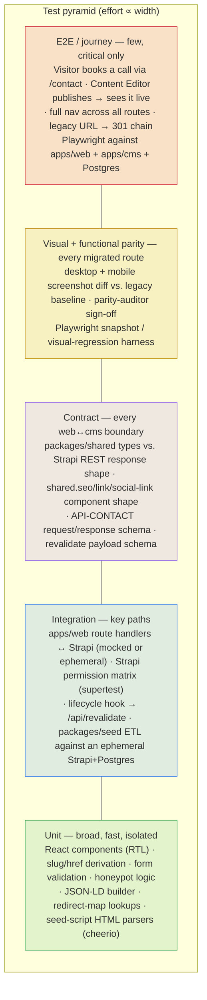
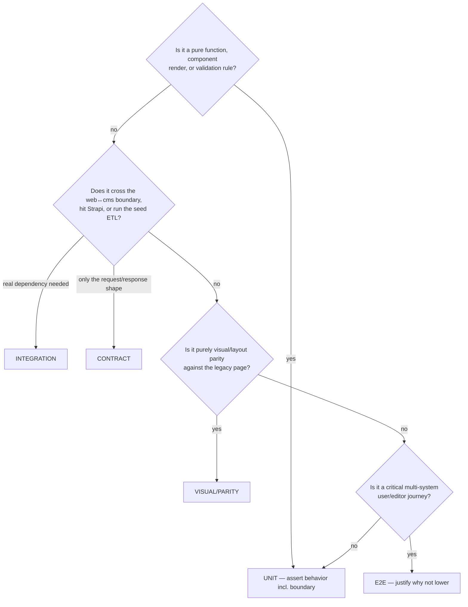
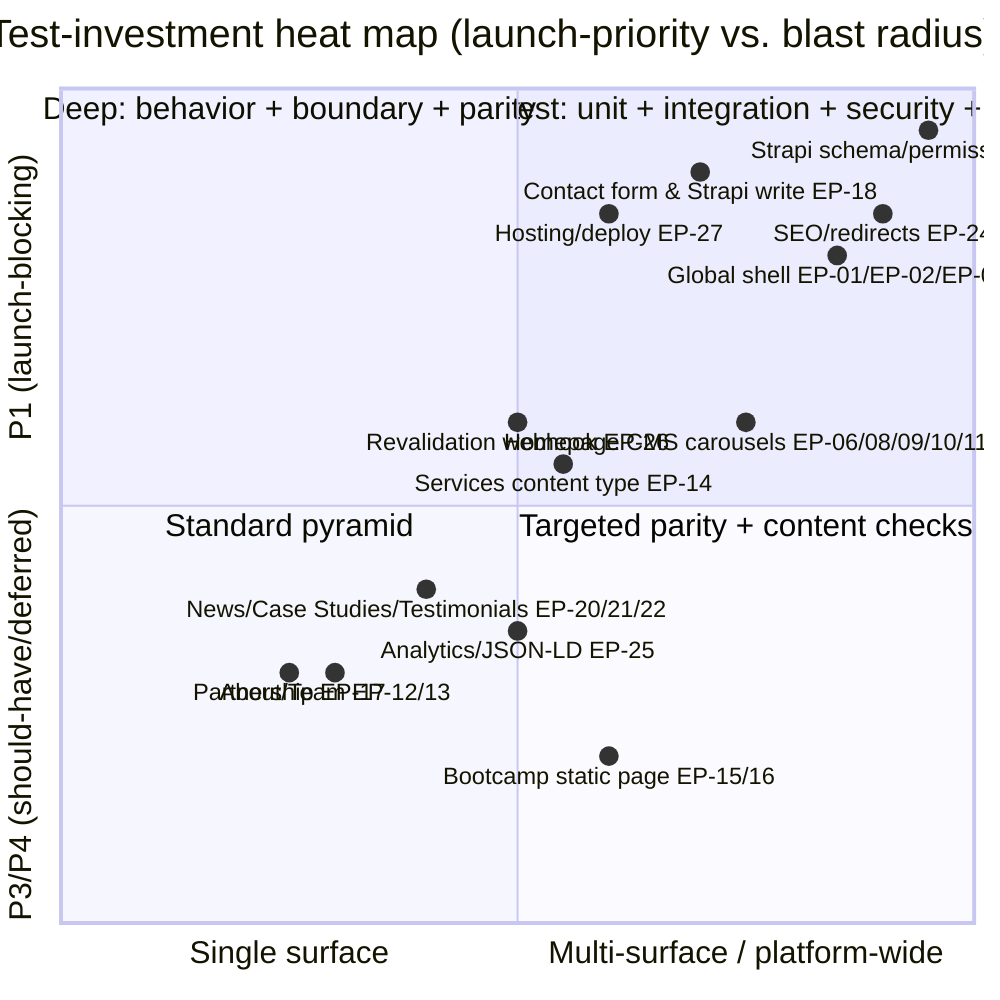
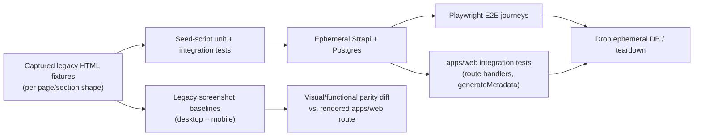

# TS-000 — Master Test Strategy

> **Producer:** QA / Test-Architect agent (strategic quality authority — test strategy, layering, gates, coverage; **no application or test code**).
> **System under test:** TrieDatum marketing website modernization — static Themeholy (Bootstrap 5 + jQuery) HTML site (23 pages, `mail.php`, no data layer, no build, no tests) → **`TDWebsite2`**: Next.js 14 App Router (`apps/web`, SSG+ISR) + Strapi v5/TypeScript (`apps/cms`) + PostgreSQL, npm-workspaces monorepo with `packages/shared` (typed REST client) and `packages/seed` (cheerio HTML→Strapi ETL), deployed to a single Hostinger VPS (Nginx + PM2) behind Cloudflare.
> **Inputs:** [`../A01-2-REQUIREMENTS/`](../A01-2-REQUIREMENTS/) (27 Epics / 80 Stories, Gherkin AC, P1–P4 priority scale) and the target repo's `docs/architecture.md`, `docs/migration-map.md`, `docs/content-model.md`.
> **Downstream consumers:** the engineering agents building `apps/web`, `apps/cms`, `packages/seed`, and `infra/`, each building **test-first** against these plans; the `parity-auditor` agent, which independently confirms visual/functional parity per story.
> **Framing:** `TDWebsite2` has **no test runner installed today** (`apps/web/package.json` and `apps/cms/package.json` list no Vitest/Jest/Playwright dependency). This strategy specifies the pyramid, tooling, and gates to be **stood up as the migration is built** — it is not a report on an existing suite.

---

## 1. Purpose & how to read this set

This document is the governing test strategy. It defines *how* the modernization is verified: the test pyramid adapted to a headless-CMS + SSG/ISR marketing site, the test types per architectural layer, the mandatory visual+functional parity check (unique to a lift-and-shift migration), the environment and test-data strategy, the CI/CD quality gates, and the risk-based prioritization that decides where to spend test effort. The per-section plans (TS-001…TS-009) and the cross-cutting strategies (TS-010 NFR, TS-011 Security, TS-012 Content-Migration Fidelity) inherit everything here; they specify *what* to test for each Epic/Story.

| Document | Scope | Epics |
|---|---|---|
| **TS-000** (this) | Master strategy, pyramid, gates, environments, data, tooling | all |
| [TS-001](TS-001-global-shell-navigation-and-footer.md) | Global Site Shell, Navigation & Footer | EP-01–EP-03 |
| [TS-002](TS-002-homepage.md) | Homepage | EP-04–EP-11 |
| [TS-003](TS-003-about-and-team.md) | About & Team | EP-12–EP-13 |
| [TS-004](TS-004-services.md) | Services | EP-14 |
| [TS-005](TS-005-ai-bootcamp.md) | AI Bootcamp | EP-15–EP-16 |
| [TS-006](TS-006-partnership.md) | Partnership | EP-17 |
| [TS-007](TS-007-contact-and-lead-capture.md) | Contact & Lead Capture | EP-18–EP-19 |
| [TS-008](TS-008-news-case-studies-and-testimonials.md) | News, Case Studies & Testimonials | EP-20–EP-22 |
| [TS-009](TS-009-cms-seo-and-platform.md) | CMS Platform, SEO, Redirects, Analytics & Hosting | EP-23–EP-27 |
| [TS-010](TS-010-nfr-performance-and-accessibility.md) | Performance & accessibility (Core Web Vitals, WCAG) | NFR |
| [TS-011](TS-011-security-and-privacy.md) | Strapi permissions, spam, revalidate-secret gating | EP-23-S2/S3, EP-18, EP-26-S1 |
| [TS-012](TS-012-content-migration-fidelity.md) | Seed/ETL idempotency, SEO uniqueness, redirect completeness | EP-24, packages/seed |
| [TS-COVERAGE](TS-COVERAGE-test-coverage-matrix.md) | Coverage evidence — every Epic/Story → covering plan(s) | all |

---

## 2. Quality objectives (what "done" means for QA)

1. **Zero regression, zero traffic/ranking loss.** Every one of the 23 legacy URLs 301s to its correct new route (TS-009/TS-012); GA4 keeps firing under the same property ID with no gap (TS-009 §EP-25).
2. **Visual + functional parity, desktop and mobile.** Per the requirements' Definition of Done, every ported page/section is confirmed by `parity-auditor` against the legacy page at both breakpoints — this is a **per-story gate**, not a one-time site-wide audit (§4.3).
3. **Content correctness over two authoring paths.** Every Strapi-driven surface (homepage carousels, `/services`, `/partnership`, `/case-studies`, `/news`, `/testimonials`) renders the seeded content faithfully, and editing that content in Strapi propagates to every consuming surface (homepage teaser + detail page) without drift (TS-004, TS-006, TS-008).
4. **Security by construction.** The Strapi Public role is exactly as wide as required (`find`/`findOne` on published editorial types, `create`-only on `contact-submission`, never `update`/`delete` anywhere) — verified independently of the UI (TS-011).
5. **Migration fidelity.** `packages/seed` is idempotent, every generic/duplicated legacy SEO string is replaced with a unique value, and every preserve-or-retire / content-owner-decision item surfaced during requirements analysis is **recorded as a decision**, never silently resolved by code (TS-012, TS-COVERAGE §6).
6. **Traceability.** Every one of the 80 Stories maps to ≥1 named test layer/scenario (TS-COVERAGE).

---

## 3. The test pyramid — applied to a headless-CMS, SSG/ISR marketing site

The standard pyramid (unit-heavy, few E2E) holds, but the **layers are instantiated differently per architectural plane** because `apps/web` (Next.js Server/Client Components), `apps/cms` (Strapi schema/permissions/lifecycle hooks), and `packages/seed` (one-time ETL) have different units of work and failure modes. **Fix every defect at the lowest layer that can express it**: a wrong `slug` derivation is a unit failure, never an E2E failure; a wrong Public-role permission is an integration/security failure, never a "the button was hidden in the UI" fix.

### 3.1 Layer definitions and where each lives

| Layer | `apps/web` (Next.js) | `apps/cms` (Strapi) | `packages/seed` / `packages/shared` |
|---|---|---|---|
| **Unit** (<50ms, fast, isolated) | React component rendering/props/state (Vitest + React Testing Library): `ServiceExpandButton`, `HeroSlider` slide data, `MobileMenu` open/close state, contact-form client validation + honeypot, redirect-map lookup function, JSON-LD builder pure function, `stroke-dashoffset` scroll-progress math. | Schema field validators, lifecycle-hook payload builder (pure function, mocked `strapi` global), slug/uid generation edge cases. | `cheerio` HTML-extraction functions tested against fixture HTML snippets (one fixture per legacy page family); idempotent-upsert-by-slug logic; `packages/shared` typed client's request/response mapping functions. |
| **Integration** (<1s, real or ephemeral dependency) | API route handlers (`/api/contact`, `/api/revalidate`) against a real or Testcontainers-run Strapi instance; `generateStaticParams`/`generateMetadata` against seeded fixture content. | Strapi's own integration-test conventions (Jest + `supertest` against a running Strapi instance with SQLite/Postgres): Public-role permission matrix per content type, `draftAndPublish` filtering, lifecycle-hook firing on create/update/delete. | Full seed script run against an ephemeral Strapi + Postgres (docker-compose or Testcontainers): idempotent re-run, validation-error handling, dead-code/discrepancy logging. |
| **Contract** (<2s) | `packages/shared`'s generated types vs. Strapi's actual REST response shape (schema/JSON-Schema assertion) for every content type; `shared.seo`/`shared.link`/`shared.social-link` component shape; `/api/contact` and `/api/revalidate` request/response schemas. | Strapi content-type schema itself is the contract producer — verified by the same assertion from the `apps/web` side. | — |
| **E2E / solution** (<60s/flow, Playwright) | Full-stack journeys against a locally-running `apps/web` + `apps/cms` + Postgres: visitor fills and submits the contact form and a `contact-submission` appears in Strapi; a Content Editor publishes a case study and it appears on `/case-studies` and the homepage carousel after revalidation; a legacy URL 301-chain resolves to a live page. | — | — |
| **Visual + functional parity** (desktop + mobile) | Playwright screenshot/DOM-structure comparison of each migrated route against a legacy-site baseline capture, at the Bootstrap breakpoints the legacy CSS defines (notably 992px); `parity-auditor` agent sign-off per story, feeding the Definition of Done gate. | — | — |

### 3.2 Layer-selection rule (decision tree)

> **Pyramid enforcement.** An E2E test is admitted only when the behavior genuinely spans systems (visitor → API → Strapi → notification email; editor → lifecycle hook → revalidate → regenerated page). Form validation, permission decisions, slug derivation, and redirect-map correctness are unit/integration/contract obligations, never E2E-only.

---

## 4. Test types beyond the pyramid (cross-cutting)

| Type | What it verifies | Primary home | Detail in |
|---|---|---|---|
| **Visual + functional parity (desktop + mobile)** | Ported page/section matches the legacy page's layout, copy, and interaction behavior at both breakpoints — the requirements' explicit Definition-of-Done gate on every story. | All page-specific plans | TS-001…TS-008, §4.3 below |
| **Content-fidelity / CMS-drift tests** | A Strapi edit to shared content (service, testimonial, footer address) propagates identically to every consuming surface (teaser + detail page; footer + contact-page chrome) with no independently-hard-coded duplicate. | TS-002 (services/testimonials), TS-004, TS-006, TS-007 | per-plan |
| **Redirect-coverage tests** | All 23 legacy `.html` URLs (7 static + 4 news + 10 case studies + 2 testimonials) 301, none 404 or 302. | TS-009, TS-012 | TS-012 §2 |
| **SEO-metadata-uniqueness tests** | No two pages share an identical `metaTitle`; none equals the legacy generic string; canonical + OG triple present on every page. | TS-009 | TS-012 §3 |
| **Idempotency tests** | Re-running `packages/seed` against an already-seeded instance upserts by slug, never duplicates. | TS-012 | TS-012 §1 |
| **Preserve-or-retire / decision-flag tests** | A discrepancy found during analysis (case8 orphan, Cognition partner asset, Raj/Rajesh bio, AI-Enabled Migrations' missing case-study link, `about.html`'s dead hero block) is asserted to be **logged and pending an explicit decision**, not silently resolved either way by the shipped code. | Every plan that owns a flagged item | TS-COVERAGE §6 |
| **Security / permission tests** | Public-role matrix exactly matches spec; honeypot + server-side validation reject spam; `/api/revalidate` rejects an incorrect/missing secret. | TS-011 | TS-011 |
| **Performance / accessibility tests** | Core Web Vitals budgets; WCAG 2.1 AA checks (axe-core), keyboard navigation, `aria-expanded`/labels on interactive widgets. | TS-010 | TS-010 |
| **Resilience / graceful-degradation tests** | Missing images, unreachable Strapi at build/request time, failed Resend calls, missing env vars — each degrades gracefully, never a 500 or a crashed build. | Every page-specific plan | per-plan |

### 4.3 Why parity is a first-class, per-story test type here

Unlike a typical greenfield build, this migration's primary risk is **regression from a known-good legacy baseline**, not net-new correctness. Every Story's Definition of Done requires `parity-auditor` sign-off at desktop *and* mobile. This strategy therefore treats visual+functional parity as its own pyramid rung (§3), sitting between contract and E2E: cheap enough to run per-route on every PR (screenshot diff against a captured legacy baseline), but distinct from unit-level component tests because it asserts the *composed* page, not an isolated component.

---

## 5. Risk-based prioritization

Test depth follows the requirements' own **P1–P4 priority scale** (§8 of `00-overview-and-architecture.md`) combined with **blast radius** — how many pages/surfaces a defect would affect, since this site's dominant duplication-elimination pattern (one Strapi collection feeding N surfaces) means a schema or seed defect propagates everywhere at once.

**Tier 1 (P1, deepest coverage — unit + integration + security + E2E + parity):** EP-23 Strapi content modeling & permissions, EP-18 contact form & Strapi write, EP-24 SEO/redirects, EP-01/EP-02/EP-03 global shell (every route depends on it), EP-27 hosting/deploy, EP-04/EP-06/EP-11 homepage hero/services/case-studies carousels, EP-14 services content type, EP-25-S1 GA4 continuity.
**Tier 2 (P2, full behavioral + boundary + parity):** EP-05/EP-07/EP-08/EP-09/EP-10 remaining homepage sections, EP-12/EP-13 About & Team, EP-17 Partnership, EP-19 contact chrome, EP-20/EP-21 News & Case Studies collections, EP-26 revalidation webhook, EP-25-S2 JSON-LD.
**Tier 3 (P3, standard pyramid):** EP-22 Testimonials, EP-27-S5 (designed-not-active CI).
**Tier 4 (P4, documented-deferred — verify the *deferral is documented*, not the feature):** EP-18-S5 Turnstile, EP-15-S4's deferred `bootcamp-program` collection type.

---

## 6. Environments & test data strategy

### 6.1 Environments

| Tier | Compute / store | Used by |
|---|---|---|
| **Local / CI unit** | Vitest + RTL for `apps/web`; Strapi's Jest conventions with SQLite for `apps/cms` — no network, no shared state | unit, most contract |
| **Ephemeral integration** | `apps/cms` + a throwaway PostgreSQL (Testcontainers or docker-compose), seeded with a small fixture set per content type | integration, permission-matrix, seed-idempotency |
| **Local solution stack** | `apps/web` (`next dev`/`next build && next start`) + `apps/cms` (`strapi develop`) + PostgreSQL, all seeded via `packages/seed` against fixture HTML | E2E, visual/functional parity, redirect-coverage |
| **Staging (Hostinger VPS staging slice or a pre-prod droplet)** | Prod-shaped: Nginx + PM2 + PostgreSQL, real domain/TLS | full Lighthouse/perf runs, DoD sign-off ("all Gherkin AC pass in staging"), final redirect-coverage sweep against real DNS |

### 6.2 Test-data principles

- **Legacy HTML fixtures, not synthetic data, for seed/ETL tests.** `packages/seed`'s unit and integration tests run against captured snapshots of the actual legacy pages (`index.html`, `service.html`, `case-study/case1..10.html`, etc.) checked into a fixtures directory — the whole point of the ETL is faithfully parsing *this specific* legacy markup, so synthetic HTML would not exercise the real parsing risk (empty `<li>` spacing hacks, dead commented-out blocks, generic duplicated `<title>` strings, the `subject`→`company` field-name quirk).
- **One fixture set per structurally-distinct content shape.** News articles are not uniform (gallery vs. plain-narrative vs. program-cards-plus-CTA vs. zero-image) — each of the 4 shapes needs its own fixture, not one generic "news article" builder.
- **Deterministic seeds; no unseeded randomness.** Slug generation, `order` fields, and JSON-LD output must be deterministic given the same input HTML, so re-running the seed script (idempotency tests) and comparing JSON-LD to rendered card counts (EP-16) are exact-match assertions, not fuzzy ones.
- **Real legacy screenshots as the parity baseline.** Before any page is ported, a reference screenshot (desktop + mobile) of the live legacy page is captured and stored as the golden baseline for that route's visual/functional parity test — analogous in spirit to a golden-master but for pixels/DOM structure rather than financial output.
- **Boundary-first fixtures per known discrepancy.** Each flagged preserve-or-retire item ships a fixture that reproduces the exact discrepancy (e.g. a `case-study` entry seeded with the legacy generic title, to prove the draft-gate blocks its publish; a `partner` seed run against asset data containing the orphaned `Cognition.png` reference, to prove it is *not* silently created).
- **Isolation / cleanup.** Integration tests against Strapi run against a uniquely-named ephemeral database dropped on teardown; no test-order dependency; no shared mutable Strapi instance across parallel CI jobs.

### 6.3 Test-data flow

---

## 7. CI/CD quality gates

`TDWebsite2` has no CI pipeline active yet (`infra/github/deploy.yml` is designed but not copied into `.github/workflows/`, per EP-27-S5) and no test runner installed. This section specifies the gates to add as both are stood up.

| Gate | Threshold | Stage | Source |
|---|---|---|---|
| Typecheck / lint | clean (`tsc --noEmit`, `next lint`, Strapi's TS build) | pre-commit / CI verify job | requirements DoD |
| Unit test coverage | target set per touched surface in each TS-0XX plan (new-code lines) | CI | requirements DoD ("Unit test coverage meets the target in TS-000 §2") |
| Integration + contract layers pass | all green | CI (pre-merge) | this doc §3 |
| Redirect-coverage check | all 23 legacy URLs 301, 0 fall through to 404 | CI + staging sweep | TS-009, TS-012 |
| SEO-uniqueness check | no duplicate `metaTitle` across content-backed routes; none equal the legacy generic string | CI (build-time script) | TS-012 |
| Seed idempotency check | re-running `packages/seed` against an already-seeded instance produces zero duplicate entries | CI batch job | TS-012 |
| Public-permission audit | Public role matrix matches the spec table in TS-011 exactly (no unexpected `update`/`delete`, no read on `contact-submission`) | CI (Strapi integration test) | TS-011, EP-23-S2/S3 |
| Visual + functional parity | `parity-auditor` sign-off recorded per story, desktop + mobile | pre-merge (per story) | requirements DoD |
| Accessibility scan | zero critical/serious axe-core violations on touched routes | CI | TS-010 |
| Performance budget | Lighthouse CI scores within TS-010 budgets on touched routes | CI (or pre-staging gate) | TS-010 |
| Security scan | no CRITICAL/HIGH findings from Standards/Security scan | CI + Security review | requirements DoD |
| Preserve-or-retire flags | every flagged discrepancy has a corresponding logged entry in `docs/content-model.md`/`SOURCE-COVERAGE.md` before the owning story is marked done | manual + CI doc-presence check | TS-COVERAGE §6 |
| Branch protection | no direct push to `main`/`production` | pre-push | requirements DoD |

**Entry criteria (to start testing a Story):** its Gherkin AC and component/content-type list (doc 01/02 of the requirements) are available; if it's CMS-driven, the owning Strapi schema exists; if it involves seeding, a legacy-HTML fixture is captured.
**Exit criteria (to accept a Story):** all 3 Gherkin AC scenarios (happy/failure/edge) pass at their designated layer(s); parity confirmed at desktop+mobile; any preserve-or-retire item the story owns is logged; the requirements' full Definition of Done checklist is satisfied.

---

## 8. Tooling (recommended; implemented by the engineering agents)

> The Test-Architect specifies *what* to test and at which layer. Concrete frameworks are recommendations grounded in the actual stack (`apps/web/package.json`, `apps/cms/package.json`); substitutions are fine if they meet the gate thresholds. **The Test-Architect does not write test code.**

| Plane / concern | Recommended | Notes |
|---|---|---|
| `apps/web` component unit tests | **Vitest** + **React Testing Library** | Next.js 14/App Router-compatible; matches the existing `tsc --noEmit`/`next lint` toolchain already in `package.json` |
| `apps/web` API routes (unit + integration) | Vitest + `next`'s route-handler test utilities, or `supertest` against a locally-run `next start` | `/api/contact`, `/api/revalidate` |
| `apps/cms` schema/permission/lifecycle tests | Strapi's own **Jest**-based testing conventions (`@strapi/strapi` test utils) + `supertest` | keep `apps/cms`'s test tooling inside its own `node_modules` boundary — do **not** hoist test deps that could reintroduce the `ajv@6`/`ajv@8` collision documented in EP-27-S2 |
| Contract assertions | JSON-Schema / Zod validation of Strapi REST responses against `packages/shared`'s generated types | one schema per content type + `shared.seo`/`link`/`social-link` |
| `packages/seed` ETL unit + integration tests | Vitest (unit, parsing functions against fixture HTML with `cheerio`) + integration run against Testcontainers Strapi+Postgres | fixtures are real captured legacy HTML, not synthetic (§6.2) |
| E2E / solution journeys | **Playwright** | run against `next build && next start` + `strapi start` + Postgres, seeded fixture data |
| Visual + functional parity | Playwright screenshot comparison (`toHaveScreenshot`) at legacy breakpoints (notably 992px) against captured legacy baselines; `parity-auditor` agent reviews and signs off | desktop + mobile per story |
| Accessibility | **axe-core** via `@axe-core/playwright` | WCAG 2.1 AA target, see TS-010 |
| Performance | **Lighthouse CI** | Core Web Vitals budgets, see TS-010 |
| Redirect-coverage / SEO-uniqueness checks | small Node scripts run in CI against the built `next.config.js` redirect map and generated sitemap | TS-009, TS-012 |
| Coverage reporting | Vitest's built-in `--coverage` (`v8`/`istanbul`) | per-package thresholds set in each TS-0XX plan |

---

## 9. Test design conventions (apply in every TS-0XX plan)

- **Naming:** `[unit]_[scenario]_[expectedOutcome]`, e.g. `slugDerivation_multiWordName_producesHyphenatedSlug`, `honeypot_populated_rejectsSilently`.
- **AAA structure**, one behavior per test, deterministic, no arbitrary `sleep`/timeouts (use Playwright's built-in waiting), no test-order dependency, no shared mutable state.
- **Every Story contributes ≥3 scenarios** mirroring its Gherkin AC: happy / failure / edge-boundary — this is already the requirements' own authoring convention (§7 of `00-overview-and-architecture.md`), so each plan's test matrix maps 1:1 onto the AC already written rather than inventing new scenario shapes.
- **Preserve-or-retire scenarios assert the flag, not a disposition.** Where a story's AC includes an "edge/boundary: discrepancy is logged, not silently resolved" scenario, the corresponding test asserts that a documented entry exists and that the code ships a safe default *pending* the decision — never that a particular resolution was correct.
- **Test observable behavior, not implementation.** Assert rendered DOM, returned API status/body, persisted Strapi records, or emitted redirect/JSON-LD output — never internal call order. Don't duplicate the same assertion at every pyramid layer (e.g. "money is decimal"-style invariants in the reference domain map here to "no two pages share a `metaTitle`" — asserted once, centrally, in TS-012, not re-asserted per page).
- **Each plan carries a per-component/per-story test matrix** (Story → layers → key scenarios → any preserve-or-retire flag it owns) and a traceability stub that rolls up into TS-COVERAGE.

---

## 10. Assumptions, open risks & their test impact

| Risk | Test-strategy handling |
|---|---|
| No test runner is installed in either `apps/web` or `apps/cms` today | This strategy's §7/§8 double as the initial tooling-adoption plan; the first engineering PR that touches a testable surface should add the relevant runner rather than deferring indefinitely. |
| Several content discrepancies are pending content-owner sign-off (case8, Cognition, Raj/Rajesh, AI-Enabled Migrations' case-study link, the disabled About-page hero block) | Tested as **flagged, not gaps** — see §4 and TS-COVERAGE §6. Launch sign-off requires the flag to be *recorded*, not requires the decision to already be made, except where the story's own DoD explicitly blocks on it (e.g. EP-21-S4's case8 disposition is a stated launch blocker). |
| Turnstile bot protection and the `bootcamp-program` collection type are intentionally deferred (P4) | Tested for "deferral is documented and discoverable," not for the deferred feature itself (§5 Tier 4). |
| `apps/cms`'s dependency isolation (the `ajv@6`/`ajv@8` hoist conflict, EP-27-S2) is a real, previously-encountered failure mode | Any new dev/test dependency added to `apps/cms` must be verified not to reintroduce the collision — a regression check belongs in TS-009's EP-27 test matrix. |
| CI pipeline is designed but not active (`infra/github/deploy.yml`, EP-27-S5) | Tests for this story assert the YAML is valid and the *documented status* is "designed, not active" — not that it runs automatically. |
| Redirect map for 5 case studies depends on titles not yet finalized by a Content Editor (EP-21-S1/S3) | Redirect-coverage tests must tolerate a "pending slug" state without ever emitting a permanent 301 to a slug still subject to change (per EP-21-S3's own AC). |

---

## 11. Roles, hand-offs & responsibilities

| Activity | Owner |
|---|---|
| Test strategy, layering, gates, coverage evidence (this set) | **QA / Test-Architect** (this agent) |
| Test **code** implementation, fixtures, running suites | Engineering agents (`next-porter`/`feature-builder`, `strapi-modeler`/`cms-extender`, `content-migrator`) — test-first against these plans |
| Visual + functional parity sign-off | **`parity-auditor`** agent (desktop + mobile, per story) |
| Standards/Security scan | Standards or Security review, per the requirements DoD |
| Content-owner decisions on flagged discrepancies | Content owner / Site Administrator persona — tracked in TS-COVERAGE §6 |
| Deployment/CI activation | `deploy-engineer` agent (EP-27) |

---

_Next: per-section plans TS-001…TS-009, cross-cutting TS-010…TS-012, then the TS-COVERAGE matrix._
