# TS-001 — Test Plan: Global Site Shell, Navigation & Footer (EP-01–EP-03)

> **Inherits:** [TS-000 Master Strategy](TS-000-master-test-strategy.md).
> **Requirements source:** [`01-global-shell-navigation-and-footer.md`](../A01-2-REQUIREMENTS/01-global-shell-navigation-and-footer.md).
> **Components:** `SEC-HEADER`, `SEC-MOBILE-MENU`, `SEC-FOOTER`, `SEC-PRELOADER`, `SEC-SCROLLTOP`, `SEC-ANALYTICS`, `CMS-GLOBAL`.
> **Why this plan matters most:** every route in `apps/web` renders this chrome exactly once via the root layout — a defect here has the largest blast radius on the site (TS-000 §5, Tier 1).
> **Risk tier:** EP-01 (nav) = Tier 1; EP-02 (footer/`global`) = Tier 1; EP-03 (preloader/scroll-top/GA4) = Tier 1 (GA4), Tier 2 (preloader/scroll-top).

---

## 1. Target requirements

- **EP-01** Global Site Header & Navigation (S1 desktop nav, S2 mobile off-canvas menu, S3 shared Case Studies dropdown, S4 sticky/absolute header scroll).
- **EP-02** Global Footer & Site Settings / Strapi `global` single type (S1 schema+seed, S2 address line-break rendering, S3 nav links + social icons, S4 copyright line).
- **EP-03** Shared Page Chrome (S1 preloader + guaranteed-clear safeguard, S2 scroll-to-top progress circle, S3 GA4 tag).

## 2. Testing topology

```mermaid
flowchart LR
    subgraph U["UNIT"]
        u1["SiteHeader/MobileMenu render\nidentical shared link array"]
        u2["breakpoint boundary logic (992px)"]
        u3["PreloaderKiller timeout/error-boundary logic"]
        u4["scroll-progress stroke-dashoffset math\n(incl. zero-scroll guard)"]
        u5["global schema field mapping\n(usAddress \\n handling)"]
    end
    subgraph I["INTEGRATION"]
        i1["SiteFooter ← CMS-GLOBAL fetch\n(packages/shared)"]
        i2["seed script → global single type\n(idempotent upsert)"]
        i3["Strapi validation on shared.link/\nshared.social-link sub-fields"]
    end
    subgraph C["CONTRACT"]
        c1["CMS-GLOBAL response shape\nvs packages/shared types"]
    end
    subgraph V["VISUAL/PARITY"]
        v1["header transparent→sticky transition\ndesktop+mobile"]
        v2["off-canvas menu open/close, no ghost DOM"]
        v3["footer address/link/copyright layout"]
    end
    subgraph E["E2E"]
        e1["full nav across 5+ routes,\nactive-state + breakpoint behavior"]
    end
    U --> I --> C --> V --> E
```

## 3. Per-story test matrix

| Story | Layers | Key scenarios (happy / failure / edge) | Notes |
|---|---|---|---|
| EP-01-S1 (desktop nav) | U, V, E | **H:** SiteHeader renders identical ordered link set on every route, active-route indicator correct. **F:** a nav link target route missing → Next.js build fails (compile-time route check), not a silent 404 — asserted as a build-step test, not a runtime one. **E:** exactly at 992px, desktop nav shown / hamburger hidden; below, reversed; no flash-of-both-menus during hydration. | One shared link-array fixture consumed by both S1 and S2 tests to prevent drift. |
| EP-01-S2 (mobile off-canvas) | U, V, E | **H:** hamburger opens panel with full link parity incl. Case Studies trigger; background scroll locked. **F:** rapid double-toggle ends in one consistent state, no duplicate panel/backdrop in DOM. **E:** closing via link/backdrop/× all unlock scroll identically; link-click additionally navigates after close. | Assert DOM node count for panel/backdrop after toggling, not just visual state. |
| EP-01-S3 (Case Studies dropdown) | U, V, E, A11Y | **H:** both desktop and mobile dropdown render the identical 9-item list (case8 excluded — see TS-008 EP-21-S4 cross-reference), same shared data array. **F:** a 10th case-study entry published in Strapi does not appear (dropdown is intentionally hard-coded) — asserted as expected, not a defect. **E:** keyboard Tab+Enter opens dropdown and focuses first link; mobile tap expands in place without closing the panel. | Cross-reference: this dropdown's exclusion of case8 must stay consistent with whatever disposition EP-21-S4 records (TS-008); if that decision promotes case8 site-wide, this test's expected list must be updated in lockstep. |
| EP-01-S4 (sticky header scroll) | U, V | **H:** header transparent/absolute at top, gains sticky/opaque class + fixed position past threshold. **F:** a page shorter than viewport height never errors (no scroll-listener exception logged). **E:** rapid scroll-direction changes across the threshold toggle cleanly (debounced), no visible flicker. | Debounce/throttle behavior asserted via controlled synthetic scroll events, not real-time waits. |
| EP-02-S1 (`global` schema+seed) | U, I, C | **H:** every legacy `footer_content.json` field has a corresponding populated `global` field after seeding; nothing dropped. **F:** re-running the seed script against an already-populated `global` entry upserts (never duplicates — single types physically cannot duplicate, but the script must not silently clobber a manual admin edit without `--force`) and logs created/updated/skipped. **E:** a `shared.social-link` entry saved with no `url` is rejected by Strapi's own validation; other valid entries unaffected. | Idempotency assertion reused from TS-012 §1's general seed-idempotency harness. |
| EP-02-S2 (address line-break rendering) | U, V | **H:** multi-line `usAddress`/`indiaAddress` with embedded `\n` renders as multiple visual lines via `white-space: pre-line`. **F:** an emptied `indiaAddress` field renders that block omitted/empty without throwing; `usAddress` unaffected. **E:** a single-line address (no `\n`) renders with no extra blank-line artifact from the CSS rule. | Pure rendering-logic unit test plus a visual snapshot for the CSS-artifact edge case. |
| EP-02-S3 (footer links/social from CMS) | U, I, V | **H:** all 5 `footerLinks` + 1 `social` entry render in order with correct hrefs, including the case-studies hash-anchor. **F:** an entry with an empty `href` renders inert/skipped, never a reload-current-page `<a href="">`. **E:** adding/reordering a 6th link in Strapi is reflected after revalidation with no code change. | Integration test seeds `global` with a deliberately empty-href link to assert the guard. |
| EP-02-S4 (copyright line) | U, I | **H:** `copyrightYear`+`siteName` render as "© 2026 TrieDatum" with icon+homepage link owned by the template, not raw-HTML injection. **F:** editing `copyrightYear` in Strapi and firing the revalidation webhook updates the live footer without a redeploy; if the webhook fails, the ISR timer fallback still updates it (cross-ref TS-009 EP-26). **E:** a `global` entry with no `copyrightYear` falls back to the schema default (2026), no blank/undefined year. | Confirms the legacy raw-HTML-injection XSS-adjacent pattern is *not* reproduced — template owns markup, CMS owns only year/name. |
| EP-03-S1 (preloader) | U, V | **H:** letter-by-letter animation shows, then clears once critical content is ready. **F:** a hung non-critical resource still triggers PreloaderKiller's max-duration force-removal; page remains interactive. **E:** a JS error elsewhere during load doesn't block preloader removal (timeout safeguard fires independently); error is logged, not swallowed silently. | This story explicitly fixes a legacy defect (indefinite stuck-preloader risk) — the failure/edge scenarios *are* the regression tests for that fix. |
| EP-03-S2 (scroll-to-top) | U, V | **H:** SVG `stroke-dashoffset` tracks scroll % correctly; click smooth-scrolls to top. **F:** a page with no scrollable overflow renders hidden/inert, never NaN/divide-by-zero in the offset calc. **E:** rapid scroll events are throttled; final resting value still accurate. | Unit-test the offset formula directly against a matrix of `scrollY`/document-height inputs including the zero-height edge case. |
| EP-03-S3 (GA4 tag) | U, E | **H:** `gtag.js` loads once via root layout/`next/script`, fires with measurement ID `G-HP0RJZ369Q` on every route. **F:** GA4 script blocked/failing does not throw or block page render. **E:** client-side Next.js route transitions still fire a pageview-equivalent event (App Router does not auto-refire third-party scripts on client nav — this must be explicitly wired). | Cross-reference TS-009 EP-25-S1, which owns the platform-wide continuity assertion; this story owns the chrome-level single-instance-per-route check. |

## 4. Boundary & negative fixtures (mandatory)

- **Breakpoint boundary:** viewport widths 991px/992px/993px for the desktop/mobile nav swap (EP-01-S1/S4).
- **Scroll-progress boundary:** `scrollY = 0`, `scrollY = documentHeight - viewportHeight` (100%), and `documentHeight === viewportHeight` (no scroll possible) for EP-03-S2.
- **Global-entry boundary:** `global` seeded with zero `footerLinks`, exactly 5, and 6+ to prove the footer never assumes a fixed count.
- **Idempotent-seed boundary:** run the `global` seed script 0 times / 1 time / 2 times consecutively and assert exactly one entry each time.

## 5. Defect-fix verification (deliberately changed from legacy)

| Legacy behavior/defect | Verification |
|---|---|
| Hand-duplicated nav/mobile-menu markup across ~24 files (any change = 24 manual edits) | Single `SiteHeader`/`MobileMenu` component instance rendered by the root layout — asserted by a static check that no second copy of the nav markup exists anywhere under `apps/web/app`. |
| Preloader could stick indefinitely on a hung resource or thrown error | EP-03-S1 failure/edge scenarios above are the explicit regression tests. |
| Footer client-side fetch-and-inject (`load-footer.js`) with no server-rendering | `SiteFooter` is asserted to be a Server Component reading `global` at render/revalidate time, not a client-side `fetch` — no flash-of-unstyled/empty footer on load. |
| Copyright line injected as raw HTML from the CMS field | EP-02-S4's edge scenario proves the template, not CMS-supplied HTML, owns the surrounding markup. |

## 6. Testability issues to escalate

- **Sticky-header scroll threshold value** (exact pixel offset) should be confirmed against the legacy CSS/JS before the debounce boundary test can assert an exact trigger point rather than "somewhere past the top."
- **PreloaderKiller's maximum-duration timeout value** needs a concrete number from the Front-End Engineer implementing EP-03-S1 before the failure-scenario test can assert a precise upper bound.

## 7. Traceability stub (rolls up to TS-COVERAGE)

| Story | Covered by |
|---|---|
| EP-01-S1 | desktop nav unit + parity + E2E breakpoint |
| EP-01-S2 | mobile menu unit + parity + E2E toggle-state |
| EP-01-S3 | dropdown unit + parity + a11y keyboard/touch |
| EP-01-S4 | scroll-listener unit + parity |
| EP-02-S1 | schema/seed unit + integration + contract |
| EP-02-S2 | address rendering unit + parity |
| EP-02-S3 | footer links/social integration + parity |
| EP-02-S4 | copyright integration (revalidation) + unit fallback |
| EP-03-S1 | preloader unit + parity (defect-fix verification) |
| EP-03-S2 | scroll-to-top unit + parity |
| EP-03-S3 | GA4 unit + E2E route-transition |
