# TS-002 — Test Plan: Homepage (EP-04–EP-11)

> **Inherits:** [TS-000 Master Strategy](TS-000-master-test-strategy.md).
> **Requirements source:** [`02-homepage.md`](../A01-2-REQUIREMENTS/02-homepage.md).
> **Components:** `PAGE-HOME`, `SEC-HERO`, `SEC-ABOUT-TEASER`, `SEC-SERVICES`, `SEC-STATS`, `SEC-NEWS`, `SEC-TESTIMONIALS`, `SEC-PARTNERS`, `SEC-CASE-STUDIES`, `CMS-SERVICE`, `CMS-NEWS-ARTICLE`, `CMS-TESTIMONIAL`, `CMS-PARTNER`, `CMS-CASE-STUDY`.
> **Risk tier:** EP-04 hero, EP-06 services, EP-11 case studies = Tier 1 (highest homepage blast radius/CMS-drift risk). EP-05, EP-07, EP-08, EP-09, EP-10 = Tier 2.

---

## 1. Target requirements

- **EP-04** Homepage Hero Slider (S1 six-slide content/order, S2 per-slide CTA hrefs, S3 GSAP/ScrollTrigger entrance timing).
- **EP-05** Homepage About Teaser (S1 static section, S2 cross-page copy consistency with About's "Our Story").
- **EP-06** Homepage Services Carousel (S1 CMS-driven 4-card Swiper, S2 isolated expand/collapse client component).
- **EP-07** Homepage Stats Counters (S1 count-up-on-scroll animation, S2 exact values/labels).
- **EP-08** Homepage News Marquee & Grid (S1 seamless-loop ticker, S2 4-card grid from `news-article`).
- **EP-09** Homepage Testimonials Carousel (S1 CMS-driven Swiper, S2 formatting/equal-height parity).
- **EP-10** Homepage Partner Logo Strip (S1 CMS-driven strip + stale-record pruning, S2 uniform link-through).
- **EP-11** Homepage Case Studies Carousel (S1 9-of-10 order from `case-study`, S2 "View All" → real `/case-studies`).

## 2. Testing topology

```mermaid
flowchart LR
    subgraph U["UNIT"]
        u1["HeroSlider slide data + href map"]
        u2["ServiceExpandButton local state\n(per-card isolation)"]
        u3["StatsCounter animate-once guard\n+ already-in-viewport case"]
        u4["NewsMarquee duplication technique\n(no JS re-render loop)"]
        u5["PartnerMarquee data mapping\n(no stray Cognition entry)"]
    end
    subgraph I["INTEGRATION"]
        i1["homepage fetch: service/news-article/\ntestimonial/partner/case-study\nvia packages/shared"]
        i2["Strapi unreachable at fetch time\n→ graceful degrade, no 500"]
        i3["fewer/more than expected entries\npublished → layout still valid"]
    end
    subgraph C["CONTRACT"]
        c1["each collection's response shape\nvs packages/shared types"]
    end
    subgraph V["VISUAL/PARITY"]
        v1["hero fade transition + entrance anim"]
        v2["services carousel breakpoints 1/1/2/3/4"]
        v3["stats card equal-height / long-label wrap"]
        v4["testimonial card equal-height flex-grow"]
    end
    subgraph E["E2E"]
        e1["homepage full load: all 8 sections render\nand each CTA/link resolves"]
    end
    U --> I --> C --> V --> E
```

## 3. Per-story test matrix

| Story | Layers | Key scenarios (happy / failure / edge) | Notes |
|---|---|---|---|
| EP-04-S1 (hero content/order) | U, V, A11Y | **H:** 6 slides render in exact legacy order with byte-identical headline/subtext; fade cross-transition (no slide/translate motion). **F:** slide-1 image fails to fetch → headline/subtext/CTAs remain readable/clickable, no layout collapse. **E:** `prefers-reduced-motion: reduce` shortens/disables fade duration while content/order stay unchanged. | Content is static/hardcoded per EP-04's own out-of-scope note — unit test is a literal content-parity assertion, not a CMS-fetch test. |
| EP-04-S2 (per-slide CTA hrefs) | U, V | **H:** each slide's "Learn more"/"Contact us" pair routes correctly (6 distinct href pairs incl. slide-6's title-case labels). **F:** `/services#dataEng` loads successfully even if the `#dataEng` anchor is later removed — no client-side error, lands at page top. **E:** slide 6 renders "Learn More"/"Contact Us" (title case), distinct from slides 1–5's sentence case. | Table-driven unit test: 6 rows of {slide, expectedHref, expectedLabelCasing}. |
| EP-04-S3 (entrance animation timing) | U, V | **H:** entrance animation replays on every slide change (not just initial load), completes within the legacy timing window. **F:** if the animation hook throws during hydration, all slide content is still visible immediately (never hidden behind a never-fired animation). **E:** rapid pagination-dot clicks don't stack duplicate animations or leave elements mid-animation/invisible. | Failure scenario is a resilience assertion — content visibility must not depend on animation library success. |
| EP-05-S1 (About teaser static section) | U, V | **H:** image, sub-title, heading, description, "Learn More"→`/about` all render verbatim. **F:** `about.jpg` failing to load doesn't collapse layout; text/link remain functional. **E:** narrow mobile viewport stacks image above text, no overflow. | Static content — unit test is literal string/href assertion. |
| EP-05-S2 (teaser/Our-Story consistency) | — (docs/process gate) | **H:** teaser and About page's "Our Story" agree on founding year/HQ/delivery-model facts at launch. **F:** a future edit to one without the other is caught by the documented editorial-guardrail note in `docs/content-model.md`, not by an automated test (no shared CMS field exists — see EP-05-S2's own out-of-scope). **E:** differing *detail depth* (teaser shorter) is acceptable; only factual contradiction is a defect. | This story is a content-governance gate, not a code test — its "test" is a documentation-presence check plus a one-time manual fact-comparison at launch, tracked as a checklist item, not automated. |
| EP-06-S1 (Services carousel from CMS) | U, I, C, V | **H:** exactly the 4 seeded `service` entries render in seeded order via Swiper with the legacy 1/1/2/3/4 breakpoint config. **F:** Strapi unreachable at fetch time → last-good ISR version served or graceful empty-state, never a 500. **E:** 3 or 5 published services still render correctly with breakpoint config intact. | Integration test simulates a Strapi timeout via a mocked fetch layer, not by actually taking Strapi down. |
| EP-06-S2 (expand/collapse client component) | U, A11Y | **H:** clicking one card's chevron expands only that card's summary; others unaffected. **F:** rapid double-click ends in a deterministic state (odd toggles = expanded), no flicker/desync between text and chevron. **E:** keyboard Tab+Enter/Space toggles identically; `aria-expanded` reflects state. | Explicitly replaces a legacy inline-`onclick` global-function pattern — unit test asserts per-instance `useState` isolation across 4 rendered cards simultaneously. |
| EP-07-S1 (stats count-up animation) | U, V | **H:** 4 counters animate 0→target on scroll-into-view once. **F:** IntersectionObserver polyfill missing → static target numbers still display (no blank/zero). **E:** section already in initial viewport on load still triggers the animation (not gated solely on a scroll event). | Unit-test the "already visible on mount" path explicitly — legacy scroll-only trigger did not have this guarantee. |
| EP-07-S2 (exact stat values/labels) | U, V | **H:** 4 cards read exactly "8+ Delighted Clients", "65+ Finished Projects", "6+ Years of Delivery", "160+ Collective Years of Experience in AI & Data" in that order with matching icons. **F:** a future value update is an isolated text/prop edit, not a logic change (asserted structurally: values are props/constants, not embedded in animation logic). **E:** the longest label wraps on narrow mobile without truncation or layout break. | Literal content-parity unit test + one visual snapshot for the long-label wrap case. |
| EP-08-S1 (news marquee seamless loop) | U, V | **H:** ticker scrolls continuously with 3 CMS-sourced headlines, seamless loop-group transition (no jump-cut). **F:** only 1 published article → shows that 1 headline duplicated across loop groups, no empty divider slots. **E:** an unusually long headline doesn't wrap or break single-line marquee layout. | Unit test asserts the two-identical-group DOM duplication technique is present (not a JS re-render timer). |
| EP-08-S2 (news grid from CMS) | U, I, V | **H:** exactly the 4 most-recent `news-article` entries (by `publishedDate` desc) render with date/excerpt/image. **F:** an article with no `image` renders the graphic/gradient fallback, not a broken ``; other fields still render. **E:** fewer than 4 published articles renders that many cards, grid adjusts gracefully (no empty placeholder columns). | Integration test seeds 6 articles with varying dates to assert correct 4-of-6 selection and ordering. |
| EP-09-S1 (testimonials Swiper from CMS) | U, I, V | **H:** both seeded testimonials render with byte-identical quote/name/designation, each linking to `/testimonials/[slug]`. **F:** a testimonial published with no `slug` falls back to a generated slug or is excluded from click-through, never crashes the whole carousel. **E:** a 3rd testimonial published shows 3 slides, breakpoint (2 slides at 1200px+) still respected with genuine paging. | Cross-reference TS-008 EP-22 for the detail-page/slug-generation contract this carousel depends on. |
| EP-09-S2 (testimonial card formatting) | U, V | **H:** quote icon, bold name, muted designation, curly-quoted text, equal-height cards regardless of quote length. **F:** unusually long designation text wraps without truncation/overlap. **E:** a very short quote still stretches to match a taller sibling card's height via flex-grow. | Visual/layout-focused; the equal-height assertion is best verified via a snapshot test with two deliberately mismatched-length fixtures. |
| EP-10-S1 (partner strip + stale-record pruning) | U, I | **H:** exactly 3 partners (Databricks, Claude, Timbr) render in order, each duplicated across both marquee loop tracks. **F:** a stale "Cognition" `partner` record from an earlier draft/seed run is pruned (or never created) — seed run against fixture data must not produce a 4th entry. **E:** a genuinely new partner added post-launch appears correctly duplicated across both loop tracks without breaking the seamless scroll. | This is a **data-hygiene regression test**, not just a rendering test — see TS-006 (Partnership) for the shared `CMS-PARTNER` schema this reads from, and TS-012 §1 for the general stale-record-pruning pattern. |
| EP-10-S2 (uniform partner link-through) | U, A11Y | **H:** every logo (regardless of which partner) links to `/partnership`. **F:** a partner published with no logo image still renders a clickable (text-fallback) anchor, never an unclickable blank slot. **E:** keyboard/screen-reader navigation exposes an accessible name per logo anchor (e.g. "Databricks — view partnership details"). | — |
| EP-11-S1 (case studies carousel from CMS) | U, I, V | **H:** exactly 9 of 10 seeded case studies render in the specific legacy order (case1, case2, case4, case5, case6, case7, case3, case9, case10), autoplay/loop/pause-on-hover intact. **F:** a nav-arrow click mid-autoplay-transition completes cleanly, autoplay resumes per `disableOnInteraction:false`. **E:** unpublishing a previously-homepage-flagged case study leaves no blank slide in its place. | Depends on the `case-study.featured`/homepage-order field seeded per TS-008 EP-21-S1/S4 — this test's fixture must match whatever case8 disposition EP-21-S4 records. |
| EP-11-S2 ("View All" → real listing) | E, SEO | **H:** clicking "View All" routes to `/case-studies`, which lists all 10 case studies (not just the homepage's 9). **F:** if `/case-studies` is not yet deployed mid-migration, the button must not silently regress to the legacy improvised pattern (a direct link to one detail page or a same-page anchor) — treated as a launch blocker, tested via an explicit assertion the href is never a legacy-shaped fallback. **E:** case8 (per EP-21-S4's disposition) is visible/clickable on `/case-studies` even if excluded from the homepage carousel. | This closes a genuine legacy content gap (no listing page ever existed) — the failure scenario is written as a regression guard against reintroducing the legacy improvisation, not just "the link works." |

## 4. Boundary & negative fixtures (mandatory)

- **Collection-count boundaries:** each CMS-driven section tested at 0 / 1 / exact-legacy-count / legacy-count+1 published entries (services: 3/4/5; news: 1/2/4/6; testimonials: 1/2/3; partners: 2/3/4; case studies: 8/9/10/11).
- **Missing-media boundary:** every image-bearing card type (hero slide, news, testimonial avatar if applicable, partner logo) tested with the media field null/unresolved.
- **Stale-record boundary (EP-10-S1):** a `partner` fixture set that includes the orphaned "Cognition" entry to prove the pruning/non-creation logic actually fires, not just that it happens to be absent from a clean fixture.
- **Breakpoint matrices:** each Swiper carousel's own responsive `slidesPerView` config tested at each of its declared breakpoints (services: 0/576/768/992/1200; testimonials: <1200/≥1200; case studies: 0/576/768/992/1200).

## 5. Cross-cutting content-drift checks

| Surface pair | Drift risk | Test |
|---|---|---|
| Services homepage teaser ↔ `/services` detail page | Both read `CMS-SERVICE`; editing `summary` in Strapi must update both | Integration test: update fixture `summary`, assert both surfaces reflect it after next fetch (cross-ref TS-004). |
| Testimonials homepage carousel ↔ `/testimonials/[slug]` detail | Both read `CMS-TESTIMONIAL`; must never diverge into a hand-maintained duplicate | Integration test asserts the homepage carousel's rendered quote text is sourced from the same fetch as the detail page's `quote` field (cross-ref TS-008 EP-22-S3). |
| Case studies homepage carousel ↔ `/case-studies` listing | Both read `CMS-CASE-STUDY`; `featured`/order field is the single source of the homepage's 9-vs-10 selection | Integration test asserts homepage selection logic reads the same `featured` field the listing page ignores (cross-ref TS-008 EP-21-S2/S4). |

## 6. Traceability stub (rolls up to TS-COVERAGE)

| Story | Covered by |
|---|---|
| EP-04-S1 | hero content unit + parity + a11y (reduced-motion) |
| EP-04-S2 | CTA href unit + parity |
| EP-04-S3 | entrance-animation unit + parity |
| EP-05-S1 | teaser unit + parity |
| EP-05-S2 | content-governance doc-presence check |
| EP-06-S1 | services carousel integration + contract + parity |
| EP-06-S2 | expand/collapse unit + a11y |
| EP-07-S1 | stats animation unit + parity |
| EP-07-S2 | stats content-parity unit + parity |
| EP-08-S1 | news marquee unit + parity |
| EP-08-S2 | news grid integration + parity |
| EP-09-S1 | testimonials integration + parity |
| EP-09-S2 | testimonial-card formatting unit + parity |
| EP-10-S1 | partner strip integration + data-hygiene regression |
| EP-10-S2 | partner link-through unit + a11y |
| EP-11-S1 | case-studies carousel integration + parity |
| EP-11-S2 | "View All" E2E + SEO/gap-closure regression |
