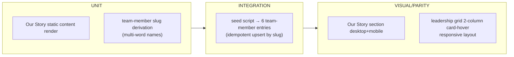

# TS-003 — Test Plan: About & Team (EP-12–EP-13)

> **Inherits:** [TS-000 Master Strategy](TS-000-master-test-strategy.md).
> **Requirements source:** [`03-about-and-team.md`](../A01-2-REQUIREMENTS/03-about-and-team.md).
> **Components:** `PAGE-ABOUT`, `SEC-OUR-STORY`, `SEC-TEAM-GRID`, `CMS-TEAM-MEMBER`.
> **Risk tier:** EP-12 = Tier 3 (static content, low blast radius); EP-13 = Tier 2 (first CMS collection type in this section, 6 real people's public bios/links).

---

## 1. Target requirements

- **EP-12** About "Our Story" (S1 render live narrative + flag the disabled hero-slider block).
- **EP-13** Team Member Directory (S1 model/seed `team-member`, S2 render leadership grid + flag the dead-carousel bio/name discrepancy).

## 2. Testing topology

## 3. Per-story test matrix

| Story | Layers | Key scenarios (happy / failure / edge) | Preserve-or-retire flag |
|---|---|---|---|
| EP-12-S1 (Our Story render + hero-block flag) | U, V | **H:** sub-title/icon, background image, full multi-paragraph narrative render verbatim, matching legacy at desktop+mobile. **F:** background image failing to load doesn't break sub-title/narrative rendering or throw an unhandled error. **E:** the disabled `.th-hero-wrapper.hero-18` block (its distinct, shorter "Our Story" copy) is **not** present anywhere in rendered output. | **Yes — dead hero-slider block.** Test asserts (a) zero hero-18 markup/headline in the DOM, and (b) a preserve-or-retire entry exists in `SOURCE-COVERAGE.md`/`docs/content-model.md` recording the content owner's explicit choice (retire or resurrect) — the test fails if either condition is unmet, but does **not** assert which choice was made. |
| EP-13-S1 (model+seed `team-member`) | U, I | **H:** all 6 members (Yin Guo, Trevor, Ranjit Das, Raj Nadipalli, Jayanta Bora, Mrinal Das) seeded with non-empty name/slug/role/bio/image/linkedin, `order` matching legacy grid sequence. **F:** re-running the seed script against an already-seeded instance upserts by slug — exactly 6 entries after any number of re-runs. **E:** "Raj Nadipalli" derives a URL-safe, unique, hyphenated slug (`raj-nadipalli`); uniqueness holds across all 6. | Related to, but distinct from, EP-13-S2's flag below — S1 seeds the *live-grid* bio/name as-is; it does not resolve the discrepancy. |
| EP-13-S2 (render grid + bio/name-discrepancy flag) | U, I, V | **H:** 6 `team-card-hover` cards render in a 2-column responsive grid from CMS data, ordered by `order`; each LinkedIn icon opens the member's URL in a new tab. **F:** a member with no `image` renders a fallback/placeholder, not a broken ``; rest of the card renders normally. **E:** the leadership grid ships with the live-grid bios and "Raj Nadipalli" spelling *pending* content-owner sign-off — not blocked on it. | **Yes — dead carousel bio/name discrepancy.** Test asserts (a) a preserve-or-retire entry in `SOURCE-COVERAGE.md` documents both the bio-length divergence (esp. Ranjit Das, Raj Nadipalli) and the "Raj" vs. "Rajesh" naming conflict, (b) the entry explicitly requires content-owner sign-off before the seed data is final, and (c) the rendered grid is **not blocked** on that decision — it ships with the live-grid content now. |

## 4. Boundary & negative fixtures

- **Slug-uniqueness boundary:** seed all 6 real names together to confirm no accidental slug collision (all 6 are structurally distinct, but the test should not assume that — it asserts uniqueness programmatically).
- **Missing-media boundary:** one `team-member` fixture with no `image` to exercise the fallback path (EP-13-S2 failure scenario).
- **Idempotent-seed boundary:** seed script run 0/1/2 times consecutively — exactly 6 entries every time, no duplicate-by-name entries.

## 5. Traceability stub (rolls up to TS-COVERAGE)

| Story | Covered by |
|---|---|
| EP-12-S1 | Our Story unit + parity + preserve-or-retire flag check |
| EP-13-S1 | team-member seed unit (slug) + integration (idempotency) |
| EP-13-S2 | leadership grid integration + parity + preserve-or-retire flag check |
