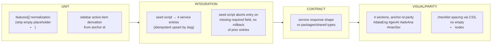

# TS-004 — Test Plan: Services (EP-14)

> **Inherits:** [TS-000 Master Strategy](TS-000-master-test-strategy.md).
> **Requirements source:** [`04-services.md`](../A01-2-REQUIREMENTS/04-services.md).
> **Components:** `PAGE-SERVICES`, `SEC-SERVICE-DETAIL`, `SEC-SERVICE-SIDEBAR-NAV`, `CMS-SERVICE`.
> **Why this plan matters:** `CMS-SERVICE` is the single source of truth for **two** independently-drifting legacy surfaces (homepage teaser slider, TS-002 EP-06; and this detail page) — a schema or seed defect here propagates to both. Tier 1.

---

## 1. Target requirements

- **EP-14** Services Detail Page & Service Content Type (S1 model/seed `service`, S2 render 4 sections with anchor-id parity, S3 shared sidebar nav widget, S4 preserve/flag the "Read a case study" outbound link inconsistency).

## 2. Testing topology

## 3. Per-story test matrix

| Story | Layers | Key scenarios (happy / failure / edge) | Preserve-or-retire flag |
|---|---|---|---|
| EP-14-S1 (model+seed `service`) | U, I | **H:** 4 entries ("Data Engineering", "Generative AI Enablement", "Advanced Analytics", "AI-Enabled Migrations") seeded with `order` 1–4, `summary` matching the homepage teaser, `description` matching `service.html`'s body. **F:** seed script aborts a single entry on a missing checklist/intro node, logs the missing field + source line range, and does **not** roll back previously-seeded entries in the same run. **E:** re-running the seed script against already-seeded services is idempotent (matched by slug, updated in place, never duplicated). | — |
| EP-14-S2 (4 sections, anchor-id parity + `<li>` normalization) | U, I, V | **H:** 4 sections render in order with title/intro/image/checklist/body matching `service.html`; each section's root element carries its legacy anchor id exactly. **F:** a missing feature image renders the section's text/checklist without erroring; a placeholder/omitted-image layout is used; the other 3 sections are unaffected. **E:** the Data Engineering checklist renders exactly 5 real `<li>` items with **zero** empty placeholder items — visual spacing is achieved via CSS (flex/gap), never empty markup nodes; a direct anchor navigation (`/services#manSer`) scrolls to the correct section and marks the correct sidebar item active. | — |
| EP-14-S3 (shared sidebar nav widget) | U, V | **H:** each of the 4 sections displays a single-source "Our Services" sidebar listing all 4 services in CMS `order`, linking to their anchors. **F:** unpublishing a service after static generation removes it from the sidebar on next revalidation with no broken link/empty nav item, and its detail section is also omitted. **E:** active-item highlighting is derived from component props/section context — asserted by rendering the same shared component with 4 different `activeAnchor` props and confirming exactly one item is marked active each time (proving one implementation, not 4 hand-authored copies). | — |
| EP-14-S4 (case-study link per service, flagged) | U, I | **H:** the 3 services with a legacy case-study link (Data Engineering→case2, GenAI→case1, Advanced Analytics→case7) render "Read a case study" targeting the correct migrated route. **F:** a `caseStudyLink` pointing at a retired/renamed slug logs a broken-reference warning at static-generation time, the section still renders its other content, and the link itself is omitted rather than rendered dead. **E:** AI-Enabled Migrations has an empty `caseStudyLink` — no link renders, no error/placeholder text — **and** this omission is recorded in `SOURCE-COVERAGE.md`'s preserve-or-retire register as a content-owner decision point, not resolved unilaterally by seeding a guessed link from the dead `case6.html` reference. | **Yes — AI-Enabled Migrations' missing case-study link.** Test asserts the preserve-or-retire entry exists and that the dead `case6.html`-referencing content block (lines 862–908) is never resurrected as-is by the seed script. |

## 4. Boundary & negative fixtures

- **Empty-`<li>` regression fixture:** a `features` array seeded exactly as the normalized 5/whatever-count real items — the rendering test must fail if any empty string or placeholder item is present, guarding against the legacy CSS-spacing-hack pattern being reintroduced.
- **Broken case-study reference fixture:** a `service` entry's `caseStudyLink` pointed at a slug deliberately not present in the seeded `case-study` set, to exercise EP-14-S4's failure scenario.
- **Partial-seed-failure fixture:** a source HTML fixture missing an expected checklist node, to exercise EP-14-S1's abort-without-rollback guarantee.
- **Anchor-id exhaustiveness:** all 4 anchor ids (`#dataEng`, `#genAI`, `#advAna`, `#manSer`) tested individually for both direct-navigation and homepage-teaser click-through (cross-ref TS-002 EP-06).

## 5. Cross-cutting content-drift check

`CMS-SERVICE.summary` feeds the homepage teaser (TS-002 EP-06-S1) and `CMS-SERVICE.description` feeds this page's detail body — both from one entry. An integration test updates a fixture service's `summary` and asserts the homepage teaser reflects it on next fetch without touching `/services`, proving the two surfaces share one write path rather than two independently-authored copies (this is the epic's stated success metric).

## 6. Traceability stub (rolls up to TS-COVERAGE)

| Story | Covered by |
|---|---|
| EP-14-S1 | seed unit + integration (partial-failure, idempotency) |
| EP-14-S2 | section render integration + parity (anchor ids, `<li>` normalization) |
| EP-14-S3 | sidebar unit + parity (active-state derivation) |
| EP-14-S4 | case-study-link integration + preserve-or-retire flag check |
