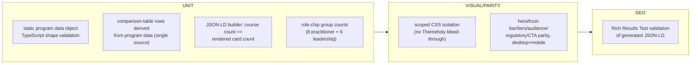

# TS-005 — Test Plan: AI Bootcamp (EP-15–EP-16)

> **Inherits:** [TS-000 Master Strategy](TS-000-master-test-strategy.md).
> **Requirements source:** [`05-ai-bootcamp.md`](../A01-2-REQUIREMENTS/05-ai-bootcamp.md).
> **Components:** `PAGE-BOOTCAMP`, `SEC-BOOTCAMP-HERO`, `SEC-BOOTCAMP-TIERS`, `SEC-BOOTCAMP-AUDIENCE`, `SEC-BOOTCAMP-PROGRAMS`, `SEC-BOOTCAMP-COMPARE`, `SEC-BOOTCAMP-REG`, `SEC-BOOTCAMP-CTA`, `SEC-BOOTCAMP-JSONLD`.
> **Structural note:** `bootcamp.html` is a self-contained micro-site with its own scoped CSS design system — tests must additionally verify **CSS isolation** from the shared Themeholy chrome, a concern unique to this section.
> **Deliberate scope decision under test:** **no `bootcamp-program` Strapi collection type exists for v1** — the 5 program cards are static page content. Tests must verify this is a *documented, tested-as-designed* deferral, not treat its absence as a gap.
> **Risk tier:** EP-15 = Tier 1 (visual-parity-heavy, but low CMS/blast-radius risk since content is static); EP-16 = Tier 2.

---

## 1. Target requirements

- **EP-15** Bootcamp Landing Page & Program Content (S1 hero+trust bar, S2 tier explainer+Why-TrieDatum grid, S3 audience role/industry chips, S4 5 program cards static-by-design, S5 comparison table derived from same data, S6 regulatory badges+delivery cards, S7 closing CTA).
- **EP-16** Bootcamp Structured Data / JSON-LD (S1 generate `EducationalOrganization`+`OfferCatalog` from the same static program data).

## 2. Testing topology

## 3. Per-story test matrix

| Story | Layers | Key scenarios (happy / failure / edge) |
|---|---|---|
| EP-15-S1 (hero + trust bar) | U, V | **H:** eyebrow/H1-with-emphasis/subtext render; "Explore Programs" scrolls to `#programs`; "Request a Consultation" → `/contact`; trust bar shows exactly 4 items with icon+label. **F:** scoped stylesheet failing to load still yields valid, readable HTML with **zero** shared Themeholy classes leaking in — asserted by a CSS-class-namespace audit, not just a visual check. **E:** 320px viewport stacks hero/CTAs vertically without overflow; all 4 trust-bar items remain legible. |
| EP-15-S2 (tier explainer + Why-TrieDatum grid) | U, V | **H:** exactly 2 tier cards + 6 Why-TrieDatum cards render with matching titles/descriptions. **F:** a future code change that accidentally empties one of the 6 cards is caught by a build/lint-time content-completeness check, not shipped silently. **E:** 768px viewport reflows the 6-card grid to 2 columns without overlap; consistent card heights per row. |
| EP-15-S3 (audience role/industry chips) | U, V | **H:** exactly 8 practitioner-role chips + 6 leadership-role chips + 8 industry cards render in the specified grouping/order. **F:** a length-asserting unit test (`expect(practitionerRoles).toHaveLength(8)`, `expect(leadershipRoles).toHaveLength(6)`) fails the build if a future edit drifts the count — this is the story's own specified regression guard, tested directly. **E:** the longest chip label ("Senior Director AI & Data") wraps/truncates gracefully at 320px without introducing horizontal scroll. |
| EP-15-S4 (5 program cards, static-by-design) | U, V | **H:** exactly 4 Practitioner-Tier + 1 Leadership-Tier card render, each with format badge/duration/meta/audience tag/tagline/description/≥6 outcome bullets/≥6 tags/"Enquire →"→`/contact`. **F:** TypeScript's static type-checking on the program data shape fails the build if a required field (e.g. `duration`) is accidentally deleted — this is the specified guard, verified as a `tsc`-level check, not a runtime one. **E:** the 8-outcome-bullet card at 375px shows all bullets via natural page scroll (no internal scroll container) and wraps its tag list without overflowing the card boundary. | Also verify: **no** `bootcamp-program` Strapi content type/seed script exists — a static repo-structure assertion confirming the deferral is real and documented (see §4). |
| EP-15-S5 (comparison table, derived) | U, V | **H:** table renders exactly 6 columns × 5 rows, each cell value matching the corresponding program card's field. **F:** updating a program's `duration` only in the shared static data object propagates to both the card and the table row automatically — asserted by changing the fixture once and checking both render outputs, proving single-source derivation (no separately-hard-coded table). **E:** at 375px the table becomes horizontally scrollable within its own container; the rest of the page body does not scroll horizontally. |
| EP-15-S6 (regulatory badges + delivery cards) | U, V | **H:** exactly 8 regulatory badges + 5 delivery-model cards render with correct labels/order. **F:** a badge icon 404 still shows the label text legibly, layout not collapsed. **E:** at the exact breakpoint where the badge grid switches 2↔3 columns, all 8 remain evenly distributed with no orphaned single badge and no clipped text. |
| EP-15-S7 (closing CTA) | U, V | **H:** heading/paragraph match legacy; both "Request a Consultation" and "Email Us Directly" link to `/contact` (legacy `mailto:` intent preserved by routing to the site's single lead-capture surface, per the site's unified-contact-surface rule). **F:** `/contact` returning a server error doesn't crash the bootcamp page itself when either button is clicked. **E:** clear visual separation (spacing/border/background) exists between the delivery section and the CTA at every supported viewport width, no overlap. |
| EP-16-S1 (JSON-LD from program data) | U, SEO | **H:** a single `application/ld+json` block contains a valid `EducationalOrganization`+`OfferCatalog` with exactly 5 `Course` entries, each field (`name`/`description`/`timeRequired` ISO-8601/`educationalLevel`) matching the corresponding program's static data; exactly the 2 certificate-bearing programs include `offers.name`. **F:** a malformed (non-ISO-8601) `duration` value is rejected by a build-time validation function — the build fails loudly rather than shipping invalid structured data. **E:** adding a 6th program to the static data object automatically yields 6 `Course` entries with no manual JSON-LD edit; the "JSON-LD course count equals rendered card count" test continues passing unmodified. |

## 4. The static-content deferral is itself under test

Because EP-15-S4 explicitly defers a `bootcamp-program` Strapi collection type as a documented, intentional P4/future-work decision (not an oversight), this plan's coverage of that story includes a **negative existence check**: no `apps/cms/src/api/bootcamp-program` content type and no corresponding `packages/seed` script exist, and the deferral rationale is discoverable in the requirements/architecture docs. If a future change silently introduces a partial/half-modeled collection type without revisiting this decision explicitly, this check is designed to catch that drift.

## 5. Boundary & negative fixtures (mandatory)

- **Chip-count boundary:** exactly 8/6/8 (practitioner roles/leadership roles/industry cards) — any drift fails immediately per EP-15-S3's own specified test.
- **Outcome-bullet boundary:** the program with the maximum 8 bullets, rendered at 375px, is the mandatory mobile-overflow fixture for EP-15-S4.
- **JSON-LD field-count boundary:** 5 `Course` entries, exactly 2 with `offers.name` — tested as an exact-count assertion, not "at least."
- **CSS-isolation boundary:** render `/bootcamp` alongside another route (e.g. `/about`) in the same test session to assert no shared Themeholy class leaks either direction.

## 6. Traceability stub (rolls up to TS-COVERAGE)

| Story | Covered by |
|---|---|
| EP-15-S1 | hero/trust-bar unit + parity + CSS-isolation check |
| EP-15-S2 | tiers/grid unit (content-completeness) + parity |
| EP-15-S3 | audience unit (exact chip counts) + parity |
| EP-15-S4 | program-cards unit (type-safety) + parity + deferred-CMS existence check |
| EP-15-S5 | comparison-table unit (single-source derivation) + parity |
| EP-15-S6 | regulatory/delivery unit + parity |
| EP-15-S7 | closing CTA unit + parity |
| EP-16-S1 | JSON-LD unit + SEO (Rich Results validation) |
