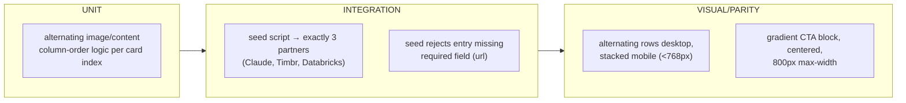

# TS-006 — Test Plan: Partnership (EP-17)

> **Inherits:** [TS-000 Master Strategy](TS-000-master-test-strategy.md).
> **Requirements source:** [`06-partnership.md`](../A01-2-REQUIREMENTS/06-partnership.md).
> **Components:** `PAGE-PARTNERSHIP`, `SEC-PARTNER-CARDS`, `SEC-PARTNER-CTA`, `CMS-PARTNER`.
> **Why this plan matters:** `CMS-PARTNER` is **shared** with the homepage logo strip (TS-002 EP-10) — a seed defect here (notably the Cognition discrepancy) propagates to both surfaces.
> **Risk tier:** Tier 2.

---

## 1. Target requirements

- **EP-17** Partnership Page & Partner Content Type (S1 model/seed + flag the Cognition asset discrepancy, S2 alternating card rows, S3 closing gradient CTA).

## 2. Testing topology

## 3. Per-story test matrix

| Story | Layers | Key scenarios (happy / failure / edge) | Preserve-or-retire flag |
|---|---|---|---|
| EP-17-S1 (model+seed `partner` + Cognition flag) | U, I | **H:** exactly 3 entries seeded — Claude (order 1, badge "Enterprise AI"), Timbr (order 2, "Knowledge Graph"), Databricks (order 3, "Data Platform"). **F:** the seed script rejects an entry with no `url` (Strapi 400), persists no partial entry, logs the failure and halts rather than continuing with incomplete data. **E:** the `Cognition.png` asset referenced nowhere in `partnership.html` or the homepage strip is explicitly logged, not silently seeded as a guessed 4th entry nor silently deleted. | **Yes — Cognition orphaned asset.** Test asserts a `docs/content-model.md` entry identifies the asset as orphaned art with no corresponding rendered content, and states the required content-owner decision (add a 4th partner, or delete the asset) without the seed script unilaterally choosing either outcome. Shared with TS-002 EP-10-S1's stale-record-pruning test — both must reference the same recorded disposition once decided. |
| EP-17-S2 (alternating card rows) | U, V | **H:** 3 cards render top-to-bottom in `order` (Claude, Timbr, Databricks); Claude/Databricks image-left, Timbr content-left on desktop; each shows badge/name/tagline/description/"Visit Website" (`target="_blank" rel="noopener"`). **F:** a partner with a null/unresolved `image` renders a graceful image-panel fallback, content panel unaffected. **E:** below 768px, image/content stack vertically (image above) regardless of the desktop alternating order; CTA remains fully visible/tappable without horizontal scroll. | — |
| EP-17-S3 (closing gradient CTA) | U, I, V | **H:** heading "Delivering Greater Value Through Strategic Partnerships" + supporting paragraph render white-on-gradient, centered, paragraph capped near 800px. **F:** if the CTA copy can't be fetched at build/request time, ISR fails closed (serves last known-good cached version) rather than publishing an empty/broken CTA block; failure logged for the Deploy Engineer. **E:** at 375px, the gradient box's padding shrinks without text overflow/overlap; block stays within viewport width, no horizontal scroll. | — |

## 4. Boundary & negative fixtures

- **Missing-required-field fixture:** a `partner` create payload with `url` omitted, to exercise EP-17-S1's 400-rejection path.
- **Cognition-asset fixture:** a seed run against fixture data that includes the `Cognition.png` reference in the asset tree but no corresponding markup, to prove the pruning/non-creation logic fires (shared fixture with TS-002 EP-10).
- **Alternation-order boundary:** all 3 cards' `order-md-1`/`order-md-2` column assignment tested individually (Claude image-left, Timbr content-left, Databricks image-left) — not just "alternates," but the exact per-card assignment.
- **CMS-unreachable boundary:** simulated fetch failure at ISR revalidation time for EP-17-S3's fail-closed behavior.

## 5. Cross-cutting content-drift check

The homepage partner strip (TS-002 EP-10-S1) and this page's card list (EP-17-S2) both read `CMS-PARTNER` ordered by the same `order` field. An integration test reorders a fixture partner and asserts both surfaces reflect the new order after the next fetch, with no independently-hard-coded order on either side.

## 6. Traceability stub (rolls up to TS-COVERAGE)

| Story | Covered by |
|---|---|
| EP-17-S1 | seed integration (validation, count) + preserve-or-retire flag check (Cognition) |
| EP-17-S2 | card-row unit (alternation) + parity |
| EP-17-S3 | CTA integration (fail-closed ISR) + parity |
