# TS-007 — Test Plan: Contact & Lead Capture (EP-18–EP-19)

> **Inherits:** [TS-000 Master Strategy](TS-000-master-test-strategy.md). Cross-cutting permission/security detail (Public role `create`-only on `contact-submission`) lives in [TS-011](TS-011-security-and-privacy.md); this plan covers the **functional** form/validation/notification behavior.
> **Requirements source:** [`07-contact-and-lead-capture.md`](../A01-2-REQUIREMENTS/07-contact-and-lead-capture.md).
> **Components:** `PAGE-CONTACT`, `SEC-CONTACT-FORM`, `SEC-CONTACT-INFO`, `API-CONTACT`, `CMS-CONTACT-SUBMISSION`, `CMS-GLOBAL`.
> **Why this plan matters most in this section set:** `contact.html` is the **only** `<form>` on the entire legacy site — every other CTA ultimately points here. This is the single highest-value conversion surface in the migration. **Risk tier: Tier 1** (EP-18), Tier 2 (EP-19).

---

## 1. Target requirements

- **EP-18** Contact Form & Submission Handling (S1 legacy-parity fields, S2 client validation+honeypot, S3 `POST /api/contact` validation+Strapi write, S4 best-effort Resend notification, S5 deferred Turnstile).
- **EP-19** Contact Page Chrome (S1 info boxes from `CMS-GLOBAL`, shared with the footer).

## 2. Testing topology

```mermaid
flowchart LR
    subgraph U["UNIT"]
        u1["client validation: required/format\n(Name, Email, Message)"]
        u2["honeypot visually-hidden field\n(never populated by a human)"]
        u3["field/DTO name mapping\nlegacy 'subject' -> 'company'"]
    end
    subgraph I["INTEGRATION"]
        i1["POST /api/contact -> Strapi create\n(contact-submission, Public create-only)"]
        i2["honeypot populated -> silent reject,\nno Strapi write, success-shaped response"]
        i3["Resend failure caught/logged,\nStrapi write unaffected"]
    end
    subgraph C["CONTRACT"]
        c1["/api/contact request/response schema"]
        c2["contact-submission field shape\nvs packages/shared types"]
    end
    subgraph E["E2E"]
        e1["visitor submits valid form ->\nrecord appears in Strapi + email attempted"]
    end
    U --> I --> C --> E
```

## 3. Per-story test matrix

| Story | Layers | Key scenarios (happy / failure / edge) |
|---|---|---|
| EP-18-S1 (legacy-parity fields) | U, V | **H:** Name/Email/Phone Number/Company/Message all render and accept input; the Company field's underlying value is keyed `company` internally (not the legacy `subject`), while the label stays "Company" — the rename is invisible to the user. **F:** with JavaScript disabled, the static HTML still renders all 5 labeled fields, none hidden/non-functional purely from missing hydration. **E:** a 5,000-character Message input is accepted and displayed in full without truncation or a premature client-side error. |
| EP-18-S2 (client validation + honeypot) | U, A11Y | **H:** valid Name/Email/Message with the honeypot untouched shows no validation errors and allows submission. **F:** an empty or malformed Email (e.g. `not-an-email`) blocks submission with an inline field-specific error. **E:** a honeypot populated by an automated fill-everything script still proceeds to the client's submission call (client-side alone cannot distinguish this) — the rejection is a **server-side** responsibility (EP-18-S3), and this story's test asserts only that the client does *not* attempt to block it itself. |
| EP-18-S3 (server-side validation + honeypot enforcement + Strapi write) | U, I, C, SEC | **H:** a valid POST (name/email/message required, honeypot empty, phone/company optional) creates a `contact-submission` with the `subject→company` mapping applied, responds 2xx, persists only the 5 mapped fields — no extra fields. **F:** honeypot populated → **no** Strapi write occurs, the API responds with a **success-shaped** response (never revealing the anti-spam mechanism to the bot), and the rejection is logged server-side for monitoring. **E:** a missing `message` or malformed `email` — even if client-side checks were bypassed/spoofed — is rejected 400-level with a field-specific error and no Strapi write. **Additional security scenario (cross-ref TS-011):** an unauthenticated `GET /api/contact-submissions` against the Strapi REST API directly is rejected 403/404, because Public has create-only access. |
| EP-18-S4 (best-effort Resend notification) | I | **H:** after a successful Strapi write, an email is sent to `contact@triedatum.com` with the submitted fields; the visitor's success response is **not** delayed waiting on email delivery confirmation. **F:** Resend failing/timing out/erroring is caught and logged server-side; the already-written Strapi record is unaffected and remains the durable source of truth; the visitor still receives the same success response. **E:** a missing/invalid `RESEND_API_KEY` still completes the Strapi write successfully; the notification attempt fails gracefully without throwing an unhandled exception that would surface a 500 to the visitor. |
| EP-18-S5 (deferred Turnstile — documented gap) | — (doc-presence check) | **H:** `.env.example` documents `TURNSTILE_SITE_KEY`/`TURNSTILE_SECRET_KEY` as "provisioned, not yet integrated"; project status notes list Turnstile wiring as an intentional, deferred P4 item. **F:** a future engineer inspecting `apps/web/app/api/contact/route.ts` finds no Turnstile verification call and can discover this story (EP-18-S5) via `SOURCE-COVERAGE.md` as the documented reason — asserted as a doc-cross-reference check, not a code test. **E:** the honeypot-only residual risk under a sophisticated spam campaign is explicitly accepted and documented as this story's known limitation. | This story is intentionally **not** a functional test of bot protection that doesn't exist — its test is entirely about documentation presence and discoverability, matching TS-000's framing rule for documented deferrals. |
| EP-19-S1 (contact-page chrome from `CMS-GLOBAL`) | I, V | **H:** the page's info boxes (US Address, India Address, Email, Call) render the `global` single type's current values, visually matching the footer's `info-box` card pattern. **F:** `global` temporarily unreachable at build/request time → the page fails gracefully (last successfully generated ISR version), and the contact **form itself remains functional** independent of this chrome (assert form submission still works even when the info-box fetch is mocked to fail). **E:** an admin edit to `indiaAddress` in `global`, once revalidated, is reflected on **both** the footer and this page's info box with no separate contact-page-specific data source or code change. |

## 4. Boundary & negative fixtures (mandatory)

- **Honeypot matrix:** {untouched by human} / {populated by naive bot} / {populated by a bot that also fills every visible field correctly} — the third case is EP-18-S5's explicitly accepted residual-risk scenario, not a false pass.
- **Field-mapping fixture:** assert the persisted Strapi record never contains a `subject` key — only `company` — proving the rename is complete, not just label-deep.
- **Payload-shape fixture:** a POST body with extra/unexpected fields beyond the 5 mapped ones, asserting the Strapi write persists **only** name/email/company/phone/message (EP-18-S3's own AC).
- **Resend-outage fixture:** mock Resend to throw/timeout/return non-2xx across all 3 cases in one parametrized integration test, asserting the Strapi write and visitor response are identical across all 3.
- **CMS-unreachable fixture (EP-19-S1):** mock the `global` fetch to fail while leaving `/api/contact` fully functional, to prove the form's independence from the chrome-fetch failure path.

## 5. Traceability stub (rolls up to TS-COVERAGE)

| Story | Covered by |
|---|---|
| EP-18-S1 | field-render unit + parity (no-JS fallback) |
| EP-18-S2 | client-validation unit + honeypot pass-through unit |
| EP-18-S3 | server validation/write integration + contract + security (cross-ref TS-011) |
| EP-18-S4 | notification integration (Resend failure isolation) |
| EP-18-S5 | doc-presence / discoverability check |
| EP-19-S1 | chrome integration (shared-data-source + fail-closed) + parity |
