# TS-008 — Test Plan: News, Case Studies & Testimonials (EP-20–EP-22)

> **Inherits:** [TS-000 Master Strategy](TS-000-master-test-strategy.md). The case8 orphan-page disposition and other flagged items in this section cross-reference [TS-COVERAGE §6](TS-COVERAGE-test-coverage-matrix.md#6-preserve-or-retire--content-owner-decision-tracking).
> **Requirements source:** [`08-news-case-studies-and-testimonials.md`](../A01-2-REQUIREMENTS/08-news-case-studies-and-testimonials.md).
> **Components:** `PAGE-NEWS`, `PAGE-NEWS-DETAIL`, `CMS-NEWS-ARTICLE`, `PAGE-CASE-STUDIES`, `PAGE-CASE-STUDY-DETAIL`, `CMS-CASE-STUDY`, `PAGE-TESTIMONIAL-DETAIL`, `CMS-TESTIMONIAL`.
> **Why this plan matters:** all three collections share one structural pattern — one-time `packages/seed` ETL from bespoke legacy HTML into a Strapi collection type, then a Next.js `[slug]` route via `generateStaticParams` — but each collection's *source* HTML is the least template-uniform on the site (4 differently-shaped news articles, 10 case studies with 5 needing newly-authored titles, 2 testimonials in incompatible body formats). The seed-script parsing risk, not the rendering risk, is this plan's dominant concern.
> **Risk tier:** EP-20 (news) = Tier 2, with EP-20-S3 (redirects) = Tier 1; EP-21 (case studies) = Tier 2, with EP-21-S3 (redirects) = Tier 1; EP-22 (testimonials) = Tier 3 (TS-000 §5).

---

## 1. Target requirements

- **EP-20** News Article Collection & Detail Route (S1 model+seed the 4 confirmed articles, excluding the 5th hybrid promotional card; S2 `/news` listing + `/news/[slug]` with a flexible body layout and a re-implemented Magnific Popup lightbox; S3 301-redirect all 5 legacy news URLs).
- **EP-21** Case Study Collection & Detail Route (S1 model+seed all 10 case studies, authoring real unique titles for the 5 that only ever carried the generic sitewide `<title>`; S2 the net-new `/case-studies` listing + `/case-studies/[slug]` detail route; S3 301-redirect all 10 legacy URLs, tolerant of not-yet-finalized slugs; S4 resolve the `case8` orphan-page parity decision).
- **EP-22** Testimonial Collection & Detail Route (S1 model+seed both testimonials, preserving the essay vs. Q&A format difference and skipping the dead commented-out paragraph in `testimonial2.html`; S2 `/testimonials/[slug]` detail route rendering both formats through one shared richtext renderer; S3 301-redirect both legacy URLs and confirm the homepage carousel shares the same data source).

## 2. Testing topology

```mermaid
flowchart LR
    subgraph U["UNIT"]
        u1["cheerio parsers, one fixture per\nnews-article body shape (gallery/plain/\nprogram-cards+CTA/zero-image)"]
        u2["slug derivation from newly-authored\ncase-study titles + uid-uniqueness collision"]
        u3["testimonial body-format detection\n(essay headings vs. Q&A pairs)"]
        u4["dead-comment-block skip logic\n(testimonial2.html)"]
    end
    subgraph I["INTEGRATION"]
        i1["seed script -> ephemeral Strapi:\nnews-article / case-study / testimonial"]
        i2["idempotent re-run, matched by slug\n(cross-ref TS-012 §1)"]
        i3["generic-title case-study created in\ndraft, publish blocked until retitled"]
    end
    subgraph C["CONTRACT"]
        c1["news-article / case-study / testimonial\nresponse shape vs packages/shared types"]
    end
    subgraph V["VISUAL/PARITY"]
        v1["/news/[slug] gallery + lightbox\nvs legacy Magnific Popup"]
        v2["/case-studies listing + detail\n(net-new page, no legacy baseline)"]
        v3["/testimonials/[slug] essay vs Q&A\nlayout fidelity"]
    end
    subgraph E["E2E"]
        e1["visitor opens gallery article,\nlightbox next/prev navigation"]
        e2["all redirect-coverage checks\n(5 news + 10 case study + 2 testimonial)"]
    end
    U --> I --> C --> V --> E
```

## 3. Per-story test matrix

| Story | Layers | Key scenarios (happy / failure / edge) |
|---|---|---|
| EP-20-S1 (model+seed `news-article`) | U, I, MIG | **H:** all 4 confirmed articles ("5 Year Anniversary", "New Engineering Office", "Trevor Mason...CTO", "Launching...Bootcamp") seed with title/slug/excerpt/publishedDate/author/image matching source, and the `triedatum-news.html` 5th hybrid card is **not** created as a 5th entry. **F:** an article with no discoverable publish date logs a named warning, does not fail the whole seed run, and the resulting entry is left in draft pending manual date entry. **E:** re-running the seed script against the 4 already-seeded entries produces zero duplicates, matched and updated by slug. |
| EP-20-S2 (`/news` listing + `/news/[slug]` flexible body + lightbox) | U, I, V, E | **H:** the gallery-format article (`5-year-anniversary`) renders its narrative and thumbnail gallery; clicking a thumbnail opens a full-size lightbox without a page navigation, with working next/previous. **F:** `/news/not-a-real-article` returns the site's standard 404, not an unhandled server error. **E:** the zero-image bootcamp-launch article renders its 5 program mini-cards, CTA box, and all 10 tag pills correctly, with no broken image placeholder or empty gallery component, proving the layout does not assume an image is present. |
| EP-20-S3 (301-redirect 5 legacy news URLs) | SEO, E | **H:** `/news/trevor-cto.html` responds 301 with `Location: /news/trevor-cto`. **F:** a redirect-map entry accidentally missing for `/news/triedatum-bootcamp.html` falls through to the standard 404 (never crashes the request pipeline) and is caught by the redirect-coverage test before launch, per this story's own AC. **E:** `/triedatum-news.html` (the listing page's own URL) is a distinct redirect-map entry, 301ing to `/news`, separate from the 4 individual article redirects. |
| EP-21-S1 (model+seed `case-study`, 5 retitled) | U, I, MIG | **H:** `case9.html`'s confirmed real title ("Transforming Greenhouse Intelligence...") seeds verbatim, with its slug derived from that title, not the generic string. **F:** processing one of the 5 generically-titled files (`case1`–`case2`, `case4`–`case5`, `case8`) creates the entry in **draft** with a placeholder flag, never published with the generic title, requiring a Content Editor to author a real title before publish. **E:** two of the 5 generically-titled entries accidentally authored with identical new titles trigger Strapi's uid-uniqueness rejection on the second save, prompting the Content Editor to choose a distinct title/slug. |
| EP-21-S2 (`/case-studies` listing + detail — net-new page) | U, I, V, E | **H:** with 10 seeded case-study entries, `/case-studies` renders a card grid ordered by the `order` field, and clicking any card navigates to its `/case-studies/[slug]` detail page. **F:** the ported nav dropdown's "Case Studies" parent link resolves to `/case-studies` (not a homepage-carousel anchor or a single case study) — verified in the parity audit as a **documented behavior improvement**, not a broken link. **E:** a published case-study entry with an empty `summary` field still renders a card with a graceful fallback (e.g. truncated body text), never a thrown rendering error or an omitted card. |
| EP-21-S3 (301-redirect 10 legacy case-study URLs, slug-tolerant) | SEO, E | **H:** `/case-study/case9.html` 301s to `/case-studies/<confirmed-title-slug>`. **F:** if the redirect map is generated before all 5 retitled case studies' final slugs are known, the build either fails the redirect-coverage check with a clear "pending slug" error or emits a temporary redirect to `/case-studies` — **never** a permanent 301 to a slug still subject to change (this story's own AC). **E:** all 10 redirects are verified together in one automated pass against staging: all report 301 with a `Location` resolving to a live detail page, none 404 or fall back to the generic listing. |
| EP-21-S4 (resolve `case8` orphan-page decision) | MIG, doc-presence | **H (disposition a):** if `case8.featured` is set `false` while the other 9 are `true`, the homepage carousel and nav dropdown both render exactly the legacy 9-of-10 set in legacy order, and the decision is recorded in `docs/content-model.md` referencing this story. **F:** if the Definition-of-Done checklist is evaluated with **neither** disposition (a) nor (b) recorded, the story fails the "No open blockers" gate and launch is blocked on this story until a disposition is recorded — asserted as a doc-presence check, not a code test. **E (disposition b):** if `case8.featured` is set `true` along with the other 9, the nav dropdown gains a 10th entry and the parity-auditor's report explicitly calls out the 10-card carousel as an **approved deviation**, not a defect. |
| EP-22-S1 (model+seed `testimonial`, essay + Q&A) | U, I, MIG | **H:** Rob Wdowik's essay seeds with all 9 bold subheadings preserved in order as distinct richtext headings, `company` populated as "Large Pharmaceutical International Organization" while the body text's anonymized "Client" wording is preserved verbatim. **F:** the dead commented-out essay paragraph inside `testimonial2.html` is **not** extracted into Kristy Burns's entry; the seed script logs that a commented-out block was found and skipped, cross-referencing `SOURCE-COVERAGE.md`'s preserve-or-retire register. **E:** Kristy Burns's Q&A entry's `quote` field contains only the short pull-quote (not the full body), and `body` preserves all 5 question/answer pairs as distinct richtext blocks, structurally distinguishable from testimonial1's heading-based essay. |
| EP-22-S2 (`/testimonials/[slug]` detail, both formats via one renderer) | U, V, E | **H:** `/testimonials/kristy-burns` renders all 5 questions bold immediately above their answers, with the short pull-quote rendered prominently above the Q&A body. **F:** `/testimonials/not-a-real-testimonial` returns the site's standard 404. **E:** `/testimonials/rob-wdowik` renders all 9 subheadings in original order ending with "Conclusion," with the anonymized "Client" wording preserved verbatim (never silently replaced by the `company` field's value) — asserted via **one shared richtext renderer**, not two hard-coded per-format templates. |
| EP-22-S3 (301-redirect both testimonial URLs + shared data-source confirmation) | SEO, I, E | **H:** `/testimonial/testimonial1.html` 301s to `/testimonials/rob-wdowik`. **F:** if a Content Editor updates Kristy Burns's `quote` field and, after the next ISR/on-demand revalidation, the homepage carousel's preview text still shows stale, independently-hard-coded text, this is logged as a defect against `EP-09`'s implementation (Section B, TS-002) — **not** accepted as expected behavior, since both surfaces must read the same `testimonial` record. **E:** both legacy testimonial URLs are verified together in the redirect-coverage test: both 301 to a live `/testimonials/[slug]` page, neither falls back to a generic listing page (none exists in this section's scope). |

## 4. Boundary & negative fixtures (mandatory)

- **One fixture per news-article body shape.** `5-year-anniversary.html`/`new-engineering-office.html` (gallery), `trevor-cto.html` (plain narrative + single photo), `triedatum-bootcamp.html` (zero images, program cards + CTA + tag pills) — each is its own captured HTML fixture; a single generic "news article" fixture is explicitly insufficient (TS-000 §6.2).
- **Generic-title boundary set.** All 5 generically-titled case studies (`case1`, `case2`, `case4`, `case5`, `case8`) are fixtured together to assert the draft-gate blocks publish uniformly, not just for one representative file.
- **Slug-collision fixture.** Two synthetic retitle attempts that resolve to the same slug, to exercise Strapi's uid-uniqueness rejection deterministically (EP-21-S1's edge scenario).
- **Pending-slug redirect fixture.** A redirect-map generation run executed *before* all 5 retitled slugs are finalized, asserting the build either fails clearly or issues a temporary (not permanent) redirect — never a permanent 301 to a slug still subject to change (EP-21-S3).
- **Essay-vs-Q&A body fixture pair.** `testimonial1.html` and `testimonial2.html` are never collapsed into one shared "testimonial body" fixture generator — each format's structural markers (bold subheadings vs. bold question + answer pairs) are asserted independently.
- **Dead-content fixture.** `testimonial2.html`'s HTML-commented paragraph is deliberately included in its seed-script fixture (not stripped beforehand), so the skip-and-log behavior is exercised against the real discrepancy, not a pre-cleaned substitute.

## 5. Preserve-or-retire test obligations owned by this plan

This section owns three of the requirements set's flagged discrepancies (`SOURCE-COVERAGE.md`'s preserve-or-retire register). Per TS-000 §4/§9, each test asserts the flag is **recorded and safely defaulted**, never that a particular disposition is the "correct" one:

| Item | Test obligation | Owning story |
|---|---|---|
| `triedatum-news.html`'s 5th hybrid card (links to `partnership.html`, not a news article) | Seed-script test asserts exactly 4 `news-article` entries are created, never 5 — the hybrid card's exclusion is a positive assertion, not an omission. | EP-20-S1 |
| `case8` orphan (absent from legacy nav dropdown + homepage carousel; target currently renders all 10) | Doc-presence check: the Definition-of-Done gate for EP-21-S4 fails if no disposition is recorded in `docs/content-model.md`, regardless of which disposition is eventually chosen. | EP-21-S4 |
| Dead commented-out essay paragraph in `testimonial2.html` (belongs to `testimonial1`'s subject matter) | Seed-script test asserts the block is skipped from extraction **and** that a skip is logged, cross-referencing `SOURCE-COVERAGE.md`. | EP-22-S1 |

## 6. Traceability stub (rolls up to TS-COVERAGE)

| Story | Covered by |
|---|---|
| EP-20-S1 | seed unit + integration (idempotency, missing-date warning, hybrid-card exclusion) |
| EP-20-S2 | listing/detail unit + parity (gallery lightbox, zero-image layout) + E2E lightbox journey |
| EP-20-S3 | redirect-coverage (SEO layer, cross-ref TS-012 §2) |
| EP-21-S1 | seed unit + integration (draft-gate on generic titles, uid-collision) |
| EP-21-S2 | listing/detail unit + parity + E2E (nav-dropdown behavior-improvement assertion) |
| EP-21-S3 | redirect-coverage (SEO layer, pending-slug handling, cross-ref TS-012 §2) |
| EP-21-S4 | doc-presence / DoD-gate check (preserve-or-retire, cross-ref TS-COVERAGE §6) |
| EP-22-S1 | seed unit + integration (dual body-format fidelity, dead-block skip) |
| EP-22-S2 | detail-route unit + parity (shared richtext renderer, both formats) |
| EP-22-S3 | redirect-coverage + integration (shared-data-source-with-homepage-carousel check, cross-ref TS-002 EP-09) |
