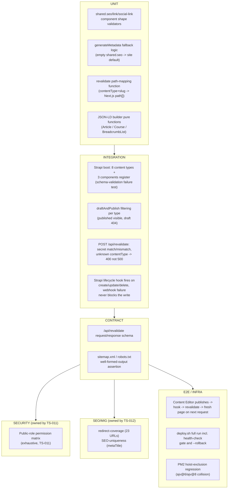

# TS-009 — Test Plan: CMS Platform, SEO, Redirects, Analytics & Hosting (EP-23–EP-27)

> **Inherits:** [TS-000 Master Strategy](TS-000-master-test-strategy.md). **Depth split to avoid duplicate assertions (TS-000 §9):** the Public-role permission matrix's exhaustive deny/allow enumeration is owned by [TS-011](TS-011-security-and-privacy.md) (cross-referenced at §3 EP-23-S2/S3 below, asserted only once, there); SEO-uniqueness and redirect-coverage's exhaustive per-URL enumeration is owned by [TS-012](TS-012-content-migration-fidelity.md) (cross-referenced at §3 EP-24 below). This plan owns the platform *mechanics* — schema existence, `generateMetadata` wiring, sitemap/robots generation, GA4/JSON-LD correctness, the revalidation webhook's own request handling, and hosting/deploy behavior.
> **Requirements source:** [`09-cms-seo-and-platform.md`](../A01-2-REQUIREMENTS/09-cms-seo-and-platform.md).
> **Components:** `CMS-GLOBAL`, `CMS-CASE-STUDY`, `CMS-NEWS-ARTICLE`, `CMS-SERVICE`, `CMS-TEAM-MEMBER`, `CMS-PARTNER`, `CMS-TESTIMONIAL`, `CMS-CONTACT-SUBMISSION`, `SVC-SEO`, `SVC-REDIRECTS`, `API-REVALIDATE`, `INFRA-NGINX`, `INFRA-PM2`, `INFRA-POSTGRES`, `INFRA-CI`.
> **Why this plan matters most in this section set:** nothing in Sections A–H renders without this platform underneath it — a schema defect, a permission gap, or a hosting misconfiguration here has the largest blast radius of any plan in this set (TS-000 §5 quadrant chart places EP-23/EP-24/EP-27 at the top-right "deepest coverage" quadrant).
> **Risk tier:** EP-23, EP-24, EP-27 = Tier 1; EP-25-S1 = Tier 1, EP-25-S2 = Tier 2; EP-26 = Tier 2; EP-27-S5 = Tier 3 (designed-not-active CI, per TS-000 §5).

---

## 1. Target requirements

- **EP-23** Strapi Content Modeling & Permissions (S1 8 content types + 3 shared components; S2 Public read grants; S3 Public create-only on `contact-submission`, no update/delete anywhere; S4 `draftAndPublish` on every editorial type, off for `contact-submission`).
- **EP-24** SEO, Metadata, Sitemap & 301 Redirects (S1 `shared.seo` → `generateMetadata`, replacing the generic duplicated string; S2 the exhaustive 23-URL redirect table; S3 `sitemap.xml`/`robots.txt`; S4 canonical URLs + Open Graph triple).
- **EP-25** Analytics & Structured Data (S1 GA4 `G-HP0RJZ369Q` continuity incl. client-side route transitions; S2 JSON-LD for `EducationalOrganization`/`Course`, `Article`, `BreadcrumbList` generated from live CMS data).
- **EP-26** On-Demand ISR / Revalidation Webhook (S1 secret-gated `POST /api/revalidate` request-handling + path-mapping; S2 Strapi lifecycle-hook registration, best-effort, never blocking the write; S3 the always-on `revalidate: 3600` timed fallback).
- **EP-27** Hosting, Deployment & CI/CD — Hostinger VPS (S1 Nginx reverse-proxy server blocks; S2 PM2 fork mode + the `apps/cms` hoist exclusion regression guard; S3 PostgreSQL provisioning recipe; S4 `deploy.sh`/`backup.sh`; S5 the CI pipeline design, explicitly not yet activated).

## 2. Testing topology

## 3. Per-story test matrix

| Story | Layers | Key scenarios (happy / failure / edge) |
|---|---|---|
| EP-23-S1 (8 content types + 3 components) | I | **H:** Content-Type Builder lists all 8 types (`global` single type; `case-study`, `news-article`, `service`, `team-member`, `partner`, `testimonial`, `contact-submission` collection types), each field list matching its owning Section B–H story. **F:** if `shared.seo` has not yet been created under `apps/cms/src/components/shared/` while `case-study` references it, Strapi fails to build/start with a schema-validation error naming the missing component — no type is silently registered without its declared component. **E:** an attempt to create a second `global` entry via the REST API is rejected, since singleType semantics permit exactly one. |
| EP-23-S2 (Public read grants) | I, SEC | **H:** an anonymous `GET /api/case-studies/<slug>` on a published entry responds 200 with public fields. **F:** an anonymous `GET /api/news-articles/<slug>` on a draft-state entry responds 404. **E:** `GET /api/global` succeeds anonymously with only `find` granted (no `findOne` needed for a singleType). **Full exhaustive matrix owned by [TS-011 §1](TS-011-security-and-privacy.md).** |
| EP-23-S3 (Public create-only on `contact-submission`; no update/delete anywhere) | I, SEC | **H:** an anonymous `POST /api/contact-submissions` with valid fields responds 201. **F:** anonymous `GET`/`PUT`/`DELETE` against `/api/contact-submissions[/​<id>]` all respond 403 — submissions are write-only from the anonymous side. **E:** an audit of the full Public permission matrix across all 8 content types confirms `update`/`delete` unchecked everywhere, including types that grant `find`/`findOne`. **Full exhaustive matrix owned by [TS-011 §1](TS-011-security-and-privacy.md).** |
| EP-23-S4 (`draftAndPublish` on/off split) | I | **H:** a case-study entry saved without "Publish" is invisible via the public API (404 per EP-23-S2) and becomes visible only after publish. **F:** an attempt to enable `draftAndPublish` on `contact-submission` is flagged in schema review as violating the platform's stated hard rule and must not be merged. **E:** the `global` single type's unpublished edit does not remove the live footer — `GET /api/global` keeps returning the last-published version until the edit is explicitly published. |
| EP-24-S1 (`shared.seo` → `generateMetadata`, replace generic string) | U, I | **H:** a case-study's `shared.seo.metaTitle` renders as the page's `<title>` and does not match the legacy generic string. **F:** a `service` entry migrated with an empty `shared.seo` falls back to a sensible site-level default title/description rather than an empty `<title>` tag, and the gap is logged as a migration content defect. **E:** every page that previously carried the generic duplicated string now has a distinct value pairwise, with none equal to the legacy string verbatim. **Full pairwise-uniqueness sweep owned by [TS-012 §3](TS-012-content-migration-fidelity.md).** |
| EP-24-S2 (23-URL redirect table) | SEO | **H:** `/about.html` 301s to `/about`, holding for all 7 static pages. **F:** if any one of the 10 case-study or 4 news-article URLs is accidentally omitted from the map, that URL 404s instead of 301ing — this story's own AC treats that as a failed acceptance bar, not a passable interim state. **E:** both testimonial URLs 301 to their consolidated target with no URL left unmapped. **Full 23-URL enumeration and the redirect-coverage CI check owned by [TS-012 §2](TS-012-content-migration-fidelity.md).** |
| EP-24-S3 (`sitemap.xml` + `robots.txt`) | I, C | **H:** with 10 published case studies and 4 published news articles, `GET /sitemap.xml` returns valid XML with a `<url>` entry for every static route and every published content-backed entry. **F:** a draft-state news-article entry does not appear in the sitemap; publishing it causes it to appear on the next regeneration. **E:** `robots.txt` allows crawling of all public `apps/web` routes, references the sitemap location, and explicitly disallows the `cms.<domain>` admin subdomain/path. |
| EP-24-S4 (canonical URLs + OG triple) | U, I | **H:** a published case-study page emits exactly one `<link rel="canonical">` and a complete non-empty `og:title`/`og:description`/`og:image` triple. **F:** `/services?ref=newsletter` and `/services` both emit the identical canonical URL with no query string, and no page ever emits more than one canonical tag. **E:** a `team-member` entry with no image uploaded still emits a valid `og:image` via the site-wide default fallback — the OG triple is never incomplete. |
| EP-25-S1 (GA4 continuity, incl. client-side transitions) | U, E | **H:** every route fires a GA4 pageview tagged `G-HP0RJZ369Q`, visible in real-time reporting within seconds. **F:** a client-side Next.js route transition (no full page reload) still fires a new GA4 pageview — explicitly verified, since App Router does not auto-refire third-party scripts on client navigation. **E:** an audit confirms exactly one GA4 snippet/initialization exists site-wide, never a duplicate copy that would inflate session/event counts. |
| EP-25-S2 (JSON-LD generated from live CMS data) | U, I | **H:** `/bootcamp`'s JSON-LD `EducationalOrganization`/`Course` block matches live CMS price/date values and validates cleanly in Google's Rich Results Test. **F:** a Content Editor changes the bootcamp price in Strapi and publishes; after the page regenerates (ISR or on-demand per EP-26), the JSON-LD reflects the new price automatically with no hand-edit — this is the explicit negative test for the legacy failure mode (`bootcamp.html`'s static hand-authored block). **E:** a `news-article` published without its optional `author` field omits the `author` property entirely from its `Article` JSON-LD (never an empty/null value), while the block still validates as well-formed. |
| EP-26-S1 (secret-gated `POST /api/revalidate`) | U, I, C | **H:** a request with a matching secret header and `{ contentType: "case-study", slug: "acme-corp" }` calls `revalidatePath` for `/case-studies/acme-corp` and any listing/index page that includes case studies, responding 200 naming the revalidated paths. **F:** a request with a missing or incorrect secret header responds 401 and performs no revalidation, regardless of whether `contentType`/`slug` are otherwise valid — **exhaustive secret-gating scenarios owned by [TS-011 §3](TS-011-security-and-privacy.md).** **E:** an unrecognized `contentType` (typo or future/unmapped type) with a correct secret responds 400 naming the unrecognized type, never an unhandled exception or server crash. |
| EP-26-S2 (Strapi lifecycle-hook registration, best-effort) | I | **H:** publishing a case-study entry fires `afterCreate`/`afterUpdate` and POSTs to `/api/revalidate` with the slug and secret header. **F:** if the Next.js server is unreachable when the hook fires, the Strapi entry is still successfully created/updated/deleted and visible in the admin panel — the failure is logged, never surfaced as an error in the publish flow. **E:** deleting a `testimonial` entry also fires the same webhook pattern via `afterDelete`, and the corresponding path is revalidated so the deleted entry stops appearing on the next request. |
| EP-26-S3 (timed `revalidate: 3600` fallback) | I | **H:** a route with no on-demand webhook call ever received still self-heals: after 3600+ seconds elapse, Next.js serves the stale page once, triggers background regeneration, and the next request reflects current content. **F:** content published while the Next.js server was offline (webhook silently failed) still regenerates once the timed window elapses after the server returns — no manual cache-clear or redeploy required. **E:** a page on-demand-revalidated 5 seconds ago, with its 3600-second window not yet elapsed, continues serving the fresh content without the timed window forcing a redundant, conflicting regeneration. |
| EP-27-S1 (Nginx reverse-proxy blocks) | I | **H:** the apex/www domain proxies to `localhost:3000`; `cms.<domain>` proxies to `localhost:1337`. **F:** if the PM2-managed Next.js process is down, Nginx returns a clear 502/503 (never hangs indefinitely or returns a misleading 200), visible in Nginx's error log. **E:** the admin-panel IP-allowlist directive is present in config but inactive by default — the admin panel remains reachable from any IP until the Site Administrator explicitly enables it via a documented one-line config change. |
| EP-27-S2 (PM2 fork mode + `apps/cms` hoist-exclusion regression guard) | I | **H:** `pm2 list` shows both processes as fork-mode instances, each with a configured `max_memory_restart`. **F (regression test for the hard-won decision):** a hypothetical hoisted-`apps/cms` configuration reproduces the documented `ajv@6`/`ajv@8` collision — Strapi crashes at boot with `Cannot find module 'ajv/dist/core'` — confirming this is the reason the exclusion must be preserved, never "simplified" away in a future refactor. **E:** a process exceeding its `max_memory_restart` cap is auto-restarted by PM2 with no manual intervention, visible in `pm2 logs`. |
| EP-27-S3 (PostgreSQL provisioning recipe) | I | **H:** following the documented recipe against a fresh machine produces a dedicated database and a dedicated least-privilege role (not the superuser), and Strapi completes its first-boot schema sync using those credentials. **F:** a misconfigured connection string (wrong password/database name) causes Strapi to fail fast with a clear database-connection error traceable to the specific variable — never a silent hang. **E:** running the recipe a second time for a second environment produces two fully independent databases/roles with no shared credentials or cross-environment visibility. |
| EP-27-S4 (`deploy.sh` + `backup.sh`) | I, E | **H:** `./deploy.sh` performs `git pull --ff-only` → `npm ci` → build → `pm2 reload --update-env` → health-check curls against both apps, finishing only after both return healthy. **F:** a non-2xx post-deploy health check is reported clearly (no silent success), and a non-fast-forward git state halts the script *before* touching any running process rather than attempting a merge. **E:** `./deploy.sh --rollback` checks out the previously stored known-good SHA, rebuilds, and reloads PM2 back to that state; independently, `backup.sh` prunes only `pg_dump` files older than the 30-day retention window. |
| EP-27-S5 (CI pipeline designed, not activated) | doc-presence | **H:** `infra/github/deploy.yml`'s YAML validates; its verify job (install/typecheck/lint/build) and deploy job (SSH + `deploy.sh`, gated to `main`) are both correctly defined. **F:** any documentation, status report, or DoD checklist claiming "CI/CD is automated" while `.github/workflows/` does not contain a copy of this file is flagged as inaccurate during review — the correct documented status is "designed, version-controlled, not yet activated." **E:** activating the pipeline later requires only a file copy/move plus SSH-secret configuration — no redesign of the verify/deploy job logic — asserted as a scope check on this story, not a functional test of an active pipeline. |

## 4. Boundary & negative fixtures (mandatory)

- **Schema-boot fixture:** a content type referencing a not-yet-created shared component, to prove Strapi fails loudly at boot rather than silently registering a partial type (EP-23-S1).
- **Draft/publish boundary:** one entry per editorial content type left unpublished, to exercise the 404-until-published behavior uniformly (EP-23-S4) — the exhaustive permission-cell enumeration itself lives in TS-011, not repeated here.
- **Empty-`shared.seo` fixture:** at least one seeded entry per content-backed type with a deliberately blank `shared.seo`, to exercise the `generateMetadata` fallback path (EP-24-S1).
- **Revalidate-endpoint fixtures:** correct secret / missing secret / wrong secret / correct secret + unmapped `contentType`, run as one parametrized suite (EP-26-S1) — cross-referenced, not duplicated, in TS-011 §3.
- **Webhook-unreachable fixture:** the Next.js server stopped at the moment a Strapi lifecycle hook fires, to prove the Strapi write is unaffected and the failure is logged, not surfaced to the Content Editor (EP-26-S2).
- **ajv hoist-collision regression fixture:** a scratch/CI-only workspace configuration that intentionally re-permits hoisting `apps/cms`, run only to reproduce and document the known crash — never merged as a runtime configuration (EP-27-S2).

## 5. Traceability stub (rolls up to TS-COVERAGE)

| Story | Covered by |
|---|---|
| EP-23-S1 | Strapi boot/schema integration (missing-component failure, singleType cardinality) |
| EP-23-S2 | integration (read-grant smoke scenarios here; exhaustive matrix in TS-011 §1) |
| EP-23-S3 | integration (create-only smoke scenarios here; exhaustive matrix in TS-011 §1) |
| EP-23-S4 | integration (draft/publish filtering, hard-rule schema-review check) |
| EP-24-S1 | unit (fallback logic) + integration (metaTitle rendering; pairwise uniqueness in TS-012 §3) |
| EP-24-S2 | SEO smoke scenarios here; exhaustive 23-URL sweep in TS-012 §2 |
| EP-24-S3 | integration + contract (sitemap/robots well-formedness, draft-exclusion) |
| EP-24-S4 | unit + integration (canonical singularity, OG fallback) |
| EP-25-S1 | unit (single-instance audit) + E2E (client-side route-transition pageview) |
| EP-25-S2 | unit (JSON-LD builders) + integration (live-CMS-value reflection, optional-field omission) |
| EP-26-S1 | unit + integration + contract (secret-gating smoke here; exhaustive in TS-011 §3) |
| EP-26-S2 | integration (best-effort non-blocking write, afterDelete coverage) |
| EP-26-S3 | integration (timed fallback self-heal, no double-fire conflict) |
| EP-27-S1 | integration (reverse-proxy routing, 502/503 on upstream-down, optional allowlist) |
| EP-27-S2 | integration (fork-mode + memory-cap; ajv hoist-collision regression guard) |
| EP-27-S3 | integration (provisioning recipe repeatability, fail-fast on misconfiguration) |
| EP-27-S4 | integration + E2E (deploy.sh health-gate + rollback; backup.sh retention) |
| EP-27-S5 | doc-presence / YAML-validity check (designed-not-active status, cross-ref TS-COVERAGE §6) |
