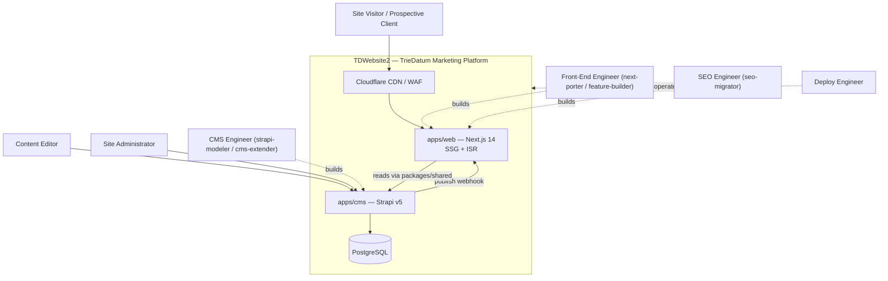
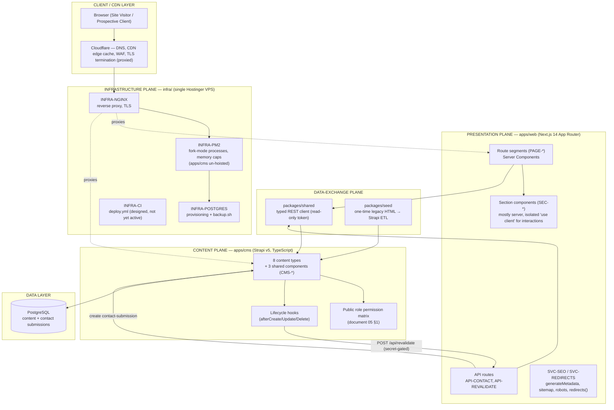

# 00 — Solution Architecture Overview

> TrieDatum marketing site (23 static Themeholy/Bootstrap HTML pages, `mail.php`, no data layer, no build pipeline, no tests) → **Next.js 14 + Strapi v5 + PostgreSQL**, delivered as an npm-workspaces monorepo.

---

## 1. Executive summary

The legacy site is flat, hand-authored HTML: every repeating structure (services, case studies, news, testimonials, partners, team) is duplicated markup, the only centralized data is a footer JSON blob, and the only server-side logic is a PHP mail script. There is no CMS, no cache, no redirect mechanism, no sitemap, and no deployment pipeline — because there was never anything to deploy beyond static files.

This solution architecture designs a system with four cleanly separated planes:

- **Presentation plane** — `apps/web`, a Next.js 14 App Router application rendering every route as **Static Site Generation (SSG) with Incremental Static Regeneration (ISR)**. Server Components fetch content at build time and at revalidation; a small set of isolated `"use client"` components own the ported jQuery-era interactions (sliders, counters, carousels).
- **Content plane** — `apps/cms`, a Strapi v5 (TypeScript) headless CMS exposing 8 content types and 3 shared components (document 02) through a read-mostly REST API, backed by PostgreSQL.
- **Data-exchange plane** — `packages/shared`, a typed REST client that is the **only** contract between `apps/web` and `apps/cms` (neither app reaches into the other's internals), plus `packages/seed`, the one-time legacy-HTML → Strapi ETL tool.
- **Infrastructure plane** — `infra/`, a single Hostinger VPS running Nginx (reverse proxy + TLS) in front of two PM2 fork-mode processes (`web` on :3000, `cms` on :1337) over a local PostgreSQL instance, itself fronted by Cloudflare (CDN/WAF/DNS).

Everything is expressed as **functional components with explicit interface contracts** (document 01), so the build (Developer agent personas) and the test plan (QA Architect agent) can proceed component-by-component, and so every `PAGE-*`/`SEC-*`/`API-*`/`CMS-*`/`SVC-*`/`INFRA-*` ID a Story references resolves to exactly one definition.

---

## 2. Architecture principles

| # | Principle | Consequence in this design |
|---|-----------|-----------------------------|
| P1 | **Static-first, dynamic where it earns it** | Every content-backed route is SSG+ISR; the only genuinely dynamic server code is the two API routes (`API-CONTACT`, `API-REVALIDATE`). No route is server-rendered per-request by default. |
| P2 | **One typed seam between the two apps** | `apps/web` never queries PostgreSQL or imports Strapi internals; `apps/cms` never imports Next.js code. `packages/shared` is the only crossing point (ADR-independent architectural rule, mirrors the "no component reaches into another's internals" discipline). |
| P3 | **Content model is need-driven, not aspirational** | The 8 content types + 3 shared components (document 02) are exactly what the 80 Stories require — no speculative page-builder/CMS-driven layout system is introduced ahead of a story that needs it (v1 pages like `/bootcamp` and `/contact` are structurally hard-coded templates, not free-form CMS layouts). |
| P4 | **Freshness is fast but never load-bearing** | On-demand revalidation (ADR-003) makes publishes visible in seconds; the timed `revalidate: 3600` fallback means correctness never depends on the webhook succeeding. |
| P5 | **Public API is exactly as wide as the site needs** | Strapi's `Public` role gets `find`/`findOne` on published entries of the 7 editorial types and `create`-only on `contact-submission` — nothing else, ever (document 05 §1). |
| P6 | **Preserve legacy visual/SEO equity deliberately** | Styling is lift-and-shift (ADR-004); every one of the 23 legacy URLs 301s (not 404s, not 302s); real per-page SEO metadata replaces the legacy generic string — preservation and correction are both explicit, not incidental. |
| P7 | **A hard-won dependency decision is preserved, not "simplified"** | `apps/cms` is deliberately excluded from npm-workspace hoisting to keep `ajv@8` (Strapi) and `ajv@6` (Next/ESLint) from colliding (ADR-005). This is a documented constraint, not a code smell to "fix" later. |
| P8 | **Deploy small, deploy honestly** | A single VPS, PM2 fork mode with memory caps, and a scripted `deploy.sh`/`backup.sh` — sized to the actual traffic profile of a marketing site, not a needlessly elastic topology. The CI pipeline is designed and version-controlled before it is activated, and is never described as already running until it is (EP-27-S5). |

---

## 3. C4 — System context

---

## 4. C4 — Container / layered view

**Why this split.** Three requirement clusters shape the boundary:

- **Editorial content must be centrally managed** (EP-23) but the public site must never depend on Strapi being fast or even reachable at request time — hence SSG+ISR: Strapi is a build-/revalidation-time dependency of `apps/web`, never a per-request one (ADR-001).
- **Freshness must be near-immediate on publish, without becoming a correctness dependency** (EP-26) — hence the on-demand webhook layered strictly *on top of* the timed ISR fallback, never replacing it (ADR-003).
- **Two Node.js toolchains with incompatible transitive dependencies must coexist in one repo** (EP-27-S2) — hence the deliberate un-hoisting of `apps/cms` (ADR-005), which is the modernization's own hard-won equivalent of the legacy-migration "preserve, don't silently drop" discipline.

---

## 5. Rendering & freshness contract (summary; full detail in document 04)

| Phase | Owner | Mechanism |
|-------|-------|-----------|
| **Build** | `apps/web` | `generateStaticParams` + Server Component data fetch via `packages/shared` produces the initial static HTML for every route. |
| **Publish (fast path)** | `apps/cms` → `apps/web` | Strapi lifecycle hook → secret-gated `POST /api/revalidate` → `revalidatePath()` for the affected route(s) → next request regenerates. Best-effort; never blocks or fails the Strapi write. |
| **Publish (fallback path)** | `apps/web` | Every content-backed route also declares `revalidate: 3600`; if the webhook never fires (front end offline, dropped request), the page still self-heals within the hour, with zero manual intervention. |
| **Serve** | Cloudflare | Regenerated HTML is served from the CDN edge; Cloudflare cache invalidation beyond Next.js's own revalidation triggers is explicitly out of scope for v1. |

---

## 6. Technology stack

| Concern | Choice | Notes |
|---------|--------|-------|
| Front end | **Next.js 14, App Router** | Server Components by default; `"use client"` only for ported interactive widgets (Swiper/GSAP/Isotope/CounterUp/Tilt/Magnific Popup equivalents). |
| Rendering strategy | **SSG + ISR** (timed + on-demand) | ADR-001, ADR-003. |
| Headless CMS | **Strapi v5 (TypeScript)** | ADR-002. Content-type schemas under `apps/cms/src/api/**`; shared field groups under `apps/cms/src/components/shared/**`. |
| Database | **PostgreSQL** | Dev and prod (ADR-002); provisioned per document 05 / EP-27-S3. |
| Styling | **Lift-and-shift legacy compiled CSS** (Themeholy/Bootstrap 5 class names, verbatim) | ADR-004. No Tailwind/CSS-Modules rewrite in v1. |
| Monorepo tooling | **npm workspaces** (`apps/web`, `packages/*`) + **Turborepo** task runner; `apps/cms` deliberately un-hoisted | ADR-005. |
| Shared data-access | **`packages/shared`** — typed REST client generated from the Strapi schema | The only dependency boundary between `apps/web` and `apps/cms`. |
| Content migration | **`packages/seed`** — cheerio-based legacy HTML → Strapi ETL | One-time; not a runtime component. |
| Hosting | **Single Hostinger VPS** — Nginx + PM2 (fork mode) + PostgreSQL, fronted by **Cloudflare** | ADR-006. |
| Analytics | **GA4** (existing property `G-HP0RJZ369Q`, continuity preserved) | EP-25-S1. |
| Email | **Resend** (contact-form notification) | Behind `API-CONTACT`. |
| Anti-spam | Honeypot field (v1); **Cloudflare Turnstile** (deferred, P4) | EP-19. |
| Secrets | Environment variables (`STRAPI_REVALIDATE_SECRET`, `STRAPI_API_TOKEN`, `APP_KEYS`, DB credentials) | Document 05 §2. |

---

## 7. Non-functional targets (design basis — confirm or correct)

These are **not** explicitly numeric in the requirements beyond the qualitative success metrics per Epic; they are the explicit sizing/target basis for this design, appropriate to a marketing site's traffic profile, and should be corrected if the business has different expectations.

| Dimension | Target |
|-----------|--------|
| Traffic profile | Low-to-moderate marketing-site traffic; no user accounts, no checkout, no high-concurrency writes. |
| Page freshness (on-demand path) | Seconds after publish, when the webhook succeeds. |
| Page freshness (fallback path) | ≤ 3600 seconds (1 hour) worst case, unconditionally. |
| TTFB for cached routes | Served from Cloudflare edge cache; sub-100 ms typical for a cache hit. |
| Availability | Single-VPS topology; no multi-region HA in v1 (document 05 §4). |
| Contact-form write path | Synchronous `create` on `contact-submission` + best-effort email notification via Resend; failure of the email leg must not lose the submission (document 04 §3). |
| Process resilience | PM2 `max_memory_restart` caps on both processes; automatic restart on breach (ADR-006, EP-27-S2). |
| Backup | Nightly `pg_dump`, 30-day retention (EP-27-S4). |
| SEO continuity | 23/23 legacy URLs 301; zero generic duplicated metadata; complete OG/canonical/sitemap/robots coverage (EP-24). |

---

## 8. How this document set is organized

See [README.md](README.md) for the full reading order. In brief: document 01 is the component catalog every Story's `**Components:**` line resolves against; document 02 is the content-model detail the ER preview in the requirements overview promised; document 03 is the conceptual ontology beneath that physical schema; document 04 expands the publish/revalidate/serve pipeline into sequence-level detail; document 05 is security and non-functional design; document 06 is the Epic-to-component traceability matrix; `adr/` records the six decisions that shape the rest.

---

## 9. Decision log

| ADR | Title | Status |
|-----|-------|--------|
| [ADR-001](adr/ADR-001-nextjs-ssg-isr-rendering-strategy.md) | Next.js SSG + ISR rendering strategy | Accepted |
| [ADR-002](adr/ADR-002-strapi-v5-postgresql-headless-cms.md) | Strapi v5 + PostgreSQL headless CMS | Accepted |
| [ADR-003](adr/ADR-003-on-demand-revalidation-webhook-with-timed-isr-fallback.md) | On-demand revalidation webhook with timed ISR fallback | Accepted |
| [ADR-004](adr/ADR-004-lift-and-shift-css-strategy.md) | Lift-and-shift CSS strategy | Accepted |
| [ADR-005](adr/ADR-005-npm-workspaces-monorepo-with-apps-cms-hoist-exclusion.md) | npm-workspaces monorepo with `apps/cms` hoist exclusion | Accepted |
| [ADR-006](adr/ADR-006-hostinger-vps-pm2-nginx-cloudflare-hosting-topology.md) | Hostinger VPS + PM2 + Nginx + Cloudflare hosting topology | Accepted |

---

## 10. Consolidated `[RISKS / OPEN QUESTIONS]`

| # | Item | Impact | Suggested owner |
|---|------|--------|-----------------|
| R1 | Media fields (`image` on `case-study`, etc.) are modeled as plain string URLs in v1 rather than Strapi Media Library relations; migrating to true media relations (and/or Cloudflare R2 storage) is a fast-follow, not a v1 requirement. | Content-authoring ergonomics; storage/CDN strategy for uploaded media. | CMS Engineer |
| R2 | `bootcamp-program` collection type, real CAPTCHA/Turnstile wiring, and single-type CMS-driven pages for `home`/`about`/`services`/`partnership`/`contact` are explicitly deferred (P4) — v1 keeps those page shells structurally hard-coded in `apps/web` with only their repeating card content CMS-driven. | Editorial flexibility for page-level (non-repeating) copy. | Product/Content Editor |
| R3 | The exact Lakebase-equivalent consistency question does not apply here (no dual-write plane), but the webhook's best-effort semantics (EP-26-S2) mean a Content Editor gets no in-admin confirmation that the front end actually revalidated — only that Strapi saved. | Editorial UX; observability of the webhook's success/failure rate. | Deploy Engineer |
| R4 | CI/CD (`infra/github/deploy.yml`) is designed but explicitly not yet activated (EP-27-S5) — activation requires copying it into `.github/workflows/` plus provisioning SSH secrets. | Release cadence until activated. | Deploy Engineer |
| R5 | Turnstile/CAPTCHA on the contact form is deferred; v1 relies on a honeypot field only. | Spam exposure on `API-CONTACT` until Turnstile lands. | SEO Engineer / Deploy Engineer |
| R6 | Cloudflare-layer cache purging beyond Next.js's own revalidation triggers is out of scope for v1 — a CDN-level stale edge cache in front of a freshly revalidated origin is a theoretical edge case not covered by this design. | Cache-freshness edge cases at the CDN layer. | Deploy Engineer |

Detailed component, data, ontology, pipeline, security/NFR and coverage content follows in documents 01–06.
