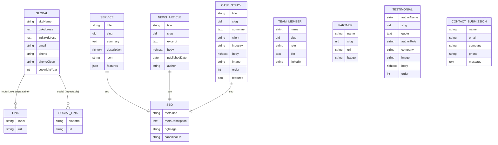

# 02 — Data Architecture & Content Model

> Full field-level Strapi v5 schema for the 8 content types + 3 shared components that back every `CMS-*` component in `01-component-architecture.md`, elaborating the ER preview in `A01-2-REQUIREMENTS/00-overview-and-architecture.md` §5. This is the schema to be modeled by the CMS Engineer persona (`strapi-modeler`) — no content type below exists yet in a running Strapi instance.

---

## 1. Content types (collection types + single type)

### 1.1 `global` (singleType) — `CMS-GLOBAL`

Replaces `assets/data/footer_content.json` + `assets/js/load-footer.js` entirely; no client-side fetch-and-inject step in the target.

| Field | Type | Required | Notes |
|-------|------|----------|-------|
| `siteName` | string | — | default `"TrieDatum"` |
| `usAddress` | text | — | preserves line breaks |
| `indiaAddress` | text | — | preserves line breaks |
| `email` | string | — | |
| `phone` | string | — | display format |
| `phoneClean` | string | — | `tel:`-safe digits-only format |
| `copyrightYear` | integer | — | default `2026` |
| `footerLinks` | component (repeatable) → `shared.link` | — | |
| `social` | component (repeatable) → `shared.social-link` | — | |

`draftAndPublish`: enabled (EP-23-S4) but effectively published-only in practice — no preview workflow is needed for footer content.

### 1.2 `service` — `CMS-SERVICE`

| Field | Type | Required | Notes |
|-------|------|----------|-------|
| `title` | string | yes | |
| `slug` | uid | yes | targets `title` |
| `summary` | text | yes | used in the homepage carousel card |
| `description` | richtext | yes | full detail-page body |
| `icon` | string | — | icon identifier/class, lift-and-shift from legacy markup |
| `features` | json | — | bullet list rendered on the detail section |
| `seo` | component → `shared.seo` | — | |

### 1.3 `news-article` — `CMS-NEWS-ARTICLE`

| Field | Type | Required | Notes |
|-------|------|----------|-------|
| `title` | string | yes | |
| `slug` | uid | yes | |
| `excerpt` | text | yes | ticker + grid-card copy |
| `body` | richtext | yes | detail-page body, flexible layout |
| `publishedDate` | date | yes | |
| `author` | string | — | |
| `seo` | component → `shared.seo` | — | |

### 1.4 `case-study` — `CMS-CASE-STUDY`

| Field | Type | Required | Notes |
|-------|------|----------|-------|
| `title` | string | yes | 5 entries are retitled from their legacy source during seed (EP-21-S1) |
| `slug` | uid | yes | |
| `summary` | text | yes | |
| `client` | string | — | |
| `industry` | string | — | |
| `body` | richtext | yes | |
| `image` | string | — | plain URL in v1 — see Risk R1 |
| `order` | integer | — | drives carousel/listing sort |
| `featured` | boolean | — | default `false` |
| `seo` | component → `shared.seo` | — | |

`case8` is seeded here as an ordinary entry with its listing-page inclusion/exclusion governed by the EP-21-S4 parity decision, not a schema-level flag.

### 1.5 `team-member` — `CMS-TEAM-MEMBER`

| Field | Type | Required | Notes |
|-------|------|----------|-------|
| `name` | string | yes | |
| `slug` | uid | yes | |
| `role` | string | yes | job title |
| `bio` | text | — | |
| `linkedin` | string | — | outbound profile URL |

### 1.6 `partner` — `CMS-PARTNER`

| Field | Type | Required | Notes |
|-------|------|----------|-------|
| `name` | string | yes | |
| `slug` | uid | yes | |
| `url` | string | yes | outbound partner site |
| `badge` | string | — | logo asset reference |

Shared verbatim between the homepage strip (`SEC-PARTNERS`) and `PAGE-PARTNERSHIP` (`SEC-PARTNER-CARDS`) — one collection, two renderers, per EP-10/EP-17. The `Cognition.png` legacy asset with no referencing entry is a content-owner decision, not a schema gap (overview §10).

### 1.7 `testimonial` — `CMS-TESTIMONIAL`

| Field | Type | Required | Notes |
|-------|------|----------|-------|
| `authorName` | string | yes | |
| `slug` | uid | yes | targets `authorName` |
| `quote` | text | yes | short pull-quote used in previews/carousel |
| `authorRole` | string | — | |
| `company` | string | — | may hold an anonymized value verbatim (e.g. `"Large Pharmaceutical International Organization"`) — content characteristic to preserve |
| `image` | string | — | |
| `body` | richtext | yes | full essay **or** Q&A content; the format difference is carried entirely by richtext structure (headings vs. bold-lead paragraphs), not by a schema field |
| `order` | integer | — | |

One shared richtext renderer handles both native formats at `PAGE-TESTIMONIAL-DETAIL` — no per-format content-type variant.

### 1.8 `contact-submission` — `CMS-CONTACT-SUBMISSION`

| Field | Type | Required | Notes |
|-------|------|----------|-------|
| `name` | string | yes | |
| `email` | string (email format) | yes | |
| `company` | string | — | |
| `phone` | string | — | |
| `message` | text | yes | |

`draftAndPublish`: **disabled** — this is the one content type explicitly excluded from draft/publish (EP-23-S4), and the one content type with no `Public` `find`/`findOne`/`update`/`delete` — `create`-only (§3).

---

## 2. Shared components (`shared.*`)

| Component | Fields | Used by |
|-----------|--------|---------|
| `shared.link` | `label` (string), `url` (string) | `global.footerLinks` (repeatable) |
| `shared.social-link` | `platform` (string), `url` (string, required) | `global.social` (repeatable) |
| `shared.seo` | `metaTitle` (string), `metaDescription` (text), `ogImage` (string), `canonicalUrl` (string) | `service.seo`, `news-article.seo`, `case-study.seo` — the three content types with per-page generic/duplicated legacy metadata being replaced (EP-24-S1) |

---

## 3. ER diagram

`TEAM_MEMBER`, `PARTNER`, `TESTIMONIAL`, and `CONTACT_SUBMISSION` have no `shared.seo` relation — none of them back a route with unique per-entry `<head>` metadata beyond the parent listing page's metadata.

---

## 4. Public-role permission matrix (summary; full detail and hard rules in `05-security-and-nfr.md` §1)

| Content type | `find` | `findOne` | `create` | `update` | `delete` |
|---|---|---|---|---|---|
| `global` (singleType — only `find` exists) | Public | n/a | admin only | admin only | admin only |
| `service` | Public | Public | admin only | admin only | admin only |
| `news-article` | Public | Public | admin only | admin only | admin only |
| `case-study` | Public | Public | admin only | admin only | admin only |
| `team-member` | Public | Public | admin only | admin only | admin only |
| `partner` | Public | Public | admin only | admin only | admin only |
| `testimonial` | Public | Public | admin only | admin only | admin only |
| `contact-submission` | **denied** | **denied** | **Public** | admin only | admin only |

Rules that hold without exception (EP-23-S2, EP-23-S3): Public `find`/`findOne` only ever returns entries in the `published` state (per `draftAndPublish`, §1.8 excepted); Public never gets `update`/`delete` on anything, including `contact-submission`; `contact-submission` is the **only** content type where Public gets `create`, and it gets nothing else there.

---

## 5. `draftAndPublish` matrix

| Content type | `draftAndPublish` |
|---|---|
| `global`, `service`, `news-article`, `case-study`, `team-member`, `partner`, `testimonial` | Enabled |
| `contact-submission` | **Disabled** — a submission is a fact, not editorial copy; there is no "draft" state for a lead |

---

## 6. `[RISKS / OPEN QUESTIONS]`

| # | Item | Impact |
|---|------|--------|
| D1 | `image`/`badge`/`ogImage` fields are plain string URLs, not Strapi Media Library relations, in v1 (overview §10 R1). | A fast-follow to true media relations changes these fields' type from `string` to a media relation — tracked here so the migration is a schema change, not a surprise. |
| D2 | No `bootcamp-program` content type exists — `SEC-BOOTCAMP-PROGRAMS`/`SEC-BOOTCAMP-COMPARE` render structurally hard-coded v1 data (overview §10 R2). | If promoted to CMS-driven, add a new collection type here and a corresponding `CMS-BOOTCAMP-PROGRAM` entry in `01-component-architecture.md`. |
