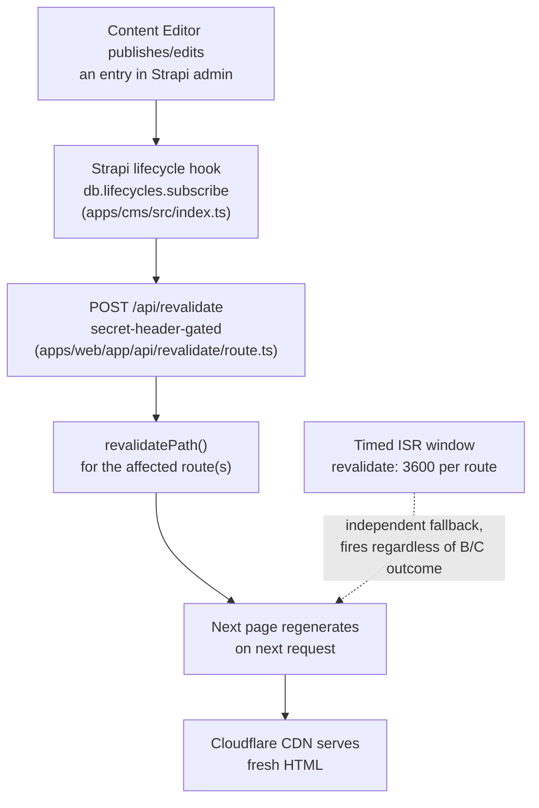

# 04 — Content-Editing Pipeline & Data Exchange

> Elaborates the publish → revalidate → CDN-serve pipeline sketched in `A01-2-REQUIREMENTS/00-overview-and-architecture.md` §6 into full sequence detail, failure modes, and the timed-ISR fallback contract that the site's correctness depends on. Backs `API-REVALIDATE` (EP-26) and `API-CONTACT` (EP-18); to be implemented, not yet running.

---

## 1. Pipeline overview



Two independent triggers converge on the same regeneration step (E): the fast, best-effort webhook path (A→D) and the always-on timed path (G). Neither depends on the other; the timed path is the one the architecture's correctness guarantee rests on (principle P4, overview §2).

---

## 2. Sequence — on-demand path (happy path)

```mermaid
sequenceDiagram
    actor CE as Content Editor
    participant Strapi as apps/cms (Strapi v5)
    participant Hook as Lifecycle hook
    participant Revalidate as API-REVALIDATE
    participant Next as apps/web (Next.js)
    participant CDN as Cloudflare CDN
    actor Visitor as Site Visitor

    CE->>Strapi: Publish case-study "acme-corp"
    Strapi->>Strapi: Persist entry (durable write completes)
    Strapi->>Hook: afterCreate/afterUpdate fires
    Hook->>Revalidate: POST /api/revalidate<br/>{contentType: "case-study", slug: "acme-corp"}<br/>+ secret header
    Revalidate->>Revalidate: Validate STRAPI_REVALIDATE_SECRET
    Revalidate->>Revalidate: Map contentType+slug → paths<br/>(/case-studies/acme-corp, homepage carousel)
    Revalidate->>Next: revalidatePath() for each mapped path
    Revalidate-->>Hook: 200 (paths revalidated)
    Note over Strapi,Hook: Strapi write already committed before this point;<br/>hook result never rolls it back.
    Visitor->>Next: GET /case-studies/acme-corp
    Next->>Next: Regenerate page (fresh content)
    Next-->>CDN: Fresh HTML
    CDN-->>Visitor: Serve fresh HTML
```

Key property: the Strapi write (step 2) is **committed before** the webhook fires. The webhook is purely a downstream notification — it can never block, delay, or fail the editorial action itself.

---

## 3. Sequence — contact-form write path (`API-CONTACT`, EP-18)

```mermaid
sequenceDiagram
    actor PC as Prospective Client
    participant Form as SEC-CONTACT-FORM (client)
    participant API as API-CONTACT
    participant Strapi as CMS-CONTACT-SUBMISSION
    participant Resend as Resend (email)
    actor Admin as Site Administrator

    PC->>Form: Fills name/email/company/phone/message
    Form->>Form: Client-side validation + honeypot field (empty)
    Form->>API: POST /api/contact
    API->>API: Server-side re-validation (never trusts client alone)
    alt honeypot populated (bot)
        API-->>Form: 2xx success-shaped response (no write, no tell)
        API->>API: Log rejection server-side
    else valid human submission
        API->>Strapi: create contact-submission<br/>(Public role, create-only)
        Strapi-->>API: 201 Created
        API-->>Form: 2xx success response (returned immediately)
        API->>Resend: Best-effort notification email<br/>(does not block the response already sent)
        alt Resend succeeds
            Resend-->>Admin: Email delivered
        else Resend fails/times out/misconfigured
            Resend--xAPI: Error
            API->>API: Catch + log; Strapi record remains the durable source of truth
        end
    end
```

Key property: persistence (Strapi write) and notification (Resend email) are **decoupled** — the opposite of legacy `mail.php`, where the `mail()` call *was* the only record and its failure lost the lead entirely (doc 00 overview §1). The visitor-facing response is never held open waiting on email delivery.

---

## 4. Content-type → path mapping (`API-REVALIDATE`'s responsibility)

`API-REVALIDATE` owns a fixed mapping from the 7 editorial content types to the Next.js paths a change to that type can affect. This mapping is deliberately closed (not a general-purpose "invalidate anything" surface):

| `contentType` | Paths revalidated |
|---|---|
| `global` | Every route (footer/contact-info chrome is global) |
| `service` | `/services`, `/` (homepage carousel) |
| `case-study` | `/case-studies/[slug]`, `/case-studies`, `/` (homepage carousel) |
| `news-article` | `/news/[slug]`, `/news`, `/` (homepage ticker + grid) |
| `team-member` | `/about` |
| `partner` | `/partnership`, `/` (homepage strip) |
| `testimonial` | `/testimonials/[slug]`, `/` (homepage carousel) |

`contact-submission` is absent from this table by design — it has no lifecycle hook (EP-26-S2 explicit carve-out) and no rendered page to invalidate.

---

## 5. Failure modes & how the pipeline degrades

| Failure | Where it happens | Behavior |
|---|---|---|
| Wrong/missing secret header on `/api/revalidate` | `API-REVALIDATE` | `401`; no revalidation performed; Strapi write is unaffected (already committed upstream). |
| Unrecognized `contentType` in the request body | `API-REVALIDATE` | `400` with a clear error naming the unrecognized type; no unhandled exception, no server crash. |
| `apps/web` unreachable when the lifecycle hook fires (down for maintenance, network blip) | Lifecycle hook → `API-REVALIDATE` | POST fails (connection refused/timeout); the hook logs the failure and **does not** roll back or block the Strapi write; no error surfaces to the Content Editor. |
| `afterDelete` on a previously-cached entity | Lifecycle hook | Same webhook pattern as create/update — the corresponding path is revalidated so the deleted entity stops appearing on the next request. |
| Timed window and on-demand path overlap | `apps/web` ISR | The two mechanisms do not conflict: a page just revalidated on-demand keeps serving that fresh content until its own `revalidate: 3600` window independently elapses — no redundant regeneration is forced. |
| `contact-submission` write succeeds, Resend fails/times out/misconfigured (`RESEND_API_KEY` unset) | `API-CONTACT` | Error is caught and logged; the visitor still receives the same success response; the Strapi record remains the durable source of truth regardless of email outcome. |
| Honeypot field populated | `API-CONTACT` | No Strapi write; a success-shaped response is still returned (so as not to reveal the anti-spam mechanism to the bot); rejection logged server-side. |

**The invariant that survives every failure above:** the Strapi write for editorial content, and the Strapi write for a contact submission, are never lost or blocked by a downstream step failing. Only *freshness timing* degrades — never data durability.

---

## 6. Timed-ISR fallback contract

- Every content-backed route in `apps/web` declares `revalidate: 3600` (one hour) **independently** of whether it also participates in the on-demand webhook path.
- This is not a "backup in case the webhook is broken" afterthought — it is the mechanism the design explicitly treats as load-bearing for correctness (principle P4, overview §2); the webhook exists purely to make the *common case* fast.
- Concretely: if a Content Editor publishes a change while the `apps/web` process is down (local dev not running, production mid-deploy), the webhook has nothing to reach and fails silently by design — but the change is still visible everywhere within the hour once the process is back up and the window elapses, with zero manual cache-clear or redeploy.
- Cloudflare's own edge cache sits in front of Next.js's regeneration; purging the CDN edge beyond what Next.js's own revalidation triggers already covers is explicitly out of scope for v1 (overview §10, R6) — a theoretical stale-edge-in-front-of-fresh-origin scenario is not designed against here.

---

## 7. `[RISKS / OPEN QUESTIONS]`

| # | Item | Impact |
|---|------|--------|
| P1 | The webhook's best-effort semantics mean a Content Editor gets no in-admin confirmation that the front end actually revalidated — only that Strapi saved (overview §10, R3). | No editorial UX signal of webhook health; a monitoring/alerting layer on webhook failure rate is explicitly out of scope for this pipeline's v1 code requirements (EP-26-S3). |
| P2 | No retry/backoff queue for a failed webhook delivery — the timed window is the only fallback, by design (EP-26-S2 explicit out-of-scope). | Acceptable given P4/A6 (doc 03) hold; revisit only if the 1-hour worst case proves too slow for a real editorial workflow. |
