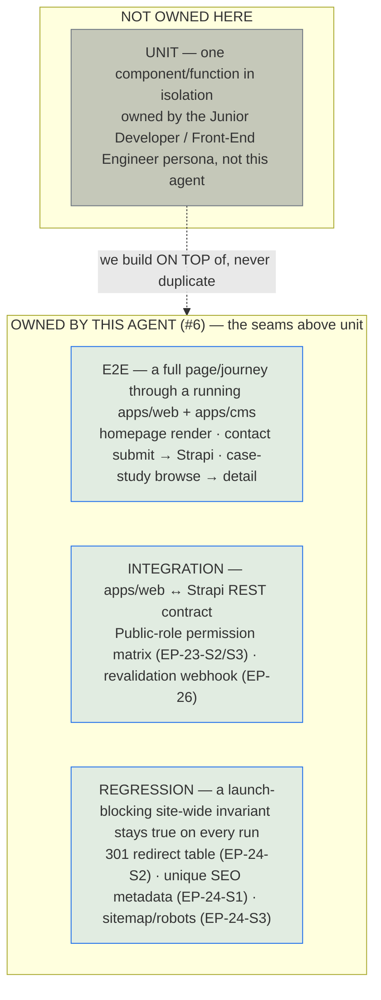

# SOLUTION-TESTS — TDWebsite2 Migration QA Campaign

> **Producer:** Test Automation agent (#6, *Develop* phase) of the TrieDatum
> Agentic SDLC. This agent owns the test layers **above** unit — integration
> (contract) and end-to-end (journey/regression) — covering the seams between
> `apps/web` and `apps/cms` that component-level unit tests cannot reach. It
> writes **test plans and illustrative test code**; a test that reveals a real
> defect becomes a tracked issue, never a silent code fix from this agent.
>
> **System under test:** the **TrieDatum marketing website migration** —
> `TDWebsite` (static Themeholy HTML/jQuery, 23 pages) →
> `TDWebsite2` (Next.js 14 App Router + Strapi v5 + PostgreSQL npm-workspaces
> monorepo: `apps/web` + `apps/cms` + `packages/shared` + `packages/seed`).
>
> **Upstream input consumed:** [`../A01-2-REQUIREMENTS/`](../A01-2-REQUIREMENTS/)
> — 27 Epics / 80 Stories across 9 section documents — is the **sole**
> authoritative source for this deliverable. Other AIDLC phase folders for this
> project (solution architecture, unit tests, etc.) may still be in progress
> concurrently and are intentionally **not** depended on here.

---

## Status at a glance — this is a first-pass campaign, planned against a system still being built

**This is not a "green build" report.** `TDWebsite2` (verified directly against the
real target monorepo checkout at authoring time) currently has route scaffolding,
static/CMS-driven homepage sections, and Strapi content-type folders in place, but:

- No test runner (Playwright, Vitest, `node --test`, pytest, etc.) is wired into
  either `apps/web/package.json` or the monorepo root yet.
- The `/case-studies` **listing** route (`EP-21-S2`) does not exist yet — only
  `/case-studies/[slug]` does. Any test that exercises "View All" → `/case-studies`
  will fail against the current checkout, as documented in the campaign report.
- Strapi permissions (EP-23-S2/S3), the revalidation webhook (EP-26-S1/S2), and the
  full 301 redirect table (EP-24-S2) have not been independently verified running.

Every artifact in this folder is written and organized as if the suites *will* run
the moment the target environment is stood up — see
[`testing-results/run-20260701-090000/campaign-report.md`](testing-results/run-20260701-090000/campaign-report.md)
for the honest, first-run breakdown of planned vs. blocked vs. executed.

---

## What this folder contains

```
A06-1-SOLUTION-TESTS/
├── README.md                              ← this file
├── test-plans-and-code/
│   ├── plans/
│   │   ├── TP-000-master-campaign-plan.md      ← overall scope, environments, tooling, gating
│   │   ├── TP-E2E-page-journeys.md             ← Playwright plan: homepage → contact/case-studies journeys
│   │   ├── TP-INT-cms-integration.md           ← REST-client plan: apps/web ↔ Strapi contract tests
│   │   └── TP-REG-seo-and-redirects.md         ← 301-redirect / SEO regression suite plan
│   ├── e2e/                                    ← illustrative Playwright specs (TypeScript)
│   │   ├── homepage.spec.ts
│   │   ├── contact-form.spec.ts
│   │   └── case-study-journey.spec.ts
│   └── integration/                            ← illustrative REST-client integration tests (TypeScript)
│       ├── strapi-permissions.test.ts
│       └── revalidate-webhook.test.ts
└── testing-results/
    └── run-20260701-090000/                    ← this campaign's single run record
        ├── campaign-report.md                  ← narrative: pass/planned/blocked + next steps
        └── summary.json                        ← structured counts by status
```

## Test layer ownership (why these suites, and why no unit layer here)



The governing plan is
[`test-plans-and-code/plans/TP-000-master-campaign-plan.md`](test-plans-and-code/plans/TP-000-master-campaign-plan.md);
it maps the requirements' 27 Epics / 80 Stories onto the three per-suite plans
listed above.

## How to run the campaign (once the target environment exists)

```bash
# from the TDWebsite2 monorepo root, with apps/web and apps/cms both running
# (this scaffold's specs are illustrative; wiring them into TDWebsite2's own
# package.json / CI is tracked as a next step in the campaign report)

npx playwright test test-plans-and-code/e2e --config=playwright.config.ts
npx vitest run test-plans-and-code/integration
```

No suite in this folder has been executed against a live `apps/web` + `apps/cms`
deployment as of this run — see the campaign report for exactly what was and
was not exercised, and why.

## Status

See
[`testing-results/run-20260701-090000/campaign-report.md`](testing-results/run-20260701-090000/campaign-report.md)
for the latest (and, to date, only) campaign verdict, and
[`summary.json`](testing-results/run-20260701-090000/summary.json) for the
machine-readable counts.
