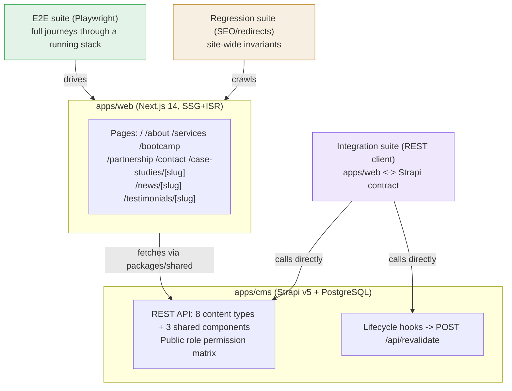
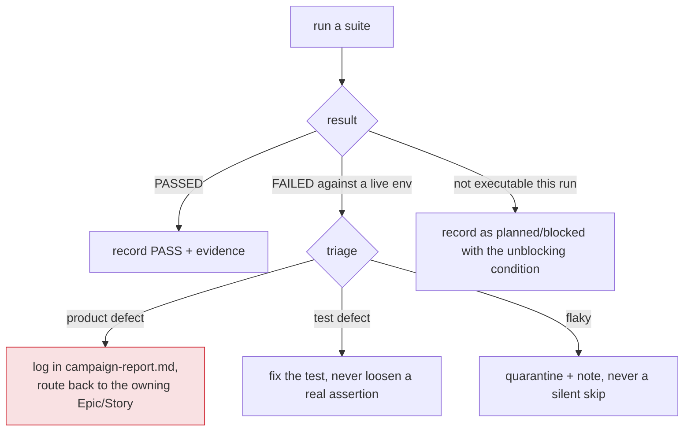

# TP-000 — Master Test-Automation Campaign Plan

> **Agent:** Test Automation (#6). **Scope:** integration (apps/web ↔ Strapi
> contract) · E2E (page/journey) · regression (SEO/redirects) for the
> `TDWebsite` → `TDWebsite2` migration. **Inherits:**
> [`../../../A01-2-REQUIREMENTS/`](../../../A01-2-REQUIREMENTS/) — 27 Epics /
> 80 Stories across sections A–I — as the sole upstream input. This document
> maps that requirement set onto concrete suites in this folder and records
> the design decisions a reviewer needs.

---

## 1. Mandate and boundaries

This campaign verifies **solution-level** behavior: whole user journeys through
a deployed `apps/web` + `apps/cms` stack, the REST contract between them, and
the site-wide SEO/redirect invariants that no single component test can catch.
It explicitly does **not**:

- Re-implement component/function unit tests (owned by the Front-End
  Engineer / CMS Engineer personas building `apps/web` and `apps/cms`).
- Fix any production code. A confirmed failure is logged as a defect in the
  campaign report and routed back to the owning Epic — never silently patched
  by this agent.
- Author or reinterpret acceptance criteria. An untestable or ambiguous AC
  (e.g. the still-open `EP-21-S4` case8 disposition) is flagged as a blocked
  item, not guessed at.

Every test here **maps to at least one Story's acceptance criteria**. Untraceable
tests are noise and are not written.

## 2. Why this is a first-pass plan, not a completed run

`A01-2-REQUIREMENTS` is the authoritative and, as of this writing, most mature
AIDLC artifact available for this project — solution architecture, unit tests,
and prior QA runs for `TDWebsite2` either do not exist yet or are being
authored concurrently by other agents and are deliberately **not** waited on
(per this agent's brief). Independently checking the real target monorepo
checkout confirms the build is genuinely mid-flight: route folders and Strapi
content-type directories exist, but no test runner is wired in yet, and at
least one required route (`/case-studies` listing, `EP-21-S2`) is not yet
implemented. This plan is therefore written to be **immediately runnable the
moment the environment exists**, and the first campaign run
(`testing-results/run-20260701-090000/`) honestly reports what could and could
not be exercised today rather than fabricating a passing run.

## 3. The three suites and what each proves

| Suite | Tool | Layer | Target | Plan |
|---|---|---|---|---|
| [`e2e/`](../e2e) | Playwright (TypeScript) | E2E / journey | a running `apps/web` (+ `apps/cms` for CMS-driven sections) | [`TP-E2E-page-journeys.md`](TP-E2E-page-journeys.md) |
| [`integration/`](../integration) | REST-client (TypeScript, `fetch`/Vitest) | Integration / contract | `apps/cms` Strapi REST API directly, no browser | [`TP-INT-cms-integration.md`](TP-INT-cms-integration.md) |
| *(cross-cutting, asserted from both suites)* | Playwright + REST-client | Regression | 301 redirect table, unique SEO metadata, sitemap/robots | [`TP-REG-seo-and-redirects.md`](TP-REG-seo-and-redirects.md) |

## 4. Environments

| Environment | Purpose | Notes |
|---|---|---|
| **Local dev** | `apps/web` (`next dev -p 3000`) + `apps/cms` (`npm run cms:develop`, port 1337) + local PostgreSQL | Primary target for this campaign's E2E and integration suites once wired in |
| **Staging (Hostinger VPS, pre-cutover)** | Full parity check before cutover — the environment `EP-24`'s redirect-coverage test and `EP-27`'s health checks are specified against | Not yet provisioned as of this run (`EP-27` still in progress per requirements) |
| **Production (post-cutover)** | Smoke-only subset (redirects, GA4 tag, contact form) run once, immediately after DNS cutover | Out of scope for this campaign; tracked as a future run |

This run exercises none of the above live — see §6 and the campaign report.

## 5. Tooling decisions and why

- **Playwright over Cypress/Selenium** for E2E: first-class multi-browser
  support, native TypeScript, and a request-interception API well suited to
  asserting the CMS-driven sections (Services/News/Testimonials/Partners/Case
  Studies carousels) render from real Strapi data without needing a second
  tool for API assertions inside a browser test.
- **A plain REST-client integration suite (`fetch` + Vitest assertions), not a
  browser** for the Strapi contract layer: permission-matrix and webhook
  assertions are pure HTTP-in/HTTP-out contracts (`EP-23-S2/S3`, `EP-26-S1/S2`)
  — running them through a browser would add Playwright's overhead for zero
  additional coverage.
- **No pytest / Python layer**: unlike a data-engineering target, nothing in
  this stack (Next.js, Strapi, PostgreSQL, all Node-based) benefits from a
  second language runtime; a single TypeScript toolchain matching
  `apps/web`'s own `tsc --noEmit` discipline keeps the campaign's tooling
  surface minimal.

## 6. Entry / exit criteria

**Entry criteria** for a campaign run to be executed (not just planned):
1. `apps/cms` boots against a PostgreSQL instance with the 8 content types
   from `EP-23-S1` present.
2. `apps/web` boots and can reach `apps/cms` via `packages/shared`.
3. The Strapi seed (`packages/seed`) has populated at least the minimum
   fixture set each suite's plan specifies (e.g. ≥1 published `case-study`,
   the `global` single-type entry, a `contact-submission`-capable Public role).

**As of `run-20260701-090000`, entry criterion 1 is partially met** (content-type
folders exist under `apps/cms/src/api/`) but criteria 2–3 could not be
confirmed against a live boot in this pass — see the campaign report §2.

**Exit criteria** for a campaign to be considered a **clean gate**:
- Every P1 Story's mapped acceptance-criteria scenario has a green test at its
  designated layer (§7).
- No assertion was loosened, no test skipped/`.only`/`.skip`'d to reach green.
- Any failure is either a logged defect (routed back to its Epic) or an
  explicitly recorded `blocked` entry with a stated unblocking condition —
  never a silenced red.

This run is **not** a clean gate — it is a planning-and-illustration pass; see
the campaign report for the honest status of every suite.

## 7. How P1 stories gate launch

Per `A01-2-REQUIREMENTS/00-overview-and-architecture.md` §8, **P1 = launch-blocking**.
This campaign treats "all P1 acceptance criteria green" as the site's actual
go-live gate, independent of P2–P4 status. The P1-tagged Epics this campaign's
three suites are scoped to cover, end to end:

| Epic | Title | Suite(s) covering it |
|---|---|---|
| EP-01 | Global Site Header & Navigation | e2e (nav parity across journeys) |
| EP-02 | Global Footer & Site Settings | e2e (footer chrome on every journey), integration (`global` single type read) |
| EP-03 | Shared Page Chrome (Preloader/ScrollTop/GA4) | e2e (homepage) |
| EP-04 | Homepage Hero Slider | e2e (homepage) |
| EP-05 | Homepage About Teaser | e2e (homepage) |
| EP-06 | Homepage Services Carousel | e2e (homepage), integration (`service` read) |
| EP-07 | Homepage Stats Counters | e2e (homepage) |
| EP-08 | Homepage News Marquee & Grid | e2e (homepage), integration (`news-article` read) |
| EP-11 | Homepage Case Studies Carousel | e2e (homepage, case-study journey) |
| EP-18 | Contact Form & Submission Handling | e2e (contact-form), integration (create-only permission) |
| EP-23 | Strapi Content Modeling & Permissions | integration (permission matrix) |
| EP-24 | SEO, Metadata, Sitemap & 301 Redirects | regression (seo-and-redirects) |
| EP-27 | Hosting, Deployment & CI/CD | out of scope for this campaign (infra-provisioning verification, not app-level testing) |

P2–P4 Epics (EP-09/10/19/20–22/25/26 in part) are covered by the same suites
where in scope, but a P2+ failure does not, by itself, block the launch gate —
see each suite's plan for its own priority-weighted test inventory.

## 8. Triage and defect handling

**No-silencing rule:** no loosened/deleted assertions, no `test.skip`/`.only`/
`xfail`-equivalent on a real failure, no threshold tuned purely to go green.
An untestable AC is a Planner/Analyst question, not something to invent around.
