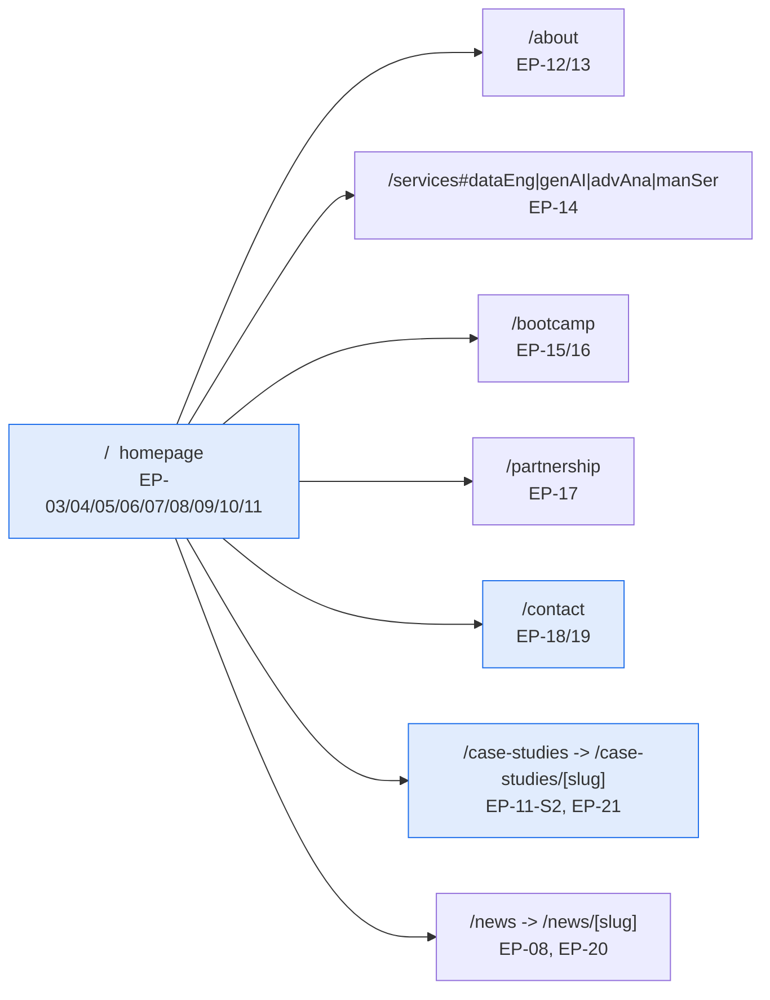

# TP-E2E — Page & Journey Coverage Suite

> **Suite:** [`../e2e/`](../e2e) · **Tool:** Playwright (TypeScript) · **Layer:**
> E2E / journey · **Inherits:** TP-000, `A01-2-REQUIREMENTS` Sections A, B, C, D,
> E, F, G, H. **Target:** a running `apps/web` (port 3000) with `apps/cms`
> reachable for CMS-driven sections.

## 1. What this suite proves

Every route a Site Visitor or Prospective Client can actually navigate to
renders the correct legacy-parity content, chrome, and CTAs, and the two
highest-value conversion journeys — contact-form submission and case-study
browsing — complete end to end through a real browser. This is the layer that
catches "the component compiles but the journey is broken" failures that no
unit test and no isolated Strapi contract test can see.

## 2. Route inventory under test (grounded in the real target monorepo)

Confirmed present under `apps/web/app/` in the `TDWebsite2` checkout at
authoring time: `/` (`page.tsx`), `/about`, `/services`, `/bootcamp`,
`/partnership`, `/contact`, `/news`, `/news/[slug]`, `/case-studies/[slug]`,
`/testimonials/[slug]`. **Not yet present:** a `/case-studies` listing
`page.tsx` (only the `[slug]` dynamic route exists) — `EP-21-S2` is
specified but not yet built; every spec that depends on it is written against
the *specified* behavior and will fail informatively (not silently pass)
against today's checkout. This gap is carried into the campaign report as a
blocked item, not quietly worked around.

## 3. Journeys and the pages they cover

## 4. Per-page/journey test inventory

| Spec | Journey | Key Stories exercised | Priority |
|---|---|---|---|
| [`homepage.spec.ts`](../e2e/homepage.spec.ts) | Land on `/`, verify hero/nav/chrome, scroll through CMS-driven sections | EP-01-S1, EP-03-S3, EP-04-S1/S2, EP-06-S1 | P1 |
| [`contact-form.spec.ts`](../e2e/contact-form.spec.ts) | Fill and submit the contact form, verify client validation and honeypot behavior | EP-18-S1, EP-18-S2, EP-18-S3 | P1 |
| [`case-study-journey.spec.ts`](../e2e/case-study-journey.spec.ts) | Homepage carousel → "View All" → listing → detail page | EP-11-S1, EP-11-S2, EP-21-S2 | P1 |
| *(planned, not yet authored)* `about.spec.ts` | `/about` "Our Story" + team grid parity | EP-12, EP-13 | P2 |
| *(planned, not yet authored)* `services.spec.ts` | `/services` 4 sections + anchor-id parity (`#dataEng`/`#genAI`/`#advAna`/`#manSer`) | EP-14-S2 | P1 |
| *(planned, not yet authored)* `bootcamp.spec.ts` | `/bootcamp` micro-site chrome + JSON-LD | EP-15, EP-25-S2 | P2 |
| *(planned, not yet authored)* `partnership.spec.ts` | `/partnership` page + partner-strip click-through | EP-17, EP-10-S2 | P2 |
| *(planned, not yet authored)* `news-journey.spec.ts` | `/news` listing → `/news/[slug]` detail, gallery lightbox | EP-20-S2 | P2 |

Only the three P1 journeys named in this campaign's scope (`homepage`,
`contact-form`, `case-study-journey`) have illustrative code written this
pass; the remaining rows are logged as planned backlog, not silently omitted.

## 5. Fixtures and determinism

- Each spec assumes a seeded minimum data set: ≥1 published `service`,
  ≥1 published `news-article`, ≥9 published `case-study` entries flagged
  `featured` (the legacy 9-of-10 homepage set per `EP-11-S1`), and the single
  `global` entry.
- No spec depends on wall-clock date/time except where explicitly asserting
  "most recent N" ordering (`EP-08-S2`), which uses `publishedDate` from the
  seeded fixtures, not `Date.now()`.
- Contact-form submissions in `contact-form.spec.ts` use a uniquely-tagged
  test email per run (`e2e-test+<runId>@example.invalid`) so repeat runs never
  collide with or depend on prior runs' Strapi state.

## 6. What this suite does NOT cover (by design)

- Visual regression / pixel-diffing against the legacy site — that is the
  `parity-auditor` agent's job per the Definition of Done in every requirements
  section, not this suite's.
- Load/performance testing — not in scope for this campaign.
- The Strapi admin panel UI itself (Content Editor/Site Administrator
  workflows) — covered indirectly by the integration suite's permission
  assertions, not by browser-driven admin-panel journeys.
