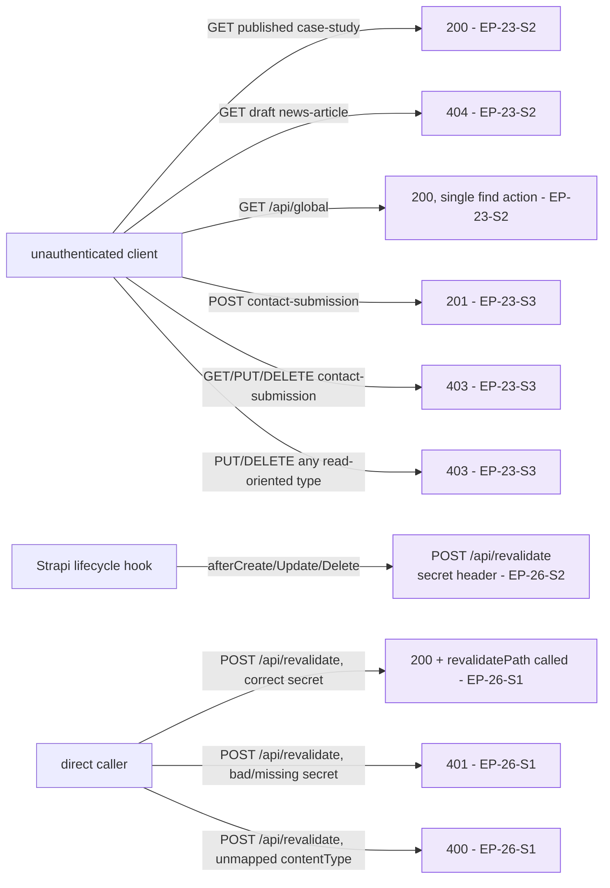

# TP-INT — Strapi CMS Integration Suite

> **Suite:** [`../integration/`](../integration) · **Tool:** REST-client
> (TypeScript `fetch`, asserted with Vitest) · **Layer:** integration / contract
> · **Inherits:** TP-000, `A01-2-REQUIREMENTS` §09 (`EP-23`, `EP-26`). **Target:**
> `apps/cms` Strapi REST API directly — no browser, no `apps/web` in the loop.

## 1. What this suite proves

`apps/web` is only as safe as the permission boundary Strapi enforces and only
as fresh as the revalidation path that invalidates its cache. This suite
verifies both **directly against the Strapi REST API**, independent of any
front-end rendering, because a permission or webhook regression is a
seam-level contract break, not a rendering bug — the fastest, most
deterministic place to catch it is one HTTP call away from the CMS itself.

## 2. Test inventory & mapping

| Test id (file::test) | Scenario | Maps to |
|---|---|---|
| `strapi-permissions.test.ts::published entry is readable anonymously` | `GET /api/case-studies/<slug>` on a published entry → 200 | EP-23-S2 |
| `…::draft entry is not readable anonymously` | `GET /api/news-articles/<slug>` on a draft entry → 404 | EP-23-S2 |
| `…::global single type exposes find only` | `GET /api/global` → 200; no `findOne` route exists | EP-23-S2 |
| `…::anonymous create on contact-submission succeeds` | `POST /api/contact-submissions` valid payload → 201 | EP-23-S3, EP-18-S3 |
| `…::anonymous read of contact-submission is forbidden` | `GET /api/contact-submissions` → 403 | EP-23-S3 |
| `…::anonymous update/delete of contact-submission is forbidden` | `PUT`/`DELETE /api/contact-submissions/<id>` → 403 each | EP-23-S3 |
| `…::no content type grants anonymous update or delete` | matrix sweep across all 8 content types → 403 for `update`/`delete` on every one | EP-23-S3 |
| `revalidate-webhook.test.ts::valid secret revalidates the mapped path(s)` | `POST /api/revalidate {contentType:"case-study", slug}` with correct header → 200 + expected path set | EP-26-S1 |
| `…::missing or wrong secret is rejected` | same call, bad/absent header → 401, no revalidation performed | EP-26-S1 |
| `…::unrecognized contentType is rejected without a 500` | unmapped `contentType` value → 400 with a named error, not a crash | EP-26-S1 |
| `…::lifecycle hook failure does not block the Strapi write` | simulate `apps/web` unreachable during an `afterUpdate` hook → Strapi entry still persists | EP-26-S2 |
| `…::delete triggers the same webhook pattern as create/update` | delete a `testimonial` entry → webhook call observed with the same contentType/slug shape | EP-26-S2 |

## 3. Environment and fixtures

- Requires a running `apps/cms` (default `http://localhost:1337`) with the
  8 content types from `EP-23-S1` registered and at least one published and
  one draft entry per read-oriented type.
- `STRAPI_REVALIDATE_SECRET` must be set identically in the test environment
  and in `apps/web`'s `.env` for the webhook tests to assert a real match/
  mismatch rather than a trivially-true comparison.
- The permission-matrix sweep (`no content type grants anonymous update or
  delete`) iterates all 8 content types from a single source-of-truth list so
  adding a 9th content type later does not silently fall outside coverage.

## 4. Determinism controls

- Every test creates its own fixture entries (via an authenticated setup call
  using an admin/API token, out of the Public role under test) and tears them
  down after assertion, so runs never depend on or pollute shared CMS state.
- The webhook tests assert against a lightweight local HTTP listener standing
  in for `apps/web`'s `/api/revalidate` route where the story under test is
  Strapi's *calling* behavior (`EP-26-S2`), and against the real
  `/api/revalidate` handler where the story under test is the endpoint's own
  logic (`EP-26-S1`) — the two are deliberately not conflated into one test.

## 5. Boundary on what is NOT covered here

- Whether `apps/web` actually *renders* the revalidated page correctly — that
  is the E2E suite's job (`TP-E2E-page-journeys.md`).
- Strapi admin-panel UI behavior (draft/publish button clicks) — covered by
  the requirements' Gherkin as a Content Editor workflow, but not
  browser-automated here; this suite asserts the REST contract those UI
  actions rely on, not the UI itself.
- `draftAndPublish` schema configuration itself (`EP-23-S4`) is asserted
  indirectly (draft entries 404, published entries 200) rather than by
  inspecting Strapi's Content-Type Builder configuration directly.
