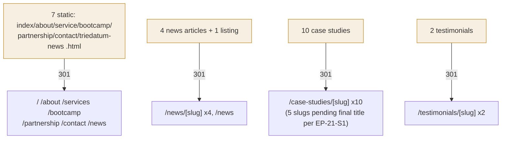

# TP-REG — SEO & 301-Redirect Regression Suite

> **Layer:** regression (site-wide invariant) · **Tools:** Playwright
> (HTTP-response assertions, no page interaction needed) for redirect checks;
> a REST-client script for sitemap/robots/metadata sweeps · **Inherits:**
> TP-000, `A01-2-REQUIREMENTS/09-cms-seo-and-platform.md` (`EP-24`, `EP-25`).
> **Target:** a running `apps/web` with the full redirect map and content
> seed in place.

## 1. What this suite proves, and why it is "regression" not "E2E"

Unlike a journey (which proves a *feature* works), this suite proves a
**standing invariant never regresses**: every one of the 23 legacy URLs keeps
301-ing to the correct new route, no page ever reverts to shipping the generic
duplicated legacy title string, and the machine-readable discovery files
(`sitemap.xml`, `robots.txt`) stay in sync with published content. Because
these are exactly the kind of cross-cutting properties that are easy to break
by accident in an unrelated change (e.g. renaming a slug, forgetting to add a
new content type to the sitemap generator), this suite is designed to run on
every change to `apps/web`'s routing/SEO surface, not just once at launch.

## 2. The 23-URL redirect table under test

Per `A01-2-REQUIREMENTS/09-cms-seo-and-platform.md` (`EP-24-S2`): 7 static
pages, 4 news articles + 1 news listing page, 10 case studies, 2 testimonials
= 23 legacy URLs (`case8.html`'s inclusion/exclusion tracks the separate
`EP-21-S4` disposition decision and is asserted once that decision is
recorded — see the campaign report for its current open status).

## 3. Test inventory

| Test | Assertion | Maps to |
|---|---|---|
| `redirect-table.spec.ts::all 7 static pages 301 correctly` *(planned)* | each of `/index.html`, `/about.html`, `/service.html`, `/bootcamp.html`, `/partnership.html`, `/contact.html`, `/triedatum-news.html` → 301 with the correct `Location` | EP-24-S2 |
| `redirect-table.spec.ts::all 4 news + listing URLs 301 correctly` *(planned)* | EP-20-S3 |
| `redirect-table.spec.ts::all 10 case-study URLs 301 correctly, including retitled slugs` *(planned)* | EP-21-S3 |
| `redirect-table.spec.ts::both testimonial URLs 301 to their consolidated target` *(planned)* | EP-22-S3, EP-24-S2 |
| `redirect-table.spec.ts::no legacy URL 404s` *(planned)* | full 23-URL sweep, fails loudly on any gap | EP-24-S2 |
| `seo-metadata.spec.ts::no two pages share an identical metaTitle` *(planned)* | pairwise comparison across all content-backed routes | EP-24-S1 |
| `seo-metadata.spec.ts::no page ships the legacy generic string` *(planned)* | literal string match against `"TrieDatum - Your Trusted Partner in AI & Data"` on every route | EP-24-S1 |
| `seo-metadata.spec.ts::exactly one canonical tag per page, full OG triple present` *(planned)* | `<link rel="canonical">` count === 1; `og:title`/`og:description`/`og:image` all non-empty | EP-24-S4 |
| `discovery-files.spec.ts::sitemap.xml includes every published route, excludes drafts` *(planned)* | XML parse + set comparison against the seeded published/draft fixture | EP-24-S3 |
| `discovery-files.spec.ts::robots.txt allows the public site, disallows the cms subdomain` *(planned)* | text assertion on `robots.txt` body | EP-24-S3 |
| `ga4-tag.spec.ts::GA4 fires with the correct measurement ID on every route, including client-side transitions` *(planned)* | network assertion for a `gtag`/`collect` request tagged `G-HP0RJZ369Q` | EP-03-S3, EP-25-S1 |

No code for this suite is authored in this pass (the task scope for
illustrative specs was the three E2E journeys and two integration tests); this
plan exists so the redirect/SEO regression suite is fully specified and ready
to implement as the very next increment — see the campaign report's next
steps.

## 4. Determinism and coverage-completeness controls

- The redirect table is asserted as a **closed set of exactly 23 entries**
  read from one shared source-of-truth data file, not hand-enumerated per
  test — so a URL silently dropped from the map fails the count assertion
  even if every *present* entry still redirects correctly (this is the exact
  failure mode `EP-24-S2`'s AC calls out explicitly).
- The 5 case-study slugs still pending a finalized title (`EP-21-S1`) are
  asserted with a "pending" status, not skipped — per `EP-21-S3`'s AC, a
  permanent 301 must never be issued to a slug that is still subject to
  change, so this suite's job is to confirm the build fails the
  redirect-coverage check or emits an interim redirect, not to itself finalize
  the slugs.
- The generic-title check runs against the specific 5+ legacy pages named in
  `00-overview-and-architecture.md` §3 item 5 (`index`, `about`, `service`,
  most case studies, half of news) as a known-affected set, plus a site-wide
  sweep so a *new* page accidentally introducing the generic string is also
  caught.

## 5. Boundary on what is NOT covered here

- Actually submitting the sitemap to Search Console/Bing Webmaster Tools — an
  operational step outside this codebase (`EP-24-S3` out-of-scope note).
- JSON-LD structured-data validation (`EP-25-S2`) — tracked separately as it
  is content-shape correctness, not a redirect/metadata regression; a future
  `structured-data.spec.ts` is a natural extension of this suite but is not
  claimed as covered here.
