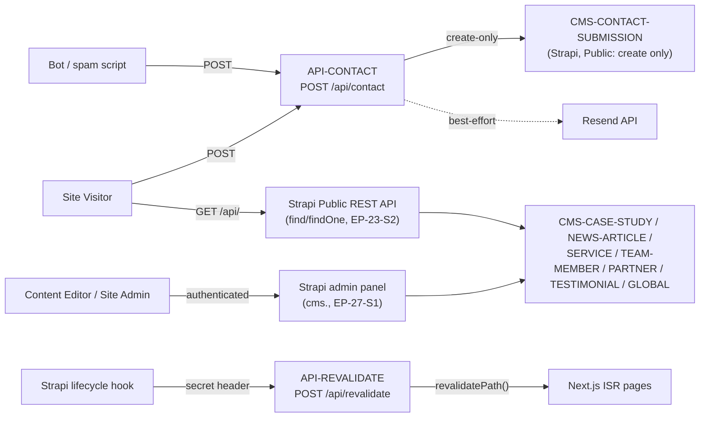

# Threat Model — TrieDatum Website Modernization

**Scope:** `apps/web` (Next.js 14, App Router) + `apps/cms` (Strapi v5 + PostgreSQL), as specified
in `A01-2-REQUIREMENTS/00-overview-and-architecture.md`, `07-contact-and-lead-capture.md`, and
`09-cms-seo-and-platform.md`, and as already implemented in the code present at scan time
(`apps/web/app/api/contact/route.ts`, `apps/web/app/api/revalidate/route.ts`, `apps/cms/src/index.ts`,
`apps/cms/src/api/global`, `apps/cms/src/api/case-study`).

This is a public marketing site with one transactional write path (the contact form). There is no
end-user authentication anywhere on the public site — every visitor is anonymous. The only
authenticated surface is the Strapi admin panel.

## 1. Actors

| Actor | Trust level | Capability |
|---|---|---|
| **Site Visitor / Prospective Client** | Untrusted, anonymous | Reads all public pages; can `POST /api/contact`; can (per EP-23-S2) anonymously `GET`/`findOne` every published editorial content type directly against the Strapi REST API |
| **Automated bot / spam script** | Untrusted, adversarial | Same capabilities as a Site Visitor, at arbitrary volume and speed — no CAPTCHA/Turnstile gate exists yet (EP-18-S5, deferred to P4) |
| **Content Editor** | Trusted, authenticated (Strapi admin) | Create/update/delete on editorial content types via the Strapi admin panel |
| **Site Administrator** | Trusted, authenticated (Strapi admin + VPS) | Manages Strapi users/roles/permissions, `.env` secrets, VPS deployment |
| **Strapi lifecycle hook (`apps/cms/src/index.ts`)** | Trusted, server-to-server | Calls `POST /api/revalidate` on `apps/web` with `STRAPI_REVALIDATE_SECRET` |

## 2. Attack surfaces (data-flow view)

Four distinct externally-reachable surfaces exist:

1. **The public contact form** (`apps/web/app/contact/page.tsx` → `POST /api/contact` →
   `apps/cms` `contact-submission`) — the only public write path in the whole system (EP-18/EP-23-S3).
2. **The Strapi public REST API** (`find`/`findOne` on 7 content types, EP-23-S2) — read-only by
   design, but its correctness depends entirely on the Public-role permission matrix being set
   and staying set exactly as specified.
3. **The revalidation webhook** (`POST /api/revalidate`, EP-26-S1) — the one endpoint gated by a
   shared secret rather than a user identity.
4. **The Strapi admin panel** (`cms.<domain>`, EP-27-S1) — authenticated, but internet-reachable
   by default (the IP-allowlist in the Nginx config is documented as optional/off by default).

## 3. Top risks

Ranked by a mix of likelihood (given no production deployment yet, but a launch-blocking P1
timeline) and impact. Each maps to a logged defect in `security-defects/run-20260701-110000/`.

| # | Risk | Why it matters here | Defect |
|---|---|---|---|
| 1 | **No rate-limiting on `/api/contact` or `/api/revalidate`** | Both routes are unauthenticated-reachable (`/api/contact` by design; `/api/revalidate` protected only by a static shared secret, not throttled). Either can be hammered — one drives Strapi write volume + Resend spend, the other is a brute-force/DoS target for guessing or exhausting the secret check. | SEC-01 |
| 2 | **Richtext body fields rendered without a documented sanitization step** | `case-study.body`, `service.description`, `news-article.body` are Strapi `richtext` (HTML-bearing) fields written by trusted Content Editors today, but the schema and route code reviewed contain no explicit sanitization/allowlist step before render — a single compromised or careless admin-panel session becomes a stored-XSS vector against every Site Visitor. | SEC-02 |
| 3 | **Strapi Public-role permission matrix has no automated regression test** | EP-23-S2/S3's entire security model (find/findOne read-only on 7 types, create-only on `contact-submission`, never update/delete anywhere) lives in Strapi admin-panel configuration state, not in version-controlled code that CI can check. A future admin-panel change (accidental or malicious) can silently widen the matrix with no code review to catch it. | SEC-03 |
| 4 | **Contact form has no real bot/spam gate at launch** | The honeypot (EP-18-S2) is the only control; Turnstile is explicitly deferred to EP-18-S5/P4. This is an already-accepted, already-documented risk — this scan independently confirms it as a launch-time exposure rather than contradicting the deferral. | SEC-04 |
| 5 | **Revalidation secret handling hygiene** | `STRAPI_REVALIDATE_SECRET` is compared with `!==` (not constant-time) in `apps/web/app/api/revalidate/route.ts`, is a single static long-lived value with no rotation story, and both `apps/cms/src/index.ts` and the route treat a missing secret as a silent no-op rather than a startup-time misconfiguration alarm. | SEC-05 |
| 6 | **No security headers configured anywhere** | No `next.config.js` exists yet in `apps/web`, so there is no CSP, `X-Frame-Options`, `Referrer-Policy`, `X-Content-Type-Options`, or HSTS declaration. Given richtext (risk #2) and an admin panel proxied on a subdomain (EP-27-S1), headers are a meaningful defense-in-depth layer that is currently entirely absent. | SEC-06 |
| 7 | **CI/CD is designed but not active — no automated dependency/secret scanning runs today** | EP-27-S5 explicitly documents `infra/github/deploy.yml` as "designed, not yet activated." A direct consequence not called out in that story: until it is activated (or a scanning-only workflow is added sooner), there is zero automated `npm audit`/Dependabot/secret-scanning gate on any push or PR to this repo. | SEC-07 |
| 8 | **No `.env.example` committed yet; secrets hygiene undocumented** | At scan time, no `.env.example` exists anywhere in the repo (confirmed by search), despite EP-18-S5 explicitly requiring Turnstile keys to be "provisioned and documented" there, and EP-26/EP-27 requiring `STRAPI_REVALIDATE_SECRET`, `RESEND_API_KEY`, `DATABASE_*`, and SSH deploy secrets. Without a template, real secrets are more likely to be typed directly into a real `.env` with no guardrail against accidental commit. | SEC-08 |

## 4. Controls already correctly specified (not re-flagged as defects)

To avoid noise, the following are verified as *already correct* in the requirements/code reviewed
and are **not** logged as defects:

- **`contact-submission` is create-only for Public, never find/findOne/update/delete** — correctly
  stated in EP-23-S3 and correctly implemented in `apps/web/app/api/contact/route.ts` (writes via
  Strapi's public create endpoint only; no read-back path exists in the route).
- **Honeypot rejection returns a success-shaped response** — `apps/web/app/api/contact/route.ts`
  returns `{ ok: true }` on a populated honeypot without a Strapi write, exactly per EP-18-S3's
  acceptance criteria (don't reveal the anti-spam mechanism to the bot).
- **Resend failure never blocks or fails the visitor-facing response** — `notifyTeam()` is wrapped
  in `try/catch` after the Strapi write succeeds, per EP-18-S4.
- **Revalidation webhook failure never blocks the Strapi write** — `apps/cms/src/index.ts`'s
  `notifyRevalidate()` catches and logs, per EP-26-S2.
- **The CI/CD gap is honestly self-documented** — EP-27-S5 already states, in its own acceptance
  criteria, that claiming "CI/CD is automated" would be inaccurate. SEC-07 exists to make the
  *security* consequence of that gap (no scanning) explicit and trackable, not to re-litigate
  whether the gap itself was disclosed.
