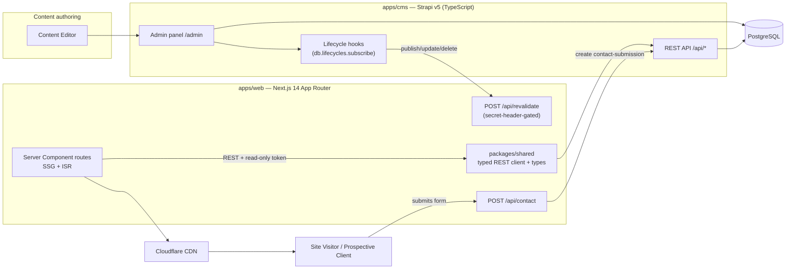
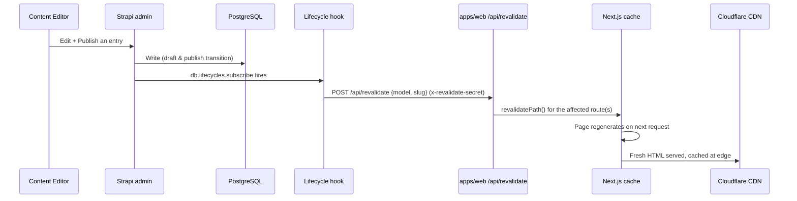

<!-- Last updated: 2026-07-01 -->

# 01 — Architecture Overview

**Audience:** Front-End Engineer · CMS Engineer
**Source:** [`A01-2-REQUIREMENTS/00-overview-and-architecture.md`](../A01-2-REQUIREMENTS/00-overview-and-architecture.md) §4–§6

This is the delivered-solution architecture summary. It is a reader-oriented digest; the
requirements' overview document remains the authoritative source for roles, glossary, and story
conventions.

## Contents

1. [The core decision: headless CMS, decoupled rendering](#1-the-core-decision-headless-cms-decoupled-rendering)
2. [Architecture principles](#2-architecture-principles)
3. [Container view](#3-container-view)
4. [Components by layer](#4-components-by-layer)
5. [Content-editing pipeline (the sync contract)](#5-content-editing-pipeline-the-sync-contract)
6. [Rendering strategy](#6-rendering-strategy)
7. [Technology stack](#7-technology-stack)
8. [Infrastructure topology](#8-infrastructure-topology)
9. [Cross-cutting concerns](#9-cross-cutting-concerns)
10. [Lift-and-shift migration strategy](#10-lift-and-shift-migration-strategy)

---

## 1. The core decision: headless CMS, decoupled rendering

The legacy site fused content and markup: every page was a hand-authored `.html` file, and the
only externalized data was the footer (`assets/data/footer_content.json`, fetched client-side by
`load-footer.js`). Changing a word anywhere else meant editing HTML and redeploying. The
modernization separates these concerns onto two independently deployable apps:

- **Content layer (`apps/cms`)** — a Strapi v5 admin backed by PostgreSQL. Every editable unit of
  copy, media, and structured data (services, case studies, news, testimonials, team, partners,
  the global footer/contact block, and page-level singletons) is a typed content type or
  component, editable by a non-technical Content Editor with no code deploy required.
- **Presentation layer (`apps/web`)** — a Next.js 14 App Router front end that owns nothing but
  rendering, routing, SEO, and client-side interactivity. It never hard-codes content; every page
  fetches from Strapi through one typed client (`packages/shared`).

**Why decouple instead of a CMS-templated site or a fully static rebuild?** Three requirement
clusters drove the split:

| Requirement | Needs | Why headless, not templated-CMS or fully static |
|---|---|---|
| Non-technical editing (EP-23) | A content author changes copy/media without touching code | A fully static rebuild (Markdown-in-repo) still requires a PR per edit |
| Sub-second-fresh content without a full rebuild (EP-26) | Publishing a case study should not require redeploying the whole site | A CMS-templated monolith (e.g. WordPress) couples rendering to the CMS's own templating and hosting model |
| Design fidelity during migration (all Epics) | The Next.js front end must be pixel-identical to the legacy Themeholy theme at launch | A framework-opinionated site builder would force an early, risky redesign instead of a verified lift-and-shift |

The trade-off this buys: two apps to operate instead of one, and an explicit content contract
(`packages/shared`) that must be kept in sync — see [§5](#5-content-editing-pipeline-the-sync-contract).

---

## 2. Architecture principles

| # | Principle | Consequence |
|---|-----------|-------------|
| P1 | Strapi is the single content authority | No content is hard-coded in `apps/web` components; every field traces to a Strapi content type or component |
| P2 | The web↔cms contract lives in one package | Schema changes happen in `apps/cms` first, then `packages/shared` types regenerate, then `apps/web` components rewire |
| P3 | Public API is read-only except lead capture | The Public role may `find`/`findOne` published entries and `create` a `contact-submission`; no public `update`/`delete` anywhere |
| P4 | Rendering is static-first | SSG + ISR by default; a page is a server round-trip to Strapi only at build/revalidate time, never per visitor request |
| P5 | Content changes should not require a rebuild | An on-demand revalidation webhook invalidates just the affected route(s) within seconds of a publish |
| P6 | Migrate incrementally, verify parity at each step | Legacy markup renders verbatim first (lift-and-shift), then is replaced section-by-section by CMS-driven components |
| P7 | Every render path degrades gracefully | CMS-driven sections carry a static fallback array so a Strapi outage does not blank the page |
| P8 | Deployment isolates the two apps' dependency trees | `apps/cms`'s ajv 8 requirement is incompatible with the hoisted Next/ESLint ajv 6 — `apps/cms` is deliberately excluded from workspace hoisting |

---

## 3. Container view



---

## 4. Components by layer

### Presentation layer (`apps/web` — documented in [03](03-web-api-reference.md))

| Component | Module(s) | Responsibility |
|---|---|---|
| `PAGE-HOME` | `app/page.tsx` | Homepage — composes 8 section components |
| `PAGE-ABOUT` | `app/about/page.tsx` | "Our Story" copy + CMS-driven team grid |
| `PAGE-SERVICES` | `app/services/page.tsx` | CMS-driven service detail cards |
| `PAGE-BOOTCAMP` | `app/bootcamp/page.tsx` | Static bootcamp landing page (no CMS collection yet) |
| `PAGE-PARTNERSHIP` | `app/partnership/page.tsx` | CMS-driven partner cards |
| `PAGE-CONTACT` | `app/contact/page.tsx` | Static hero/info chrome + client contact form |
| `PAGE-NEWS` / `PAGE-NEWS-DETAIL` | `app/news/page.tsx`, `app/news/[slug]/page.tsx` | News index + detail |
| `PAGE-CASESTUDY-DETAIL` | `app/case-studies/[slug]/page.tsx` | Case study detail |
| `PAGE-TESTIMONIAL-DETAIL` | `app/testimonials/[slug]/page.tsx` | Testimonial detail |
| `SEC-HEADER` / `SEC-MOBILEMENU` / `SEC-FOOTER` | `components/layout/{SiteHeader,MobileMenu,SiteFooter}.tsx` | Shared chrome, footer fed by the `global` single type |
| `SEC-HERO-SLIDER`, `SEC-ABOUT-TEASER`, `SEC-STATS` | `components/sections/{HeroSlider,AboutSection,StatsCounter}.tsx` | Static homepage sections |
| `SEC-SERVICES-CAROUSEL`, `SEC-NEWS-GRID`, `SEC-TESTIMONIALS`, `SEC-PARTNERS-STRIP`, `SEC-CASESTUDIES-CAROUSEL` | `components/sections/*.tsx` | CMS-driven homepage sections, each with a static fallback |
| `SEC-CONTACT-FORM` | `components/sections/ContactForm.tsx` | Client contact form, honeypot field, posts to `API-CONTACT` |
| `API-CONTACT` | `app/api/contact/route.ts` | Validates + honeypot-checks, forwards to Strapi, optional Resend email |
| `API-REVALIDATE` | `app/api/revalidate/route.ts` | Secret-gated on-demand ISR webhook target |
| `SVC-LEGACY-HTML` | `components/LegacyHtml.tsx` | Lift-and-shift fallback renderer for any not-yet-converted route |

### Content layer (`apps/cms` — documented in [04](04-cms-reference.md))

| Component | Module(s) | Responsibility |
|---|---|---|
| `CMS-GLOBAL` | `src/api/global/` (single type) | Footer/contact/social — replaces `footer_content.json` |
| `CMS-HOME-PAGE` … `CMS-CONTACT-PAGE` | `src/api/*-page/` (single types) | Page-level hero/intro/CTA/SEO singletons per route |
| `CMS-SERVICE`, `CMS-CASESTUDY`, `CMS-NEWS-ARTICLE`, `CMS-TEAM-MEMBER`, `CMS-PARTNER`, `CMS-TESTIMONIAL` | `src/api/*/` (collection types) | Repeating card content |
| `CMS-CONTACT-SUBMISSION` | `src/api/contact-submission/` | Lead-capture store; public `create`-only, draft & publish off |
| `SVC-BOOTSTRAP` | `src/index.ts` | Grants Public-role permissions, seeds/prunes collections, registers revalidation lifecycle hooks |

### Shared/infra layer

| Component | Module(s) | Responsibility |
|---|---|---|
| `SVC-SHARED-CLIENT` | `packages/shared` | Typed Strapi REST client + generated content types — the single dependency boundary between `apps/web` and `apps/cms` |
| `SVC-SEED` | `packages/seed` | `cheerio`-based legacy HTML → Strapi migration scripts (`npm run seed`) |
| `INFRA-NGINX` | `infra/nginx/*.conf` | Reverse-proxy server blocks (apex/`www` → `web`, `cms.` subdomain → `cms`, admin IP-allowlist) |
| `INFRA-PM2` | `infra/pm2/ecosystem.config.cjs` | Process definitions for both apps |
| `INFRA-DEPLOY` / `INFRA-BACKUP` | `infra/deploy/{deploy,backup}.sh` | Deploy and nightly backup scripts |
| `INFRA-CI` | `infra/github/deploy.yml` | CI/CD pipeline definition (designed, not yet activated — `EP-27-S5`) |

---

## 5. Content-editing pipeline (the sync contract)

The two apps are reconciled through a **publish-triggered webhook**, not a shared database or a
polling loop. This resolves the one genuine coupling hazard: a Content Editor's change must reach
a statically-rendered page without forcing a full site rebuild.



**Fallback path.** If the webhook cannot reach `apps/web` (front end down, wrong `WEB_URL`,
network partition), every fetch in `packages/shared` still carries a timed ISR fallback
(`next: { revalidate: 3600 }`), so the page self-heals within the hour even with zero webhook
delivery (`EP-26-S3`).

**Why this, not a shared database or SSR-on-every-request?** A shared DB would break the "Strapi
is the single content authority" boundary and couple the two apps' deploy cadences. Rendering on
every request would defeat the point of a CDN-cacheable static site and add Strapi as a
per-visitor dependency. The webhook gives near-real-time freshness while keeping both apps
independently deployable and the public site fully cacheable.

---

## 6. Rendering strategy

| Concern | Choice | Notes |
|---|---|---|
| Static generation | `generateStaticParams` for every dynamic detail route (`/news/[slug]`, `/case-studies/[slug]`, `/testimonials/[slug]`) | Params sourced from `packages/shared` slug accessors |
| Background refresh | `export const revalidate` / `next: { revalidate: 3600 }` on Strapi fetches | Hourly safety net independent of the webhook |
| On-demand refresh | `POST /api/revalidate` → `revalidatePath()` | Seconds-scale freshness after a publish |
| Client interactivity | Isolated `"use client"` components | Only widgets that need it (contact form, expand toggles, mobile menu); everything else is a Server Component |
| CDN caching | Cloudflare in front of Nginx | Static assets HIT; `/admin` and `/api` bypass cache |

---

## 7. Technology stack

| Concern | Choice | Notes |
|---|---|---|
| Front end | Next.js 14 (App Router), React Server Components | `apps/web` |
| Content admin | Strapi v5 (TypeScript) | `apps/cms` |
| Database | PostgreSQL (prod); SQLite (local dev only) | One `triedatum` database/role |
| Web↔CMS contract | Typed REST client, hand-generated content types | `packages/shared` |
| Content migration | `cheerio`-based HTML scraping scripts | `packages/seed`, one-time + repeatable upsert |
| Email | Resend (contact-form notification) | Best-effort; form persists to Strapi regardless of email success |
| Spam control | Honeypot field (form); Cloudflare Turnstile designed, not yet wired | `EP-18-S5`, deferred P4 |
| Analytics | GA4 (`G-HP0RJZ369Q`) | Continuity requirement across the migration, not a new integration |
| Media | Strapi Media Library → local disk (dev) / Cloudflare R2 (prod, recommended) | |
| Styling (v1) | Lift-and-shift legacy compiled CSS, original class names preserved | Tailwind/CSS-Modules rewrite explicitly out of v1 scope |
| Monorepo tooling | npm workspaces + Turborepo | `apps/cms` deliberately de-hoisted (see P8) |

---

## 8. Infrastructure topology

Single Hostinger KVM VPS, Nginx + PM2 + local PostgreSQL, Cloudflare in front.

```
                         ┌─────────────── Cloudflare ───────────────┐
   visitors ───────────▶ │  DNS · CDN cache · WAF · TLS (proxied)    │
                         └───────────────────┬───────────────────────┘
                                             │  (HTTPS to origin)
                                  ┌──────────▼───────────┐  Hostinger KVM VPS
                                  │        Nginx          │  (Ubuntu 24.04)
                                  │  reverse proxy + gzip │
                                  └───┬───────────────┬───┘
              triedatum.com / www ────┘               └──── cms.triedatum.com
                        │                                        │  (admin path
              ┌─────────▼─────────┐                    ┌─────────▼──────────┐  IP-allowlisted)
              │ Next.js (PM2 "web")│                    │ Strapi (PM2 "cms") │
              │ :3000  SSG+ISR    │◀── REST (token) ──▶│ :1337  /admin /api │
              └─────────┬─────────┘                    └─────────┬──────────┘
                        │ on-demand revalidate webhook           │
                        └──────────────◀─────────────────────────┘
                                                        ┌─────────▼──────────┐
                                                        │ PostgreSQL (local) │
                                                        └────────────────────┘
                              uploads: local /uploads  →  Cloudflare R2 (recommended)
```

Full provisioning, deploy, and scaling detail: [06 — Deployment Runbook](06-runbook-deployment.md).

---

## 9. Cross-cutting concerns

| Concern | Owned by | Detail in |
|---|---|---|
| Public-role read/write scoping | Strapi Users & Permissions plugin (`CMS-GLOBAL` and every content type) | [04](04-cms-reference.md), [10](10-security-compliance.md) |
| Secret handling (revalidate secret, API token, APP_KEYS) | `.env` on each app, never committed | [10](10-security-compliance.md) |
| PII in lead capture | `CMS-CONTACT-SUBMISSION` (admin-only visibility) | [02](02-content-model-dictionary.md), [10](10-security-compliance.md) |
| SEO metadata & redirects | `shared.seo` component + `next.config.js` `redirects()` | [09](09-release-playbook.md) |
| On-demand revalidation | `SVC-BOOTSTRAP` lifecycle hooks + `API-REVALIDATE` | [03](03-web-api-reference.md), [08](08-troubleshooting-kb.md) |
| Backup & DR | `INFRA-BACKUP`, Hostinger VPS snapshots | [07](07-runbook-incident-recovery.md) |

---

## 10. Lift-and-shift migration strategy

To guarantee zero visual/behavioral regression from the legacy site, `apps/web` first rendered
the original Themeholy pages verbatim, then migrated to CMS-driven components incrementally:

1. **Extraction.** Each legacy page's `<body>` is extracted into `apps/web/content/legacy/<route>.html`
   (scripts stripped, asset paths absolutized, inline JS split out, inline `<style>` preserved).
2. **Verbatim render.** `SEC-LEGACY-HTML` (`components/LegacyHtml.tsx`) injects that fragment,
   keeping exact markup/classes/inline handlers, while `app/layout.tsx` loads the theme CSS,
   fonts, and vendor JS bundle in the original order.
3. **Chrome componentization.** Header/nav/footer are extracted first into typed React components
   fed by `CMS-GLOBAL` — the first seam proven end-to-end (DB edit → API → SSR footer).
4. **Section-by-section componentization.** Each page body is replaced piece by piece with a real
   component fed from Strapi, verified for parity at each step. As of this documentation pass,
   **every route is componentized — no `LegacyHtml` remains in `apps/web/app/`** — but the
   mechanism is retained for any future route added before its CMS content type exists.

This staged approach means a section that has not yet been componentized never breaks, because
the surrounding DOM/CSS is untouched until that section is deliberately migrated — the same
"verify parity at each step" discipline the requirements' Definition of Done enforces per Story.
