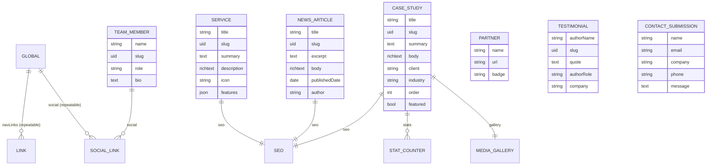

<!-- Last updated: 2026-07-01 -->

# 02 — Content Model Dictionary

**Audience:** CMS Engineer · Front-End Engineer · Content Editor
**Source:** `apps/cms/src/api/**/content-types/**/schema.json`, `apps/cms/src/components/**`
**Owner:** CMS Engineer (`strapi-modeler` persona). This document is the CMS content authority's
field-by-field reference — the CMS analogue of a relational data dictionary. Any schema change
must be reflected here, in `packages/shared`'s generated types, and in the consuming `apps/web`
component (see [01 §5](01-architecture-overview.md#5-content-editing-pipeline-the-sync-contract)).

## Contents

1. [Type-fidelity conventions](#1-type-fidelity-conventions)
2. [Collection types](#2-collection-types)
3. [Single types](#3-single-types)
4. [Shared components](#4-shared-components)
5. [Entity-relationship overview](#5-entity-relationship-overview)
6. [Permissions summary](#6-permissions-summary)

---

## 1. Type-fidelity conventions

| Rule | Detail |
|---|---|
| Slugs | Every publicly-routable content type has a `uid` field (`slug`) generated from its title/name field; slugs are stable identifiers used by `generateStaticParams` and must match `redirect-map.json` where a legacy URL maps to that entry |
| Rich text | Editorial long-form fields (`body`, `description`) are Strapi rich text, rendered client-side via `html-react-parser` |
| Media | Image fields are Strapi Media Library relations, not URL strings — the API response includes width/height/formats for `next/image` |
| Repeatable groups | Fields like `features`, `stats`, `hero` are either a `component` marked repeatable, or a plain `json` field for unstructured lists (see per-type notes) |
| SEO | Every content type that renders its own route embeds the shared `seo` component; it feeds `generateMetadata`, never a page's own ad-hoc meta fields |
| Draft & publish | On for every content type **except** `contact-submission` (a lead capture record has no "draft" state — see [04](04-cms-reference.md#draft--publish)) |

---

## 2. Collection types

### `CMS-SERVICE` — `service`

Renders at `/services` and the homepage services carousel (`SEC-SERVICES-CAROUSEL`).

| Field | Type | Required | Notes |
|---|---|---|---|
| `title` | string | yes | Card/heading title |
| `slug` | uid (from `title`) | yes | Anchors preserved from legacy (`#genAI`, `#advAna`, `#manSer`) are matched by convention, not stored as a field |
| `icon` | string | no | Icon class/token from the theme's icon set |
| `summary` | text | yes | Short card copy |
| `description` | richtext | no | Full detail-page copy |
| `image` | media (single) | no | |
| `href` | string | no | Legacy anchor-link compatibility for homepage cards |
| `features` | json | no | Unstructured bullet list rendered on the detail card |
| `order` | integer | no | Display order override |
| `seo` | component (`shared.seo`) | no | |

### `CMS-CASESTUDY` — `case-study`

Renders at `/case-studies/[slug]` and the homepage case-study carousel + Isotope-filterable grid.

| Field | Type | Required | Notes |
|---|---|---|---|
| `title` | string | yes | |
| `slug` | uid (from `title`) | yes | Legacy `caseN` basenames retained as interim slugs pending SEO-friendly renaming (`EP-21`) |
| `summary` | text | yes | Card teaser |
| `body` | richtext | yes | Full case study copy |
| `heroImage` | media (single) | no | |
| `client` | string | no | |
| `industry` | string | no | Drives the Isotope filter |
| `stats` | component, repeatable (`sections.stat-counter`) | no | |
| `gallery` | component (`sections.media-gallery`) | no | |
| `order` | integer | no | Carousel/grid ordering |
| `featured` | boolean | no | **Not yet consumed by the front end** — added as the resolution path for the `case8` homepage-carousel parity gap (see [11 — Traceability](11-traceability-coverage.md), open item O1) |
| `seo` | component (`shared.seo`) | no | |

### `CMS-NEWS-ARTICLE` — `news-article`

Renders at `/news` (grid, 4 most recent on the homepage) and `/news/[slug]`.

| Field | Type | Required | Notes |
|---|---|---|---|
| `title` | string | yes | |
| `slug` | uid (from `title`) | yes | |
| `excerpt` | text | yes | Grid card copy |
| `body` | richtext | yes | Detail-page copy |
| `coverImage` | media (single) | no | Photos render `object-fit: cover`; partner-logo-style images render `object-fit: contain` by path convention (`/partners/` in the asset path) |
| `publishedDate` | date | yes | Drives sort order and the date badge |
| `author` | string | no | |
| `seo` | component (`shared.seo`) | no | |

### `CMS-TEAM-MEMBER` — `team-member`

Renders in the About page leadership grid.

| Field | Type | Required | Notes |
|---|---|---|---|
| `name` | string | yes | |
| `slug` | uid (from `name`) | yes | Reserved for a future team-member detail route; not currently linked to |
| `role` | string | yes | |
| `photo` | media (single) | no | |
| `bio` | text | no | |
| `social` | component, repeatable (`shared.social-link`) | no | |
| `order` | integer | no | |

### `CMS-PARTNER` — `partner`

Renders on the Partnership page and the homepage partner strip.

| Field | Type | Required | Notes |
|---|---|---|---|
| `name` | string | yes | |
| `logo` | media (single) | yes | |
| `url` | string | no | |
| `badge` | string | no | Optional label (e.g. "Technology Partner") |
| `order` | integer | no | The seed prunes any partner record not present in the seed set, so the live roster always matches the intended set exactly |

### `CMS-TESTIMONIAL` — `testimonial`

Renders in the homepage testimonials carousel and `/testimonials/[slug]`.

| Field | Type | Required | Notes |
|---|---|---|---|
| `quote` | text | yes | |
| `authorName` | string | yes | |
| `slug` | uid (from `authorName`) | yes | |
| `authorRole` | string | no | |
| `authorPhoto` | media (single) | no | |
| `company` | string | no | |

### `CMS-CONTACT-SUBMISSION` — `contact-submission`

Admin-only; written exclusively by `API-CONTACT`. **Draft & publish is OFF** — see
[04 — CMS Reference](04-cms-reference.md#draft--publish).

| Field | Type | Required | Notes |
|---|---|---|---|
| `name` | string | yes | |
| `email` | email | yes | Validated server-side in `API-CONTACT` before the Strapi write |
| `company` | string | no | |
| `phone` | string | no | |
| `message` | text | yes | |
| `createdAt` | datetime (system) | — | Strapi-managed timestamp |

**PII note:** this content type holds personal data by design (name, email, phone, free-text
message). See [10 — Security & Compliance](10-security-compliance.md#pii-in-contact-submissions)
for handling rules.

---

## 3. Single types

Single types hold exactly one entry each — they model the global chrome and the page-level
hero/intro/CTA blocks that don't repeat.

| Type | Holds | Notes |
|------|-------|-------|
| `CMS-GLOBAL` — `global` | `usAddress`, `indiaAddress`, `email`, `phone`, `social` (repeatable `shared.social-link`), `navLinks` (repeatable `shared.link`), `copyright` | Replaces `assets/data/footer_content.json`; addresses retain legacy line breaks (rendered with `white-space: pre-line`) |
| `CMS-HOME-PAGE` — `home-page` | `hero` (repeatable `sections.hero-slide`), `aboutBlock`, `featuredServices`, `stats` (repeatable `sections.stat-counter`), `featuredCaseStudies`, `featuredNews`, `cta` (`sections.cta`), `seo` | The hero slider is currently sourced from static data in `content/site.ts`, not yet promoted to this single type's `hero` field — a candidate follow-up, not a defect |
| `CMS-ABOUT-PAGE` — `about-page` | `hero`, body sections, team intro copy, `stats`, `seo` | |
| `CMS-SERVICES-PAGE` — `services-page` | `intro`, services list display config, `process` (repeatable `sections.process-step`), `cta`, `seo` | |
| `CMS-BOOTCAMP-PAGE` — `bootcamp-page` | `hero`, curriculum/`process` (repeatable `sections.process-step`), `pricing` (repeatable `sections.pricing-tier`), `faq` (repeatable `sections.faq-item`), `cta`, `seo` | Largest single type by field count; the live `/bootcamp` route does not yet consume it (see [01 §10](01-architecture-overview.md#10-lift-and-shift-migration-strategy) and `EP-15-S4`) |
| `CMS-PARTNERSHIP-PAGE` — `partnership-page` | `intro`, partners display config, `benefits`, `cta`, `seo` | |
| `CMS-CONTACT-PAGE` — `contact-page` | `hero`, `addresses`, form display config, `map`, `seo` | |

---

## 4. Shared components

Components are reusable field groups nested inside content types — never routable on their own.

| Component | Category | Fields |
|-----------|----------|--------|
| `shared.seo` | shared | `metaTitle`, `metaDescription`, `canonicalUrl`, `ogImage`, `noindex` |
| `shared.link` | shared | `label`, `href`, `external` |
| `shared.social-link` | shared | `platform`, `url`, `icon` |
| `sections.hero-slide` | sections | `heading`, `subheading`, `image`, `ctaLabel`, `ctaHref` |
| `sections.stat-counter` | sections | `label`, `value`, `suffix` |
| `sections.cta` | sections | `heading`, `text`, `buttonLabel`, `buttonHref` |
| `sections.faq-item` | sections | `question`, `answer` |
| `sections.process-step` | sections | `order`, `title`, `description`, `icon` |
| `sections.pricing-tier` | sections | `name`, `price`, `period`, `features` (list), `highlighted`, `ctaHref` |
| `sections.rich-section` | sections | `heading`, `body` (rich), `image`, `layout` (enum) |
| `sections.media-gallery` | sections | `images` (media, multiple), `caption` |

---

## 5. Entity-relationship overview

---

## 6. Permissions summary

See [04 — CMS Reference §Permission matrix](04-cms-reference.md#permission-matrix) for the full
role-by-role grid. Summary for the Public role (the only role `apps/web` authenticates as):

- `find` / `findOne` on **published** entries of every read-oriented type.
- `create` on `contact-submission` **only**.
- No public `update` or `delete` anywhere, on any type.
