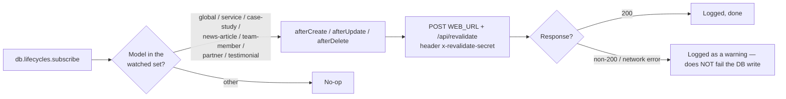

<!-- Last updated: 2026-07-01 -->

# 04 — CMS Reference

**Audience:** CMS Engineer · Site Administrator
**Source:** `apps/cms/src/**`, `apps/cms/config/**`

Strapi-specific reference: how content types are authored, who can do what, what fires on
publish, and how draft & publish behaves per type. For the content itself (fields/types), see
[02 — Content Model Dictionary](02-content-model-dictionary.md).

## Contents

1. [Content-type builder conventions](#1-content-type-builder-conventions)
2. [Permission matrix](#2-permission-matrix)
3. [Lifecycle hooks](#3-lifecycle-hooks)
4. [Draft & publish](#4-draft--publish)
5. [Bootstrap & seeding](#5-bootstrap--seeding)
6. [Configuration reference](#6-configuration-reference)

---

## 1. Content-type builder conventions

`CMS-*` content types are authored as code (`src/api/<type>/content-types/<type>/schema.json`),
not exclusively through the admin's Content-Type Builder UI — the schema JSON is what's version
controlled and reviewed.

| Convention | Rule |
|---|---|
| Naming | Content-type UID is kebab-case singular (`case-study`, not `CaseStudies`); matches the Strapi-generated REST path pluralized automatically (`/api/case-studies`) |
| Slugs | Any content type with its own route has a `uid` field named `slug`, generated from a title-like field, `required: true` |
| Components vs. relations | Reusable field groups (SEO, social links, hero slides) are Strapi **components**, not relations — they have no independent lifecycle or admin list view, matching their "embedded field group" role in the domain model |
| Category | Components are grouped under `shared` (cross-cutting: SEO, links) or `sections` (page-building blocks: hero slides, stat counters, CTAs) |
| Schema changes ship as a set | A schema change is committed together with the `packages/shared` type regeneration and the consuming `apps/web` component update — never landed alone (P2 in [01](01-architecture-overview.md#2-architecture-principles)) |
| No public schema mutation | The Content-Type Builder is available in the admin, but structural changes made there without going through `strapi-modeler`/this workflow will desync `packages/shared` — see the "Don'ts" in [05 — Content Operations](05-runbook-content-operations.md#donts) |

---

## 2. Permission matrix

Strapi ships with the Users & Permissions plugin; this project uses exactly two roles that
matter operationally — **Public** (unauthenticated, used by `apps/web`) and **Authenticated
admin** (Content Editor / Site Administrator, via the admin panel, a separate permission system
from the API roles above).

| Content type | Public `find`/`findOne` | Public `create` | Public `update`/`delete` | Admin (Content Editor) |
|---|---|---|---|---|
| `service`, `case-study`, `news-article`, `team-member`, `partner`, `testimonial` | ✅ published entries only | ❌ | ❌ | Full CRUD + publish/unpublish |
| `global`, `home-page`, `about-page`, `services-page`, `bootcamp-page`, `partnership-page`, `contact-page` (single types) | ✅ (`find` only — no `findOne` on a single type) | ❌ | ❌ | Full edit + publish/unpublish |
| `contact-submission` | ❌ | ✅ **create only** | ❌ | Read + delete (no edit — a submission is a record, not editorial copy) |

**Enforcement mechanism.** These are granted programmatically by `SVC-BOOTSTRAP` at startup
(`src/index.ts`), not click-configured by hand in the admin — so the permission set is
reproducible across environments and reviewable in version control (`EP-23-S2`, `EP-23-S3`).

**Admin panel access.** Separate from the API roles above: the Strapi admin (`/admin`) itself
sits behind Nginx's IP-allowlist on the `cms.` subdomain in production (see
[06 — Deployment Runbook](06-runbook-deployment.md) and
[10 — Security & Compliance](10-security-compliance.md)) — admin authentication is a second,
independent control from the API permission grants in this table.

---

## 3. Lifecycle hooks

**Registered in:** `SVC-BOOTSTRAP` → `registerRevalidateHooks()`, called from Strapi's bootstrap
lifecycle in `apps/cms/src/index.ts`.

**Watched models:** `global`, `service`, `case-study`, `news-article`, `team-member`, `partner`,
`testimonial` (`EP-26-S2`). Page-level single types (`home-page`, `about-page`, etc.) are
**not yet** in the watched set — a designed gap, since those singletons are still largely
static/lift-and-shift content on the front end (see [01 §10](01-architecture-overview.md#10-lift-and-shift-migration-strategy)).

**Failure isolation.** The webhook call is best-effort and asynchronous relative to the database
write: a webhook failure (front end down, wrong secret, network error) is logged but never rolls
back or blocks the content save. This preserves "Strapi is the content authority" — the admin
save always succeeds or fails on its own terms, independent of the front end's availability
(`EP-26-S3`, and see [08 — Troubleshooting KB-3](08-troubleshooting-kb.md#kb-3)).

---

## 4. Draft & publish

Enabled per content type in its schema (`options.draftAndPublish`).

| State | Behavior |
|---|---|
| **On** (every editorial type) | An entry has a `draft` and a `published` version. Editors can save changes as a draft, preview, and only the **Publish** action makes it visible to the Public role and triggers the lifecycle hook. Un-publishing removes it from public reads without deleting the record. |
| **Off** (`contact-submission` only) | There is no draft state — a `create` from `API-CONTACT` is immediately a complete, visible-to-admins record. This matches its nature as a transactional lead-capture write, not editorial copy that benefits from a review step (`EP-23-S4`). |

**Why this split, not draft & publish everywhere?** A contact submission is never "drafted" by
anyone — it's a one-shot write from the public form. Forcing a publish step on it would either
hide real leads from admins by default (if drafts default to unpublished) or make the flag
meaningless busywork. Every other type genuinely benefits from a review-before-live step, which
is also the natural trigger point for the revalidation webhook.

---

## 5. Bootstrap & seeding

**Component:** `SVC-BOOTSTRAP` (`apps/cms/src/index.ts`), run on every Strapi start.

| Step | What it does |
|---|---|
| 1. Grant permissions | Applies the [permission matrix](#2-permission-matrix) programmatically — idempotent, safe to re-run |
| 2. Seed collections | `seedCollection()` **upserts by slug** — re-running bootstrap updates existing records to match the seed rather than skipping them, so enriched seed content lands even on an already-seeded database |
| 3. Prune collections | `pruneCollection()` removes any record **not** present in the current seed set (used for `partner`, keeping the live roster exactly matching the intended set — see [02 §Partner](02-content-model-dictionary.md#cms-partner--partner)) |
| 4. Register lifecycle hooks | Wires up [§3](#3-lifecycle-hooks) |

**Content source of truth during scaffolding.** While the CMS is still being populated from the
legacy site, the seed script (`packages/seed` + `SVC-BOOTSTRAP`'s seed step) is the authoritative
source — editors should expect a full CMS restart to re-assert the seed's values over any manual
admin edit made to a seeded field. Once content ownership fully transfers to editors post-launch,
this seed-authority behavior is expected to be retired (tracked as a release-readiness item, see
[09 — Release Playbook](09-release-playbook.md)).

**Restart requirement.** Strapi's dev file-watcher reload does **not** reliably re-run bootstrap
after editing `src/index.ts`. A full restart (`npm run cms:develop`) is required to force a
re-seed, and re-registers the lifecycle hooks — expect a burst of `POST /api/revalidate` calls
against `apps/web` immediately after any CMS restart, one per upserted record.

---

## 6. Configuration reference

| File | Controls |
|---|---|
| `apps/cms/config/database.ts` | `DATABASE_CLIENT` (postgres in prod, sqlite locally), connection string from `.env` |
| `apps/cms/config/server.ts` | `PORT` (default 1337) / `HOST`, read via `env.int('PORT', 1337)` |
| `apps/cms/config/plugins.ts` | Upload provider (local disk in dev; S3-compatible → Cloudflare R2 recommended for prod) |
| `apps/cms/.env` | `DATABASE_*`, `APP_KEYS`, JWT secrets (auto-generated), `STRAPI_REVALIDATE_SECRET`, `WEB_URL` — never committed |

Monorepo note: `apps/cms` is **deliberately excluded from npm-workspace hoisting**. Its
dependency tree requires `ajv` 8, which conflicts with the Next.js/ESLint toolchain's `ajv` 6 when
hoisted to the root `node_modules` (`Cannot find module 'ajv/dist/core'` at Strapi startup). It is
installed in isolation (`npm run cms:install` → `apps/cms/node_modules`) and run via root
`cms:*` scripts (`EP-27-S2`). See [08 — Troubleshooting KB](08-troubleshooting-kb.md) for the
failure signature if this is ever accidentally re-hoisted.
