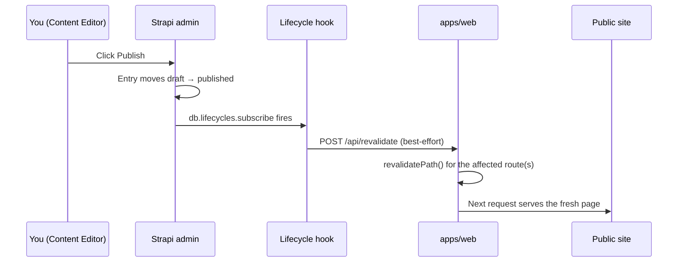

<!-- Last updated: 2026-07-01 -->

# 05 — Content Operations Runbook

**Audience:** Content Editor
**Source:** [`04 — CMS Reference`](04-cms-reference.md), [`02 — Content Model Dictionary`](02-content-model-dictionary.md)

Day-to-day operating instructions for the person editing copy, media, and structured data in the
Strapi admin — no code knowledge required. For *why* the system behaves this way, see
[04 — CMS Reference](04-cms-reference.md); for the exact fields available on each content type,
see [02 — Content Model Dictionary](02-content-model-dictionary.md).

## Contents

1. [Where you work](#1-where-you-work)
2. [Editing an existing entry](#2-editing-an-existing-entry)
3. [Creating a new entry](#3-creating-a-new-entry)
4. [What happens the moment you click Publish](#4-what-happens-the-moment-you-click-publish)
5. [Verifying a change went live](#5-verifying-a-change-went-live)
6. [Editing the global footer/contact block](#6-editing-the-global-footercontact-block)
7. [Handling a contact-form submission](#7-handling-a-contact-form-submission)
8. [Don'ts](#donts)
9. [Quick reference](#9-quick-reference)

---

## 1. Where you work

You work exclusively in the Strapi admin panel — never in code, never in a file. In production
this is `https://cms.<domain>/admin`; in local development it's `http://localhost:1337/admin`.
Log in with the admin account a Site Administrator created for you.

The left sidebar under **Content Manager** lists every content type you can touch:

| Group | What's in it |
|---|---|
| Single Types | `Global`, `Home Page`, `About Page`, `Services Page`, `Bootcamp Page`, `Partnership Page`, `Contact Page` — one entry each, the page-level chrome |
| Collection Types | `Service`, `Case Study`, `News Article`, `Team Member`, `Partner`, `Testimonial` — repeating cards, each with its own entries |
| `Contact Submission` | Read-only for you (see [§7](#7-handling-a-contact-form-submission)) — you never create these by hand |

If a field you expect isn't there, don't add it via the Content-Type Builder yourself — see
[Don'ts](#donts).

---

## 2. Editing an existing entry

1. Open the content type in the sidebar, then click the entry (e.g. the `case-study` titled
   "Acme Corp").
2. Edit any field. Strapi autosaves your keystrokes into the **draft** version of the entry — the
   **published** version the public site reads is untouched until you explicitly publish.
3. Click **Save** to persist the draft without going live, if you want to come back to it later.
4. Click **Publish** when the edit is ready for the public site. This is the action that matters —
   see [§4](#4-what-happens-the-moment-you-click-publish).

**`contact-submission` is the one exception:** it has no draft state (see
[04 §4 — Draft & publish](04-cms-reference.md#4-draft--publish)). You can view and delete a
submission, but there's nothing to "publish" — a submission is either there or it isn't.

---

## 3. Creating a new entry

1. In the relevant collection type, click **Create new entry**.
2. Fill in every field marked required in [02 — Content Model Dictionary](02-content-model-dictionary.md)
   for that type — Strapi blocks Publish (not Save) if a required field is empty.
3. The `slug` field is auto-generated from the title-like field (`title`, `name`, or `authorName`
   depending on the type) — you don't type it yourself, and you generally shouldn't hand-edit it
   after the entry is live, since that changes the entry's public URL.
4. Set `order` (where the type has one) to control display position in its carousel/grid/list.
5. Save as a draft to come back to it, or Publish when it's ready.

---

## 4. What happens the moment you click Publish

Publishing does two things at once: it makes the entry visible to the Public role's API reads
(§[04 — Permission matrix](04-cms-reference.md#2-permission-matrix)), and it fires a best-effort
webhook that tells the live site to refresh the specific page(s) affected — usually within
seconds. If that webhook call doesn't land (front end briefly down, network hiccup), your publish
still succeeded in Strapi; the site catches up on its own within the hour regardless (see
[§5](#5-verifying-a-change-went-live) and [08 — Troubleshooting KB](08-troubleshooting-kb.md)).

**Which entries trigger the fast path today:** `global`, `service`, `case-study`,
`news-article`, `team-member`, `partner`, `testimonial`. Editing one of the page-level single
types (`home-page`, `about-page`, etc.) does **not** currently trigger an on-demand refresh — those
pages still rely on the hourly background refresh (see
[04 §3 — Lifecycle hooks](04-cms-reference.md#3-lifecycle-hooks)). If you edit one of those and
need it live sooner, ask a Deploy Engineer to trigger a manual revalidation.

---

## 5. Verifying a change went live

1. Wait roughly 10–15 seconds after clicking Publish.
2. Open the public page in a private/incognito browser window (to bypass your own browser cache).
3. Confirm the edited field's new value is showing.
4. If it isn't yet:
   - Wait another 30–60 seconds and hard-refresh — the webhook call can occasionally be delayed.
   - If it's still not showing after a few minutes, this is a webhook-delivery problem, not a
     content problem — flag it to a Deploy Engineer with the entry's content type and slug, and
     see [08 — Troubleshooting KB-3](08-troubleshooting-kb.md#kb-3). The content is safely
     published in Strapi either way; only the *public page's freshness* is affected, and it will
     self-correct within an hour even with zero intervention.

---

## 6. Editing the global footer/contact block

The `Global` single type holds the footer addresses, email, phone, social links, and nav links
that appear on every page — it's the direct replacement for the legacy site's
`footer_content.json`. Because every page reads from this one entry, an edit here is the single
highest-blast-radius change you can make as a Content Editor: double-check the value before
publishing, since it affects the whole site simultaneously rather than one card or page.

---

## 7. Handling a contact-form submission

Submissions from the public contact form appear under **Content Manager → Contact Submission** —
you don't create these; a visitor's form POST does, via `API-CONTACT`. You can:

- **Read** a submission's `name`, `email`, `company`, `phone`, and `message`.
- **Delete** a submission once it's been handled (e.g. after following up by email).

You cannot edit a submission's fields — it's a record of what the visitor sent, not editorial
copy. See [10 — Security & Compliance §PII in contact submissions](10-security-compliance.md#pii-in-contact-submissions)
for how this data should and shouldn't be handled.

---

## Don'ts

| Don't | Why |
|---|---|
| Don't add/rename/remove a field via the Content-Type Builder in the admin | Structural schema changes are authored as code (`apps/cms/src/api/**/schema.json`) and shipped together with the matching `packages/shared` type and `apps/web` component update (P2, [04 §1](04-cms-reference.md#1-content-type-builder-conventions)). A click-through schema change desyncs the front end silently — fields you add this way won't render anywhere until a CMS Engineer follows up in code. |
| Don't hand-edit a `slug` on a live entry unless you understand it changes the public URL | The old URL 404s the moment you save; nothing 301s it automatically. |
| Don't try to "publish" a `contact-submission` | It has no draft/publish state by design — see [04 §4](04-cms-reference.md#4-draft--publish). There's nothing to click. |
| Don't assume an edit to a page-level single type (e.g. `about-page`) is instant | Those types aren't in the fast-path webhook set today (§[4](#4-what-happens-the-moment-you-click-publish)) — expect up to an hour unless a Deploy Engineer manually revalidates. |
| Don't be surprised if a CMS restart reverts a seeded field you'd edited by hand | While the CMS is still being populated from the legacy site, the seed script re-asserts its values on every Strapi restart (see [04 §5 — Bootstrap & seeding](04-cms-reference.md#5-bootstrap--seeding)). This is a scaffolding-phase behavior, not a bug, and is expected to be retired post-launch. |

---

## 9. Quick reference

| I want to… | Do this |
|---|---|
| Change a service's description | `Content Manager → Service → <entry> → description → Save → Publish` |
| Add a new case study | `Content Manager → Case Study → Create new entry` → fill required fields → `Publish` |
| Update the footer phone number | `Content Manager → Global → phone → Save → Publish` |
| Take down a testimonial without deleting it | Open the entry → **Unpublish** (keeps the record, removes it from public reads) |
| Check if a change is live | Open the public page in a private window ~15 seconds after publishing — see [§5](#5-verifying-a-change-went-live) |
| Read/delete a contact submission | `Content Manager → Contact Submission → <entry>` |
