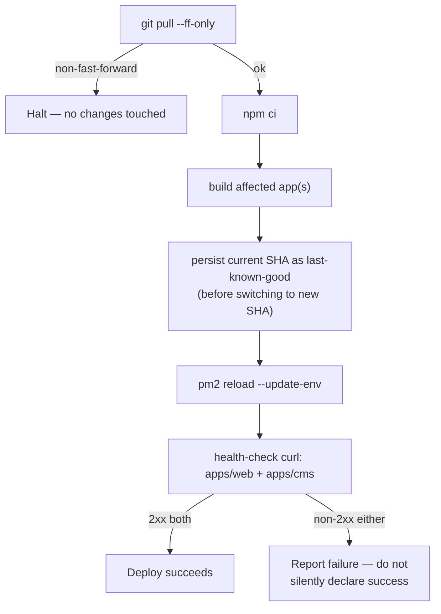

<!-- Last updated: 2026-07-01 -->

# 06 — Deployment Runbook

**Audience:** Deploy Engineer
**Source:** [`A01-2-REQUIREMENTS/09-cms-seo-and-platform.md`](../A01-2-REQUIREMENTS/09-cms-seo-and-platform.md)
§EP-27, [01 §8 — Infrastructure topology](01-architecture-overview.md#8-infrastructure-topology)

This is the operational recipe for provisioning and deploying both apps on the target Hostinger
KVM VPS. It documents the design specified by EP-27 — treat this as the procedure to follow when
standing up or redeploying an environment, not as a record of a system already running in
production. Nothing in this document should be read as "already deployed."

## Contents

1. [Topology recap](#1-topology-recap)
2. [Nginx reverse-proxy server blocks](#2-nginx-reverse-proxy-server-blocks)
3. [PM2 process management](#3-pm2-process-management)
4. [PostgreSQL provisioning](#4-postgresql-provisioning)
5. [`deploy.sh`](#5-deploysh)
6. [`backup.sh`](#6-backupsh)
7. [The CI pipeline (designed, not yet active)](#7-the-ci-pipeline-designed-not-yet-active)
8. [Environment variables checklist](#8-environment-variables-checklist)

---

## 1. Topology recap

Single Hostinger KVM VPS (Ubuntu 24.04), Cloudflare in front, Nginx terminating TLS and
reverse-proxying to two PM2-managed Node processes, one local PostgreSQL instance. Full diagram:
[01 §8](01-architecture-overview.md#8-infrastructure-topology).

| App | Process name | Port | Domain |
|---|---|---|---|
| `apps/web` | `web` | `3000` | apex / `www` |
| `apps/cms` | `cms` | `1337` | `cms.<domain>` |

---

## 2. Nginx reverse-proxy server blocks

**Component:** `INFRA-NGINX` (`infra/nginx/*.conf`, `EP-27-S1`)

Two server blocks, both terminating TLS at Nginx:

| Server block | Listens for | Proxies to |
|---|---|---|
| Apex/`www` | `triedatum.com`, `www.triedatum.com` | `localhost:3000` (`apps/web`) |
| CMS subdomain | `cms.triedatum.com` | `localhost:1337` (`apps/cms`) |

```nginx
# apex/www → apps/web
server {
    server_name triedatum.com www.triedatum.com;
    location / {
        proxy_pass http://localhost:3000;
        proxy_set_header Host $host;
        proxy_set_header X-Real-IP $remote_addr;
        proxy_set_header X-Forwarded-Proto $scheme;
    }
}

# cms.triedatum.com → apps/cms
server {
    server_name cms.triedatum.com;
    location / {
        proxy_pass http://localhost:1337;
        proxy_set_header Host $host;
        proxy_set_header X-Real-IP $remote_addr;
        proxy_set_header X-Forwarded-Proto $scheme;
    }

    # Optional, disabled by default — a one-line uncomment, not a code change.
    # location /admin {
    #     allow 203.0.113.0/24;
    #     deny all;
    #     proxy_pass http://localhost:1337;
    # }
}
```

**Design rules that must hold:**

- Each server block proxies to its own port only — never both apps behind one block.
- If the upstream process is down, Nginx must return a clear `502`/`503` (its default proxy
  failure behavior) — never hang or return a misleading `200`. Check `/var/log/nginx/error.log`
  first when a domain is unreachable but the VPS itself is up.
- The admin-panel IP-allowlist is present in config but commented out/inactive by default — the
  decision to lock the `cms.` admin path to specific IPs belongs to the Site Administrator, not a
  platform default. Enabling it is the one-line uncomment shown above, not a code change
  (`EP-27-S1`).

---

## 3. PM2 process management

**Component:** `INFRA-PM2` (`infra/pm2/ecosystem.config.cjs`, `EP-27-S2`)

Both apps run as **fork-mode** PM2 processes — not cluster mode, one instance per app — each with
an explicit memory cap so a leak restarts the process automatically instead of taking down the
VPS:

```js
module.exports = {
  apps: [
    {
      name: "web",
      cwd: "./apps/web",
      script: "npm",
      args: "run start",
      exec_mode: "fork",
      max_memory_restart: "500M",
      env: { NODE_ENV: "production" },
    },
    {
      name: "cms",
      cwd: "./apps/cms",
      script: "npm",
      args: "run start",
      exec_mode: "fork",
      max_memory_restart: "700M",
      env: { NODE_ENV: "production" },
    },
  ],
};
```

**Hard rule — the `apps/cms` hoist exclusion.** This is a deliberate, hard-won architecture
decision (`EP-27-S2`) and must never be "simplified" away in a future refactor:

> Strapi's dependency tree requires `ajv@8`. The Next.js/ESLint toolchain elsewhere in the
> monorepo requires `ajv@6`. If npm workspace hoisting is allowed to promote a single shared `ajv`
> to the root `node_modules`, one toolchain gets the wrong major version — in practice, Strapi
> crashes at boot with `Cannot find module 'ajv/dist/core'` when `ajv@6` wins the hoist.

The fix: `apps/cms` is deliberately excluded from npm-workspace hoisting and installed into its
own isolated `node_modules` (via a root `cms:install` script), so each toolchain resolves its own
correct `ajv` major version. See [08 — Troubleshooting KB-1](08-troubleshooting-kb.md#kb-1) for
the exact failure signature if this exclusion is ever accidentally undone.

**Operating PM2:**

```bash
pm2 start infra/pm2/ecosystem.config.cjs   # first start
pm2 reload --update-env                    # zero-downtime reload, picks up new env vars
pm2 list                                    # confirm both are "fork" mode, online
pm2 logs web                                # tail one process's logs
pm2 logs cms
```

A process that exceeds its `max_memory_restart` cap restarts automatically — this shows up in
`pm2 logs`/`pm2 list` with no operator action required. If a process keeps restarting
immediately after each auto-restart, that's a crash loop, not a memory cap — see
[08 — Troubleshooting KB-2](08-troubleshooting-kb.md#kb-2).

---

## 4. PostgreSQL provisioning

**Component:** `INFRA-POSTGRES` (`EP-27-S3`)

Strapi requires PostgreSQL in production (SQLite is local-dev only, per
[01 §7 — Technology stack](01-architecture-overview.md#7-technology-stack)). The provisioning
recipe is the same shape for both a fresh dev machine and the production VPS — a dedicated
database and a dedicated, least-privilege role, never the Postgres superuser:

```bash
sudo -u postgres psql <<'SQL'
CREATE ROLE triedatum WITH LOGIN PASSWORD '<generated-strong-password>';
CREATE DATABASE triedatum OWNER triedatum;
GRANT ALL PRIVILEGES ON DATABASE triedatum TO triedatum;
SQL
```

Set the resulting connection details in `apps/cms/.env` (see
[04 §6 — Configuration reference](04-cms-reference.md#6-configuration-reference)):

```env
DATABASE_CLIENT=postgres
DATABASE_HOST=127.0.0.1
DATABASE_PORT=5432
DATABASE_NAME=triedatum
DATABASE_USERNAME=triedatum
DATABASE_PASSWORD=<generated-strong-password>
```

Verify connectivity before the first Strapi boot:

```bash
psql "postgresql://triedatum:<password>@127.0.0.1:5432/triedatum" -c '\conninfo'
```

If `DATABASE_*` is misconfigured, Strapi fails fast at boot with a clear connection error naming
the problem (wrong password, wrong database name, connection refused) — it does not hang
silently. Running this recipe a second time for a different environment (e.g. dev after prod) is
safe and produces a fully independent database/role pair with no shared credentials.

---

## 5. `deploy.sh`

**Component:** `INFRA-DEPLOY` (`infra/deploy/deploy.sh`, `EP-27-S4`)

Ordered steps on every deploy:



```bash
./infra/deploy/deploy.sh              # normal deploy
./infra/deploy/deploy.sh --rollback   # redeploy the last stored known-good SHA
```

**Rules that must hold:**

- `git pull --ff-only` halts immediately on a non-fast-forward state — it never attempts a merge,
  and nothing running is touched before this check passes.
- The previous SHA is persisted **before** switching to the new one, specifically so a rollback
  target always exists.
- The deploy is not considered successful until both apps answer their health-check `curl` with a
  `2xx` — a failed health check is reported clearly, not swallowed.
- `--rollback` checks out the stored previous SHA, rebuilds, and reloads PM2 back to that known
  state — the same pipeline run in reverse, not a separate code path.

---

## 6. `backup.sh`

**Component:** `INFRA-BACKUP` (`infra/deploy/backup.sh`, `EP-27-S4`)

Runs nightly via cron (or PM2's own scheduler):

```bash
pg_dump "postgresql://triedatum:<password>@127.0.0.1:5432/triedatum" \
  | gzip > /var/backups/triedatum/triedatum-$(date +%F).sql.gz

find /var/backups/triedatum -name '*.sql.gz' -mtime +30 -delete
```

- Produces one gzipped `pg_dump` per night.
- Optionally syncs the dump offsite (e.g. to object storage) — the offsite-sync target's own
  encryption-at-rest is what's relied on; `backup.sh` itself doesn't add a second encryption layer.
- Prunes dumps older than **30 days** on every run — this is the retention window, not a
  configurable-per-environment setting.

Restore procedure (used during an incident): see
[07 — Incident & Recovery Runbook §Database restore](07-runbook-incident-recovery.md#3-restoring-the-database-from-backup).

---

## 7. The CI pipeline (designed, not yet active)

**Component:** `INFRA-CI` (`infra/github/deploy.yml`, `EP-27-S5`)

A two-job GitHub Actions pipeline is fully written and version-controlled at
`infra/github/deploy.yml`:

| Job | Runs on | Steps |
|---|---|---|
| `verify` | every push/PR | install dependencies → `typecheck` → `lint` → `build` |
| `deploy` | merges to `main` only | SSH to the Hostinger VPS → invoke `deploy.sh` (§5) |

**This is explicitly not yet active.** `infra/github/deploy.yml` exists in version control, but it
has **not** been copied into `.github/workflows/`, so no GitHub event currently triggers it. Do
not report this pipeline as "CI/CD is automated" — the accurate status is "designed,
version-controlled, not yet activated," and it is tracked as a known gap to close before the
platform is considered fully operationally mature (see
[09 — Release Playbook](09-release-playbook.md) and
[11 — Traceability, open item O4](11-traceability-coverage.md#open-items-carried-forward)).

Activating it later is a file-copy step plus configuring the SSH secrets GitHub Actions needs —
not a redesign of the verify/deploy job logic.

---

## 8. Environment variables checklist

Before the first deploy to a new environment, confirm every one of these is set (see
[03 §4](03-web-api-reference.md#4-environment-variables-this-surface-depends-on) and
[04 §6](04-cms-reference.md#6-configuration-reference) for the full per-variable reference):

| Variable | App | Set before |
|---|---|---|
| `DATABASE_*` | `apps/cms` | First Strapi boot |
| `APP_KEYS`, JWT secrets | `apps/cms` | First Strapi boot (auto-generated if absent — do not reuse across environments) |
| `STRAPI_REVALIDATE_SECRET` | both | Must be **identical** in both `.env` files |
| `WEB_URL` | `apps/cms` | Must point at the reachable `apps/web` origin for that environment |
| `NEXT_PUBLIC_STRAPI_URL` | `apps/web` | Must point at the reachable `apps/cms` origin |
| `STRAPI_API_TOKEN` | `apps/web` | Scoped, non-admin token minted in the Strapi admin |
| `RESEND_API_KEY` | `apps/web` | Optional — omit to skip contact-form notification email |

See [10 — Security & Compliance §Secret handling](10-security-compliance.md#secret-handling) for
rotation rules and the never-commit policy.
