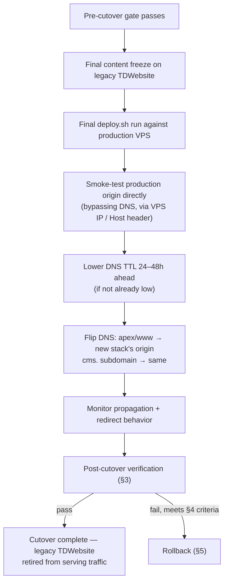

<!-- Last updated: 2026-07-01 -->

# 09 — Release Playbook

**Audience:** Release Manager · SEO Engineer · Team
**Source:** [`A01-2-REQUIREMENTS/09-cms-seo-and-platform.md`](../A01-2-REQUIREMENTS/09-cms-seo-and-platform.md)
§EP-24/EP-25/EP-27, [README §Verification status](README.md#verification-status-as-of-this-documentation-pass)

The cutover checklist for switching production traffic from the legacy static site (`TDWebsite`)
to this modernized stack. This is a **planned procedure**, written ahead of the actual cutover —
it is not a record of a cutover that has already happened. Treat every unchecked box here as
open work, not as documentation debt.

## Contents

1. [Pre-cutover gate](#1-pre-cutover-gate)
2. [Cutover sequence](#2-cutover-sequence)
3. [Post-cutover verification](#3-post-cutover-verification)
4. [Rollback trigger criteria](#4-rollback-trigger-criteria)
5. [Rollback procedure](#5-rollback-procedure)

---

## 1. Pre-cutover gate

Every item below must be true **before** DNS is touched. This is a go/no-go gate, not a
nice-to-have checklist:

- [ ] `deploy.sh` has completed at least one successful production deploy of both apps, with
      health checks passing (see [06 §5](06-runbook-deployment.md#5-deploysh)).
- [ ] `backup.sh` has produced at least one verified-restorable nightly dump (see
      [07 §3](07-runbook-incident-recovery.md#3-restoring-the-database-from-backup)).
- [ ] All 23 legacy URLs are confirmed present in the redirect map and 301 correctly in a
      staging/pre-cutover environment (`EP-24-S2`) — 7 static pages, 4 news articles, 10 case
      studies, 2 testimonials.
- [ ] `sitemap.xml` and `robots.txt` resolve correctly and `robots.txt` disallows the `cms.`
      admin subdomain (`EP-24-S3`).
- [ ] No page ships the legacy generic metadata string ("TrieDatum - Your Trusted Partner in AI &
      Data") — every content-backed page has a unique `metaTitle`/`metaDescription` (`EP-24-S1`).
- [ ] GA4 fires under the existing property (`G-HP0RJZ369Q`) on every route in the pre-cutover
      environment, including client-side navigations (`EP-25-S1`) — see
      [§3](#3-post-cutover-verification) for the exact continuity check.
- [ ] The open items below have an explicit decision recorded, even if the decision is "defer
      post-launch" — none may be silently unresolved at cutover:
      - **O1** — `case8`'s missing homepage-carousel card vs. the CMS-driven carousel showing all
        10 case studies (`EP-21-S4`).
      - **O5** — honeypot-only spam control accepted for launch, or Cloudflare Turnstile wired
        first (`EP-18-S5`).
- [ ] Production secrets are minted and distinct from any dev/staging value: `STRAPI_REVALIDATE_SECRET`,
      `APP_KEYS`, JWT secrets, a scoped `STRAPI_API_TOKEN` (see
      [10 — Security & Compliance](10-security-compliance.md)).
- [ ] The team has explicitly acknowledged the CI/CD pipeline (`infra/github/deploy.yml`) is
      **not** active — cutover does not depend on it, and no status report claims otherwise
      (`EP-27-S5`).

---

## 2. Cutover sequence

1. **Content freeze on legacy site.** Stop editing the legacy `TDWebsite` HTML — any last-minute
   copy change should go into the new CMS instead, so it isn't lost when legacy is retired.
2. **Final production deploy.** Run `deploy.sh` against the production VPS one last time
   immediately before the DNS flip, so the cutover ships the most current build.
3. **Direct-origin smoke test.** Verify the new stack serves correctly by hitting the VPS directly
   (via IP or a `Host` header override) — this confirms the app layer is healthy *before*
   introducing DNS propagation as a variable.
4. **DNS flip.** Point the apex/`www` domain and `cms.` subdomain at the new stack. If Cloudflare
   is already proxying the legacy site, this is a proxied-origin change, not a nameserver change.
5. **Monitor.** Watch error rates, redirect behavior, and GA4 real-time reporting through the
   propagation window.

---

## 3. Post-cutover verification

| Check | How | Pass criteria |
|---|---|---|
| DNS resolves to the new stack | `dig`/`nslookup` the apex and `cms.` subdomain | Both resolve to the new origin, no stale legacy IP cached |
| All 23 legacy URLs 301 | Script a `curl -I` loop over the redirect map | Every entry returns `301` with the correct `Location`, none 404 |
| SEO metadata is real and unique | Spot-check `<title>`/meta description on homepage, a service, a case study, a news article | No page shows the legacy generic string; no two pages share identical `metaTitle` |
| `sitemap.xml` / `robots.txt` live | `curl https://<domain>/sitemap.xml` and `/robots.txt` | Valid XML/text; `robots.txt` disallows `cms.<domain>` |
| Canonical + OG tags present | View source on a few page types | Exactly one canonical tag per page; complete `og:title`/`og:description`/`og:image` triple |
| **GA4 continuity** | Open GA4 real-time reporting during the cutover window; navigate the new site including client-side (App Router) transitions | Events continue accumulating under `G-HP0RJZ369Q` with no gap and no duplicate/double-counted events from a leftover legacy snippet (`EP-25-S1`) |
| Contact form end-to-end | Submit a real test lead on production | `POST /api/contact` → `201` in Strapi → (if configured) Resend notification arrives |
| On-demand revalidation | Publish a trivial test edit in Strapi | Public page reflects it within ~15 seconds, per [05 §5](05-runbook-content-operations.md#5-verifying-a-change-went-live) |

---

## 4. Rollback trigger criteria

Roll back (§5) if, within the post-cutover monitoring window, **any** of the following is true —
these are the stated bright lines, not judgment calls to be made under pressure in the moment:

- Any of the 23 legacy URLs 404s instead of 301ing.
- GA4 shows a gap in event data, or clearly duplicated/inflated event counts, attributable to the
  cutover.
- The contact form fails to persist a submission to Strapi (a `502 cms_unreachable` or worse on a
  real attempt, not a validation `400`).
- Either `apps/web` or `apps/cms` fails its health check and does not recover within the incident
  response window defined in [07 §4 — Severity triage](07-runbook-incident-recovery.md#4-severity-triage).
- A P1-severity defect is discovered that blocks core site function (navigation, a whole page
  type failing to render) and cannot be hotfixed within the monitoring window.

A cosmetic defect, a single content gap, or a non-blocking SEO nit (e.g. one page's `og:image`
falling back to the site default) is **not**, on its own, a rollback trigger — fix forward
instead.

---

## 5. Rollback procedure

1. Flip DNS back to the legacy `TDWebsite` origin (this is why legacy should stay
   deployable/reachable, not decommissioned, until cutover is confirmed stable — see
   [11 — Traceability, open items](11-traceability-coverage.md#open-items-carried-forward)).
2. Communicate the rollback and the reason to the team immediately — do not let stakeholders
   discover it from the site itself.
3. Diagnose the triggering issue against [08 — Troubleshooting KB](08-troubleshooting-kb.md) and
   [07 — Incident & Recovery](07-runbook-incident-recovery.md) as appropriate.
4. Fix forward on the new stack in a non-production environment, re-run the full
   [pre-cutover gate](#1-pre-cutover-gate), and reschedule the cutover — a rollback is a "not yet,"
   not a decision to abandon the migration.
