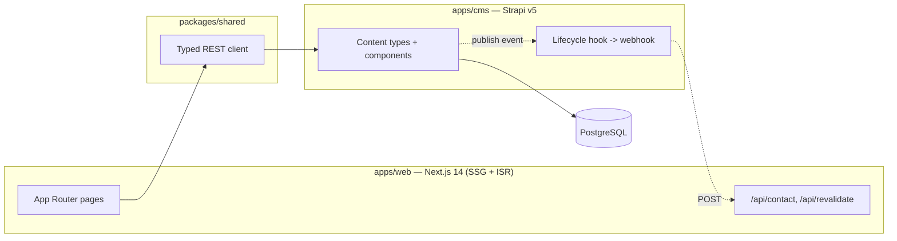

# TrieDatum Website Modernization — Next.js + Strapi

Modernization of TrieDatum's marketing website from a static Themeholy
(Bootstrap 5 + jQuery) HTML site to a **Next.js 14 (App Router) + Strapi v5 +
PostgreSQL** headless-CMS monorepo. This repository holds the upstream
specifications (requirements, test strategy, solution architecture) and a
**lean implementation skeleton + unit tests** generated from them.

> **Status — requirements/test-strategy/architecture/documentation complete;
> a representative 5-Epic code skeleton implemented and unit-tested; nothing
> deployed or run live yet.**
>
> All 27 Epics / 80 Stories are fully specified (`A01-2-REQUIREMENTS`), have a
> reconciled test strategy (`A02-2-TEST-STRATEGY`), a reconciled solution
> architecture with 6 ADRs (`A04-2-SOLUTION-ARCHITECTURE`), a standards scan
> (`A07`, 9 findings) and a security scan (`A08`, 8 findings) against the code
> that exists, and full operational documentation (`A10`). A lean skeleton
> covering 5 Epics — global header/footer (EP-01/EP-02), the contact-form API
> route (EP-18), Strapi content modeling for 2 of 8 content types (EP-23), and
> the on-demand revalidation webhook (EP-26) — is implemented under `apps/`
> and `packages/`, with **24 unit tests written** (see
> [`A05-1-UNIT-TESTS/RESULTS.md`](A05-1-UNIT-TESTS/RESULTS.md)).
>
> **Nothing has been installed, deployed, or run yet.** No `npm install`, no
> Strapi instance, no PostgreSQL database, no live environment. See
> [`IMPLEMENTATION-CROSSCHECK.md`](IMPLEMENTATION-CROSSCHECK.md) for the exact,
> honest per-Epic status (0 ✅ Full, 5 🟡 Partial, 22 ⛔ Gap) and
> [`A06-1-SOLUTION-TESTS/testing-results/run-20260701-090000/`](A06-1-SOLUTION-TESTS/testing-results/run-20260701-090000/)
> for why solution-level tests are 0 executed / 5 blocked.

## Architecture at a glance

Two apps, one content contract (ADR-002, ADR-003):

- **`apps/web`** — Next.js 14 App Router, Server Components, SSG + ISR with an
  on-demand revalidation webhook (ADR-003) and a `revalidate: 3600` timed
  fallback. Reads Strapi through `packages/shared`'s typed REST client.
- **`apps/cms`** — Strapi v5 (TypeScript) over PostgreSQL. 8 content types + 3
  shared components (2 content types + all 3 components exist today; see
  `IMPLEMENTATION-CROSSCHECK.md`). Deliberately excluded from the npm
  workspace hoist (ADR-005) to avoid the `ajv@6`/`ajv@8` collision.



## Documentation map

| Phase | Folder | What it contains |
|---|---|---|
| Analyst | [`A01-2-REQUIREMENTS/`](A01-2-REQUIREMENTS/) | 27 Epics, 80 Stories, legacy-page traceability (`SOURCE-COVERAGE.md`) |
| QA Architect | [`A02-2-TEST-STRATEGY/`](A02-2-TEST-STRATEGY/) | Master strategy, per-section plans, NFR/security/content-fidelity, coverage matrix |
| Solution Architect | [`A04-2-SOLUTION-ARCHITECTURE/`](A04-2-SOLUTION-ARCHITECTURE/) | Component architecture, content model, domain ontology, 6 ADRs, requirements coverage |
| Junior Developer | [`apps/`](apps/), [`packages/`](packages/), [`A05-1-UNIT-TESTS/`](A05-1-UNIT-TESTS/) | Lean 5-Epic code skeleton + 24 unit tests |
| Test Automation | [`A06-1-SOLUTION-TESTS/`](A06-1-SOLUTION-TESTS/) | Solution test plans, e2e/integration specs, a (blocked) first campaign run |
| Standards Checker | [`A07-1-STANDARDS-SCAN-RESULTS/`](A07-1-STANDARDS-SCAN-RESULTS/) | 9 findings against the actual skeleton + fixes |
| Security Scanner | [`A08-1-SECURITY-SCAN-RESULTS/`](A08-1-SECURITY-SCAN-RESULTS/) | 8 findings (3 High) + fixes |
| Doc Generator | [`A10-1-SOLUTION-DOCUMENTATION/`](A10-1-SOLUTION-DOCUMENTATION/) | Architecture, content/API/CMS reference, runbooks, release playbook |

## Getting started

```bash
npm install                # resolves apps/web + packages/* (apps/cms is excluded — see ADR-005)
npm run cms:install        # installs apps/cms independently
npm run cms:develop        # boots Strapi against PostgreSQL — see A10-1-SOLUTION-DOCUMENTATION/06-runbook-deployment.md
npm run dev                # boots apps/web
```

No environment has actually run these commands yet in this repository — see
`IMPLEMENTATION-CROSSCHECK.md` §"Next steps to move Partial → Full" for the
real bring-up sequence.
